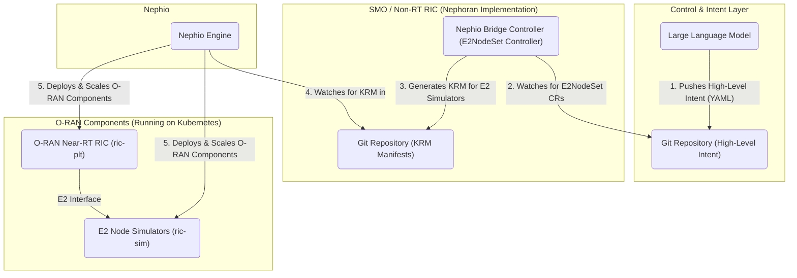

# Nephoran Intent Operator

The Nephoran Intent Operator is a cloud-native orchestration system designed to manage O-RAN compliant network functions using a Large Language Model (LLM) as the primary control interface. It leverages the GitOps principles of [Nephio](https://nephio.org/) to translate high-level, natural language intents into concrete, declarative Kubernetes configurations.

This project serves as a proof-of-concept for autonomous network operations, where an LLM can drive the scale-out and scale-in of O-RAN E2 Nodes (simulated Network Functions) in response to high-level goals.

## Architecture

The system is composed of several key components that work together in a GitOps workflow:



1.  **LLM Intent**: An LLM interprets a high-level goal (e.g., "scale up RAN capacity") and translates it into a declarative Kubernetes custom resource (`E2NodeSet`). This resource is pushed to a `control` Git repository.
2.  **Nephio Bridge Controller**: This custom controller (the core of this project) watches the `control` repository. When it sees a new or modified `E2NodeSet` resource, it acts as the bridge to the orchestration layer.
3.  **KRM Generation**: The controller uses Kpt packages (based on official O-RAN specifications) to generate the detailed Kubernetes Resource Model (KRM) YAML manifests required to achieve the desired state (e.g., manifests for 5 E2 Node simulators).
4.  **GitOps Hand-off**: The generated manifests are committed to a `deployment` Git repository.
5.  **Nephio Orchestration**: The Nephio engine monitors the `deployment` repository and uses the manifests to declaratively deploy and manage the O-RAN components in the Kubernetes cluster.

## Deployment Guide

This project supports two primary deployment environments: `local` for development and `remote` for a cloud-based setup.

### Prerequisites

*   [Docker](https://www.docker.com/)
*   [kubectl](https://kubernetes.io/docs/tasks/tools/)
*   [kustomize](https://kustomize.io/)
*   A running Kubernetes cluster (e.g., [kind](https://kind.sigs.k8s.io/), [Minikube](https://minikube.sigs.k8s.io/docs/start/))

### Local Deployment

The `local` deployment is designed for development and testing on a local machine. It builds the container images and loads them directly into your local Kubernetes cluster's node, using an `imagePullPolicy` of `Never`.

**Steps:**

1.  **Ensure your local Kubernetes cluster is running.**
2.  **Run the deployment script:**
    ```shell
    ./deploy.sh local
    ```
This script will build all container images, load them into your cluster, and deploy all necessary components using the Kustomize overlay at `deployments/kustomize/overlays/local`.

### Remote Deployment (Google Kubernetes Engine)

The `remote` deployment is configured for a GKE cluster using Google Artifact Registry for image storage.

**Steps:**

1.  **Configure GCP Settings:**
    Update the following variables in the `deploy.sh` script with your GCP project details:
    *   `GCP_PROJECT_ID`
    *   `GCP_REGION`
    *   `AR_REPO` (your Artifact Registry repository name)

2.  **Update Kustomization:**
    In `deployments/kustomize/overlays/remote/kustomization.yaml`, replace the placeholder `your-gcp-project` with your actual `GCP_PROJECT_ID`.

3.  **Grant Artifact Registry Permissions:**
    The GKE nodes' service account needs permission to pull images. Grant the `Artifact Registry Reader` role to it.
    ```shell
    # Replace with your actual GCP Project ID and GKE Node Service Account
    GCP_PROJECT_ID="your-gcp-project-id"
    GKE_NODE_SA="your-node-sa-email@${GCP_PROJECT_ID}.iam.gserviceaccount.com"

    gcloud projects add-iam-policy-binding "${GCP_PROJECT_ID}" \
      --member="serviceAccount:${GKE_NODE_SA}" \
      --role="roles/artifactregistry.reader"
    ```

4.  **Create Image Pull Secret:**
    Authenticate Docker with Artifact Registry and then create a Kubernetes secret named `nephoran-regcred` from your local configuration.
    ```shell
    # Authenticate Docker
    gcloud auth configure-docker us-central1-docker.pkg.dev

    # Create the secret
    kubectl create secret generic nephoran-regcred \
      --from-file=.dockerconfigjson=${HOME}/.docker/config.json \
      --type=kubernetes.io/dockerconfigjson
    ```

5.  **Run the deployment script:**
    ```shell
    ./deploy.sh remote
    ```
This will build the images, push them to your Artifact Registry, and deploy the operator using the `remote` Kustomize overlay.

## Usage Example

Once the operator is deployed, you can control the number of simulated E2 Nodes by creating or modifying an `E2NodeSet` custom resource.

1.  **Create an Intent File:**
    Create a YAML file named `my-e2-nodes.yaml`:
    ```yaml
    apiVersion: nephoran.com/v1
    kind: E2NodeSet
    metadata:
      name: simulated-gnbs
      namespace: default
    spec:
      replicas: 3 # The desired number of E2 node simulators
    ```

2.  **Apply the Intent:**
    ```shell
    kubectl apply -f my-e2-nodes.yaml
    ```

The `nephio-bridge` controller will detect this resource and commit the corresponding manifests for three `ric-sim` deployments to the `deployment-repo`. Nephio will then apply these manifests to the cluster.

## Development

This project uses a `Makefile` to streamline common development tasks.

*   **Build all binaries:**
    ```shell
    make build-all
    ```
*   **Run linters:**
    ```shell
    make lint
    ```
*   **Run tests:**
    ```shell
    make test-integration
    ```
*   **Generate code (after modifying API types):**
    ```shell
    make generate
    ```
