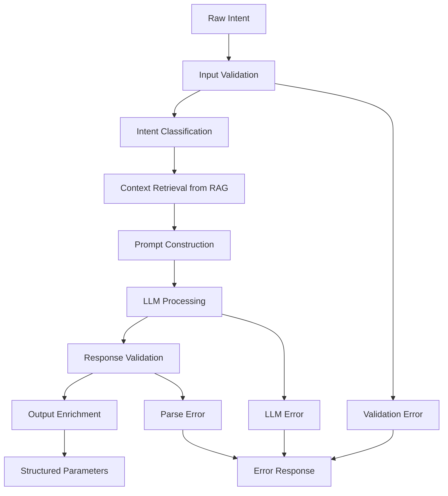

# LLM Processor Service - Technical Specifications

## Overview

The LLM Processor Service is a critical component of the Nephoran Intent Operator ecosystem, responsible for translating natural language network intents into structured parameters for O-RAN network function deployments. This document provides comprehensive technical specifications for production-ready implementation.

## 1. REST API Specification

### 1.1 API Overview

**Service Name**: llm-processor  
**Default Port**: 8080  
**Protocol**: HTTP/HTTPS  
**Content-Type**: application/json  

### 1.2 Endpoint Definitions

#### POST /process

**Purpose**: Process natural language network intent and return structured parameters

**Request Schema**:
```json
{
  "spec": {
    "intent": "string"
  },
  "metadata": {
    "name": "string",
    "namespace": "string",
    "uid": "string",
    "generation": "integer"
  }
}
```

**Response Schema (Success)**:
```json
{
  "type": "NetworkFunctionDeployment" | "NetworkFunctionScale",
  "name": "string",
  "namespace": "string",
  "spec": {
    "replicas": "integer",
    "image": "string",
    "resources": {
      "requests": {
        "cpu": "string",
        "memory": "string"
      },
      "limits": {
        "cpu": "string",
        "memory": "string"
      }
    }
  },
  "o1_config": "string (XML format for FCAPS operations)",
  "a1_policy": {
    "policy_type_id": "string",
    "policy_data": "object"
  },
  "original_intent": "string",
  "timestamp": "string (ISO 8601)",
  "processing_metadata": {
    "model_used": "string",
    "confidence_score": "float",
    "processing_time_ms": "integer"
  }
}
```

**Response Schema (Error)**:
```json
{
  "error": "string",
  "error_code": "string",
  "original_intent": "string",
  "timestamp": "string (ISO 8601)",
  "retry_after_seconds": "integer (optional)",
  "details": {
    "stage": "validation|llm_processing|response_parsing",
    "raw_output": "string (optional)",
    "exception": "string (optional)"
  }
}
```

**HTTP Status Codes**:
- `200 OK`: Successful processing
- `400 Bad Request`: Invalid request format or missing required fields
- `422 Unprocessable Entity`: Valid request format but semantic errors in intent
- `429 Too Many Requests`: Rate limiting applied
- `500 Internal Server Error`: LLM processing failure
- `502 Bad Gateway`: RAG API unavailable
- `503 Service Unavailable`: Service temporarily unavailable

#### GET /healthz

**Purpose**: Basic health check endpoint

**Response**:
```json
{
  "status": "ok",
  "timestamp": "string (ISO 8601)",
  "version": "string",
  "uptime_seconds": "integer"
}
```

**HTTP Status Codes**:
- `200 OK`: Service healthy
- `503 Service Unavailable`: Service unhealthy

#### GET /readyz

**Purpose**: Readiness probe for Kubernetes

**Response**:
```json
{
  "status": "ready",
  "timestamp": "string (ISO 8601)",
  "dependencies": {
    "rag_api": "available|unavailable",
    "llm_backend": "available|unavailable"
  }
}
```

**HTTP Status Codes**:
- `200 OK`: Service ready to handle requests
- `503 Service Unavailable`: Dependencies not ready

#### GET /metrics (Prometheus)

**Purpose**: Prometheus metrics endpoint

**Metrics Exported**:
- `llm_processor_requests_total{method, status_code}`
- `llm_processor_request_duration_seconds{method}`
- `llm_processor_rag_api_requests_total{status}`
- `llm_processor_rag_api_duration_seconds`
- `llm_processor_errors_total{error_type}`

### 1.3 Authentication and Authorization

**Current Implementation**: None (internal cluster service)

**Production Requirements**:
- **mTLS**: Mutual TLS for inter-service communication
- **API Keys**: Service-to-service authentication via headers
- **RBAC Integration**: Kubernetes ServiceAccount-based authorization
- **Network Policies**: Kubernetes network policies restricting access

```yaml
# Example Authentication Header
Authorization: Bearer <service-token>
X-Service-Name: networkintent-controller
X-Namespace: nephoran-system
```

## 2. LLM Integration Architecture

### 2.1 Multi-Model Support Architecture

**Primary Model**: Mistral-8x22B (Production Target)  
**Fallback Model**: OpenAI GPT-4o-mini (Current Implementation)  
**Local Alternatives**: Llama 3.1 70B, CodeLlama 34B

### 2.2 Model Configuration Schema

```yaml
apiVersion: v1
kind: ConfigMap
metadata:
  name: llm-processor-config
data:
  llm.yaml: |
    models:
      primary:
        name: "mistral-8x22b"
        endpoint: "http://mistral-inference:8080/v1/chat/completions"
        api_key_secret: "mistral-api-key"
        timeout_seconds: 30
        max_tokens: 2048
        temperature: 0.0
        
      fallback:
        name: "gpt-4o-mini"
        endpoint: "https://api.openai.com/v1/chat/completions"
        api_key_secret: "openai-api-key"
        timeout_seconds: 20
        max_tokens: 2048
        temperature: 0.0
        
    retry_policy:
      max_retries: 3
      backoff_strategy: "exponential"
      base_delay_ms: 1000
      max_delay_ms: 30000
      
    circuit_breaker:
      failure_threshold: 5
      recovery_timeout: 60
      half_open_max_calls: 3
```

### 2.3 Mistral-8x22B Integration Specifications

**API Compatibility**: OpenAI-compatible chat completions API

**Request Format**:
```json
{
  "model": "mistral-8x22b",
  "messages": [
    {
      "role": "system",
      "content": "You are an expert telecom network engineer..."
    },
    {
      "role": "user", 
      "content": "Configure a 5G network slice for IoT devices..."
    }
  ],
  "max_tokens": 2048,
  "temperature": 0.0,
  "response_format": {"type": "json_object"}
}
```

**Infrastructure Requirements**:
- **GPU**: A100 80GB (minimum 4x for production)
- **Memory**: 160GB+ system RAM
- **Storage**: 1TB+ NVMe for model weights
- **Network**: 10Gbps+ for model inference

**Container Deployment**:
```yaml
apiVersion: apps/v1
kind: Deployment
metadata:
  name: mistral-inference
spec:
  template:
    spec:
      containers:
      - name: mistral-8x22b
        image: vllm/vllm-openai:latest
        args:
          - --model
          - mistralai/Mixtral-8x22B-Instruct-v0.1
          - --dtype
          - bfloat16
          - --tensor-parallel-size
          - "4"
        resources:
          requests:
            nvidia.com/gpu: 4
            memory: 160Gi
          limits:
            nvidia.com/gpu: 4
            memory: 160Gi
```

### 2.4 Prompt Engineering for Telecom Networks

**System Prompt Template**:
```text
You are an expert telecommunications network engineer with deep knowledge of:
- 5G Core Network Functions (AMF, SMF, UPF, NSSF, PCF)
- O-RAN architecture (O-DU, O-CU, Near-RT RIC, Non-RT RIC)
- Network slicing and Quality of Service (QoS) management
- Edge computing and Multi-access Edge Computing (MEC)
- Kubernetes and cloud-native network functions

Your task is to translate natural language network operations requests into structured JSON objects that can be used to configure and deploy network functions.

Context from knowledge base: {context}

User Intent: {intent}

Output MUST be valid JSON matching one of these schemas:

For NEW network function deployment:
{
  "type": "NetworkFunctionDeployment",
  "name": "descriptive-nf-name",
  "namespace": "target-namespace",
  "spec": {
    "replicas": integer,
    "image": "container-image-url",
    "resources": {
      "requests": {"cpu": "100m", "memory": "256Mi"},
      "limits": {"cpu": "500m", "memory": "512Mi"}
    },
    "ports": [{"containerPort": 8080, "protocol": "TCP"}],
    "env": [{"name": "ENV_VAR", "value": "value"}]
  },
  "o1_config": "XML configuration for FCAPS operations",
  "a1_policy": {
    "policy_type_id": "string",
    "policy_data": {}
  },
  "service_config": {
    "type": "ClusterIP|NodePort|LoadBalancer",
    "ports": [{"port": 80, "targetPort": 8080}]
  }
}

For SCALING existing network function:
{
  "type": "NetworkFunctionScale", 
  "name": "existing-nf-name",
  "namespace": "target-namespace",
  "replicas": integer
}
```

**Intent Classification Logic**:
```python
def classify_intent(intent_text: str) -> str:
    """
    Classify network intent type based on keywords and patterns
    """
    scale_indicators = ["scale", "increase", "decrease", "replicas", "instances"]
    deploy_indicators = ["deploy", "create", "setup", "configure", "install"]
    
    if any(word in intent_text.lower() for word in scale_indicators):
        return "NetworkFunctionScale"
    elif any(word in intent_text.lower() for word in deploy_indicators):
        return "NetworkFunctionDeployment"
    else:
        # Default to deployment for ambiguous cases
        return "NetworkFunctionDeployment"
```

## 3. Natural Language Processing Pipeline

### 3.1 Intent Processing Workflow



### 3.2 Input Validation Rules

**Required Fields**:
- `spec.intent`: Non-empty string, max 2048 characters
- `metadata.name`: Valid Kubernetes name format
- `metadata.namespace`: Valid Kubernetes namespace

**Content Validation**:
```go
type IntentValidator struct {
    MaxLength    int
    MinLength    int
    ForbiddenPatterns []string
}

func (v *IntentValidator) Validate(intent string) error {
    if len(intent) < v.MinLength {
        return fmt.Errorf("intent too short: minimum %d characters", v.MinLength)
    }
    if len(intent) > v.MaxLength {
        return fmt.Errorf("intent too long: maximum %d characters", v.MaxLength)
    }
    
    for _, pattern := range v.ForbiddenPatterns {
        if matched, _ := regexp.MatchString(pattern, intent); matched {
            return fmt.Errorf("intent contains forbidden pattern: %s", pattern)
        }
    }
    
    return nil
}
```

### 3.3 Supported Network Intent Types

**Category 1: Network Function Deployment**
- 5G Core Network Functions (AMF, SMF, UPF, etc.)
- O-RAN components (O-DU, O-CU, Near-RT RIC)
- Edge computing applications
- Network monitoring tools

**Category 2: Network Function Scaling**
- Horizontal scaling (replica count)
- Vertical scaling (resource allocation)
- Auto-scaling configuration

**Category 3: Network Slice Management**
- Slice creation and configuration
- QoS parameter adjustment
- Bandwidth allocation

**Category 4: Policy Configuration**
- A1 policy management
- Traffic steering rules
- Security policies

**Example Intent Patterns**:
```yaml
deployment_intents:
  - "Deploy a UPF network function with 3 replicas for high availability"
  - "Set up Near-RT RIC with xApp support for intelligent traffic management"
  - "Configure edge computing node with GPU acceleration for video processing"

scaling_intents:
  - "Scale AMF instances to 5 replicas to handle increased signaling load"
  - "Increase UPF resources to 4 CPU cores and 8GB memory"
  - "Scale down edge applications to 2 instances during off-peak hours"

slice_intents:
  - "Create network slice for IoT devices with 100Mbps bandwidth and low latency"
  - "Configure network slice for enterprise customers with guaranteed SLA"

policy_intents:
  - "Apply traffic steering policy to route video traffic through edge nodes"
  - "Configure QoS policy with priority level 5 for critical applications"
```

### 3.4 Parameter Extraction and Validation

**Extraction Rules**:
```yaml
extraction_patterns:
  replicas:
    patterns: ["(\\d+)\\s+replicas?", "(\\d+)\\s+instances?"]
    default: 1
    range: [1, 100]
    
  cpu_resources:
    patterns: ["(\\d+)\\s+cpu\\s+cores?", "(\\d+)m\\s+cpu"]
    default: "100m"
    valid_formats: ["\\d+m", "\\d+\\.?\\d*"]
    
  memory_resources:
    patterns: ["(\\d+)\\s*[GM]i?B?\\s+memory", "(\\d+)\\s*[GM]i"]
    default: "256Mi"
    valid_formats: ["\\d+[KMG]i", "\\d+[KMG]B"]
    
  bandwidth:
    patterns: ["(\\d+)\\s*[KMG]?bps", "(\\d+)\\s*[KMG]B/s"]
    default: "1Gbps"
    
  latency:
    patterns: ["(\\d+)\\s*ms\\s+latency", "low\\s+latency"]
    mapping:
      "low": "1ms"
      "medium": "10ms" 
      "high": "100ms"
```

**Validation Schema**:
```json
{
  "$schema": "http://json-schema.org/draft-07/schema#",
  "type": "object",
  "properties": {
    "type": {
      "enum": ["NetworkFunctionDeployment", "NetworkFunctionScale"]
    },
    "name": {
      "type": "string",
      "pattern": "^[a-z0-9]([a-z0-9-]*[a-z0-9])?$",
      "maxLength": 63
    },
    "namespace": {
      "type": "string", 
      "pattern": "^[a-z0-9]([a-z0-9-]*[a-z0-9])?$",
      "maxLength": 63
    },
    "spec": {
      "type": "object",
      "properties": {
        "replicas": {
          "type": "integer",
          "minimum": 1,
          "maximum": 100
        }
      }
    }
  },
  "required": ["type", "name", "namespace"]
}
```

## 4. Integration Requirements

### 4.1 Service Discovery and Connectivity

**Current Architecture**:
```yaml
# Service Discovery via Kubernetes DNS
RAG_API_URL: "http://rag-api.default.svc.cluster.local:5001/process_intent"
MISTRAL_API_URL: "http://mistral-inference.ai-models.svc.cluster.local:8080/v1/chat/completions"

# Environment Variables
env:
  - name: RAG_API_URL
    value: "http://rag-api.default.svc.cluster.local:5001/process_intent"
  - name: LLM_BACKEND_TYPE
    value: "mistral"  # or "openai"
  - name: LLM_API_URL
    valueFrom:
      configMapKeyRef:
        name: llm-config
        key: api_url
```

**Service Mesh Integration (Future)**:
```yaml
apiVersion: networking.istio.io/v1beta1
kind: VirtualService
metadata:
  name: llm-processor-routing
spec:
  hosts:
  - llm-processor
  http:
  - match:
    - headers:
        x-intent-type:
          exact: "complex"
    route:
    - destination:
        host: mistral-inference
        weight: 100
  - route:
    - destination:
        host: openai-proxy
        weight: 100
```

### 4.2 Health Check and Readiness Probe Endpoints

**Health Check Implementation**:
```go
type HealthChecker struct {
    RAGAPIClient     *http.Client
    LLMBackendClient *http.Client
    StartTime        time.Time
}

func (h *HealthChecker) CheckHealth() HealthStatus {
    status := HealthStatus{
        Status:    "ok",
        Timestamp: time.Now().Format(time.RFC3339),
        Version:   os.Getenv("SERVICE_VERSION"),
        Uptime:    time.Since(h.StartTime).Seconds(),
    }
    
    // Basic health check - service is running
    return status
}

func (h *HealthChecker) CheckReadiness() ReadinessStatus {
    status := ReadinessStatus{
        Status:    "ready",
        Timestamp: time.Now().Format(time.RFC3339),
        Dependencies: make(map[string]string),
    }
    
    // Check RAG API availability
    if err := h.checkRAGAPI(); err != nil {
        status.Dependencies["rag_api"] = "unavailable"
        status.Status = "not_ready"
    } else {
        status.Dependencies["rag_api"] = "available"
    }
    
    // Check LLM backend availability
    if err := h.checkLLMBackend(); err != nil {
        status.Dependencies["llm_backend"] = "unavailable"
        status.Status = "not_ready"
    } else {
        status.Dependencies["llm_backend"] = "available"
    }
    
    return status
}
```

**Kubernetes Probe Configuration**:
```yaml
containers:
- name: llm-processor
  readinessProbe:
    httpGet:
      path: /readyz
      port: 8080
    initialDelaySeconds: 10
    periodSeconds: 5
    timeoutSeconds: 3
    failureThreshold: 3
    
  livenessProbe:
    httpGet:
      path: /healthz
      port: 8080
    initialDelaySeconds: 30
    periodSeconds: 10
    timeoutSeconds: 5
    failureThreshold: 3
```

### 4.3 Metrics and Observability Requirements

**Prometheus Metrics**:
```go
var (
    requestsTotal = prometheus.NewCounterVec(
        prometheus.CounterOpts{
            Name: "llm_processor_requests_total",
            Help: "Total number of requests processed",
        },
        []string{"method", "status_code"},
    )
    
    requestDuration = prometheus.NewHistogramVec(
        prometheus.HistogramOpts{
            Name: "llm_processor_request_duration_seconds",
            Help: "Request processing duration",
            Buckets: []float64{0.1, 0.5, 1.0, 2.0, 5.0, 10.0, 30.0},
        },
        []string{"method"},
    )
    
    ragAPIRequests = prometheus.NewCounterVec(
        prometheus.CounterOpts{
            Name: "llm_processor_rag_api_requests_total",
            Help: "Total requests to RAG API",
        },
        []string{"status"},
    )
    
    processingErrors = prometheus.NewCounterVec(
        prometheus.CounterOpts{
            Name: "llm_processor_errors_total",
            Help: "Total processing errors",
        },
        []string{"error_type"},
    )
)
```

**Logging Structure**:
```json
{
  "timestamp": "2025-01-20T10:30:00Z",
  "level": "info",
  "service": "llm-processor",
  "request_id": "req-123456",
  "intent_id": "intent-abc789",
  "message": "Intent processing completed",
  "duration_ms": 1250,
  "model_used": "mistral-8x22b",
  "tokens_used": 1850,
  "confidence_score": 0.95
}
```

### 4.4 Integration Testing with NetworkIntent Controller

**Test Framework**:
```go
package integration_test

import (
    "context"
    "testing"
    "time"
    
    . "github.com/onsi/ginkgo/v2"
    . "github.com/onsi/gomega"
    
    nephoranv1 "github.com/thc1006/nephoran-intent-operator/api/v1"
)

var _ = Describe("LLM Processor Integration", func() {
    Context("When processing network intents", func() {
        It("should process deployment intent successfully", func() {
            intent := &nephoranv1.NetworkIntent{
                ObjectMeta: metav1.ObjectMeta{
                    Name:      "test-deployment",
                    Namespace: "default",
                },
                Spec: nephoranv1.NetworkIntentSpec{
                    Intent: "Deploy UPF network function with 3 replicas",
                },
            }
            
            // Create NetworkIntent
            Expect(k8sClient.Create(ctx, intent)).Should(Succeed())
            
            // Wait for processing
            Eventually(func() bool {
                err := k8sClient.Get(ctx, types.NamespacedName{
                    Name: intent.Name, Namespace: intent.Namespace,
                }, intent)
                if err != nil {
                    return false
                }
                
                // Check if processed
                for _, condition := range intent.Status.Conditions {
                    if condition.Type == "Processed" && 
                       condition.Status == metav1.ConditionTrue {
                        return true
                    }
                }
                return false
            }, time.Minute*2, time.Second*5).Should(BeTrue())
            
            // Verify parameters were set
            Expect(intent.Spec.Parameters.Raw).ShouldNot(BeEmpty())
            
            var params map[string]interface{}
            err := json.Unmarshal(intent.Spec.Parameters.Raw, &params)
            Expect(err).ShouldNot(HaveOccurred())
            Expect(params["type"]).Should(Equal("NetworkFunctionDeployment"))
            Expect(params["spec"].(map[string]interface{})["replicas"]).Should(Equal(float64(3)))
        })
    })
})
```

## 5. Deployment and Configuration

### 5.1 Container Specification

**Multi-stage Dockerfile**:
```dockerfile
# Build stage
FROM golang:1.24-alpine AS builder

WORKDIR /workspace
COPY go.mod go.sum ./
RUN go mod download

COPY cmd/llm-processor/ cmd/llm-processor/
COPY pkg/ pkg/
COPY api/ api/

RUN CGO_ENABLED=0 GOOS=linux go build -a -installsuffix cgo -o llm-processor cmd/llm-processor/main.go

# Runtime stage
FROM gcr.io/distroless/static:nonroot

WORKDIR /
COPY --from=builder /workspace/llm-processor .

USER 65532:65532

EXPOSE 8080

ENTRYPOINT ["/llm-processor"]
```

**Resource Requirements**:
```yaml
containers:
- name: llm-processor
  resources:
    requests:
      cpu: 100m
      memory: 128Mi
      ephemeral-storage: 1Gi
    limits:
      cpu: 500m
      memory: 256Mi
      ephemeral-storage: 2Gi
```

### 5.2 Environment Variable Configuration Schema

**Complete Configuration**:
```yaml
env:
  # Service Configuration
  - name: PORT
    value: "8080"
  - name: LOG_LEVEL
    value: "info"
  - name: SERVICE_VERSION
    value: "v1.0.0"
    
  # RAG API Configuration
  - name: RAG_API_URL
    value: "http://rag-api.default.svc.cluster.local:5001/process_intent"
  - name: RAG_API_TIMEOUT
    value: "30s"
    
  # LLM Backend Configuration
  - name: LLM_BACKEND_TYPE
    value: "mistral"  # or "openai"
  - name: LLM_API_URL
    valueFrom:
      configMapKeyRef:
        name: llm-config
        key: api_url
  - name: LLM_API_KEY
    valueFrom:
      secretKeyRef:
        name: llm-credentials
        key: apiKey
  - name: LLM_MODEL_NAME
    value: "mistral-8x22b"
  - name: LLM_TIMEOUT
    value: "60s"
  - name: LLM_MAX_TOKENS
    value: "2048"
    
  # Circuit Breaker Configuration
  - name: CIRCUIT_BREAKER_ENABLED
    value: "true"
  - name: CIRCUIT_BREAKER_THRESHOLD
    value: "5"
  - name: CIRCUIT_BREAKER_TIMEOUT
    value: "60s"
    
  # Retry Configuration
  - name: MAX_RETRIES
    value: "3"
  - name: RETRY_DELAY
    value: "1s"
  - name: RETRY_BACKOFF
    value: "exponential"
    
  # Rate Limiting
  - name: RATE_LIMIT_REQUESTS_PER_MINUTE
    value: "60"
  - name: RATE_LIMIT_BURST
    value: "10"
    
  # Monitoring
  - name: METRICS_ENABLED
    value: "true"
  - name: TRACING_ENABLED
    value: "true"
  - name: JAEGER_ENDPOINT
    value: "http://jaeger-collector:14268/api/traces"
```

### 5.3 Scaling and Performance Characteristics

**Horizontal Pod Autoscaler**:
```yaml
apiVersion: autoscaling/v2
kind: HorizontalPodAutoscaler
metadata:
  name: llm-processor-hpa
spec:
  scaleTargetRef:
    apiVersion: apps/v1
    kind: Deployment
    name: llm-processor
  minReplicas: 2
  maxReplicas: 10
  metrics:
  - type: Resource
    resource:
      name: cpu
      target:
        type: Utilization
        averageUtilization: 70
  - type: Resource
    resource:
      name: memory
      target:
        type: Utilization
        averageUtilization: 80
  - type: Pods
    pods:
      metric:
        name: llm_processor_requests_per_second
      target:
        type: AverageValue
        averageValue: "10"
  behavior:
    scaleUp:
      stabilizationWindowSeconds: 60
      policies:
      - type: Percent
        value: 100
        periodSeconds: 15
    scaleDown:
      stabilizationWindowSeconds: 300
      policies:
      - type: Percent
        value: 50
        periodSeconds: 60
```

**Performance Targets**:
- **Throughput**: 50+ requests per second per replica
- **Latency**: <2s p95 for simple intents, <10s p95 for complex intents
- **Availability**: 99.9% uptime
- **Error Rate**: <1% processing errors
- **Recovery Time**: <30s after dependency failures

### 5.4 Security and Secret Management

**Pod Security Context**:
```yaml
spec:
  securityContext:
    runAsNonRoot: true
    runAsUser: 65532
    runAsGroup: 65532
    fsGroup: 65532
    seccompProfile:
      type: RuntimeDefault
  containers:
  - name: llm-processor
    securityContext:
      allowPrivilegeEscalation: false
      readOnlyRootFilesystem: true
      capabilities:
        drop:
        - ALL
      runAsNonRoot: true
      runAsUser: 65532
```

**Secret Management**:
```yaml
apiVersion: v1
kind: Secret
metadata:
  name: llm-credentials
type: Opaque
data:
  apiKey: <base64-encoded-api-key>
  
---
apiVersion: v1
kind: Secret
metadata:
  name: mistral-credentials
type: Opaque
data:
  apiKey: <base64-encoded-mistral-key>
  endpoint: <base64-encoded-endpoint-url>
```

**Network Policies**:
```yaml
apiVersion: networking.k8s.io/v1
kind: NetworkPolicy
metadata:
  name: llm-processor-netpol
spec:
  podSelector:
    matchLabels:
      app: llm-processor
  policyTypes:
  - Ingress
  - Egress
  ingress:
  - from:
    - podSelector:
        matchLabels:
          app: nephio-bridge
    ports:
    - protocol: TCP
      port: 8080
  egress:
  - to:
    - podSelector:
        matchLabels:
          app: rag-api
    ports:
    - protocol: TCP
      port: 5001
  - to:
    - podSelector:
        matchLabels:
          app: mistral-inference
    ports:
    - protocol: TCP
      port: 8080
  - to: []  # DNS
    ports:
    - protocol: UDP
      port: 53
```

## 6. Production Readiness Checklist

### 6.1 Operational Requirements

- [ ] **Health Checks**: Implement comprehensive health and readiness probes
- [ ] **Monitoring**: Prometheus metrics with alerting rules
- [ ] **Logging**: Structured logging with correlation IDs
- [ ] **Tracing**: Distributed tracing for request flow analysis
- [ ] **Rate Limiting**: Protect against request floods
- [ ] **Circuit Breaker**: Prevent cascade failures
- [ ] **Graceful Shutdown**: Handle SIGTERM properly
- [ ] **Resource Limits**: Prevent resource exhaustion
- [ ] **Security Scanning**: Container vulnerability scanning

### 6.2 Integration Requirements

- [ ] **API Versioning**: Backward compatibility strategy
- [ ] **Schema Evolution**: Handle API schema changes
- [ ] **Error Handling**: Comprehensive error classification
- [ ] **Retry Logic**: Exponential backoff with jitter
- [ ] **Timeout Handling**: Request timeout management
- [ ] **Load Testing**: Performance validation under load
- [ ] **Chaos Testing**: Resilience validation
- [ ] **Multi-cluster**: Cross-cluster deployment support

### 6.3 Documentation Requirements

- [ ] **API Documentation**: OpenAPI/Swagger specifications
- [ ] **Runbooks**: Operational procedures and troubleshooting
- [ ] **Architecture Documentation**: Component interaction diagrams
- [ ] **Configuration Guide**: Environment setup and tuning
- [ ] **Monitoring Guide**: Dashboard and alert setup
- [ ] **Disaster Recovery**: Backup and restore procedures

This comprehensive specification provides the foundation for implementing a production-ready LLM Processor Service that can effectively bridge natural language intents with structured network function deployments in the Nephoran Intent Operator ecosystem.