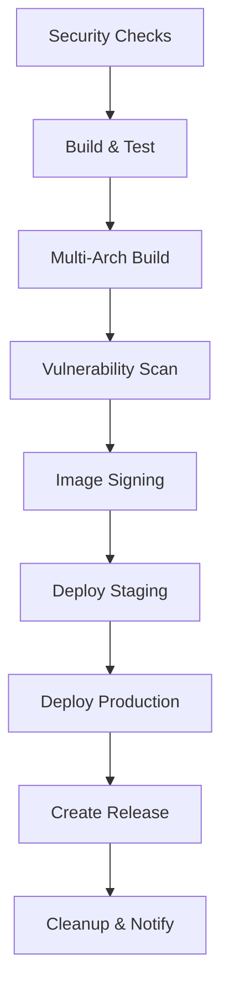

# Enhanced CI/CD Pipeline Setup Guide

This guide provides comprehensive instructions for setting up and using the enhanced CI/CD pipeline for the Nephoran Intent Operator project.

## 🚀 Overview

The enhanced CI/CD pipeline provides:

- **Multi-architecture builds** (amd64 + arm64)
- **SBOM generation** (SPDX and CycloneDX formats)
- **Container image signing** with Cosign
- **Vulnerability scanning** with Trivy and Grype
- **Multi-registry deployment** (Docker Hub, GCR, GHCR)
- **Automated staging/production deployments**
- **Build caching and optimization**
- **Release management** with automatic tagging

## 📋 Prerequisites

### Required GitHub Secrets

Configure the following secrets in your GitHub repository settings:

#### Registry Authentication
```bash
# Docker Hub
DOCKERHUB_USERNAME=your-docker-username
DOCKERHUB_TOKEN=your-docker-access-token

# Google Container Registry
GCR_JSON_KEY=base64-encoded-service-account-json

# GitHub Container Registry (automatically available)
GITHUB_TOKEN=automatically-provided-by-github
```

#### Kubernetes Cluster Access
```bash
# Staging environment
KUBE_CONFIG_STAGING=base64-encoded-kubeconfig-for-staging

# Production environment  
KUBE_CONFIG_PRODUCTION=base64-encoded-kubeconfig-for-production
```

#### Optional: Signing Keys (for enhanced security)
```bash
# Cosign private key (optional - uses keyless signing if not provided)
COSIGN_PRIVATE_KEY=cosign-private-key-content
COSIGN_PASSWORD=private-key-password

# Slack notifications (optional)
SLACK_WEBHOOK_URL=your-slack-webhook-url
```

### Required Tools Installation

The pipeline automatically installs required tools, but for local development:

```bash
# Install enhanced build tools
make install-tools

# Verify installations
make verify-tools
```

## 🏗️ Pipeline Architecture

### Workflow Triggers

The pipeline runs on:
- **Push to main/dev-container**: Full pipeline with deployment to staging
- **Pull requests**: Security checks, build, and test (no deployment)
- **Tag creation (v*)**: Full pipeline with production deployment and release
- **Manual dispatch**: Configurable deployment options

### Pipeline Stages



## 🔧 Configuration

### Environment Variables

Key environment variables in the workflow:

```yaml
env:
  # Build configuration
  REGISTRY_GCR: us-central1-docker.pkg.dev/poised-elf-466913-q2/nephoran
  REGISTRY_DOCKERHUB: thc1006
  PLATFORMS: linux/amd64,linux/arm64
  GO_VERSION: '1.24'
  
  # Feature flags
  ENABLE_SBOM: true
  ENABLE_SIGNING: true
  ENABLE_VULNERABILITY_SCAN: true
  ENABLE_MULTI_REGISTRY: true
```

### Customization Options

#### Disable Features
To disable specific features, modify the environment variables:

```yaml
env:
  ENABLE_SBOM: false              # Disable SBOM generation
  ENABLE_SIGNING: false           # Disable image signing
  ENABLE_VULNERABILITY_SCAN: false # Disable vulnerability scanning
```

#### Change Platforms
To build for different architectures:

```yaml
env:
  PLATFORMS: linux/amd64          # AMD64 only
  # or
  PLATFORMS: linux/amd64,linux/arm64,linux/arm/v7  # Multiple architectures
```

## 🚀 Usage Instructions

### 1. Development Workflow

For regular development:

```bash
# Create feature branch
git checkout -b feature/new-feature

# Make changes and commit
git add .
git commit -m "feat: add new feature"

# Push and create PR
git push origin feature/new-feature
```

The pipeline will:
- Run security checks
- Execute comprehensive tests
- Build multi-arch images (if not skipped)
- Generate SBOM and vulnerability reports
- Sign images (if enabled)

### 2. Staging Deployment

Staging deployment happens automatically on:
- Push to `main` branch
- Manual dispatch with `staging` environment

```bash
# Trigger staging deployment
git push origin main
```

Or use manual dispatch:
1. Go to GitHub Actions tab
2. Select "Enhanced CI/CD Pipeline"
3. Click "Run workflow"
4. Select "staging" from environment dropdown

### 3. Production Deployment

Production deployment happens on:
- Tag creation (releases)
- Manual dispatch with `production` environment

```bash
# Create and push release tag
git tag v1.2.3
git push origin v1.2.3
```

The pipeline will:
- Deploy to production using blue-green strategy
- Create GitHub release with artifacts
- Generate comprehensive release notes

### 4. Emergency Deployment

For emergency deployments that skip tests:

1. Use manual dispatch
2. Enable "Skip tests" option
3. Select target environment

⚠️ **Warning**: Only use for critical production fixes.

## 🔒 Security Features

### Image Signing with Cosign

All production images are signed using Cosign:

```bash
# Verify image signatures
cosign verify --certificate-identity-regexp=".*" --certificate-oidc-issuer-regexp=".*" \
  us-central1-docker.pkg.dev/poised-elf-466913-q2/nephoran/llm-processor:latest
```

### SBOM Generation

Software Bill of Materials is generated in multiple formats:
- **SPDX JSON**: Industry standard format
- **CycloneDX JSON**: Alternative standard format
- **Table format**: Human-readable format

Access SBOM files from workflow artifacts.

### Vulnerability Scanning

Comprehensive vulnerability scanning using:
- **Trivy**: Container image scanning
- **Grype**: Additional vulnerability database
- **Gosec**: Go source code security analysis

Critical vulnerabilities (>5) trigger warnings but don't fail the build.

## 📦 Multi-Registry Deployment

Images are automatically pushed to:

### Docker Hub
```
thc1006/llm-processor:latest
thc1006/nephio-bridge:latest
thc1006/oran-adaptor:latest
thc1006/rag-api:latest
```

### Google Container Registry
```
us-central1-docker.pkg.dev/poised-elf-466913-q2/nephoran/llm-processor:latest
us-central1-docker.pkg.dev/poised-elf-466913-q2/nephoran/nephio-bridge:latest
us-central1-docker.pkg.dev/poised-elf-466913-q2/nephoran/oran-adaptor:latest
us-central1-docker.pkg.dev/poised-elf-466913-q2/nephoran/rag-api:latest
```

### GitHub Container Registry
```
ghcr.io/thc1006/llm-processor:latest
ghcr.io/thc1006/nephio-bridge:latest
ghcr.io/thc1006/oran-adaptor:latest
ghcr.io/thc1006/rag-api:latest
```

## 🏭 Production Deployment Strategy

### Blue-Green Deployment

The production deployment uses blue-green strategy:

1. **Deploy to Blue**: New version deployed alongside current (green)
2. **Health Checks**: Comprehensive health validation
3. **Traffic Switch**: Gradually switch traffic to blue
4. **Cleanup**: Remove old green deployment

### Rollback Strategy

If deployment fails:

```bash
# Automatic rollback triggers on health check failure
# Manual rollback using kubectl:
kubectl rollout undo deployment/llm-processor -n nephoran-system
```

## 📊 Monitoring and Observability

### Build Metrics

The pipeline provides comprehensive metrics:
- Build duration and success rates
- Image sizes and vulnerabilities
- Test coverage reports
- Deployment success rates

### Alerts and Notifications

Configure Slack notifications for:
- Pipeline failures
- Security vulnerabilities
- Production deployments

## 🔧 Troubleshooting

### Common Issues

#### 1. Authentication Failures
```bash
Error: failed to login to registry
```
**Solution**: Verify registry secrets are correctly configured and have necessary permissions.

#### 2. Build Cache Issues
```bash
Error: failed to load cache
```
**Solution**: Clear build cache or disable caching temporarily:
```yaml
env:
  BUILD_CACHE: false
```

#### 3. Vulnerability Scan Failures
```bash
Error: critical vulnerabilities found
```
**Solution**: Review vulnerability reports and update base images or dependencies.

#### 4. Deployment Timeouts
```bash
Error: deployment timeout
```
**Solution**: Check cluster resources and increase timeout values:
```yaml
kubectl rollout status deployment/app --timeout=600s
```

### Debug Mode

Enable debug mode for detailed logging:

```yaml
env:
  RUNNER_DEBUG: 1
  ACTIONS_STEP_DEBUG: true
```

### Manual Verification

Verify pipeline components manually:

```bash
# Check build tools
make verify-tools

# Test multi-arch build
make build-multiarch

# Verify image signatures
cosign verify <image-url>

# Check vulnerability reports
grype <image-url>
```

## 📈 Performance Optimization

### Build Cache Strategy

The pipeline uses multi-level caching:

1. **GitHub Actions Cache**: Fast local cache
2. **Registry Cache**: Shared across runners
3. **BuildKit Cache**: Layer-level optimization

### Parallel Builds

Multiple services build in parallel using matrix strategy, reducing total build time.

### Resource Optimization

Production deployments include:
- Resource requests and limits
- Horizontal pod autoscaling
- Pod disruption budgets
- Node affinity rules

## 🔄 Maintenance

### Regular Tasks

1. **Update Dependencies**: Monthly dependency updates
2. **Security Patches**: Apply security updates promptly  
3. **Cache Cleanup**: Periodic cache cleanup to manage storage
4. **Secret Rotation**: Rotate authentication secrets quarterly

### Monitoring Health

Monitor pipeline health using:
- GitHub Actions insights
- Build success/failure rates
- Security scan results
- Performance metrics

## 📚 Additional Resources

- [Docker Multi-Architecture Builds](https://docs.docker.com/build/building/multi-platform/)
- [Cosign Container Signing](https://docs.sigstore.dev/cosign/overview/)
- [SBOM Generation with Syft](https://github.com/anchore/syft)
- [Vulnerability Scanning with Grype](https://github.com/anchore/grype)
- [Kustomize Configuration](https://kubectl.docs.kubernetes.io/guides/introduction/kustomize/)

## 🆘 Support

For issues with the CI/CD pipeline:

1. Check the troubleshooting section above
2. Review GitHub Actions logs
3. Check repository issues
4. Contact the DevOps team

---

**Next Steps**: After setup, see [DEPLOYMENT_GUIDE.md](../../deployments/production/DEPLOYMENT_GUIDE.md) for production deployment procedures.