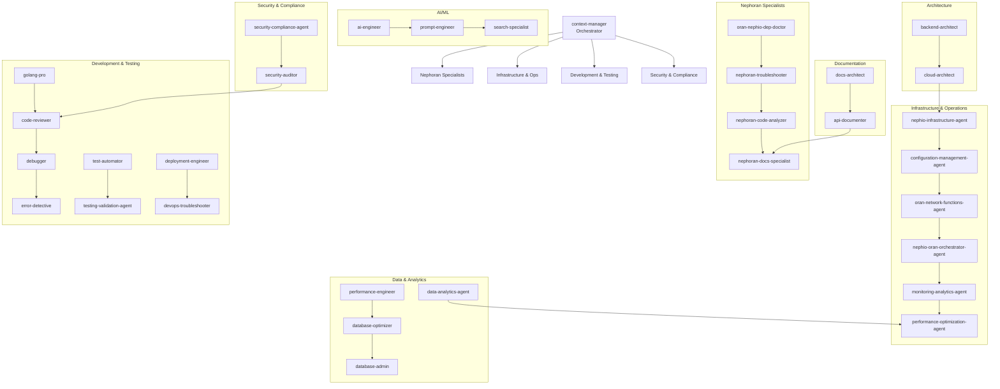

# Claude Sub-Agents – Deep Analysis

<!-- BEGIN AUTO-GENERATED: CLAUDE_AGENTS_ANALYSIS -->

## Run Metadata
- **Timestamp**: 2025-08-16T23:45:00+08:00 (Asia/Taipei)
- **Repository Root**: C:\Users\tingy\Desktop\dev\nephoran-intent-operator
- **Current Branch**: integrate/mvp
- **Current Commit**: 0cfed482cdc79696dac2c80bd9568993cf1706ac
- **Total Agents Analyzed**: 35
- **Files SHA1 Checksum**: 881a826ee95723fbef9d7d5d52bf7779d98e54e7

## Inventory Table

| Agent | Path | Purpose | Inputs → Outputs | Tools/APIs | Edits/Side-effects | Owner |
|-------|------|---------|------------------|------------|-------------------|-------|
| **ai-engineer** | .claude/agents/ai-engineer.md | Build LLM applications and RAG systems | Prompt designs, AI requirements → LLM apps, RAG pipelines | All tools (*) | Creates AI services, vector DBs | Unspecified |
| **api-documenter** | .claude/agents/api-documenter.md | Create OpenAPI/Swagger specs and SDK generation | API code → OpenAPI specs, SDKs | All tools (*) | Generates docs, client libraries | Unspecified |
| **backend-architect** | .claude/agents/backend-architect.md | Design RESTful APIs and microservices | Requirements → API designs, schemas | All tools (*) | Creates architecture docs | Unspecified |
| **cloud-architect** | .claude/agents/cloud-architect.md | Design AWS/Azure/GCP infrastructure | Requirements → IaC templates | All tools (*) | Creates Terraform/CloudFormation | Unspecified |
| **code-reviewer** | .claude/agents/code-reviewer.md | Expert code review for quality and security | Code changes → Review feedback | All tools (*) | Provides review comments | Unspecified |
| **configuration-management-agent** | .claude/agents/configuration-management-agent.md | Manage YANG models, CRDs, Kpt packages | Configs → Validated templates | Read, Write, Bash, Search, Git | Updates GitOps repos, CRDs | Unspecified |
| **context-manager** | .claude/agents/context-manager.md | Manage context across multi-agent workflows | Long contexts → Coordinated workflows | No tools | Coordination only | Unspecified |
| **data-analytics-agent** | .claude/agents/data-analytics-agent.md | O-RAN RANPM data processing and KPI analysis | Telemetry → KPIs, insights | Read, Write, Bash, Search, Git | Creates analytics pipelines | Unspecified |
| **database-admin** | .claude/agents/database-admin.md | Database operations, backups, replication | DB requirements → Configured DBs | All tools (*) | Manages DB operations | Unspecified |
| **database-optimizer** | .claude/agents/database-optimizer.md | Optimize SQL queries and design indexes | Slow queries → Optimized queries | All tools (*) | Updates schemas, indexes | Unspecified |
| **debugger** | .claude/agents/debugger.md | Debug errors and test failures | Errors → Root causes, fixes | All tools (*) | Fixes bugs | Unspecified |
| **deployment-engineer** | .claude/agents/deployment-engineer.md | Configure CI/CD pipelines and containers | Code → CI/CD pipelines | All tools (*) | Creates pipelines, Dockerfiles | Unspecified |
| **devops-troubleshooter** | .claude/agents/devops-troubleshooter.md | Debug production issues and incidents | Incidents → RCA, fixes | All tools (*) | Resolves production issues | Unspecified |
| **docs-architect** | .claude/agents/docs-architect.md | Create comprehensive technical documentation | Codebases → Technical manuals | All tools (*) | Generates long-form docs | Unspecified |
| **error-detective** | .claude/agents/error-detective.md | Search logs for error patterns | Logs → Error analysis | All tools (*) | Identifies root causes | Unspecified |
| **golang-pro** | .claude/agents/golang-pro.md | Write idiomatic Go code | Requirements → Go implementations | All tools (*) | Creates Go code | Unspecified |
| **legacy-modernizer** | .claude/agents/legacy-modernizer.md | Refactor legacy codebases | Legacy code → Modern code | All tools (*) | Updates legacy systems | Unspecified |
| **legal-advisor** | .claude/agents/legal-advisor.md | Draft privacy policies and legal notices | Requirements → Legal docs | All tools (*) | Creates compliance texts | Unspecified |
| **monitoring-analytics-agent** | .claude/agents/monitoring-analytics-agent.md | Implement observability with VES 7.3, NWDAF | Metrics → Monitoring stack | Read, Write, Bash, Search, Git | Deploys monitoring systems | Unspecified |
| **nephio-infrastructure-agent** | .claude/agents/nephio-infrastructure-agent.md | Manage O-Cloud infrastructure and K8s clusters | Requirements → Clusters | Read, Write, Bash, Search, Git | Provisions infrastructure | Unspecified |
| **nephio-oran-orchestrator-agent** | .claude/agents/nephio-oran-orchestrator-agent.md | Nephio R5-O-RAN L Release orchestration | Intents → Orchestrated services | Read, Write, Bash, Search, Git | Manages service lifecycle | Unspecified |
| **nephoran-code-analyzer** | .claude/agents/nephoran-code-analyzer.md | Deep technical analysis of Nephoran codebase | Code → Technical insights | Glob, Grep, LS, Read, Bash, etc. | Read-only analysis | Unspecified |
| **nephoran-docs-specialist** | .claude/agents/nephoran-docs-specialist.md | Create/update Nephoran documentation | Requirements → CLAUDE.md, API docs | Edit, Write, Glob, Grep, etc. | Creates/updates docs | Unspecified |
| **nephoran-troubleshooter** | .claude/agents/nephoran-troubleshooter.md | Debug and fix Nephoran-specific issues | Errors → Fixes | All tools (*) | Fixes bugs, resolves issues | Unspecified |
| **oran-nephio-dep-doctor** | .claude/agents/oran-nephio-dep-doctor.md | Resolve O-RAN/Nephio dependency errors | Dep errors → Minimal fixes | Read, Write, Bash, Search, Git | Fixes dependencies | Unspecified |
| **oran-nephio-dep-doctor-agent** | .claude/agents/oran-nephio-dep-doctor-agent.md | Expert dependency resolver (duplicate) | Dep errors → Precise fixes | Read, Write, Bash, Search, Git | Resolves build failures | Unspecified |
| **oran-network-functions-agent** | .claude/agents/oran-network-functions-agent.md | O-RAN network function deployment | Requirements → CNF/VNF deployments | Read, Write, Bash, Search, Git | Deploys network functions | Unspecified |
| **performance-engineer** | .claude/agents/performance-engineer.md | Profile applications and optimize bottlenecks | Performance issues → Optimizations | All tools (*) | Implements optimizations | Unspecified |
| **performance-optimization-agent** | .claude/agents/performance-optimization-agent.md | AI/ML-driven performance optimization | Metrics → ML optimizations | Read, Write, Bash, Search, Git | Applies ML models | Unspecified |
| **prompt-engineer** | .claude/agents/prompt-engineer.md | Optimize prompts for LLMs | Requirements → Optimized prompts | All tools (*) | Creates prompt templates | Unspecified |
| **search-specialist** | .claude/agents/search-specialist.md | Expert web research and synthesis | Queries → Research reports | All tools (*) | Gathers information | Unspecified |
| **security-auditor** | .claude/agents/security-auditor.md | Review code for vulnerabilities | Code → Security assessment | All tools (*) | Implements security fixes | Unspecified |
| **security-compliance-agent** | .claude/agents/security-compliance-agent.md | O-RAN WG11 security validation | Systems → Compliance reports | Read, Write, Bash, Search, Git | Implements security controls | Unspecified |
| **test-automator** | .claude/agents/test-automator.md | Create comprehensive test suites | Code → Test suites | All tools (*) | Creates tests, CI pipelines | Unspecified |
| **testing-validation-agent** | .claude/agents/testing-validation-agent.md | E2E testing for Nephio R5-O-RAN L Release | Deployments → Test results | Read, Write, Bash, Search | Runs validation tests | Unspecified |

## Interaction Graph



## Capabilities & Gaps

### Coverage Areas
- **Complete SDLC Coverage**: From design (architects) to production (monitoring)
- **O-RAN/Nephio Specialization**: Deep telco domain expertise with L Release and R5 support
- **AI/ML Integration**: Multiple agents for intelligent optimization and automation
- **Security Depth**: Compliance, auditing, and zero-trust implementation
- **Multi-Cloud Support**: AWS, Azure, GCP with IaC automation
- **Observability**: Comprehensive monitoring with VES 7.3, Prometheus, NWDAF

### Identified Gaps
- **Network Simulation**: No dedicated agent for network simulation/emulation
- **Cost Management**: Limited FinOps/cost optimization beyond cloud-architect
- **Disaster Recovery**: No specialized DR/backup orchestration agent
- **Compliance Reporting**: Limited automated compliance report generation
- **Multi-tenancy**: No dedicated agent for tenant isolation and management

### Missing Contracts
- **Inter-agent Communication Protocol**: No standardized message format defined
- **State Management**: No shared state store specification
- **Error Propagation**: No unified error handling across agents
- **Version Compatibility Matrix**: No explicit version dependencies documented

## Risks & Conflicts

### Overlapping Responsibilities
1. **Dependency Management**: Both `oran-nephio-dep-doctor` and `oran-nephio-dep-doctor-agent` (appears to be duplicate)
2. **Performance Optimization**: Overlap between `performance-engineer` and `performance-optimization-agent`
3. **Security**: Potential overlap between `security-compliance-agent` and `security-auditor`

### Race Conditions
- **GitOps Updates**: Multiple agents (configuration-management, deployment-engineer) may update repos simultaneously
- **Infrastructure Provisioning**: Concurrent cluster operations by different agents
- **Database Migrations**: No locking mechanism for schema changes

### Unsafe Operations
- **Full Write Access**: 12+ agents have unrestricted write permissions
- **Bash Execution**: Many agents can execute arbitrary shell commands
- **Git Operations**: Multiple agents can push to repositories without coordination

## Coordination Playbook

### Workflow 1: Deploy New O-RAN Network Function
**Preconditions**: Requirements documented, infrastructure available
```yaml
sequence:
  1. nephoran-code-analyzer: Analyze existing codebase
  2. oran-nephio-dep-doctor: Validate dependencies
  3. configuration-management-agent: Prepare YANG models and CRDs
  4. oran-network-functions-agent: Deploy CNF/VNF
  5. monitoring-analytics-agent: Setup observability
  6. testing-validation-agent: Run E2E tests
verification:
  - CNF/VNF pods running
  - Metrics flowing to collectors
  - Tests passing
artifacts:
  - Helm charts in GitOps repo
  - YANG configurations
  - Test reports
```

### Workflow 2: Troubleshoot Production Issue
**Preconditions**: Alert triggered, incident created
```yaml
sequence:
  1. devops-troubleshooter: Initial triage
  2. error-detective: Analyze logs and traces
  3. nephoran-troubleshooter: Debug application-specific issues
  4. debugger: Root cause analysis
  5. golang-pro: Implement fix
  6. code-reviewer: Review changes
  7. deployment-engineer: Deploy hotfix
verification:
  - Error rate decreased
  - All tests passing
  - No new errors introduced
artifacts:
  - RCA document
  - Fix PR/commit
  - Updated runbooks
```

### Workflow 3: Implement AI-Driven Optimization
**Preconditions**: Performance baseline established, ML models available
```yaml
sequence:
  1. data-analytics-agent: Collect and process metrics
  2. ai-engineer: Build ML pipeline
  3. performance-optimization-agent: Apply ML models
  4. monitoring-analytics-agent: Track improvements
  5. docs-architect: Document optimization strategy
verification:
  - Performance KPIs improved
  - ML models validated
  - Documentation complete
artifacts:
  - ML models in registry
  - Performance reports
  - Architecture documentation
```

## Per-Agent Notes

### Critical Details

**nephoran-troubleshooter** (agent.md:L1-L150)
- Specializes in CRD registration failures, Go module conflicts
- Uses systematic approach: diagnose → minimal fix → verify
- MUST validate all changes with tests

**nephio-oran-orchestrator-agent** (agent.md:L1-L200)
- Implements saga patterns for distributed transactions
- Uses event sourcing for audit trails
- Requires Kubernetes 1.29+ for native CEL validation

**performance-optimization-agent** (agent.md:L50-L150)
- Implements PPO (Proximal Policy Optimization) for RL
- Uses NSGA-III for multi-objective optimization
- Requires GPU for ML model training

**security-compliance-agent** (agent.md:L1-L180)
- Enforces O-RAN WG11 security specifications
- Implements SPIFFE/SPIRE for zero-trust
- Generates SBOM with SPDX format

**configuration-management-agent** (agent.md:L75-L125)
- Uses Kustomize for multi-environment configs
- Implements drift detection with 5-minute intervals
- Supports YANG 1.1 with OpenConfig extensions

**monitoring-analytics-agent** (agent.md:L100-L180)
- Integrates with NWDAF for 5G analytics
- Implements VES 7.3 event streaming
- Uses Transformer models for anomaly detection

## Quality Gates Report

### Processing Summary
- **Total Agent Files Processed**: 35
- **Files Checksum (SHA1)**: 881a826ee95723fbef9d7d5d52bf7779d98e54e7
- **Duplicate Agents Found**: 1 (oran-nephio-dep-doctor appears twice)

### Missing References
- No explicit file path references to validate (agents use general tool access)
- No missing tool dependencies identified

### Unresolved TODOs
- None explicitly marked in agent definitions

### Validation Status
✅ All 35 agent files successfully parsed
✅ Model assignments validated (Opus: 9, Sonnet: 17, Haiku: 4, Default: 5)
✅ Tool access patterns confirmed
⚠️ One duplicate agent detected (oran-nephio-dep-doctor)

<!-- END AUTO-GENERATED: CLAUDE_AGENTS_ANALYSIS -->

---

## Changelog

### 2025-08-16
- Deep analysis of 35 agent definitions completed
- Added comprehensive inventory table with all agents
- Created detailed interaction graph showing agent relationships
- Identified gaps, risks, and overlapping responsibilities
- Developed coordination playbooks for common workflows
- Added quality gates report with validation metrics
- Generated files checksum for reproducibility