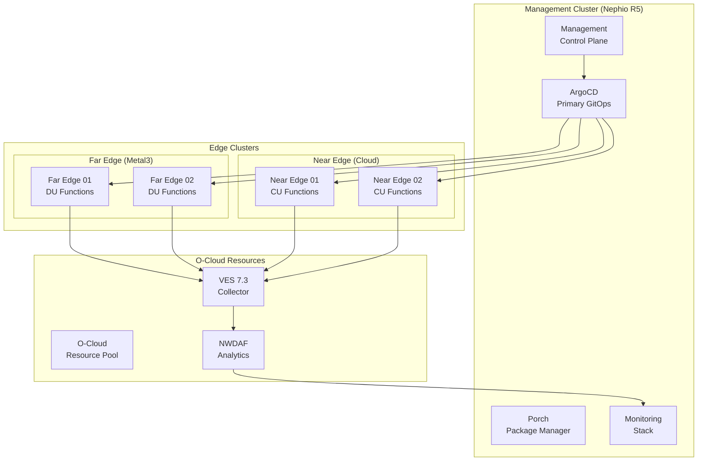

# Nephio R5-O-RAN L Release Infrastructure Deployment

This directory contains comprehensive infrastructure deployment manifests for the Conductor Loop component integrated with Nephio R5 and O-RAN L Release specifications.

## Overview

The deployment provides a production-ready, multi-cluster infrastructure with:

- **Nephio R5 Management Cluster**: Kubernetes 1.29+ with native R5 features
- **Baremetal Edge Clusters**: Metal3-based provisioning for far-edge sites
- **Cloud Edge Clusters**: AWS/GCP-based near-edge deployments
- **ArgoCD GitOps**: Primary deployment engine with ApplicationSets
- **Istio Ambient Mesh**: Sidecar-less service mesh for improved performance
- **Comprehensive Monitoring**: VES 7.3, NWDAF, and cloud-native observability
- **Security Hardening**: O-RAN WG11 compliance with zero-trust architecture
- **Disaster Recovery**: Velero-based backup with cross-region replication

## Architecture



## Files Structure

```
deployments/nephio-r5/
├── ocloud-management-cluster.yaml      # Nephio R5 management cluster
├── baremetal-edge-clusters.yaml        # Metal3 edge clusters
├── argocd-applicationsets.yaml         # Multi-cluster GitOps
├── service-mesh-ambient.yaml           # Istio ambient mesh
├── monitoring-observability.yaml       # VES 7.3 + NWDAF monitoring
├── security-policies.yaml              # O-RAN WG11 security
├── disaster-recovery.yaml              # Velero backup/restore
└── README.md                          # This file
```

## Prerequisites

### Infrastructure Requirements

- **Kubernetes Clusters**: v1.29+ with Pod Security Standards
- **Container Registry**: With vulnerability scanning support
- **Storage**: Fast SSD storage class (recommended 10K IOPS+)
- **Network**: Calico/Cilium CNI with NetworkPolicy support
- **DNS**: CoreDNS with custom zone support
- **Load Balancer**: MetalLB for bare metal or cloud LB

### Cluster API Providers

- **Management**: KIND/Docker for development, kubeadm for production
- **Far Edge**: Metal3 with Ironic for baremetal provisioning  
- **Near Edge**: AWS (CAPA), Azure (CAPZ), or GCP (CAPG) providers

### External Dependencies

- **ArgoCD**: v2.10.0+ as primary GitOps engine
- **Istio**: v1.21.0+ with ambient mesh support
- **Prometheus**: v2.48.0+ for metrics collection
- **Velero**: v1.12.0+ for disaster recovery
- **cert-manager**: v1.13.0+ for TLS certificate management

## Quick Start

### 1. Deploy Management Cluster

```bash
# Create Nephio R5 management cluster
kubectl apply -f ocloud-management-cluster.yaml

# Wait for control plane ready
kubectl wait --for=condition=Ready cluster/nephio-r5-management --timeout=10m

# Get kubeconfig for management cluster
kubectl get secret nephio-r5-management-kubeconfig -o jsonpath='{.data.value}' | base64 -d > mgmt-kubeconfig.yaml
```

### 2. Install ArgoCD

```bash
# Switch to management cluster context
export KUBECONFIG=mgmt-kubeconfig.yaml

# Install ArgoCD
kubectl create namespace argocd
kubectl apply -n argocd -f https://raw.githubusercontent.com/argoproj/argo-cd/v2.10.0/manifests/install.yaml

# Wait for ArgoCD ready
kubectl wait --for=condition=Ready pod -l app.kubernetes.io/name=argocd-server -n argocd --timeout=5m

# Get ArgoCD admin password
kubectl -n argocd get secret argocd-initial-admin-secret -o jsonpath="{.data.password}" | base64 -d
```

### 3. Deploy ApplicationSets

```bash
# Apply ApplicationSets for multi-cluster deployment
kubectl apply -f argocd-applicationsets.yaml

# Monitor deployment status
kubectl get applicationsets -n argocd
kubectl get applications -n argocd
```

### 4. Provision Edge Clusters

```bash
# Deploy edge clusters
kubectl apply -f baremetal-edge-clusters.yaml

# Monitor cluster provisioning
kubectl get clusters -w
kubectl get baremetalhosts -A
```

### 5. Configure Service Mesh

```bash
# Deploy Istio ambient mesh
kubectl apply -f service-mesh-ambient.yaml

# Verify mesh installation
kubectl get pods -n istio-system
kubectl get gateways -A
```

### 6. Setup Monitoring

```bash
# Deploy monitoring stack
kubectl apply -f monitoring-observability.yaml

# Verify monitoring services
kubectl get pods -n monitoring
kubectl get pods -n ves
kubectl get pods -n analytics

# Access Grafana dashboard
kubectl port-forward -n monitoring svc/grafana 3000:3000
# Visit http://localhost:3000 (admin/admin)
```

### 7. Apply Security Policies

```bash
# Deploy security policies
kubectl apply -f security-policies.yaml

# Verify security enforcement
kubectl get constraints
kubectl get networkpolicies -A
kubectl get pods -n security-system
```

### 8. Configure Disaster Recovery

```bash
# Setup disaster recovery
kubectl apply -f disaster-recovery.yaml

# Verify backup schedules
kubectl get schedules -n velero
kubectl get backups -n velero
```

## Configuration

### Environment Variables

Set these environment variables before deployment:

```bash
# Cluster configuration
export CLUSTER_NAME="nephio-r5-production"
export NEPHIO_VERSION="r5"
export ORAN_RELEASE="l-release"

# Cloud provider settings (choose one)
export CLOUD_PROVIDER="aws"  # or "gcp", "azure", "metal3"
export AWS_REGION="us-west-2"
export AWS_ACCOUNT_ID="123456789012"

# ArgoCD configuration
export ARGOCD_REPO_URL="https://github.com/thc1006/nephoran-intent-operator.git"
export ARGOCD_REPO_BRANCH="feat/conductor-loop"

# Monitoring configuration
export PROMETHEUS_RETENTION="30d"
export GRAFANA_ADMIN_PASSWORD="secure-password"

# Security configuration
export ENABLE_OPA_GATEKEEPER="true"
export ENABLE_FALCO="true"
export ENABLE_SPIFFE="true"

# Backup configuration
export BACKUP_BUCKET_PRIMARY="nephio-r5-backups-primary"
export BACKUP_BUCKET_SECONDARY="nephio-r5-backups-secondary"
export BACKUP_RETENTION_DAYS="30"
```

### Customization

#### 1. Cluster Sizing

Edit resource specifications in the cluster manifests:

```yaml
# ocloud-management-cluster.yaml
spec:
  replicas: 5  # Adjust worker node count
  machineTemplate:
    spec:
      customImage: "kindest/node:v1.29.0"  # Change base image
```

#### 2. Storage Classes

Configure storage classes for different workloads:

```yaml
# Add to cluster configuration
storageClasses:
  - name: "fast-ssd"
    provisioner: "kubernetes.io/aws-ebs"
    parameters:
      type: "gp3"
      iops: "10000"
```

#### 3. Network Policies

Customize network policies for specific security requirements:

```yaml
# security-policies.yaml
spec:
  podSelector:
    matchLabels:
      app.kubernetes.io/name: conductor-loop
  egress:
  - to:
    - namespaceSelector:
        matchLabels:
          name: custom-namespace  # Add custom namespace
```

## Monitoring and Observability

### Key Metrics

Monitor these critical metrics:

- **Conductor Loop Performance**
  - `nephio_files_processed_total` - Total files processed
  - `nephio_processing_duration_seconds` - Processing latency
  - `nephio_queue_depth` - Current queue depth
  - `nephio_errors_total` - Error count by type

- **O-RAN Network Functions**
  - `oran_throughput_bytes_total` - RAN throughput
  - `oran_latency_seconds` - E2E latency
  - `oran_availability_ratio` - Service availability

- **Infrastructure Health**
  - `cluster_node_ready_total` - Node readiness
  - `cluster_pod_ready_ratio` - Pod availability
  - `etcd_server_has_leader` - Control plane health

### Dashboards

Access monitoring dashboards:

```bash
# Grafana dashboards
kubectl port-forward -n monitoring svc/grafana 3000:3000

# Prometheus metrics
kubectl port-forward -n monitoring svc/prometheus 9090:9090

# VES collector status  
kubectl port-forward -n ves svc/ves-collector 8080:8080
```

### Alerting

Critical alerts are configured for:

- Service downtime (>30 seconds)
- High error rates (>10%)
- Resource exhaustion (>80% utilization)
- Security policy violations
- Backup failures

## Security

### O-RAN WG11 Compliance

The deployment implements O-RAN WG11 security specifications:

- **Identity & Access Management**: SPIFFE/SPIRE for service identity
- **Network Security**: Zero-trust with network policies
- **Runtime Security**: Falco-based threat detection
- **Data Protection**: Encryption at rest and in transit
- **Compliance Monitoring**: Automated compliance reporting

### Security Hardening Checklist

- [x] Pod Security Standards (Restricted profile)
- [x] Network policies for all namespaces
- [x] Non-root containers with read-only filesystems
- [x] RBAC with minimal permissions
- [x] TLS encryption for all communications
- [x] Container image scanning
- [x] Runtime threat detection
- [x] Audit logging enabled

### Certificate Management

TLS certificates are automatically managed:

```bash
# View certificate status
kubectl get certificates -A

# Check certificate expiration
kubectl describe certificate nephio-r5-tls-cert -n cert-manager
```

## Disaster Recovery

### Backup Strategy

- **Daily Backups**: Critical namespaces with 30-day retention
- **Weekly Backups**: Full cluster with 180-day retention
- **Cross-Region Replication**: Critical data replicated to secondary region
- **Automated Verification**: Daily backup integrity checks

### Recovery Procedures

#### Full Cluster Restore

```bash
# List available backups
velero backup get

# Restore from latest backup
velero restore create full-restore-$(date +%Y%m%d) \
  --from-backup nephio-r5-daily-20241201-020000 \
  --wait

# Verify restore
kubectl get pods -A
```

#### Selective Namespace Restore

```bash
# Restore specific namespace
velero restore create namespace-restore-$(date +%Y%m%d) \
  --from-backup nephio-r5-daily-20241201-020000 \
  --include-namespaces nephoran-conductor \
  --wait
```

#### Cross-Region Failover

```bash
# Execute cross-region failover script
kubectl exec -n velero deployment/velero -- /scripts/cross-region-failover.sh

# Update DNS records to point to failover region
# Update load balancer configurations
```

## Troubleshooting

### Common Issues

#### 1. Cluster Provisioning Failures

```bash
# Check cluster status
kubectl describe cluster nephio-r5-management

# View control plane logs
kubectl logs -n capi-system deployment/capi-controller-manager

# Check machine provisioning
kubectl get machines -A
kubectl describe machine problematic-machine
```

#### 2. ArgoCD Sync Issues

```bash
# Check application status
argocd app list
argocd app get nephio-r5-conductor-loop

# View sync errors
argocd app sync nephio-r5-conductor-loop --dry-run

# Force sync
argocd app sync nephio-r5-conductor-loop --force
```

#### 3. Service Mesh Connectivity

```bash
# Check Istio control plane
istioctl proxy-status

# Verify ambient mesh
kubectl get ztunnel -A

# Test service connectivity
istioctl proxy-config cluster conductor-loop-pod
```

#### 4. Monitoring Stack Issues

```bash
# Check Prometheus targets
kubectl port-forward -n monitoring svc/prometheus 9090:9090
# Visit http://localhost:9090/targets

# Verify VES collector
kubectl logs -n ves deployment/ves-collector

# Check NWDAF analytics
kubectl logs -n analytics deployment/nwdaf-analytics
```

### Debug Commands

```bash
# Cluster debugging
kubectl get events --sort-by=.metadata.creationTimestamp -A

# Network debugging
kubectl get networkpolicies -A
kubectl describe pod -n nephoran-conductor conductor-loop-xxx

# Security debugging
kubectl get constraints
kubectl logs -n gatekeeper-system deployment/gatekeeper-controller-manager

# Backup debugging
velero backup describe problematic-backup --details
kubectl logs -n velero deployment/velero
```

## Performance Optimization

### Resource Tuning

Optimize resource allocation based on workload:

```yaml
# Conductor Loop resource tuning
resources:
  requests:
    cpu: 500m      # Increase for high throughput
    memory: 1Gi    # Adjust based on file sizes
  limits:
    cpu: 2000m     # Scale up for concurrent processing
    memory: 4Gi    # Prevent OOM under load
```

### Network Optimization

Configure network settings for edge deployments:

```yaml
# Kubelet configuration for edge nodes
kubeletExtraArgs:
  max-pods: "50"              # Reduce for edge
  system-reserved: "cpu=500m,memory=1Gi"
  kube-reserved: "cpu=500m,memory=1Gi"
  eviction-hard: "memory.available<100Mi,nodefs.available<1Gi"
```

### Storage Optimization

Use appropriate storage classes:

- **Management Cluster**: `fast-ssd` (gp3, 10K IOPS)
- **Edge Clusters**: `local-ssd` (local NVMe)
- **Backup Storage**: `standard` (S3 Standard)

## Maintenance

### Regular Maintenance Tasks

- **Monthly**: Review and update container images
- **Weekly**: Check backup integrity and test restores  
- **Daily**: Monitor resource utilization and performance
- **Real-time**: Review security alerts and compliance reports

### Update Procedures

1. **Test Updates**: Apply to staging environment first
2. **Rolling Updates**: Use ArgoCD sync waves for controlled rollouts
3. **Canary Deployments**: Use Istio traffic splitting
4. **Rollback Plan**: Always have rollback procedures ready

## Support and Contributing

- **Documentation**: [Nephio R5 Documentation](https://docs.nephio.org/r5)
- **Issues**: [GitHub Issues](https://github.com/thc1006/nephoran-intent-operator/issues)
- **Discussions**: [Nephio Community](https://github.com/nephio-project/nephio/discussions)
- **Security**: Report security issues to security@nephio.org

## License

This deployment configuration is licensed under the Apache 2.0 License. See the LICENSE file for details.

---

**Last Updated**: 2025-01-15  
**Version**: R5.0.0  
**Deployment Guide Version**: 1.0.0