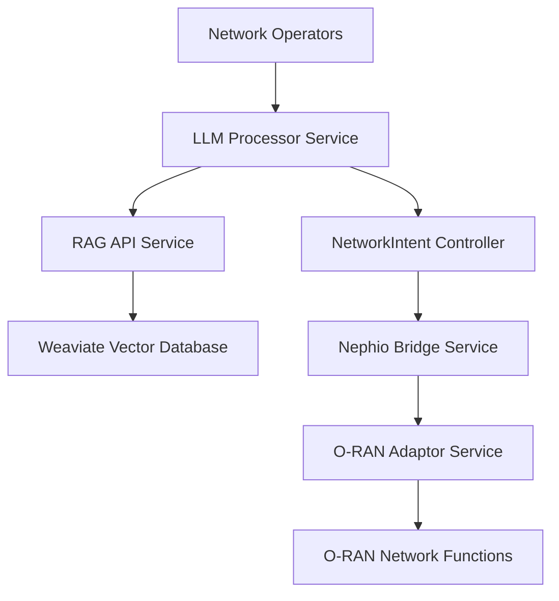

# Nephoran Intent Operator - API Documentation

## Overview

This document provides comprehensive API documentation for all services in the Nephoran Intent Operator system. The system includes multiple microservices that work together to process natural language intents and deploy O-RAN network functions.

## Service Architecture



## LLM Processor Service API

**Base URL**: `http://llm-processor:8080`  
**Service Version**: v2.0.0  
**Authentication**: OAuth2 (optional), API Key (optional)

### Core Endpoints

#### Process Intent
Process natural language intents and convert them to structured network operations.

**Endpoint**: `POST /process`  
**Authentication**: Required if `REQUIRE_AUTH=true`  
**Role**: Operator role required

**Request Body**:
```json
{
  "intent": "Deploy AMF with 3 replicas for network slice eMBB",
  "metadata": {
    "namespace": "telecom-core",
    "priority": "high",
    "user_id": "operator-001"
  }
}
```

**Response**:
```json
{
  "result": "Generated network configuration...",
  "status": "success",
  "processing_time": "1.234s",
  "request_id": "1641024000123456789",
  "service_version": "v2.0.0",
  "metadata": {
    "tokens_used": 1456,
    "model_used": "gpt-4o-mini",
    "confidence_score": 0.94
  }
}
```

**Error Response**:
```json
{
  "status": "error",
  "error": "Intent processing failed: OpenAI API timeout",
  "request_id": "1641024000123456789",
  "service_version": "v2.0.0",
  "processing_time": "30.0s"
}
```

**Response Codes**:
- `200 OK`: Intent processed successfully
- `400 Bad Request`: Invalid request body or missing intent
- `401 Unauthorized`: Authentication required
- `403 Forbidden`: Insufficient permissions
- `500 Internal Server Error`: Processing failed
- `503 Service Unavailable`: Circuit breaker open

#### Streaming Intent Processing
Real-time streaming processing with Server-Sent Events.

**Endpoint**: `POST /stream`  
**Authentication**: Required if `REQUIRE_AUTH=true`  
**Role**: Operator role required

**Request Body**:
```json
{
  "query": "Configure 5G network slice for enhanced mobile broadband",
  "intent_type": "network_configuration",
  "model_name": "gpt-4o-mini",
  "max_tokens": 2048,
  "enable_rag": true,
  "session_id": "session_123"
}
```

**Response**: Server-Sent Events stream
```
event: start
data: {"session_id":"session_123","status":"started"}

event: context_injection
data: {"type":"context_injection","content":"Context retrieved and injected","metadata":{"context_length":15420,"injection_time":"85ms"}}

event: chunk
data: {"type":"content","delta":"Based on the retrieved 3GPP TS 23.501 specifications...","timestamp":"2025-01-30T10:30:15Z","chunk_index":0}

event: completion
data: {"type":"completion","is_complete":true,"metadata":{"total_chunks":15,"total_bytes":8192,"processing_time":"2.3s"}}
```

### Health and Status Endpoints

#### Health Check (Liveness)
**Endpoint**: `GET /healthz`  
**Authentication**: None  

**Response**:
```json
{
  "status": "healthy",
  "version": "v2.0.0",
  "uptime": "2h34m18s",
  "timestamp": "2025-01-30T10:30:15Z"
}
```

#### Readiness Check
**Endpoint**: `GET /readyz`  
**Authentication**: None  

**Response**:
```json
{
  "status": "ready",
  "version": "v2.0.0",
  "dependencies": {
    "rag_api": "healthy",
    "circuit_breaker": "operational",
    "token_manager": "operational"
  },
  "timestamp": "2025-01-30T10:30:15Z"
}
```

#### Service Status
**Endpoint**: `GET /status`  
**Authentication**: Admin role required if auth enabled

**Response**:
```json
{
  "service": "llm-processor",
  "version": "v2.0.0",
  "uptime": "2h34m18s",
  "healthy": true,
  "ready": true,
  "backend_type": "rag",
  "model": "gpt-4o-mini",
  "rag_enabled": true,
  "timestamp": "2025-01-30T10:30:15Z"
}
```

### Metrics and Monitoring Endpoints

#### Comprehensive Metrics
**Endpoint**: `GET /metrics`  
**Authentication**: None  
**Format**: JSON (Prometheus format available)

**Response**:
```json
{
  "service": "llm-processor",
  "version": "v2.0.0",
  "uptime": "2h34m18s",
  "supported_models": ["gpt-4o", "gpt-4o-mini", "claude-3-haiku"],
  "circuit_breakers": {
    "llm-processor": {
      "state": "closed",
      "failure_count": 2,
      "success_count": 847,
      "failure_rate": 0.0023,
      "total_requests": 849,
      "last_failure_time": "2025-01-30T09:15:32Z"
    }
  },
  "streaming": {
    "active_streams": 3,
    "total_streams": 127,
    "completed_streams": 124,
    "average_stream_time": "2.1s",
    "total_bytes_streamed": 2048576
  },
  "context_builder": {
    "total_requests": 451,
    "successful_builds": 449,
    "average_build_time": "245ms",
    "average_context_size": 4096,
    "truncation_rate": 0.12
  }
}
```

#### Circuit Breaker Management
**Endpoint**: `GET /circuit-breaker/status`  
**Authentication**: Admin role required

**Response**:
```json
{
  "llm-processor": {
    "name": "llm-processor",
    "state": "closed",
    "failure_count": 2,
    "success_count": 847,
    "failure_rate": 0.0023,
    "total_requests": 849,
    "last_failure_time": "2025-01-30T09:15:32Z",
    "uptime": "2h34m18s"
  }
}
```

**Circuit Breaker Control**:
**Endpoint**: `POST /circuit-breaker/status`  
**Authentication**: Admin role required

**Request Body**:
```json
{
  "action": "reset",
  "name": "llm-processor"
}
```

**Actions**: `reset`, `force_open`

### OAuth2 Authentication Endpoints

#### Provider Login
**Endpoint**: `GET /auth/login/{provider}`  
**Parameters**: 
- `provider`: `azure`, `okta`, `keycloak`, `google`

**Response**: Redirect to OAuth2 provider

#### OAuth2 Callback
**Endpoint**: `GET /auth/callback/{provider}`  
**Parameters**: OAuth2 callback parameters

**Response**:
```json
{
  "access_token": "eyJhbGciOiJIUzI1NiIsInR5cCI6IkpXVCJ9...",
  "refresh_token": "eyJhbGciOiJIUzI1NiIsInR5cCI6IkpXVCJ9...",
  "expires_in": 3600,
  "user_info": {
    "id": "user-123",
    "email": "operator@company.com",
    "roles": ["operator"]
  }
}
```

#### Token Refresh
**Endpoint**: `POST /auth/refresh`  
**Authentication**: Valid refresh token

**Request Body**:
```json
{
  "refresh_token": "eyJhbGciOiJIUzI1NiIsInR5cCI6IkpXVCJ9..."
}
```

#### User Information
**Endpoint**: `GET /auth/userinfo`  
**Authentication**: Valid access token

**Response**:
```json
{
  "id": "user-123",
  "email": "operator@company.com",
  "name": "Network Operator",
  "roles": ["operator"],
  "permissions": ["process_intents", "view_status"]
}
```

#### Logout
**Endpoint**: `POST /auth/logout`  
**Authentication**: Valid access token

**Response**:
```json
{
  "status": "success",
  "message": "Logged out successfully"
}
```

## RAG API Service

**Base URL**: `http://rag-api:5001`  
**Service Version**: v1.5.0  
**Authentication**: API Key (optional)

### Core Endpoints

#### Process Intent with RAG
**Endpoint**: `POST /process_intent`  
**Content-Type**: `application/json`

**Request Body**:
```json
{
  "intent": "Scale E2 nodes to 5 replicas",
  "intent_id": "intent-12345",
  "context": {
    "namespace": "telecom-ran",
    "user": "operator-001"
  }
}
```

**Response**:
```json
{
  "intent_id": "intent-12345",
  "original_intent": "Scale E2 nodes to 5 replicas",
  "structured_output": {
    "type": "NetworkFunctionScale",
    "name": "e2-nodes",
    "namespace": "telecom-ran",
    "spec": {
      "replicas": 5,
      "scaling_policy": "horizontal",
      "resources": {
        "cpu": "500m",
        "memory": "1Gi"
      }
    }
  },
  "status": "completed",
  "metrics": {
    "processing_time_ms": 1847.3,
    "tokens_used": 1245,
    "retrieval_score": 0.89,
    "confidence_score": 0.92,
    "cache_hit": false,
    "model_version": "gpt-4o-mini"
  },
  "timestamp": 1641024000.123
}
```

#### Query Vector Database
**Endpoint**: `POST /v1/query`  
**Content-Type**: `application/json`

**Request Body**:
```json
{
  "query": "AMF registration procedures",
  "limit": 10,
  "filters": {
    "category": "5G Core",
    "source": "3GPP"
  },
  "include_metadata": true
}
```

**Response**:
```json
{
  "results": [
    {
      "id": "doc-12345",
      "content": "AMF registration procedure involves...",
      "metadata": {
        "title": "3GPP TS 23.501",
        "category": "5G Core",
        "source": "3GPP",
        "version": "Release 17",
        "confidence": 0.94
      },
      "score": 0.89
    }
  ],
  "query_metadata": {
    "total_results": 25,
    "search_time_ms": 156,
    "query_id": "query-67890"
  }
}
```

### Knowledge Management Endpoints

#### Upload Document
**Endpoint**: `POST /knowledge/upload`  
**Content-Type**: `multipart/form-data`

**Request**: File upload with metadata
```bash
curl -X POST http://rag-api:5001/knowledge/upload \
  -F "file=@3gpp-ts-23501.pdf" \
  -F "metadata={\"category\":\"5G Core\",\"source\":\"3GPP\"}"
```

**Response**:
```json
{
  "document_id": "doc-98765",
  "filename": "3gpp-ts-23501.pdf",
  "size_bytes": 2048576,
  "chunks_created": 245,
  "processing_time_ms": 12456,
  "status": "processed"
}
```

#### Knowledge Base Statistics
**Endpoint**: `GET /knowledge/stats`

**Response**:
```json
{
  "total_documents": 1247,
  "total_chunks": 145789,
  "categories": {
    "5G Core": 456,
    "RAN": 389,
    "Transport": 234,
    "Management": 168
  },
  "sources": {
    "3GPP": 678,
    "O-RAN": 345,
    "ETSI": 156,
    "ITU": 68
  },
  "index_size_gb": 4.2,
  "last_updated": "2025-01-30T08:15:22Z"
}
```

### Health Endpoints

#### Health Check
**Endpoint**: `GET /health`

**Response**:
```json
{
  "status": "healthy",
  "version": "v1.5.0",
  "dependencies": {
    "weaviate": "connected",
    "openai": "available",
    "redis": "connected"
  },
  "uptime": "1d 5h 23m",
  "timestamp": "2025-01-30T10:30:15Z"
}
```

#### Readiness Check
**Endpoint**: `GET /ready`

**Response**:
```json
{
  "status": "ready",
  "checks": {
    "vector_db": "operational",
    "embedding_service": "operational",
    "knowledge_base": "loaded"
  },
  "knowledge_base_stats": {
    "total_documents": 1247,
    "last_indexed": "2025-01-30T08:15:22Z"
  }
}
```

## NetworkIntent Controller API

**Base URL**: Kubernetes API Server  
**API Version**: `nephoran.com/v1`  
**Resource**: `networkintents`

### Custom Resource Definition

```yaml
apiVersion: nephoran.com/v1
kind: NetworkIntent
metadata:
  name: example-intent
  namespace: default
spec:
  # Natural language intent description
  intent: "Deploy AMF with 3 replicas for network slice eMBB"
  
  # Processing parameters
  priority: "high"  # low, medium, high, critical
  
  # Optional structured parameters (populated by LLM processing)
  parameters:
    networkFunction: "AMF"
    replicas: 3
    namespace: "telecom-core"
    resources:
      cpu: "2000m"
      memory: "4Gi"
    networkSlice:
      type: "eMBB"
      sla:
        latency: "20ms"
        throughput: "1Gbps"
  
  # Processing configuration
  config:
    llmModel: "gpt-4o-mini"
    timeout: "60s"
    retries: 3

status:
  # Processing phase
  phase: "Processed"  # Pending, Processing, Processed, Deployed, Failed
  
  # Processing results
  conditions:
    - type: "LLMProcessed"
      status: "True"
      reason: "IntentProcessedSuccessfully"
      message: "Intent successfully processed by LLM"
      lastTransitionTime: "2025-01-30T10:30:15Z"
    
    - type: "ParametersExtracted"
      status: "True"
      reason: "ParametersValid"
      message: "Structured parameters extracted and validated"
      lastTransitionTime: "2025-01-30T10:30:20Z"
  
  # Processing metadata
  processingInfo:
    llmModel: "gpt-4o-mini"
    processingTime: "2.3s"
    tokensUsed: 1456
    confidenceScore: 0.94
    requestID: "req-12345"
  
  # Generated resources
  generatedResources:
    - apiVersion: "apps/v1"
      kind: "Deployment"
      name: "amf-deployment"
      namespace: "telecom-core"
    - apiVersion: "v1"
      kind: "Service"
      name: "amf-service"
      namespace: "telecom-core"
```

### API Operations

#### Create NetworkIntent
```bash
kubectl apply -f networkintent.yaml
```

#### List NetworkIntents
```bash
kubectl get networkintents
```

#### Get NetworkIntent Details
```bash
kubectl describe networkintent example-intent
```

#### Update NetworkIntent
```bash
kubectl patch networkintent example-intent --type merge -p '{"spec":{"priority":"critical"}}'
```

#### Delete NetworkIntent
```bash
kubectl delete networkintent example-intent
```

## E2NodeSet Controller API

**Base URL**: Kubernetes API Server  
**API Version**: `nephoran.com/v1`  
**Resource**: `e2nodesets`

### Custom Resource Definition

```yaml
apiVersion: nephoran.com/v1
kind: E2NodeSet
metadata:
  name: simulated-gnbs
  namespace: default
spec:
  # Desired number of E2 node simulators
  replicas: 5
  
  # Node configuration template
  nodeTemplate:
    metadata:
      labels:
        type: "gNB-simulator"
        version: "v1.0"
    spec:
      # E2 connection parameters
      e2Connection:
        ricEndpoint: "http://near-rt-ric:8080"
        nodeId: "auto-generated"
        plmnId: "12345"
      
      # Resource requirements
      resources:
        requests:
          cpu: "100m"
          memory: "256Mi"
        limits:
          cpu: "500m"
          memory: "1Gi"
      
      # Configuration parameters
      config:
        cellCount: 3
        bandwidth: "100MHz"
        txPower: "20dBm"

status:
  # Replica status
  replicas: 5
  readyReplicas: 5
  availableReplicas: 5
  
  # Scaling conditions
  conditions:
    - type: "ScalingComplete"
      status: "True"
      reason: "ReplicasCreated"
      message: "All E2 node replicas are running"
      lastTransitionTime: "2025-01-30T10:30:25Z"
  
  # Individual node status
  nodeStatus:
    - nodeId: "gnb-001"
      status: "Running"
      configMapName: "e2node-gnb-001"
      lastSeen: "2025-01-30T10:35:15Z"
    - nodeId: "gnb-002"
      status: "Running"
      configMapName: "e2node-gnb-002"
      lastSeen: "2025-01-30T10:35:14Z"
```

### API Operations

#### Create E2NodeSet
```bash
kubectl apply -f e2nodeset.yaml
```

#### Scale E2NodeSet
```bash
kubectl patch e2nodeset simulated-gnbs --type merge -p '{"spec":{"replicas":8}}'
```

#### Monitor Scaling
```bash
kubectl get e2nodesets -w
kubectl get configmaps -l e2nodeset=simulated-gnbs
```

## O-RAN Adaptor Service API

**Base URL**: `http://oran-adaptor:8082`  
**Service Version**: v1.0.0  
**Authentication**: API Key

### A1 Interface (Policy Management)

#### Create Policy Type
**Endpoint**: `POST /a1/policy-types`

**Request Body**:
```json
{
  "policyTypeId": "1000",
  "name": "QoS Policy",
  "description": "Quality of Service policy for network slices",
  "schema": {
    "type": "object",
    "properties": {
      "sliceId": {"type": "string"},
      "qosParameters": {
        "type": "object",
        "properties": {
          "latency": {"type": "number"},
          "throughput": {"type": "number"}
        }
      }
    }
  }
}
```

#### Create Policy Instance
**Endpoint**: `POST /a1/policy-types/{policyTypeId}/policies`

**Request Body**:
```json
{
  "policyInstanceId": "policy-001",
  "policyData": {
    "sliceId": "embb-001",
    "qosParameters": {
      "latency": 20,
      "throughput": 1000
    }
  }
}
```

### O1 Interface (Fault/Configuration Management)

#### Get Fault Management Status
**Endpoint**: `GET /o1/fault-management/alarms`

**Response**:
```json
{
  "alarms": [
    {
      "alarmId": "alarm-001",
      "severity": "major",
      "source": "amf-001",
      "description": "High CPU utilization",
      "timestamp": "2025-01-30T10:30:15Z",
      "status": "active"
    }
  ],
  "totalCount": 1
}
```

#### Update Configuration
**Endpoint**: `POST /o1/configuration-management/config`

**Request Body**:
```json
{
  "managedElement": "amf-001",
  "configData": {
    "maxConnections": 1000,
    "logLevel": "INFO",
    "healthCheckInterval": "30s"
  }
}
```

### O2 Interface (Cloud Infrastructure)

#### Deploy Infrastructure
**Endpoint**: `POST /o2/infrastructure/deploy`

**Request Body**:
```json
{
  "deploymentName": "5g-core-infrastructure",
  "resources": [
    {
      "type": "VirtualMachine",
      "specs": {
        "cpu": 8,
        "memory": "32Gi",
        "storage": "500Gi"
      },
      "count": 3
    }
  ],
  "networkConfig": {
    "subnet": "10.0.0.0/24",
    "securityGroups": ["sg-telecom"]
  }
}
```

## Error Handling and Status Codes

### Common HTTP Status Codes

- **200 OK**: Request successful
- **201 Created**: Resource created successfully
- **202 Accepted**: Request accepted for async processing
- **400 Bad Request**: Invalid request parameters
- **401 Unauthorized**: Authentication required
- **403 Forbidden**: Insufficient permissions
- **404 Not Found**: Resource not found
- **409 Conflict**: Resource conflict (e.g., duplicate name)
- **422 Unprocessable Entity**: Valid request but semantic errors
- **429 Too Many Requests**: Rate limit exceeded
- **500 Internal Server Error**: Internal server error
- **502 Bad Gateway**: Upstream service error
- **503 Service Unavailable**: Service temporarily unavailable
- **504 Gateway Timeout**: Upstream service timeout

### Error Response Format

All services use a consistent error response format:

```json
{
  "error": {
    "code": "INTENT_PROCESSING_FAILED",
    "message": "Failed to process network intent",
    "details": {
      "reason": "OpenAI API timeout",
      "intent": "Deploy AMF with 3 replicas",
      "retryable": true,
      "retry_after": 30
    },
    "timestamp": "2025-01-30T10:30:15Z",
    "request_id": "req-12345"
  }
}
```

### Error Codes Reference

| Code | Description | Service | Retryable |
|------|-------------|---------|-----------|
| `INTENT_PROCESSING_FAILED` | LLM processing failed | LLM Processor | Yes |
| `RAG_SERVICE_UNAVAILABLE` | RAG API unavailable | LLM Processor | Yes |
| `INVALID_INTENT_FORMAT` | Invalid intent structure | LLM Processor | No |
| `AUTHENTICATION_FAILED` | Authentication failed | All Services | No |
| `RATE_LIMIT_EXCEEDED` | Too many requests | All Services | Yes |
| `CIRCUIT_BREAKER_OPEN` | Circuit breaker active | LLM Processor | Yes |
| `VECTOR_DB_ERROR` | Vector database error | RAG API | Yes |
| `KNOWLEDGE_BASE_EMPTY` | No documents indexed | RAG API | No |
| `CRD_VALIDATION_FAILED` | Invalid CRD specification | Controllers | No |
| `SCALING_FAILED` | E2NodeSet scaling failed | E2NodeSet Controller | Yes |
| `ORAN_INTERFACE_ERROR` | O-RAN interface error | O-RAN Adaptor | Yes |

## Rate Limiting

All services implement rate limiting to ensure fair usage and system stability.

### Default Rate Limits

| Service | Endpoint | Rate Limit | Burst |
|---------|----------|------------|--------|
| LLM Processor | `/process` | 60 req/min | 10 |
| LLM Processor | `/stream` | 30 req/min | 5 |
| RAG API | `/process_intent` | 100 req/min | 20 |
| RAG API | `/v1/query` | 200 req/min | 50 |
| O-RAN Adaptor | All endpoints | 120 req/min | 30 |

### Rate Limit Headers

All services include rate limiting information in response headers:

```
X-RateLimit-Limit: 60
X-RateLimit-Remaining: 45
X-RateLimit-Reset: 1641024600
Retry-After: 30
```

## SDK and Client Libraries

### Go Client Example

```go
package main

import (
    "context"
    "fmt"
    "github.com/thc1006/nephoran-intent-operator/pkg/client"
)

func main() {
    // Initialize client
    config := client.Config{
        LLMProcessorURL: "http://llm-processor:8080",
        RAGAPIUrl:      "http://rag-api:5001",
        APIKey:         "your-api-key",
    }
    
    client := client.NewNephoranClient(config)
    
    // Process intent
    result, err := client.ProcessIntent(context.Background(), &client.IntentRequest{
        Intent: "Deploy AMF with 3 replicas for network slice eMBB",
        Metadata: map[string]string{
            "namespace": "telecom-core",
            "priority":  "high",
        },
    })
    
    if err != nil {
        fmt.Printf("Error: %v\n", err)
        return
    }
    
    fmt.Printf("Result: %s\n", result.Result)
}
```

### Python Client Example

```python
import requests
import json

class NephoranClient:
    def __init__(self, base_url, api_key=None):
        self.base_url = base_url
        self.api_key = api_key
        self.session = requests.Session()
        if api_key:
            self.session.headers.update({'Authorization': f'Bearer {api_key}'})
    
    def process_intent(self, intent, metadata=None):
        payload = {
            'intent': intent,
            'metadata': metadata or {}
        }
        
        response = self.session.post(
            f'{self.base_url}/process',
            json=payload,
            timeout=60
        )
        response.raise_for_status()
        return response.json()

# Usage
client = NephoranClient('http://llm-processor:8080', 'your-api-key')
result = client.process_intent(
    'Deploy AMF with 3 replicas for network slice eMBB',
    {'namespace': 'telecom-core', 'priority': 'high'}
)
print(f"Result: {result['result']}")
```

## Monitoring and Observability

### Prometheus Metrics

All services expose Prometheus metrics at `/metrics` endpoint:

#### LLM Processor Metrics
- `nephoran_llm_requests_total`: Total LLM requests
- `nephoran_llm_request_duration_seconds`: Request duration histogram
- `nephoran_llm_tokens_used_total`: Total tokens consumed
- `nephoran_llm_cache_hits_total`: Cache hit counter
- `nephoran_streaming_active_sessions`: Active streaming sessions

#### RAG API Metrics
- `nephoran_rag_queries_total`: Total RAG queries
- `nephoran_rag_query_duration_seconds`: Query duration histogram
- `nephoran_rag_documents_indexed_total`: Total documents indexed
- `nephoran_rag_vector_search_latency_seconds`: Vector search latency

#### Controller Metrics
- `nephoran_networkintent_processing_duration_seconds`: Intent processing time
- `nephoran_e2nodeset_scaling_duration_seconds`: E2NodeSet scaling time
- `nephoran_controller_reconcile_errors_total`: Controller reconciliation errors

### Health Check Endpoints

All services provide standardized health check endpoints:
- `/healthz`: Liveness probe (basic service health)
- `/readyz`: Readiness probe (service ready to handle requests)
- `/metrics`: Prometheus metrics endpoint

### Distributed Tracing

Services support distributed tracing with Jaeger integration. Trace spans are automatically created for:
- Intent processing requests
- RAG API calls
- Vector database queries
- Controller reconciliation loops
- O-RAN interface communications

## Enhanced Features Documentation

### Async Processing Capabilities

The Nephoran Intent Operator now supports advanced asynchronous processing with Server-Sent Events (SSE) streaming, multi-level caching, and intelligent performance optimization.

#### Server-Sent Events (SSE) Streaming

**Real-time Intent Processing with Streaming Response**

The streaming processor enables real-time processing with immediate feedback:

```bash
# Start a streaming session
curl -X POST http://llm-processor:8080/stream \
  -H "Content-Type: application/json" \
  -H "Accept: text/event-stream" \
  -d '{
    "query": "Deploy AMF with 3 replicas for network slice eMBB",
    "intent_type": "network_deployment",
    "model_name": "gpt-4o-mini",
    "max_tokens": 2048,
    "enable_rag": true,
    "session_id": "demo_session_001"
  }'
```

**Streaming Response Format:**
```
event: start
data: {"session_id":"demo_session_001","status":"started","timestamp":"2025-01-30T10:30:15Z"}

event: context_injection
data: {"type":"context_injection","content":"Context retrieved and injected","metadata":{"context_length":15420,"injection_time":"85ms"}}

event: chunk
data: {"type":"content","delta":"Based on the retrieved 3GPP TS 23.501 specifications for AMF deployment...","timestamp":"2025-01-30T10:30:16Z","chunk_index":0}

event: chunk
data: {"type":"content","delta":"The network function requires the following Kubernetes resources...","timestamp":"2025-01-30T10:30:16Z","chunk_index":1}

event: heartbeat
data: {"timestamp":"2025-01-30T10:30:45Z"}

event: completion
data: {"type":"completion","is_complete":true,"metadata":{"total_chunks":15,"total_bytes":8192,"processing_time":"2.3s"}}
```

**Streaming Session Management:**

- **Concurrent Sessions**: Supports up to 100 concurrent streaming sessions
- **Session Timeout**: Configurable timeout (default: 5 minutes)
- **Heartbeat**: Automatic heartbeat every 30 seconds to maintain connection
- **Graceful Disconnection**: Automatic cleanup of disconnected sessions
- **Error Recovery**: Automatic reconnection support with exponential backoff

#### Session Management API

**Get Active Session Status:**
```bash
curl -X GET http://llm-processor:8080/stream/sessions/demo_session_001
```

**Response:**
```json
{
  "id": "demo_session_001",
  "start_time": "2025-01-30T10:30:15Z",
  "last_activity": "2025-01-30T10:30:45Z",
  "bytes_streamed": 8192,
  "chunks_streamed": 15,
  "context_updates": 2,
  "status": "streaming",
  "metadata": {
    "model_name": "gpt-4o-mini",
    "enable_rag": true
  }
}
```

**Cancel Active Session:**
```bash
curl -X DELETE http://llm-processor:8080/stream/sessions/demo_session_001
```

### Multi-Level Caching System

**Advanced L1/L2 Caching Architecture**

The enhanced caching system provides significant performance improvements:

#### Cache Configuration

```json
{
  "l1_cache": {
    "enabled": true,
    "max_size": 1000,
    "ttl": "15m",
    "eviction_policy": "LRU"
  },
  "l2_cache": {
    "enabled": true,
    "redis_addr": "redis:6379",
    "redis_db": 0,
    "ttl": "1h",
    "compression_enabled": true,
    "compression_threshold": 1024
  },
  "performance": {
    "max_key_size": 256,
    "max_value_size": 10485760,
    "enable_statistics": true
  }
}
```

#### Cache API Endpoints

**Get Cache Statistics:**
```bash
curl -X GET http://llm-processor:8080/cache/stats
```

**Response:**
```json
{
  "l1_stats": {
    "hits": 2456,
    "misses": 543,
    "sets": 2999,
    "evictions": 123,
    "size": 877,
    "hit_rate": 0.819
  },
  "l2_stats": {
    "hits": 1234,
    "misses": 456,
    "sets": 1690,
    "errors": 2,
    "enabled": true,
    "hit_rate": 0.730
  },
  "overall_stats": {
    "total_hits": 3690,
    "total_misses": 999,
    "overall_hit_rate": 0.787,
    "average_get_time": "12.5ms",
    "average_set_time": "8.3ms",
    "memory_usage": 67108864,
    "last_updated": "2025-01-30T10:30:15Z"
  }
}
```

**Cache Operations:**

**Clear Cache:**
```bash
curl -X DELETE http://llm-processor:8080/cache/clear
```

**Warm Cache with Popular Queries:**
```bash
curl -X POST http://llm-processor:8080/cache/warm \
  -H "Content-Type: application/json" \
  -d '{
    "strategy": "popular_queries",
    "limit": 100,
    "categories": ["network_deployment", "scaling_operations"]
  }'
```

#### Specialized Cache Endpoints

**RAG Context Caching:**
```bash
# Cache RAG query results
curl -X POST http://rag-api:5001/cache/rag/set \
  -H "Content-Type: application/json" \
  -d '{
    "query": "AMF deployment procedures",
    "results": [...],
    "ttl": "1h"
  }'

# Retrieve cached RAG results
curl -X GET "http://rag-api:5001/cache/rag/get?query=AMF%20deployment%20procedures"
```

**LLM Response Caching:**
```bash
# Cache LLM responses
curl -X POST http://llm-processor:8080/cache/llm/set \
  -H "Content-Type: application/json" \
  -d '{
    "prompt": "Deploy AMF with 3 replicas",
    "model_name": "gpt-4o-mini",
    "response": "...",
    "ttl": "30m"
  }'
```

### Circuit Breaker Pattern

**Advanced Fault Tolerance with Circuit Breakers**

The system implements sophisticated circuit breaker patterns for improved reliability:

#### Circuit Breaker Configuration

```json
{
  "failure_threshold": 5,
  "failure_rate": 0.5,
  "minimum_request_count": 10,
  "timeout": "30s",
  "half_open_timeout": "60s",
  "success_threshold": 3,
  "reset_timeout": "60s",
  "enable_health_check": true,
  "health_check_interval": "30s"
}
```

#### Circuit Breaker Management API

**Get Circuit Breaker Status:**
```bash
curl -X GET http://llm-processor:8080/circuit-breaker/status
```

**Response:**
```json
{
  "llm-processor": {
    "name": "llm-processor",
    "state": "closed",
    "failure_count": 2,
    "success_count": 847,
    "failure_rate": 0.0023,
    "total_requests": 849,
    "last_failure_time": "2025-01-30T09:15:32Z",
    "last_success_time": "2025-01-30T10:29:45Z",
    "uptime": "2h34m18s",
    "average_latency": "1.23s"
  },
  "rag-api": {
    "name": "rag-api",
    "state": "half-open",
    "failure_count": 0,
    "success_count": 2,
    "failure_rate": 0.0,
    "total_requests": 2,
    "state_change_time": "2025-01-30T10:25:00Z"
  }
}
```

**Circuit Breaker Control Operations:**

**Reset Circuit Breaker:**
```bash
curl -X POST http://llm-processor:8080/circuit-breaker/control \
  -H "Content-Type: application/json" \
  -d '{
    "action": "reset",
    "circuit_name": "llm-processor"
  }'
```

**Force Open Circuit Breaker:**
```bash
curl -X POST http://llm-processor:8080/circuit-breaker/control \
  -H "Content-Type: application/json" \
  -d '{
    "action": "force_open",
    "circuit_name": "llm-processor"
  }'
```

### Performance Optimization API

**Intelligent Performance Optimization**

The system includes automated performance optimization capabilities:

#### Performance Metrics Collection

**Get Current Performance Metrics:**
```bash
curl -X GET http://llm-processor:8080/performance/metrics
```

**Response:**
```json
{
  "cpu_usage": 0.65,
  "memory_usage": 0.72,
  "goroutine_count": 45,
  "heap_size": 134217728,
  "average_latency": "1.45s",
  "throughput_rpm": 850,
  "error_rate": 0.023,
  "cache_hit_rate": 0.787,
  "document_processing_time": "2.3s",
  "embedding_generation_time": "0.8s",
  "retrieval_time": "0.15s",
  "context_assembly_time": "0.12s",
  "optimizations_applied": 3,
  "last_optimization": "2025-01-30T10:15:00Z",
  "performance_gain": 0.23
}
```

#### Performance Optimization Controls

**Trigger Manual Optimization:**
```bash
curl -X POST http://llm-processor:8080/performance/optimize \
  -H "Content-Type: application/json" \
  -d '{
    "target_metrics": ["latency", "memory_usage"],
    "optimization_level": "aggressive"
  }'
```

**Get Performance Report:**
```bash
curl -X GET http://llm-processor:8080/performance/report
```

**Response:**
```json
{
  "generated_at": "2025-01-30T10:30:15Z",
  "current_metrics": { ... },
  "active_optimizations": {
    "opt_high_memory_usage_1706607015": {
      "id": "opt_high_memory_usage_1706607015",
      "type": "high_memory_usage",
      "description": "Optimize memory usage through garbage collection and cache cleanup",
      "start_time": "2025-01-30T10:30:15Z",
      "estimated_duration": "30s",
      "status": "running",
      "impact": 0.3
    }
  },
  "recommendations": [
    "Consider increasing available memory or optimizing memory usage",
    "Improve cache strategies and consider cache warming"
  ],
  "health_score": 0.78
}
```

#### Auto-Optimization Configuration

**Configure Auto-Optimization:**
```bash
curl -X POST http://llm-processor:8080/performance/config \
  -H "Content-Type: application/json" \
  -d '{
    "enable_auto_optimization": true,
    "optimization_interval": "10m",
    "memory_threshold": 0.8,
    "cpu_threshold": 0.7,
    "latency_threshold": "5s",
    "throughput_target": 1000,
    "enable_memory_optimization": true,
    "enable_cache_optimization": true
  }'
```

### Enhanced Error Handling

**Comprehensive Error Types and Recovery Patterns**

The system now provides detailed error classification and automatic recovery:

#### Error Categories

| Error Type | Code | Description | Retryable | Recovery Action |
|------------|------|-------------|-----------|------------------|
| `STREAMING_SESSION_LIMIT_EXCEEDED` | `SSE_001` | Maximum concurrent streams reached | Yes | Wait and retry |
| `STREAMING_SESSION_TIMEOUT` | `SSE_002` | Session timeout exceeded | No | Create new session |
| `STREAMING_CONNECTION_LOST` | `SSE_003` | Client connection lost | Yes | Automatic reconnection |
| `CACHE_L1_MEMORY_PRESSURE` | `CACHE_001` | L1 cache memory pressure | No | Automatic eviction |
| `CACHE_L2_REDIS_UNAVAILABLE` | `CACHE_002` | Redis cache unavailable | Yes | Fall back to L1 only |
| `CACHE_SERIALIZATION_ERROR` | `CACHE_003` | Data serialization failed | No | Skip caching |
| `CIRCUIT_BREAKER_OPEN` | `CB_001` | Circuit breaker in open state | Yes | Wait for reset timeout |
| `CIRCUIT_BREAKER_HALF_OPEN_LIMIT` | `CB_002` | Half-open request limit exceeded | Yes | Wait for state transition |
| `PERFORMANCE_MEMORY_THRESHOLD` | `PERF_001` | Memory usage above threshold | No | Auto-optimization triggered |
| `PERFORMANCE_CPU_THRESHOLD` | `PERF_002` | CPU usage above threshold | No | Concurrency limits adjusted |
| `PERFORMANCE_LATENCY_THRESHOLD` | `PERF_003` | Latency above acceptable limit | No | Timeout optimization applied |

#### Error Response Format

**Enhanced Error Structure:**
```json
{
  "error": {
    "code": "STREAMING_SESSION_LIMIT_EXCEEDED",
    "type": "streaming_error",
    "message": "Maximum concurrent streaming sessions exceeded",
    "details": {
      "current_sessions": 100,
      "max_sessions": 100,
      "retry_after": 30,
      "estimated_wait_time": "2m"
    },
    "recovery": {
      "strategy": "exponential_backoff",
      "retryable": true,
      "max_retries": 3,
      "suggested_actions": [
        "Wait for active sessions to complete",
        "Reduce concurrent request load",
        "Consider scaling the service"
      ]
    },
    "context": {
      "component": "streaming-processor",
      "session_id": "attempted_session_id",
      "timestamp": "2025-01-30T10:30:15Z",
      "request_id": "req-12345",
      "correlation_id": "corr-67890"
    }
  }
}
```

#### Automatic Recovery Mechanisms

**Circuit Breaker Recovery:**
- Automatic transition to half-open state after timeout
- Health check probes during open state
- Gradual request throttling during recovery

**Cache Recovery:**
- Automatic L2 failover to L1 when Redis is unavailable
- Memory pressure relief through intelligent eviction
- Background cache warming after recovery

**Performance Recovery:**
- Automatic resource optimization during high load
- Dynamic concurrency adjustment
- Intelligent request batching optimization

## Conclusion

This comprehensive API documentation provides detailed information for integrating with all Nephoran Intent Operator services, including the new enhanced features for async processing, multi-level caching, circuit breaker patterns, and performance optimization. The system now provides production-ready reliability with intelligent error handling and automatic recovery mechanisms.

For additional examples, troubleshooting, and advanced configuration, refer to the service-specific documentation and the main project README.

For support and questions, please refer to the project's GitHub repository or contact the development team.