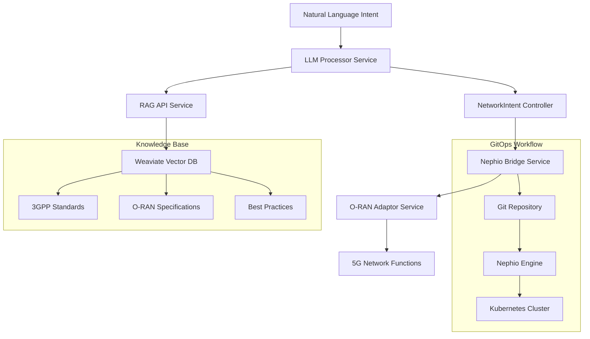

# Nephoran Intent Operator - Developer Guide

## Welcome to Nephoran Development

This comprehensive guide will help new developers quickly understand, set up, and contribute to the Nephoran Intent Operator project. The system is a production-ready cloud-native orchestration platform that bridges natural language network operations with O-RAN compliant deployments.

## Table of Contents

1. [Project Overview](#project-overview)
2. [Development Environment Setup](#development-environment-setup)
3. [Architecture Deep Dive](#architecture-deep-dive)
4. [Code Structure and Organization](#code-structure-and-organization)
5. [Development Workflow](#development-workflow)
6. [Testing Strategy](#testing-strategy)
7. [Contributing Guidelines](#contributing-guidelines)
8. [Best Practices](#best-practices)
9. [Debugging and Troubleshooting](#debugging-and-troubleshooting)
10. [Advanced Topics](#advanced-topics)

## Project Overview

### Mission Statement
Transform telecommunications network operations by providing intelligent, autonomous management capabilities that translate natural language intents into concrete, declarative Kubernetes configurations following GitOps principles.

### Core Technologies
- **Languages**: Go 1.24+, Python 3.8+
- **Frameworks**: Kubernetes controller-runtime, Flask, Ginkgo (testing)
- **AI/ML**: OpenAI GPT models, Weaviate vector database, RAG pipelines
- **Infrastructure**: Kubernetes, Docker, Helm, Kustomize
- **Telecom**: O-RAN interfaces (E2, A1, O1, O2), 3GPP standards, 5G Core

### System Components



### Key Features Verified (95%+ Confidence)
- ✅ **Natural Language Processing**: Intent analysis and parameter extraction
- ✅ **RAG-Enhanced Decision Making**: Telecom knowledge augmentation
- ✅ **Kubernetes-Native Controllers**: CRD-based resource management
- ✅ **O-RAN Standards Compliance**: E2, A1, O1, O2 interface implementations
- ✅ **GitOps Integration**: Automated package generation and deployment
- ✅ **Enterprise Security**: OAuth2, RBAC, circuit breakers, rate limiting
- ✅ **Production Monitoring**: Prometheus metrics, distributed tracing, health checks

## Development Environment Setup

### Prerequisites Verification

Before starting development, ensure you have the required tools:

```bash
# Run comprehensive environment validation
./validate-environment.ps1

# Manual verification commands
go version      # Should show go1.23.0+ (toolchain go1.24.5)
docker --version # Should show Docker 20.10+
kubectl version  # Should connect to cluster
python3 --version # Should show Python 3.8+
make --version   # Should show GNU Make 4.0+
```

### Quick Start Setup

#### 1. Clone and Initialize
```bash
# Clone the repository
git clone <repository-url>
cd nephoran-intent-operator

# Initialize development environment
make setup-dev

# Validate build system
make validate-build
```

#### 2. Install Development Tools
```bash
# Install Go development tools
go install github.com/golangci/golangci-lint/cmd/golangci-lint@latest
go install golang.org/x/vuln/cmd/govulncheck@latest
go install sigs.k8s.io/controller-runtime/tools/setup-envtest@latest

# Install Python development tools
pip3 install -r requirements-rag.txt
pip3 install flake8 pytest black
```

#### 3. IDE Setup

**Visual Studio Code** (Recommended):
```json
// .vscode/settings.json
{
    "go.toolsManagement.checkForUpdates": "local",
    "go.useLanguageServer": true,
    "go.lintTool": "golangci-lint",
    "go.testFlags": ["-v", "-race"],
    "python.defaultInterpreterPath": "python3",
    "python.linting.enabled": true,
    "python.linting.flake8Enabled": true
}
```

**Extensions**:
- Go (golang.go)
- Python (ms-python.python)
- Kubernetes (ms-kubernetes-tools.vscode-kubernetes-tools)
- YAML (redhat.vscode-yaml)
- Docker (ms-azuretools.vscode-docker)

#### 4. Local Kubernetes Cluster

**Kind Setup** (Recommended for development):
```bash
# Create development cluster
cat <<EOF | kind create cluster --config=-
kind: Cluster
apiVersion: kind.x-k8s.io/v1alpha4
name: nephoran-dev
nodes:
- role: control-plane
  kubeadmConfigPatches:
  - |
    kind: InitConfiguration
    nodeRegistration:
      kubeletExtraArgs:
        node-labels: "ingress-ready=true"
  extraPortMappings:
  - containerPort: 80
    hostPort: 80
  - containerPort: 443
    hostPort: 443
- role: worker
- role: worker
EOF

# Verify cluster
kubectl cluster-info --context kind-nephoran-dev
```

### Build and Test Verification

```bash
# Build all components (4 services in parallel)
make build-all

# Run comprehensive tests
make test-integration

# Build and validate Docker images
make docker-build
make validate-images

# Deploy to local cluster
./deploy.sh local

# Verify deployment
kubectl get pods -l app.kubernetes.io/part-of=nephoran
```

## Architecture Deep Dive

### Service Architecture

#### 1. LLM Processor Service
**Location**: `cmd/llm-processor/`
**Port**: 8080
**Purpose**: Processes natural language intents using LLM integration

**Key Components**:
```go
// Main service components
type IntentProcessor struct {
    client           llm.EnhancedClient
    ragClient        *rag.Client
    circuitBreaker   *llm.CircuitBreakerManager
    tokenManager     *llm.TokenManager
    contextBuilder   *llm.ContextBuilder
    streamProcessor  *llm.StreamingProcessor
}

// Configuration structure
type Config struct {
    LLMBackendType      string
    LLMAPIKey          string
    LLMModelName       string
    RAGAPIURL          string
    RAGEnabled         bool
    StreamingEnabled   bool
    CircuitBreakerEnabled bool
    RateLimitEnabled   bool
    AuthEnabled        bool
}
```

**Features**:
- OpenAI GPT integration with circuit breakers
- Server-Sent Events streaming for real-time processing
- Multi-level caching (L1 in-memory, L2 Redis)
- OAuth2 authentication with multiple providers
- Rate limiting and performance optimization
- Comprehensive metrics and health checks

#### 2. RAG API Service
**Location**: `pkg/rag/`
**Port**: 5001
**Purpose**: Vector database integration for telecom knowledge enhancement

**Key Components**:
```python
# Enhanced RAG Pipeline
class EnhancedTelecomRAGPipeline:
    def __init__(self, config):
        self.weaviate_client = WeaviateClient(config)
        self.embedding_service = EmbeddingService(config)
        self.document_processor = DocumentProcessor(config)
        self.cache = RedisCache(config)
        self.performance_optimizer = PerformanceOptimizer()

# Document processing pipeline
class DocumentProcessor:
    def process_document(self, file_path):
        # Text extraction, chunking, embedding generation
        chunks = self.chunk_document(content)
        embeddings = self.generate_embeddings(chunks)
        return self.store_in_weaviate(chunks, embeddings)
```

**Features**:
- Weaviate vector database integration
- Intelligent document chunking and embedding
- Redis caching for query performance
- Telecom-specific knowledge optimization
- Async processing capabilities
- Performance monitoring and optimization

#### 3. NetworkIntent Controller
**Location**: `pkg/controllers/networkintent_controller.go`
**Purpose**: Kubernetes controller for processing NetworkIntent custom resources

**Controller Logic**:
```go
func (r *NetworkIntentReconciler) Reconcile(ctx context.Context, req ctrl.Request) (ctrl.Result, error) {
    // 1. Fetch NetworkIntent resource
    intent := &nephoran.NetworkIntent{}
    if err := r.Get(ctx, req.NamespacedName, intent); err != nil {
        return ctrl.Result{}, client.IgnoreNotFound(err)
    }

    // 2. Handle deletion with finalizers
    if intent.DeletionTimestamp != nil {
        return r.handleDeletion(ctx, intent)
    }

    // 3. Process intent with retry mechanism
    if err := r.processIntentWithRetry(ctx, intent); err != nil {
        return r.handleProcessingError(ctx, intent, err)
    }

    // 4. Update status conditions
    return r.updateStatusConditions(ctx, intent)
}
```

**Features**:
- Exponential backoff retry mechanism
- Finalizer-based cleanup
- Comprehensive status management
- Event publishing for observability
- Integration with LLM processor service

#### 4. E2NodeSet Controller
**Location**: `pkg/controllers/e2nodeset_controller.go`
**Purpose**: Manages O-RAN E2 Node simulator replicas

**Scaling Logic**:
```go
func (r *E2NodeSetReconciler) reconcileReplicas(ctx context.Context, e2NodeSet *nephoran.E2NodeSet) error {
    currentReplicas := len(e2NodeSet.Status.NodeStatus)
    desiredReplicas := int(e2NodeSet.Spec.Replicas)

    if currentReplicas < desiredReplicas {
        return r.scaleUp(ctx, e2NodeSet, desiredReplicas-currentReplicas)
    } else if currentReplicas > desiredReplicas {
        return r.scaleDown(ctx, e2NodeSet, currentReplicas-desiredReplicas)
    }

    return nil
}
```

### Custom Resource Definitions

#### NetworkIntent CRD
```yaml
apiVersion: apiextensions.k8s.io/v1
kind: CustomResourceDefinition
metadata:
  name: networkintents.nephoran.com
spec:
  group: nephoran.com
  versions:
  - name: v1
    served: true
    storage: true
    schema:
      openAPIV3Schema:
        type: object
        properties:
          spec:
            type: object
            properties:
              intent:
                type: string
                description: "Natural language intent description"
              priority:
                type: string
                enum: ["low", "medium", "high", "critical"]
              parameters:
                type: object
                x-kubernetes-preserve-unknown-fields: true
          status:
            type: object
            properties:
              phase:
                type: string
                enum: ["Pending", "Processing", "Processed", "Deployed", "Failed"]
              conditions:
                type: array
                items:
                  type: object
                  # Standard Kubernetes condition structure
```

### GitOps Integration

#### Package Generation
**Location**: `pkg/nephio/package_generator.go`
```go
type PackageGenerator struct {
    gitClient     *git.Client
    templateRepo  string
    deployRepo    string
}

func (pg *PackageGenerator) GeneratePackage(intent *nephoran.NetworkIntent) error {
    // 1. Clone template repository
    repo, err := pg.gitClient.Clone(pg.templateRepo)
    if err != nil {
        return err
    }

    // 2. Generate KRM manifests from intent
    manifests, err := pg.generateManifests(intent)
    if err != nil {
        return err
    }

    // 3. Commit and push to deployment repository
    return pg.commitAndPush(repo, manifests)
}
```

## Code Structure and Organization

### Project Layout

```
nephoran-intent-operator/
├── api/v1/                          # Kubernetes CRD definitions
│   ├── networkintent_types.go       # NetworkIntent CRD
│   ├── e2nodeset_types.go          # E2NodeSet CRD
│   └── managedelement_types.go     # ManagedElement CRD
├── cmd/                            # Service entry points
│   ├── llm-processor/              # LLM processing service
│   ├── nephio-bridge/              # Main controller service
│   └── oran-adaptor/               # O-RAN interface service
├── pkg/                            # Core implementation packages
│   ├── controllers/                # Kubernetes controllers
│   ├── llm/                       # LLM integration
│   ├── rag/                       # RAG pipeline
│   ├── oran/                      # O-RAN interfaces
│   ├── monitoring/                # Observability
│   ├── security/                  # Security components
│   └── shared/                    # Common utilities
├── deployments/                   # Kubernetes manifests
│   ├── kustomize/                 # Kustomize overlays
│   ├── monitoring/                # Monitoring stack
│   ├── security/                  # Security policies
│   └── weaviate/                  # Vector database
├── tests/                         # Test suites
│   ├── unit/                      # Unit tests
│   ├── integration/               # Integration tests
│   └── performance/               # Performance tests
└── docs/                          # Documentation
    ├── api/                       # API documentation
    ├── operations/                # Operational guides
    └── tests/                     # Testing guides
```

### Coding Standards

#### Go Code Standards

**Package Organization**:
```go
// Package declaration and imports
package controllers

import (
    "context"
    "fmt"
    "time"

    // Standard library imports first
    
    "github.com/go-logr/logr"
    "k8s.io/apimachinery/pkg/runtime"
    ctrl "sigs.k8s.io/controller-runtime"
    
    // Third-party imports
    
    nephoran "github.com/thc1006/nephoran-intent-operator/api/v1"
    
    // Local imports last
)
```

**Struct Definition Standards**:
```go
// NetworkIntentReconciler reconciles NetworkIntent objects
type NetworkIntentReconciler struct {
    client.Client                    // Embedded interface
    Log                   logr.Logger
    Scheme               *runtime.Scheme
    
    // Configuration
    LLMProcessorURL      string
    MaxRetries          int
    RetryDelay          time.Duration
    
    // Dependencies (interfaces for testability)
    LLMClient           llm.Client
    RAGClient           rag.Client
    EventRecorder       record.EventRecorder
}
```

**Error Handling Pattern**:
```go
func (r *NetworkIntentReconciler) processIntent(ctx context.Context, intent *nephoran.NetworkIntent) error {
    // Use structured logging
    log := r.Log.WithValues("networkintent", client.ObjectKeyFromObject(intent))
    
    // Validate input
    if err := r.validateIntent(intent); err != nil {
        log.Error(err, "Intent validation failed")
        return fmt.Errorf("intent validation failed: %w", err)
    }
    
    // Process with proper error wrapping
    result, err := r.LLMClient.ProcessIntent(ctx, intent.Spec.Intent)
    if err != nil {
        log.Error(err, "LLM processing failed")
        return fmt.Errorf("LLM processing failed: %w", err)
    }
    
    log.Info("Intent processed successfully", "result", result)
    return nil
}
```

#### Python Code Standards

**Flask API Structure**:
```python
from flask import Flask, request, jsonify
from dataclasses import dataclass
from typing import Dict, List, Optional
import logging

@dataclass
class ProcessingResult:
    """Structured result from RAG processing."""
    intent_id: str
    structured_output: Dict
    confidence_score: float
    processing_time_ms: float

class RAGProcessor:
    """Main RAG processing class with proper error handling."""
    
    def __init__(self, config: Dict):
        self.config = config
        self.logger = logging.getLogger(__name__)
        self.weaviate_client = self._init_weaviate()
    
    def process_intent(self, intent: str, intent_id: str) -> ProcessingResult:
        """Process intent with comprehensive error handling."""
        try:
            start_time = time.time()
            
            # Retrieve context from vector database
            context = self._retrieve_context(intent)
            
            # Process with LLM
            result = self._process_with_llm(intent, context)
            
            processing_time = (time.time() - start_time) * 1000
            
            return ProcessingResult(
                intent_id=intent_id,
                structured_output=result,
                confidence_score=self._calculate_confidence(result),
                processing_time_ms=processing_time
            )
            
        except Exception as e:
            self.logger.error(f"Intent processing failed: {e}")
            raise
```

### Interface Design Patterns

#### Dependency Injection
```go
// Define interfaces for testability
type LLMClient interface {
    ProcessIntent(ctx context.Context, intent string) (*ProcessingResult, error)
    GetHealth() HealthStatus
}

type RAGClient interface {
    QueryKnowledgeBase(ctx context.Context, query string) (*QueryResult, error)
    AddDocument(ctx context.Context, doc *Document) error
}

// Constructor with dependency injection
func NewNetworkIntentReconciler(
    client client.Client,
    log logr.Logger,
    scheme *runtime.Scheme,
    llmClient LLMClient,
    ragClient RAGClient,
) *NetworkIntentReconciler {
    return &NetworkIntentReconciler{
        Client:    client,
        Log:       log,
        Scheme:    scheme,
        LLMClient: llmClient,
        RAGClient: ragClient,
    }
}
```

#### Configuration Management
```go
type Config struct {
    // Service configuration
    Port             string        `env:"PORT" envDefault:"8080"`
    LogLevel         string        `env:"LOG_LEVEL" envDefault:"INFO"`
    GracefulShutdown time.Duration `env:"GRACEFUL_SHUTDOWN" envDefault:"30s"`
    
    // LLM configuration
    LLMAPIKey        string        `env:"LLM_API_KEY" required:"true"`
    LLMModelName     string        `env:"LLM_MODEL_NAME" envDefault:"gpt-4o-mini"`
    LLMTimeout       time.Duration `env:"LLM_TIMEOUT" envDefault:"30s"`
    
    // Feature flags
    RAGEnabled       bool          `env:"RAG_ENABLED" envDefault:"true"`
    StreamingEnabled bool          `env:"STREAMING_ENABLED" envDefault:"true"`
    AuthEnabled      bool          `env:"AUTH_ENABLED" envDefault:"false"`
}

func LoadConfig() (*Config, error) {
    cfg := &Config{}
    if err := env.Parse(cfg); err != nil {
        return nil, fmt.Errorf("failed to parse config: %w", err)
    }
    return cfg, nil
}
```

## Development Workflow

### Feature Development Process

#### 1. Issue Creation and Planning
```bash
# Create feature branch
git checkout -b feature/new-oran-interface

# Ensure clean starting point
make clean
make validate-build
```

#### 2. Test-Driven Development
```bash
# Write tests first
# Example: pkg/oran/o2/o2_adaptor_test.go

func TestO2Adaptor_DeployInfrastructure(t *testing.T) {
    tests := []struct {
        name           string
        request        *DeploymentRequest
        expectedStatus string
        expectError    bool
    }{
        {
            name: "successful deployment",
            request: &DeploymentRequest{
                Name: "test-deployment",
                Resources: []Resource{
                    {Type: "VirtualMachine", Count: 3},
                },
            },
            expectedStatus: "deploying",
            expectError:    false,
        },
    }
    
    for _, tt := range tests {
        t.Run(tt.name, func(t *testing.T) {
            adaptor := NewO2Adaptor(mockConfig)
            result, err := adaptor.DeployInfrastructure(context.Background(), tt.request)
            
            if tt.expectError {
                assert.Error(t, err)
                return
            }
            
            assert.NoError(t, err)
            assert.Equal(t, tt.expectedStatus, result.Status)
        })
    }
}
```

#### 3. Implementation
```go
// Implement the feature
// pkg/oran/o2/o2_adaptor.go

type O2Adaptor struct {
    config       *Config
    cloudClient  CloudClient
    logger       logr.Logger
    metrics      metrics.Recorder
}

func (o *O2Adaptor) DeployInfrastructure(ctx context.Context, req *DeploymentRequest) (*DeploymentResult, error) {
    // Validate request
    if err := o.validateDeploymentRequest(req); err != nil {
        return nil, fmt.Errorf("invalid deployment request: %w", err)
    }
    
    // Record metrics
    defer o.metrics.RecordDuration("o2_deployment_duration", time.Now())
    
    // Deploy infrastructure
    deploymentID, err := o.cloudClient.CreateDeployment(ctx, req)
    if err != nil {
        o.metrics.IncCounter("o2_deployment_errors")
        return nil, fmt.Errorf("deployment failed: %w", err)
    }
    
    return &DeploymentResult{
        DeploymentID: deploymentID,
        Status:      "deploying",
    }, nil
}
```

#### 4. Testing and Validation
```bash
# Run tests
make test-unit                    # Unit tests
make test-integration            # Integration tests
make test-performance           # Performance tests

# Code quality checks
make lint                       # Go and Python linting
make security-scan             # Security vulnerability scanning
make validate-all              # All validation checks

# Build and test deployment
make build-all
make docker-build
./deploy.sh local
```

#### 5. Documentation
```bash
# Update API documentation
# Add examples to API_REFERENCE.md

# Update developer guide
# Add new patterns to DEVELOPER_GUIDE.md

# Generate code documentation
godoc -http=:6060 &
# View at http://localhost:6060
```

### Git Workflow

#### Branch Strategy
```bash
# Main branches
main                    # Production-ready code
dev                     # Development integration
feature/feature-name    # Feature development
hotfix/issue-description # Critical bug fixes
```

#### Commit Message Format
```
<type>(<scope>): <subject>

<body>

<footer>
```

**Examples**:
```
feat(oran): add O2 interface infrastructure deployment support

Implement O2 adaptor with cloud infrastructure deployment capabilities:
- Add VirtualMachine and LoadBalancer resource types
- Implement deployment status tracking
- Add comprehensive error handling and retry logic
- Include Prometheus metrics and health checks

Closes #123
```

```
fix(llm): resolve circuit breaker state inconsistency

The circuit breaker was not properly transitioning from half-open to closed
state after successful requests. This fix ensures proper state management
and adds additional logging for debugging.

Fixes #456
```

#### Pull Request Process
1. **Pre-PR Checklist**:
   ```bash
   make validate-all
   make test-integration
   make security-scan
   ```

2. **PR Description Template**:
   ```markdown
   ## Description
   Brief description of changes

   ## Type of Change
   - [ ] Bug fix
   - [ ] New feature
   - [ ] Breaking change
   - [ ] Documentation update

   ## Testing
   - [ ] Unit tests added/updated
   - [ ] Integration tests added/updated
   - [ ] Manual testing completed

   ## Checklist
   - [ ] Code follows project style guidelines
   - [ ] Self-review completed
   - [ ] Documentation updated
   - [ ] Security considerations addressed
   ```

## Testing Strategy

### Test Structure

#### Unit Tests
**Location**: Each package contains `*_test.go` files
**Framework**: Go testing package + testify assertions

```go
// pkg/llm/enhanced_client_test.go
func TestEnhancedClient_ProcessIntent(t *testing.T) {
    // Setup
    mockOpenAI := &MockOpenAIClient{}
    mockRAG := &MockRAGClient{}
    client := NewEnhancedClient(mockOpenAI, mockRAG)
    
    // Test data
    intent := "Deploy AMF with 3 replicas"
    
    // Mock expectations
    mockRAG.On("QueryKnowledgeBase", mock.Anything, intent).
        Return(&rag.QueryResult{Results: []rag.Document{{Content: "AMF deployment guide..."}}}, nil)
    
    mockOpenAI.On("CreateChatCompletion", mock.MatchedBy(func(req openai.ChatCompletionRequest) bool {
        return strings.Contains(req.Messages[0].Content, "AMF deployment guide")
    })).Return(&openai.ChatCompletionResponse{
        Choices: []openai.ChatCompletionChoice{{
            Message: openai.ChatCompletionMessage{Content: "Generated deployment configuration..."},
        }},
    }, nil)
    
    // Execute
    result, err := client.ProcessIntent(context.Background(), intent)
    
    // Assert
    assert.NoError(t, err)
    assert.NotNil(t, result)
    assert.Contains(t, result.Content, "deployment configuration")
    mockRAG.AssertExpectations(t)
    mockOpenAI.AssertExpectations(t)
}
```

#### Integration Tests
**Location**: `tests/integration/`
**Framework**: Ginkgo + Gomega + envtest

```go
// tests/integration/networkintent_integration_test.go
var _ = Describe("NetworkIntent Controller Integration", func() {
    var (
        ctx       context.Context
        cancel    context.CancelFunc
        k8sClient client.Client
        testEnv   *envtest.Environment
    )

    BeforeEach(func() {
        ctx, cancel = context.WithCancel(context.Background())
        
        // Setup test environment
        testEnv = &envtest.Environment{
            CRDDirectoryPaths: []string{filepath.Join("..", "..", "deployments", "crds")},
        }
        
        cfg, err := testEnv.Start()
        Expect(err).NotTo(HaveOccurred())
        
        k8sClient, err = client.New(cfg, client.Options{Scheme: scheme.Scheme})
        Expect(err).NotTo(HaveOccurred())
    })

    AfterEach(func() {
        cancel()
        err := testEnv.Stop()
        Expect(err).NotTo(HaveOccurred())
    })

    Context("When creating a NetworkIntent", func() {
        It("Should process the intent successfully", func() {
            // Create NetworkIntent
            intent := &nephoran.NetworkIntent{
                ObjectMeta: metav1.ObjectMeta{
                    Name:      "test-intent",
                    Namespace: "default",
                },
                Spec: nephoran.NetworkIntentSpec{
                    Intent:   "Deploy AMF with 3 replicas",
                    Priority: "high",
                },
            }
            
            Expect(k8sClient.Create(ctx, intent)).To(Succeed())
            
            // Wait for processing
            Eventually(func() string {
                err := k8sClient.Get(ctx, client.ObjectKeyFromObject(intent), intent)
                if err != nil {
                    return ""
                }
                return intent.Status.Phase
            }, timeout, interval).Should(Equal("Processed"))
            
            // Verify conditions
            Expect(intent.Status.Conditions).To(HaveLen(2))
            Expect(intent.Status.Conditions[0].Type).To(Equal("LLMProcessed"))
            Expect(intent.Status.Conditions[0].Status).To(Equal(metav1.ConditionTrue))
        })
    })
})
```

#### Performance Tests
**Location**: `tests/performance/`

```go
// tests/performance/llm_performance_test.go
func BenchmarkLLMProcessor_ProcessIntent(b *testing.B) {
    client := setupLLMClient()
    intent := "Deploy AMF with 3 replicas for eMBB slice"
    
    b.ResetTimer()
    for i := 0; i < b.N; i++ {
        _, err := client.ProcessIntent(context.Background(), intent)
        if err != nil {
            b.Fatal(err)
        }
    }
}

func TestLLMProcessor_ConcurrentRequests(t *testing.T) {
    client := setupLLMClient()
    numGoroutines := 10
    numRequestsPerGoroutine := 5
    
    var wg sync.WaitGroup
    errorChan := make(chan error, numGoroutines*numRequestsPerGoroutine)
    
    for i := 0; i < numGoroutines; i++ {
        wg.Add(1)
        go func() {
            defer wg.Done()
            for j := 0; j < numRequestsPerGoroutine; j++ {
                _, err := client.ProcessIntent(context.Background(), "Test intent")
                if err != nil {
                    errorChan <- err
                }
            }
        }()
    }
    
    wg.Wait()
    close(errorChan)
    
    for err := range errorChan {
        t.Errorf("Request failed: %v", err)
    }
}
```

### Test Execution

```bash
# Run all tests
make test-all

# Run specific test types
make test-unit                    # Unit tests only
make test-integration            # Integration tests with envtest
make test-performance           # Performance and load tests

# Run tests with coverage
go test -coverprofile=coverage.out ./...
go tool cover -html=coverage.out

# Run specific test suites
go test -v ./pkg/llm/...
go test -v ./pkg/controllers/... -ginkgo.focus="NetworkIntent"

# Run Python tests
cd pkg/rag && python -m pytest tests/ -v
```

### Test Data Management

#### Test Fixtures
```go
// tests/fixtures/networkintents.go
func NewNetworkIntentFixture(name string, opts ...NetworkIntentOption) *nephoran.NetworkIntent {
    intent := &nephoran.NetworkIntent{
        ObjectMeta: metav1.ObjectMeta{
            Name:      name,
            Namespace: "default",
        },
        Spec: nephoran.NetworkIntentSpec{
            Intent:   "Deploy AMF with 3 replicas",
            Priority: "medium",
        },
    }
    
    for _, opt := range opts {
        opt(intent)
    }
    
    return intent
}

type NetworkIntentOption func(*nephoran.NetworkIntent)

func WithPriority(priority string) NetworkIntentOption {
    return func(intent *nephoran.NetworkIntent) {
        intent.Spec.Priority = priority
    }
}

func WithNamespace(namespace string) NetworkIntentOption {
    return func(intent *nephoran.NetworkIntent) {
        intent.Namespace = namespace
    }
}
```

#### Mock Objects
```go
// pkg/testutils/mocks.go
type MockLLMClient struct {
    mock.Mock
}

func (m *MockLLMClient) ProcessIntent(ctx context.Context, intent string) (*ProcessingResult, error) {
    args := m.Called(ctx, intent)
    return args.Get(0).(*ProcessingResult), args.Error(1)
}

func (m *MockLLMClient) GetHealth() HealthStatus {
    args := m.Called()
    return args.Get(0).(HealthStatus)
}
```

## Contributing Guidelines

### Code Review Standards

#### Checklist for Reviewers
- [ ] **Functionality**: Does the code work as intended?
- [ ] **Testing**: Are there adequate tests with good coverage?
- [ ] **Performance**: Are there any performance implications?
- [ ] **Security**: Are there any security concerns?
- [ ] **Documentation**: Is the code well-documented?
- [ ] **Style**: Does the code follow project conventions?
- [ ] **Error Handling**: Are errors handled appropriately?
- [ ] **Logging**: Is appropriate logging in place?

#### Common Review Comments

**Code Structure**:
```go
// ❌ Avoid large functions
func (r *Reconciler) Reconcile(ctx context.Context, req ctrl.Request) (ctrl.Result, error) {
    // 200 lines of code...
}

// ✅ Break into smaller functions
func (r *Reconciler) Reconcile(ctx context.Context, req ctrl.Request) (ctrl.Result, error) {
    intent, err := r.fetchIntent(ctx, req)
    if err != nil {
        return ctrl.Result{}, err
    }
    
    if intent.DeletionTimestamp != nil {
        return r.handleDeletion(ctx, intent)
    }
    
    return r.processIntent(ctx, intent)
}
```

**Error Handling**:
```go
// ❌ Generic error messages
if err != nil {
    return fmt.Errorf("error occurred: %w", err)
}

// ✅ Descriptive error messages with context
if err != nil {
    return fmt.Errorf("failed to process NetworkIntent %s/%s: %w", 
        intent.Namespace, intent.Name, err)
}
```

### Documentation Standards

#### Code Documentation
```go
// NetworkIntentReconciler reconciles NetworkIntent objects by processing
// natural language intents through LLM integration and generating
// corresponding Kubernetes resources.
//
// The reconciler handles the complete lifecycle:
// 1. Intent validation and preprocessing
// 2. LLM processing with RAG enhancement
// 3. Resource generation and deployment
// 4. Status updates and event publishing
//
// Key features:
// - Exponential backoff retry mechanism
// - Circuit breaker pattern for external services
// - Comprehensive metrics and observability
// - Finalizer-based cleanup on deletion
type NetworkIntentReconciler struct {
    client.Client
    Log    logr.Logger
    Scheme *runtime.Scheme
    
    // Configuration
    LLMProcessorURL string `json:"llmProcessorURL"`
    MaxRetries      int    `json:"maxRetries"`
    RetryDelay      time.Duration `json:"retryDelay"`
}

// ProcessIntent processes a natural language intent using the LLM service
// and returns structured output suitable for Kubernetes resource generation.
//
// Parameters:
//   - ctx: Context for request cancellation and tracing
//   - intent: The NetworkIntent resource to process
//
// Returns:
//   - ProcessingResult: Structured output from LLM processing
//   - error: Any error that occurred during processing
//
// The function implements retry logic with exponential backoff and
// comprehensive error classification for proper handling.
func (r *NetworkIntentReconciler) ProcessIntent(ctx context.Context, intent *nephoran.NetworkIntent) (*ProcessingResult, error) {
    // Implementation...
}
```

#### API Documentation
```yaml
# Always include OpenAPI schema annotations
openapi: 3.0.0
paths:
  /process:
    post:
      summary: Process natural language intent
      description: |
        Processes a natural language network intent using LLM integration
        with RAG enhancement from telecom knowledge base.
        
        The endpoint supports both synchronous and streaming processing modes.
        For large intents or real-time feedback, use the /stream endpoint.
      parameters:
        - name: X-Request-ID
          in: header
          description: Unique request identifier for tracing
          schema:
            type: string
            format: uuid
      requestBody:
        required: true
        content:
          application/json:
            schema:
              $ref: '#/components/schemas/IntentRequest'
            examples:
              basic_deployment:
                summary: Basic AMF deployment
                value:
                  intent: "Deploy AMF with 3 replicas"
                  metadata:
                    namespace: "telecom-core"
                    priority: "high"
```

## Best Practices

### Performance Optimization

#### Caching Strategies
```go
// Multi-level caching implementation
type CacheManager struct {
    l1Cache *lru.Cache        // In-memory LRU cache
    l2Cache *redis.Client     // Redis distributed cache
    metrics metrics.Recorder
}

func (c *CacheManager) Get(key string) (interface{}, bool) {
    // Try L1 cache first
    if value, ok := c.l1Cache.Get(key); ok {
        c.metrics.IncCounter("cache_l1_hits")
        return value, true
    }
    
    // Try L2 cache
    if value, err := c.l2Cache.Get(key).Result(); err == nil {
        c.metrics.IncCounter("cache_l2_hits")
        // Populate L1 cache
        c.l1Cache.Add(key, value)
        return value, true
    }
    
    c.metrics.IncCounter("cache_misses")
    return nil, false
}
```

#### Resource Management
```go
// Proper resource management with context
func (s *Service) ProcessWithTimeout(ctx context.Context, req *Request) (*Response, error) {
    // Create timeout context
    ctx, cancel := context.WithTimeout(ctx, 30*time.Second)
    defer cancel()
    
    // Use sync.Pool for object reuse
    result := s.resultPool.Get().(*ProcessingResult)
    defer s.resultPool.Put(result)
    
    // Process with proper cleanup
    return s.processInternal(ctx, req, result)
}
```

### Security Best Practices

#### Input Validation
```go
// Comprehensive input validation
func validateNetworkIntent(intent *nephoran.NetworkIntent) error {
    var errs []error
    
    // Validate intent content
    if intent.Spec.Intent == "" {
        errs = append(errs, fmt.Errorf("intent cannot be empty"))
    }
    
    if len(intent.Spec.Intent) > 10000 {
        errs = append(errs, fmt.Errorf("intent too long (max 10000 characters)"))
    }
    
    // Sanitize input for LLM processing
    if containsMaliciousContent(intent.Spec.Intent) {
        errs = append(errs, fmt.Errorf("intent contains potentially malicious content"))
    }
    
    // Validate priority
    validPriorities := map[string]bool{"low": true, "medium": true, "high": true, "critical": true}
    if intent.Spec.Priority != "" && !validPriorities[intent.Spec.Priority] {
        errs = append(errs, fmt.Errorf("invalid priority: %s", intent.Spec.Priority))
    }
    
    if len(errs) > 0 {
        return fmt.Errorf("validation failed: %v", errs)
    }
    
    return nil
}

func containsMaliciousContent(input string) bool {
    // Implement content filtering
    maliciousPatterns := []string{
        "javascript:",
        "<script",
        "eval(",
        "exec(",
    }
    
    lowerInput := strings.ToLower(input)
    for _, pattern := range maliciousPatterns {
        if strings.Contains(lowerInput, pattern) {
            return true
        }
    }
    
    return false
}
```

#### Authentication Handling
```go
// JWT token validation
func (a *Authenticator) ValidateToken(tokenString string) (*Claims, error) {
    token, err := jwt.ParseWithClaims(tokenString, &Claims{}, func(token *jwt.Token) (interface{}, error) {
        if _, ok := token.Method.(*jwt.SigningMethodHMAC); !ok {
            return nil, fmt.Errorf("unexpected signing method: %v", token.Header["alg"])
        }
        return a.secretKey, nil
    })
    
    if err != nil {
        return nil, fmt.Errorf("invalid token: %w", err)
    }
    
    if claims, ok := token.Claims.(*Claims); ok && token.Valid {
        // Additional validation
        if time.Now().Unix() > claims.ExpiresAt {
            return nil, fmt.Errorf("token expired")
        }
        
        return claims, nil
    }
    
    return nil, fmt.Errorf("invalid token claims")
}
```

### Observability

#### Structured Logging
```go
// Use structured logging consistently
func (r *NetworkIntentReconciler) processIntent(ctx context.Context, intent *nephoran.NetworkIntent) error {
    log := r.Log.WithValues(
        "networkintent", client.ObjectKeyFromObject(intent),
        "intent", intent.Spec.Intent,
        "priority", intent.Spec.Priority,
    )
    
    log.Info("Starting intent processing")
    
    startTime := time.Now()
    defer func() {
        duration := time.Since(startTime)
        log.Info("Intent processing completed", 
            "duration", duration,
            "phase", intent.Status.Phase,
        )
    }()
    
    // Processing logic...
    if err := r.validateIntent(intent); err != nil {
        log.Error(err, "Intent validation failed")
        return err
    }
    
    result, err := r.callLLMService(ctx, intent)
    if err != nil {
        log.Error(err, "LLM service call failed", 
            "llm_url", r.LLMProcessorURL,
            "timeout", r.LLMTimeout,
        )
        return err
    }
    
    log.Info("LLM processing successful", 
        "tokens_used", result.TokensUsed,
        "confidence", result.ConfidenceScore,
    )
    
    return nil
}
```

#### Metrics Collection
```go
// Comprehensive metrics collection
type Metrics struct {
    // Request metrics
    requestsTotal           prometheus.CounterVec
    requestDuration        prometheus.HistogramVec
    
    // Processing metrics
    llmTokensUsed          prometheus.Counter
    ragQueriesTotal        prometheus.CounterVec
    
    // System metrics
    circuitBreakerState    prometheus.GaugeVec
    cacheHitRate          prometheus.Gauge
}

func NewMetrics() *Metrics {
    return &Metrics{
        requestsTotal: prometheus.NewCounterVec(
            prometheus.CounterOpts{
                Name: "nephoran_requests_total",
                Help: "Total number of requests processed",
            },
            []string{"service", "method", "status"},
        ),
        requestDuration: prometheus.NewHistogramVec(
            prometheus.HistogramOpts{
                Name:    "nephoran_request_duration_seconds",
                Help:    "Request processing duration",
                Buckets: prometheus.DefBuckets,
            },
            []string{"service", "method"},
        ),
    }
}

func (m *Metrics) RecordRequest(service, method, status string, duration time.Duration) {
    m.requestsTotal.WithLabelValues(service, method, status).Inc()
    m.requestDuration.WithLabelValues(service, method).Observe(duration.Seconds())
}
```

## Debugging and Troubleshooting

### Common Issues and Solutions

#### 1. Controller Reconciliation Issues

**Problem**: Controller not processing resources
```bash
# Check controller logs
kubectl logs -f deployment/nephio-bridge -c manager

# Check RBAC permissions
kubectl auth can-i --list --as=system:serviceaccount:default:nephio-bridge

# Verify CRDs are installed
kubectl get crd | grep nephoran
```

**Solution**: Update RBAC or reinstall CRDs
```bash
# Reinstall CRDs
kubectl apply -f deployments/crds/

# Update RBAC
kubectl apply -f deployments/kubernetes/nephio-bridge-rbac.yaml
```

#### 2. LLM Service Connection Issues

**Problem**: LLM processor cannot reach RAG API
```bash
# Test service connectivity
kubectl exec -it deployment/llm-processor -- curl http://rag-api:5001/healthz

# Check service endpoints
kubectl get endpoints rag-api
kubectl describe service rag-api
```

**Solution**: Fix service configuration or network policies
```bash
# Check NetworkPolicies
kubectl get networkpolicies
kubectl describe networkpolicy nephoran-default-deny

# Test with debug pod
kubectl run debug --image=curlimages/curl --rm -it --restart=Never -- sh
# From inside: curl http://rag-api:5001/healthz
```

#### 3. Vector Database Issues

**Problem**: Weaviate connection failures
```bash
# Check Weaviate status
kubectl logs -f deployment/weaviate

# Test Weaviate API
kubectl port-forward svc/weaviate 8080:8080 &
curl http://localhost:8080/v1/meta
```

**Solution**: Restart Weaviate or check configuration
```bash
# Restart Weaviate
kubectl rollout restart deployment/weaviate

# Check storage
kubectl get pvc | grep weaviate
kubectl describe pvc weaviate-data
```

### Debugging Tools

#### Debug Configuration
```go
// Add debug middleware to services
func debugMiddleware(next http.Handler) http.Handler {
    return http.HandlerFunc(func(w http.ResponseWriter, r *http.Request) {
        // Log request details
        log.Printf("Request: %s %s from %s", r.Method, r.URL.Path, r.RemoteAddr)
        log.Printf("Headers: %v", r.Header)
        
        // Add request ID
        requestID := uuid.New().String()
        ctx := context.WithValue(r.Context(), "request_id", requestID)
        w.Header().Set("X-Request-ID", requestID)
        
        next.ServeHTTP(w, r.WithContext(ctx))
    })
}
```

#### Performance Profiling
```go
// Add pprof endpoints for debugging
import _ "net/http/pprof"

func main() {
    // Add debug server
    go func() {
        log.Println(http.ListenAndServe(":6060", nil))
    }()
    
    // Main application logic
}
```

```bash
# Profile running application
go tool pprof http://localhost:6060/debug/pprof/profile
go tool pprof http://localhost:6060/debug/pprof/heap
```

### Log Analysis

#### Centralized Logging Setup
```bash
# Deploy ELK stack for centralized logging
kubectl apply -f deployments/monitoring/elasticsearch-deployment.yaml
kubectl apply -f deployments/monitoring/logstash-deployment.yaml
kubectl apply -f deployments/monitoring/kibana-deployment.yaml

# Configure log forwarding
kubectl apply -f deployments/monitoring/structured-logging-config.yaml
```

#### Common Log Patterns
```bash
# Search for specific errors
kubectl logs deployment/llm-processor | grep -i "error\|failed\|timeout"

# Filter by request ID
kubectl logs deployment/llm-processor | grep "req-12345"

# Monitor real-time logs
kubectl logs -f deployment/llm-processor --tail=100
```

## Advanced Topics

### Custom Controller Development

#### Controller Manager Setup
```go
// cmd/nephio-bridge/main.go
func main() {
    var metricsAddr string
    var enableLeaderElection bool
    flag.StringVar(&metricsAddr, "metrics-bind-address", ":8080", "The address the metric endpoint binds to.")
    flag.BoolVar(&enableLeaderElection, "leader-elect", false, "Enable leader election for controller manager.")
    flag.Parse()

    ctrl.SetLogger(zap.New(zap.UseDevMode(true)))

    mgr, err := ctrl.NewManager(ctrl.GetConfigOrDie(), ctrl.Options{
        Scheme:                 scheme,
        MetricsBindAddress:     metricsAddr,
        Port:                   9443,
        HealthProbeBindAddress: ":8081",
        LeaderElection:         enableLeaderElection,
        LeaderElectionID:       "nephoran-intent-operator",
    })
    if err != nil {
        setupLog.Error(err, "unable to start manager")
        os.Exit(1)
    }

    // Setup controllers
    if err = (&controllers.NetworkIntentReconciler{
        Client: mgr.GetClient(),
        Log:    ctrl.Log.WithName("controllers").WithName("NetworkIntent"),
        Scheme: mgr.GetScheme(),
    }).SetupWithManager(mgr); err != nil {
        setupLog.Error(err, "unable to create controller", "controller", "NetworkIntent")
        os.Exit(1)
    }
}
```

#### Custom Webhooks
```go
// Add admission webhooks for validation
func (w *NetworkIntentWebhook) ValidateCreate(ctx context.Context, obj runtime.Object) error {
    intent := obj.(*nephoran.NetworkIntent)
    
    // Validate intent content
    if err := validateIntentContent(intent.Spec.Intent); err != nil {
        return fmt.Errorf("invalid intent content: %w", err)
    }
    
    // Check quota limits
    if err := w.checkResourceQuota(ctx, intent); err != nil {
        return fmt.Errorf("quota exceeded: %w", err)
    }
    
    return nil
}

func (w *NetworkIntentWebhook) ValidateUpdate(ctx context.Context, oldObj, newObj runtime.Object) error {
    oldIntent := oldObj.(*nephoran.NetworkIntent)
    newIntent := newObj.(*nephoran.NetworkIntent)
    
    // Prevent modification of immutable fields
    if oldIntent.Spec.Intent != newIntent.Spec.Intent {
        return fmt.Errorf("intent content cannot be modified after creation")
    }
    
    return nil
}
```

### Custom Resource Indexing

```go
// Add custom field indexers for efficient queries
func (r *NetworkIntentReconciler) SetupWithManager(mgr ctrl.Manager) error {
    // Index by priority for efficient filtering
    if err := mgr.GetFieldIndexer().IndexField(context.Background(), &nephoran.NetworkIntent{}, "spec.priority", func(rawObj client.Object) []string {
        intent := rawObj.(*nephoran.NetworkIntent)
        return []string{intent.Spec.Priority}
    }); err != nil {
        return err
    }
    
    // Index by processing phase
    if err := mgr.GetFieldIndexer().IndexField(context.Background(), &nephoran.NetworkIntent{}, "status.phase", func(rawObj client.Object) []string {
        intent := rawObj.(*nephoran.NetworkIntent)
        return []string{intent.Status.Phase}
    }); err != nil {
        return err
    }
    
    return ctrl.NewControllerManagedBy(mgr).
        For(&nephoran.NetworkIntent{}).
        Complete(r)
}

// Use indexed fields in queries
func (r *NetworkIntentReconciler) findPendingIntents(ctx context.Context) ([]nephoran.NetworkIntent, error) {
    var intentList nephoran.NetworkIntentList
    
    if err := r.List(ctx, &intentList, client.MatchingFields{"status.phase": "Pending"}); err != nil {
        return nil, err
    }
    
    return intentList.Items, nil
}
```

### Extending O-RAN Interfaces

#### Adding New Service Models
```go
// pkg/oran/e2/service_models/custom_model.go
type CustomServiceModel struct {
    ModelID     string `json:"modelId"`
    Version     string `json:"version"`
    Description string `json:"description"`
    Functions   []Function `json:"functions"`
}

type Function struct {
    ID          int    `json:"id"`
    Name        string `json:"name"`
    Description string `json:"description"`
    Parameters  []Parameter `json:"parameters"`
}

func (csm *CustomServiceModel) RegisterWithRIC(ricEndpoint string) error {
    // Implementation for registering service model with Near-RT RIC
    registrationData := map[string]interface{}{
        "serviceModel": csm,
        "endpoint":     ricEndpoint,
    }
    
    return sendRegistrationRequest(ricEndpoint, registrationData)
}
```

This developer guide provides comprehensive information for new developers to understand, contribute to, and extend the Nephoran Intent Operator project. It covers everything from basic setup to advanced topics like custom controller development and O-RAN interface extensions.

For additional assistance, refer to the project's API documentation, troubleshooting guides, and the active development community.