# Nephoran Intent Operator - Microservices Architecture Analysis

## Executive Summary

This document provides a comprehensive analysis of the Nephoran Intent Operator microservices architecture, including service boundaries, API contracts, scaling considerations, and architectural recommendations for a production-ready telecom automation platform.

## Service Architecture Overview

```mermaid
graph TB
    %% External Components
    User[👤 Network Operator] 
    K8s[🎯 Kubernetes Cluster]
    Git[📁 Git Repository]
    ORAN[📡 O-RAN Components]
    Weaviate[🧠 Weaviate Vector DB]
    
    %% Core Services
    subgraph "Nephoran Intent Operator"
        LLM[🤖 LLM Processor<br/>:8080]
        Bridge[🌉 Nephio Bridge<br/>:8081]
        ORAN_Adaptor[📻 ORAN Adaptor<br/>:8082]
        RAG[📚 RAG API<br/>:8083]
    end
    
    %% Data Flow
    User --> LLM
    LLM --> RAG
    RAG --> Weaviate
    LLM --> Bridge
    Bridge --> K8s
    Bridge --> Git
    Bridge --> ORAN_Adaptor
    ORAN_Adaptor --> ORAN
    
    %% Service Communication
    LLM -.->|Health Checks| Bridge
    Bridge -.->|Health Checks| ORAN_Adaptor
    ORAN_Adaptor -.->|Metrics| LLM
    RAG -.->|Metrics| LLM
    
    classDef service fill:#e1f5fe,stroke:#01579b,stroke-width:2px
    classDef external fill:#f3e5f5,stroke:#4a148c,stroke-width:2px
    classDef storage fill:#e8f5e8,stroke:#1b5e20,stroke-width:2px
    
    class LLM,Bridge,ORAN_Adaptor,RAG service
    class User,ORAN external
    class K8s,Git,Weaviate storage
```



## Service Boundaries and Responsibilities

### 1. LLM Processor Service (:8080)

**Primary Responsibility**: Natural Language Processing and Intent Conversion

**Core Functions**:
- Convert natural language intents to structured operations
- RAG-enhanced processing with telecom domain knowledge
- Streaming processing for real-time operations
- Circuit breaker pattern for fault tolerance
- OAuth2 authentication and authorization

**API Endpoints**:
- `POST /llm/process` - Process natural language intent
- `POST /llm/stream` - Real-time streaming processing
- `GET /healthz` - Liveness probe
- `GET /readyz` - Readiness probe
- `GET /metrics` - Service metrics

**Service Dependencies**:
- RAG API (for knowledge enhancement)
- External LLM providers (OpenAI, etc.)

### 2. Nephio Bridge Service (:8081)

**Primary Responsibility**: Kubernetes Orchestration and Package Management

**Core Functions**:
- Network intent lifecycle management
- Nephio package generation and deployment
- Kubernetes resource orchestration
- Git-based configuration management
- CRD management (NetworkIntent, E2NodeSet)

**API Endpoints**:
- `GET/POST /nephio/intents` - Network intent management
- `GET/POST /nephio/packages` - Package management
- `POST /nephio/packages/{id}/deploy` - Package deployment
- `GET /health` - Service health

**Service Dependencies**:
- Kubernetes API Server
- Git repositories
- LLM Processor (for intent processing)
- ORAN Adaptor (for network element management)

### 3. ORAN Adaptor Service (:8082)

**Primary Responsibility**: O-RAN Protocol Handling and Network Element Management

**Core Functions**:
- O-RAN managed element lifecycle
- A1 policy type and instance management
- E2 subscription management
- O1 configuration management
- Protocol translation and adaptation

**API Endpoints**:
- `GET/POST /oran/elements` - Managed element operations
- `GET/POST /oran/a1/policy-types` - A1 policy type management
- `GET/POST /oran/a1/policies` - A1 policy instance management
- `GET/POST /oran/e2/subscriptions` - E2 subscription management

**Service Dependencies**:
- O-RAN network elements (CU, DU, RU, RIC)
- Kubernetes for configuration storage

### 4. RAG API Service (:8083)

**Primary Responsibility**: Knowledge Retrieval and Augmented Generation

**Core Functions**:
- Vector-based document search
- Telecom domain knowledge processing
- Document ingestion and indexing
- Context building for LLM enhancement
- Hybrid search (semantic + keyword)

**API Endpoints**:
- `POST /rag/search` - Vector search in knowledge base
- `POST /rag/query` - RAG-enhanced query processing
- `GET/POST /rag/documents` - Document management

**Service Dependencies**:
- Weaviate vector database
- Document storage systems

## API Contract Design Principles

### 1. RESTful Design Standards

**HTTP Methods**:
- `GET` - Retrieve resources (idempotent)
- `POST` - Create resources or trigger operations
- `PUT` - Update/replace resources (idempotent)
- `DELETE` - Remove resources (idempotent)

**Response Codes**:
- `200` - Success
- `201` - Created
- `400` - Bad Request
- `401` - Unauthorized
- `404` - Not Found
- `429` - Rate Limited
- `500` - Internal Server Error
- `503` - Service Unavailable

**URL Structure**:
```
/service/resource/identifier/sub-resource
/llm/process
/nephio/intents/embb-slice-001
/oran/elements/cu-001/policies
/rag/documents/search
```

### 2. Data Model Consistency

**Common Patterns**:
- Consistent timestamp formats (RFC3339)
- Standard error response format
- Pagination support for list operations
- Filtering and sorting capabilities
- Request/response correlation IDs

**Resource Identification**:
- UUIDs for system-generated IDs
- Kebab-case for user-defined names
- Namespace-aware resource naming

### 3. Error Handling Standards

**Structured Error Response**:
```json
{
  "error": {
    "code": "INTENT_PROCESSING_FAILED",
    "type": "processing_error",
    "message": "Failed to process network intent",
    "details": {
      "field": "intent",
      "value": "invalid syntax"
    },
    "timestamp": "2025-01-30T10:30:15Z",
    "request_id": "req-12345",
    "service": "llm-processor"
  }
}
```

## Scaling Considerations and Bottlenecks

### 1. Horizontal Scaling Design

**Stateless Services**:
- All services designed as stateless for horizontal scaling
- External state stored in Kubernetes etcd, Git, and Weaviate
- Session affinity not required

**Load Balancing**:
- Round-robin for most operations
- Consistent hashing for cache-sensitive operations
- Circuit breaker pattern for fault isolation

### 2. Identified Bottlenecks

#### **High Priority Bottlenecks**:

1. **LLM Processor Token Limits**
   - **Issue**: External LLM API rate limits and token quotas
   - **Solution**: Token management, request queuing, multiple provider support
   - **Scaling**: Implement token pooling across multiple API keys

2. **RAG Vector Search Performance** 
   - **Issue**: Vector similarity search latency at scale
   - **Solution**: Weaviate sharding, read replicas, caching
   - **Scaling**: Horizontal Weaviate cluster with geographic distribution

3. **Kubernetes API Server Load**
   - **Issue**: High CRD creation/update frequency
   - **Solution**: Batch operations, leader election, request throttling
   - **Scaling**: Multiple API server instances, resource quotas

#### **Medium Priority Bottlenecks**:

4. **Git Repository Concurrency**
   - **Issue**: Git push conflicts during high concurrent operations
   - **Solution**: Git locking, queue-based commits, branch strategies
   - **Scaling**: Multiple repository shards by tenant/namespace

5. **ORAN Protocol Latency**
   - **Issue**: Synchronous O-RAN interface calls
   - **Solution**: Asynchronous processing, event-driven updates
   - **Scaling**: Protocol connection pooling, regional O-RAN proxies

### 3. Performance Optimization Strategies

#### **Caching Strategy**:
```yaml
Cache Layers:
  L1 (Application): In-memory LRU cache for frequently accessed data
  L2 (Redis): Distributed cache for processed intents and configurations  
  L3 (CDN): Static content and document cache
```

#### **Database Optimization**:
```yaml
Weaviate Optimization:
  - Sharding by document category
  - Read replicas for search-heavy workloads
  - Index optimization for telecom queries
  
Kubernetes etcd:
  - Resource quotas per namespace
  - Garbage collection policies
  - Compact frequency optimization
```

#### **Connection Pooling**:
```yaml
HTTP Client Pools:
  - Connection reuse for external APIs
  - Circuit breaker per endpoint
  - Retry policies with exponential backoff
  
Database Connections:
  - Connection pooling for Weaviate
  - Health check intervals
  - Connection timeout configuration
```

## Technology Recommendations

### **Container Orchestration**:
- **Kubernetes 1.25+** for service orchestration
- **Istio Service Mesh** for advanced traffic management
- **KEDA** for event-driven autoscaling

### **Data Storage**:
- **Weaviate** for vector search and knowledge storage
- **PostgreSQL** for structured operational data
- **Redis** for distributed caching

### **Monitoring & Observability**:
- **Prometheus** for metrics collection
- **Grafana** for visualization  
- **Jaeger** for distributed tracing
- **OpenTelemetry** for observability standards

### **Security**:
- **OAuth2/OIDC** for authentication
- **RBAC** for fine-grained authorization
- **mTLS** for service-to-service communication
- **Vault** for secrets management

## Deployment Patterns

### **Blue-Green Deployment**:
```yaml
Strategy: Blue-Green
Benefits:
  - Zero-downtime deployments
  - Quick rollback capability
  - Production traffic validation

Implementation:
  - Duplicate environment setup
  - Traffic switching via service mesh
  - Automated validation gates
```

### **Canary Deployment**:
```yaml
Strategy: Canary
Benefits:
  - Gradual rollout validation
  - Risk mitigation
  - Performance monitoring

Implementation:
  - 5% → 25% → 50% → 100% traffic split
  - Automated rollback on error rate increase
  - A/B testing capabilities
```

## Operational Runbook

### **Health Check Strategy**:
```yaml
Liveness Probes:
  - Check service core functionality
  - No external dependencies
  - Fast response time (<1s)

Readiness Probes:
  - Validate all dependencies
  - Circuit breaker status
  - Resource availability
```

### **Monitoring Alerts**:
```yaml
Critical Alerts:
  - Service down (P0)
  - Error rate > 5% (P1)
  - Response time > 10s (P1)

Warning Alerts:
  - Error rate > 1% (P2)
  - Response time > 5s (P2)
  - Resource utilization > 80% (P2)
```

### **Scaling Triggers**:
```yaml
Auto-scaling Metrics:
  - CPU utilization > 70%
  - Memory utilization > 80%
  - Request queue depth > 100
  - Response time > 5s

Custom Metrics:
  - LLM token usage rate
  - Vector search latency
  - Kubernetes API calls/sec
```

## Security Considerations

### **Network Security**:
- Service mesh with mTLS
- Network policies for traffic isolation
- Ingress/egress controls

### **Data Security**:
- Encryption at rest and in transit
- Secrets management via Kubernetes secrets
- GDPR compliance for telemetry data

### **Access Control**:
- Role-based access control (RBAC)
- Service account authentication
- API rate limiting per user/service

## Conclusion

The Nephoran Intent Operator microservices architecture provides a solid foundation for scalable telecom network automation. Key architectural strengths include:

1. **Clear Service Boundaries**: Well-defined responsibilities and minimal coupling
2. **Comprehensive API Design**: RESTful patterns with consistent error handling  
3. **Fault Tolerance**: Circuit breakers, health checks, and graceful degradation
4. **Horizontal Scalability**: Stateless design supporting elastic scaling

**Immediate Priorities**:
1. Implement token management and rate limiting for LLM Processor
2. Deploy Weaviate clustering for RAG API scaling
3. Add request queuing and batch processing for Nephio Bridge
4. Implement comprehensive monitoring and alerting

The architecture is well-positioned to handle enterprise-scale telecom operations while maintaining operational excellence and system reliability.