# Nephoran Intent Operator - Microservices Controller Architecture Design

## Executive Summary

This document presents a comprehensive microservices architecture design to refactor the monolithic NetworkIntent controller (2,603 lines) into specialized, maintainable controllers. The design implements event-driven orchestration with Go 1.24+ patterns, supporting parallel processing while maintaining backward compatibility.

## Current State Analysis

### Monolith Analysis
The existing `NetworkIntentReconciler` contains 5 distinct processing phases:
1. **LLM Processing**: Natural language intent interpretation (lines 467-608)
2. **Resource Planning**: Telecom resource calculation and validation (lines 812-995)  
3. **Manifest Generation**: Kubernetes manifest creation (lines 1098-1478)
4. **GitOps Commit**: Git operations and Nephio integration (lines 1479-1610)
5. **Deployment Verification**: Validation and monitoring (lines 1611-1667)

### Issues with Current Monolith
- **Tight Coupling**: All phases in single reconciler
- **Limited Scalability**: Sequential processing with no parallelization
- **Complex Error Handling**: Difficult to isolate phase-specific failures
- **Testing Complexity**: Hard to unit test individual phases
- **Maintenance Burden**: Large codebase with intertwined responsibilities

## Specialized Controller Architecture

### Architecture Overview

```mermaid
graph TB
    subgraph "Event-Driven Controller Orchestration"
        IPC[IntentProcessingController<br/>🤖 LLM Phase]
        RPC[ResourcePlanningController<br/>📊 Resource Calculation]
        MGC[ManifestGenerationController<br/>📄 K8s Manifest Creation]
        GOC[GitOpsController<br/>📁 Git & Nephio Integration]
        DVC[DeploymentVerificationController<br/>✅ Validation & Monitoring]
    end

    subgraph "Shared State Management"
        NI[NetworkIntent CRD<br/>📋 Primary Resource]
        IP[IntentProcessing CRD<br/>🔄 LLM Processing State]
        RP[ResourcePlan CRD<br/>📈 Resource Planning State]
        MG[ManifestGeneration CRD<br/>🗂️ Manifest State]
        GO[GitOpsDeployment CRD<br/>🚀 Deployment State]
    end

    subgraph "Event Communication"
        EventBus[Kubernetes Event Bus<br/>📡 Controller Coordination]
        WQ[Work Queues<br/>⚡ Async Processing]
    end

    %% Primary Flow
    NI --> IPC
    IPC --> IP
    IP --> RPC
    RPC --> RP
    RP --> MGC
    MGC --> MG
    MG --> GOC
    GOC --> GO
    GO --> DVC

    %% Event Coordination
    IPC -.-> EventBus
    RPC -.-> EventBus
    MGC -.-> EventBus
    GOC -.-> EventBus
    DVC -.-> EventBus

    %% Work Queues
    EventBus --> WQ
    WQ --> IPC
    WQ --> RPC
    WQ --> MGC
    WQ --> GOC
    WQ --> DVC

    classDef controller fill:#e3f2fd,stroke:#1976d2,stroke-width:2px
    classDef crd fill:#f3e5f5,stroke:#7b1fa2,stroke-width:2px
    classDef event fill:#e8f5e8,stroke:#388e3c,stroke-width:2px

    class IPC,RPC,MGC,GOC,DVC controller
    class NI,IP,RP,MG,GO crd
    class EventBus,WQ event
```



### 1. IntentProcessingController

**Primary Responsibility**: LLM phase handling with RAG integration

```go
// IntentProcessingController handles LLM-based intent interpretation
type IntentProcessingController struct {
    client.Client
    Scheme      *runtime.Scheme
    Recorder    record.EventRecorder
    LLMClient   shared.ClientInterface
    RAGClient   *rag.Client
    
    // Performance optimization
    ProcessingQueue    workqueue.RateLimitingInterface
    ConcurrentWorkers  int
    CircuitBreaker     *breaker.CircuitBreaker
}

// Core Functions
func (r *IntentProcessingController) processIntent(ctx context.Context, processing *v1.IntentProcessing) error
func (r *IntentProcessingController) enhanceWithRAG(ctx context.Context, intent string) (*RAGContext, error)
func (r *IntentProcessingController) validateProcessingResult(result *ProcessingResult) error
func (r *IntentProcessingController) publishProcessingComplete(ctx context.Context, result *ProcessingResult) error
```

**Key Features**:
- RAG-enhanced prompt building with telecom knowledge base
- Streaming LLM processing with Server-Sent Events
- Circuit breaker pattern for external LLM API resilience
- Parallel processing of multiple intents with worker pools
- Advanced caching for repeated intent patterns

**API Interface**:
```go
type IntentProcessor interface {
    ProcessIntent(ctx context.Context, intent *v1.NetworkIntent) (*ProcessingResult, error)
    ValidateIntent(ctx context.Context, intent string) error
    GetProcessingStatus(ctx context.Context, intentID string) (*ProcessingStatus, error)
}
```

### 2. ResourcePlanningController

**Primary Responsibility**: Telecom resource calculation and validation

```go
// ResourcePlanningController handles resource planning and optimization
type ResourcePlanningController struct {
    client.Client
    Scheme           *runtime.Scheme
    TelecomKB       *telecom.TelecomKnowledgeBase
    MetricsCollector *monitoring.MetricsCollector
    
    // Resource optimization
    ResourceCalculator   *ResourceCalculator
    ConstraintValidator  *ConstraintValidator
    CostEstimator       *CostEstimator
}

// Core Functions  
func (r *ResourcePlanningController) planResources(ctx context.Context, plan *v1.ResourcePlan) error
func (r *ResourcePlanningController) optimizeResourceAllocation(ctx context.Context, requirements *ResourceRequirements) (*OptimizedPlan, error)
func (r *ResourcePlanningController) validateNetworkFunctionCompatibility(nfs []PlannedNetworkFunction) error
func (r *ResourcePlanningController) estimateResourceCosts(plan *ResourcePlan) (*CostEstimate, error)
```

**Key Features**:
- Intelligent resource calculation based on telecom workload patterns
- Network function compatibility validation
- Cost estimation and optimization recommendations
- Resource constraint validation with SLA compliance
- Multi-cloud resource allocation strategies

### 3. ManifestGenerationController

**Primary Responsibility**: Kubernetes manifest creation and templating

```go
// ManifestGenerationController handles K8s manifest generation
type ManifestGenerationController struct {
    client.Client
    Scheme              *runtime.Scheme
    TemplateEngine      *TemplateEngine
    ManifestValidator   *ManifestValidator
    
    // Template management
    TemplateCache       map[string]*Template
    CustomResourceTypes []schema.GroupVersionKind
}

// Core Functions
func (r *ManifestGenerationController) generateManifests(ctx context.Context, generation *v1.ManifestGeneration) error
func (r *ManifestGenerationController) renderTemplate(ctx context.Context, templateName string, data interface{}) (string, error)
func (r *ManifestGenerationController) validateGeneratedManifests(manifests map[string]string) error
func (r *ManifestGenerationController) optimizeManifestResources(manifests map[string]string) error
```

**Key Features**:
- Template-based manifest generation with inheritance
- Dynamic configuration injection based on deployment environment
- Manifest validation with schema compliance checking
- Resource optimization and security policy injection
- Support for Helm charts and Kustomize overlays

### 4. GitOpsController

**Primary Responsibility**: Git operations, Nephio integration, and deployment

```go
// GitOpsController handles GitOps workflows and Nephio integration
type GitOpsController struct {
    client.Client
    Scheme            *runtime.Scheme
    GitClient         git.ClientInterface
    NephioClient      *nephio.Client
    
    // GitOps management
    BranchManager     *BranchManager
    ConflictResolver  *ConflictResolver
    DeploymentTracker *DeploymentTracker
}

// Core Functions
func (r *GitOpsController) commitToGitOps(ctx context.Context, deployment *v1.GitOpsDeployment) error
func (r *GitOpsController) generateNephioPackage(ctx context.Context, manifests map[string]string) (*nephio.Package, error)
func (r *GitOpsController) handleGitConflicts(ctx context.Context, conflicts []GitConflict) error
func (r *GitOpsController) trackDeploymentProgress(ctx context.Context, commitHash string) (*DeploymentProgress, error)
```

**Key Features**:
- Multi-repository GitOps workflow management
- Automatic git conflict resolution with retry strategies
- Nephio package generation with dependency management
- Branch-based deployment strategies (feature branches, environments)
- Git webhook integration for deployment status updates

### 5. DeploymentVerificationController

**Primary Responsibility**: Deployment validation and monitoring

```go
// DeploymentVerificationController handles deployment validation
type DeploymentVerificationController struct {
    client.Client
    Scheme             *runtime.Scheme
    HealthChecker      *health.HealthChecker
    MetricsCollector   *monitoring.MetricsCollector
    
    // Verification components
    ResourceMonitor    *ResourceMonitor
    SLAValidator      *SLAValidator
    ComplianceChecker *ComplianceChecker
}

// Core Functions
func (r *DeploymentVerificationController) verifyDeployment(ctx context.Context, verification *v1.DeploymentVerification) error
func (r *DeploymentVerificationController) validateResourceHealth(ctx context.Context, resources []ResourceReference) error
func (r *DeploymentVerificationController) checkSLACompliance(ctx context.Context, slaRequirements *SLARequirements) error
func (r *DeploymentVerificationController) generateComplianceReport(ctx context.Context, deploymentID string) (*ComplianceReport, error)
```

**Key Features**:
- Real-time deployment health monitoring
- SLA compliance validation with automated rollback
- O-RAN compliance checking and reporting
- Performance metrics collection and analysis
- Automated incident response and self-healing

## Controller Orchestration Design

### Event-Driven State Machine

```go
// ProcessingPhase represents the current phase of intent processing
type ProcessingPhase string

const (
    PhaseIntentReceived     ProcessingPhase = "IntentReceived"
    PhaseLLMProcessing      ProcessingPhase = "LLMProcessing"
    PhaseResourcePlanning   ProcessingPhase = "ResourcePlanning"
    PhaseManifestGeneration ProcessingPhase = "ManifestGeneration"
    PhaseGitOpsCommit      ProcessingPhase = "GitOpsCommit"
    PhaseDeploymentVerification ProcessingPhase = "DeploymentVerification"
    PhaseCompleted         ProcessingPhase = "Completed"
    PhaseFailed           ProcessingPhase = "Failed"
)

// IntentOrchestrator manages the overall processing pipeline
type IntentOrchestrator struct {
    client.Client
    EventRecorder    record.EventRecorder
    StateMachine     *StateMachine
    
    // Phase controllers
    Controllers map[ProcessingPhase]PhaseController
    
    // Coordination
    EventBus        *EventBus
    WorkQueueManager *WorkQueueManager
}
```

### Controller Dependency Management

```go
// PhaseController interface for all specialized controllers
type PhaseController interface {
    ProcessPhase(ctx context.Context, intent *v1.NetworkIntent, phase ProcessingPhase) (ProcessingResult, error)
    GetPhaseStatus(ctx context.Context, intentID string) (*PhaseStatus, error)
    HandlePhaseError(ctx context.Context, intentID string, err error) error
    GetDependencies() []ProcessingPhase
}

// ProcessingResult contains the outcome of a phase
type ProcessingResult struct {
    Success       bool
    NextPhase     ProcessingPhase
    Data          map[string]interface{}
    Metrics       map[string]float64
    Events        []ProcessingEvent
    RetryAfter    *time.Duration
}
```

### Parallel Processing Opportunities

```go
// ParallelProcessingManager handles concurrent operations
type ParallelProcessingManager struct {
    WorkerPools      map[ProcessingPhase]*WorkerPool
    DependencyGraph  *DependencyGraph
    ResourceManager  *ResourceManager
}

// Parallel processing patterns
func (p *ParallelProcessingManager) CanProcessInParallel(phases []ProcessingPhase) bool
func (p *ParallelProcessingManager) ExecuteParallelPhases(ctx context.Context, phases []ProcessingPhase, intent *v1.NetworkIntent) error
func (p *ParallelProcessingManager) WaitForDependencies(ctx context.Context, phase ProcessingPhase, intentID string) error

// Example: Resource planning and manifest generation can run in parallel
// once LLM processing completes for different network functions
var ParallelizablePhases = map[ProcessingPhase][]ProcessingPhase{
    PhaseResourcePlanning: {PhaseManifestGeneration}, // Same NF different aspects
    PhaseManifestGeneration: {PhaseResourcePlanning}, // Can prepare templates while calculating resources
}
```

## Shared State Management

### CRD Design for Inter-Controller Communication

```yaml
# IntentProcessing CRD
apiVersion: apiextensions.k8s.io/v1
kind: CustomResourceDefinition
metadata:
  name: intentprocessings.nephoran.com
spec:
  group: nephoran.com
  versions:
  - name: v1
    schema:
      openAPIV3Schema:
        type: object
        properties:
          spec:
            type: object
            properties:
              networkIntentRef:
                type: object
                properties:
                  name: {type: string}
                  namespace: {type: string}
              llmProvider: {type: string}
              ragContext: {type: object}
              processingTimeout: {type: string}
          status:
            type: object
            properties:
              phase: {type: string}
              processedParameters: {type: object}
              llmResponse: {type: object}
              ragEnhancement: {type: object}
              startTime: {type: string}
              completionTime: {type: string}
              retryCount: {type: integer}
```

```yaml  
# ResourcePlan CRD
apiVersion: apiextensions.k8s.io/v1
kind: CustomResourceDefinition
metadata:
  name: resourceplans.nephoran.com
spec:
  group: nephoran.com
  versions:
  - name: v1
    schema:
      openAPIV3Schema:
        type: object
        properties:
          spec:
            type: object
            properties:
              intentProcessingRef:
                type: object
                properties:
                  name: {type: string}
                  namespace: {type: string}
              networkFunctions:
                type: array
                items:
                  type: object
                  properties:
                    name: {type: string}
                    type: {type: string}
                    resources: {type: object}
              resourceRequirements: {type: object}
              deploymentPattern: {type: string}
              estimatedCost: {type: number}
```

### Status Tracking and Phase Coordination

```go
// IntentStatus aggregates status from all phases
type IntentStatus struct {
    OverallPhase           ProcessingPhase                    `json:"overallPhase"`
    PhaseStatuses         map[ProcessingPhase]*PhaseStatus   `json:"phaseStatuses"`
    StartTime             *metav1.Time                       `json:"startTime"`
    LastUpdateTime        *metav1.Time                       `json:"lastUpdateTime"`
    TotalProcessingTime   *metav1.Duration                   `json:"totalProcessingTime"`
    
    // Cross-phase metrics
    TotalRetryCount       int32                              `json:"totalRetryCount"`
    ErrorHistory          []ProcessingError                  `json:"errorHistory"`
    PerformanceMetrics    map[string]float64                `json:"performanceMetrics"`
}

// PhaseStatus tracks individual phase progress
type PhaseStatus struct {
    Phase              ProcessingPhase  `json:"phase"`
    Status             string          `json:"status"` // Pending, InProgress, Completed, Failed
    StartTime          *metav1.Time    `json:"startTime"`
    CompletionTime     *metav1.Time    `json:"completionTime"`
    RetryCount         int32           `json:"retryCount"`
    LastError          string          `json:"lastError"`
    Metrics            map[string]float64 `json:"metrics"`
    
    // Dependencies
    DependsOn          []ProcessingPhase `json:"dependsOn"`
    BlockedBy          []ProcessingPhase `json:"blockedBy"`
    
    // Resource references
    CreatedResources   []ResourceReference `json:"createdResources"`
}
```

### Concurrent Access Patterns and Locking

```go
// IntentLockManager handles concurrent access to intent processing
type IntentLockManager struct {
    locks    sync.Map // map[string]*sync.RWMutex
    client   client.Client
}

func (l *IntentLockManager) AcquirePhaselock(ctx context.Context, intentID string, phase ProcessingPhase) (*PhaseLock, error) {
    key := fmt.Sprintf("%s:%s", intentID, phase)
    
    // Kubernetes-based distributed locking using Lease resources
    lease := &coordinationv1.Lease{
        ObjectMeta: metav1.ObjectMeta{
            Name:      fmt.Sprintf("intent-lock-%s", key),
            Namespace: "nephoran-system",
        },
        Spec: coordinationv1.LeaseSpec{
            HolderIdentity:       &l.holderIdentity,
            LeaseDurationSeconds: &l.leaseDurationSeconds,
        },
    }
    
    return l.acquireDistributedLock(ctx, lease)
}

// Event sourcing for audit and debugging
type EventStore struct {
    events []ProcessingEvent
    mutex  sync.RWMutex
}

type ProcessingEvent struct {
    Timestamp    time.Time         `json:"timestamp"`
    IntentID     string           `json:"intentId"`
    Phase        ProcessingPhase  `json:"phase"`
    EventType    string          `json:"eventType"`
    Controller   string          `json:"controller"`
    Data         map[string]interface{} `json:"data"`
    Correlation  string          `json:"correlationId"`
}
```

## Communication Patterns

### Controller-to-Controller Event Communication

```go
// EventBus provides decoupled communication between controllers
type EventBus struct {
    subscribers map[string][]EventHandler
    publisher   EventPublisher
    client     client.Client
}

type ProcessingEvent struct {
    Type        string                 `json:"type"`
    Source      string                `json:"source"`
    IntentID    string                `json:"intentId"`
    Phase       ProcessingPhase       `json:"phase"`
    Data        map[string]interface{} `json:"data"`
    Timestamp   time.Time             `json:"timestamp"`
    Correlation string                `json:"correlationId"`
}

// Event types for phase transitions
const (
    EventIntentReceived           = "intent.received"
    EventLLMProcessingStarted     = "llm.processing.started"
    EventLLMProcessingCompleted   = "llm.processing.completed"
    EventResourcePlanningStarted  = "resource.planning.started"
    EventResourcePlanningCompleted = "resource.planning.completed"
    EventManifestGenerationStarted = "manifest.generation.started"
    EventManifestGenerationCompleted = "manifest.generation.completed"
    EventGitOpsCommitStarted      = "gitops.commit.started"
    EventGitOpsCommitCompleted    = "gitops.commit.completed"
    EventDeploymentVerificationStarted = "deployment.verification.started"
    EventDeploymentVerificationCompleted = "deployment.verification.completed"
    EventProcessingFailed         = "processing.failed"
    EventRetryRequired           = "retry.required"
)

// Subscribe to events
func (e *EventBus) Subscribe(eventType string, handler EventHandler) error
func (e *EventBus) Publish(ctx context.Context, event ProcessingEvent) error

// Example: ResourcePlanningController subscribes to LLM completion
func (r *ResourcePlanningController) SetupWithManager(mgr ctrl.Manager, eventBus *EventBus) error {
    return eventBus.Subscribe(EventLLMProcessingCompleted, r.handleLLMProcessingCompleted)
}
```

### Shared Data Structures and Interfaces

```go
// ProcessingContext shared across all controllers
type ProcessingContext struct {
    IntentID          string                    `json:"intentId"`
    CorrelationID     string                   `json:"correlationId"`
    StartTime         time.Time                `json:"startTime"`
    CurrentPhase      ProcessingPhase          `json:"currentPhase"`
    
    // Shared data
    IntentType        string                   `json:"intentType"`
    OriginalIntent    string                   `json:"originalIntent"`
    ExtractedEntities map[string]interface{}   `json:"extractedEntities"`
    TelecomContext    *TelecomContext         `json:"telecomContext"`
    
    // Phase-specific data
    LLMResponse       *LLMResponse            `json:"llmResponse"`
    ResourcePlan      *ResourcePlan           `json:"resourcePlan"`
    GeneratedManifests map[string]string      `json:"generatedManifests"`
    GitCommitHash     string                  `json:"gitCommitHash"`
    DeploymentStatus  *DeploymentStatus       `json:"deploymentStatus"`
    
    // Performance tracking
    PhaseMetrics      map[ProcessingPhase]PhaseMetrics `json:"phaseMetrics"`
    TotalMetrics      *OverallMetrics                  `json:"totalMetrics"`
}

// Shared interfaces across controllers
type ContextAware interface {
    UpdateContext(ctx context.Context, processingCtx *ProcessingContext) error
    GetContextData(ctx context.Context, intentID string) (*ProcessingContext, error)
}

type MetricsCollector interface {
    RecordPhaseStart(phase ProcessingPhase, intentID string)
    RecordPhaseCompletion(phase ProcessingPhase, intentID string, success bool)
    RecordPhaseMetric(phase ProcessingPhase, metricName string, value float64)
}
```

### Async Messaging with Go Channels and Worker Pools

```go
// WorkerPoolManager handles concurrent processing across controllers
type WorkerPoolManager struct {
    pools        map[ProcessingPhase]*WorkerPool
    jobQueues    map[ProcessingPhase]chan ProcessingJob
    resultChan   chan ProcessingResult
    errorChan    chan ProcessingError
    
    // Coordination
    wg          sync.WaitGroup
    ctx         context.Context
    cancel      context.CancelFunc
}

type ProcessingJob struct {
    ID            string                 `json:"id"`
    IntentID      string                `json:"intentId"`
    Phase         ProcessingPhase       `json:"phase"`
    Priority      int                   `json:"priority"`
    Data          map[string]interface{} `json:"data"`
    Context       *ProcessingContext    `json:"context"`
    RetryCount    int                   `json:"retryCount"`
    MaxRetries    int                   `json:"maxRetries"`
    Timeout       time.Duration         `json:"timeout"`
}

type WorkerPool struct {
    id           string
    workerCount  int
    jobChan      chan ProcessingJob
    resultChan   chan ProcessingResult
    quit         chan bool
    workers      []*Worker
}

func (w *WorkerPool) Start(ctx context.Context) {
    for i := 0; i < w.workerCount; i++ {
        worker := &Worker{
            id:       fmt.Sprintf("%s-worker-%d", w.id, i),
            jobChan:  w.jobChan,
            resultChan: w.resultChan,
            quit:     make(chan bool),
        }
        w.workers = append(w.workers, worker)
        go worker.Start(ctx)
    }
}

// Priority-based job scheduling
type PriorityQueue struct {
    items []ProcessingJob
    mutex sync.RWMutex
}

func (pq *PriorityQueue) Push(job ProcessingJob) {
    pq.mutex.Lock()
    defer pq.mutex.Unlock()
    
    // Insert job based on priority
    inserted := false
    for i, item := range pq.items {
        if job.Priority > item.Priority {
            pq.items = append(pq.items[:i], append([]ProcessingJob{job}, pq.items[i:]...)...)
            inserted = true
            break
        }
    }
    if !inserted {
        pq.items = append(pq.items, job)
    }
}
```

### Error Handling and Recovery Mechanisms

```go
// ErrorRecoveryManager handles cross-controller error scenarios
type ErrorRecoveryManager struct {
    client        client.Client
    eventBus      *EventBus
    retryPolicy   *RetryPolicy
    circuitBreaker *CircuitBreaker
}

type ProcessingError struct {
    IntentID      string            `json:"intentId"`
    Phase         ProcessingPhase   `json:"phase"`
    Controller    string           `json:"controller"`
    ErrorType     string           `json:"errorType"`
    ErrorMessage  string           `json:"errorMessage"`
    ErrorCode     string           `json:"errorCode"`
    Timestamp     time.Time        `json:"timestamp"`
    RetryCount    int              `json:"retryCount"`
    Recoverable   bool             `json:"recoverable"`
    Context       map[string]interface{} `json:"context"`
}

type RetryPolicy struct {
    MaxRetries      int                              `json:"maxRetries"`
    BackoffStrategy BackoffStrategy                 `json:"backoffStrategy"`
    RetryableErrors map[string]bool                 `json:"retryableErrors"`
    PhaseRetryRules map[ProcessingPhase]RetryRule   `json:"phaseRetryRules"`
}

type RetryRule struct {
    MaxRetries       int           `json:"maxRetries"`
    InitialDelay     time.Duration `json:"initialDelay"`
    MaxDelay         time.Duration `json:"maxDelay"`
    BackoffMultiplier float64      `json:"backoffMultiplier"`
    RetryableErrors   []string     `json:"retryableErrors"`
}

// Error recovery strategies
func (e *ErrorRecoveryManager) HandlePhaseError(ctx context.Context, err ProcessingError) (*RecoveryAction, error) {
    switch err.Phase {
    case PhaseLLMProcessing:
        return e.handleLLMError(ctx, err)
    case PhaseResourcePlanning:
        return e.handleResourcePlanningError(ctx, err)
    case PhaseManifestGeneration:
        return e.handleManifestGenerationError(ctx, err)
    case PhaseGitOpsCommit:
        return e.handleGitOpsError(ctx, err)
    case PhaseDeploymentVerification:
        return e.handleDeploymentError(ctx, err)
    default:
        return e.handleGenericError(ctx, err)
    }
}

type RecoveryAction struct {
    Action        string                 `json:"action"` // retry, skip, rollback, escalate
    Delay         time.Duration         `json:"delay"`
    Data          map[string]interface{} `json:"data"`
    NextPhase     *ProcessingPhase      `json:"nextPhase"`
    Notifications []NotificationTarget  `json:"notifications"`
}
```

## Performance and Scalability

### Parallel Processing Pipeline Design

```go
// ParallelProcessingPipeline enables concurrent phase execution
type ParallelProcessingPipeline struct {
    dependencyGraph  *DependencyGraph
    executionPlan    *ExecutionPlan
    resourceManager  *ResourceManager
    
    // Parallelization settings
    MaxConcurrentPhases    int
    MaxConcurrentIntents   int
    ResourcePoolSize       int
}

type ExecutionPlan struct {
    Phases           []ProcessingPhase            `json:"phases"`
    Dependencies     map[ProcessingPhase][]ProcessingPhase `json:"dependencies"`
    ParallelGroups   [][]ProcessingPhase         `json:"parallelGroups"`
    EstimatedTime    time.Duration               `json:"estimatedTime"`
    ResourceNeeds    map[ProcessingPhase]ResourceRequirements `json:"resourceNeeds"`
}

// Example parallel execution groups:
var DefaultExecutionPlan = ExecutionPlan{
    ParallelGroups: [][]ProcessingPhase{
        {PhaseLLMProcessing},                                    // Group 1: Sequential start
        {PhaseResourcePlanning},                                 // Group 2: Depends on LLM
        {PhaseManifestGeneration},                              // Group 3: Can start with resource planning
        {PhaseGitOpsCommit},                                    // Group 4: Needs manifests
        {PhaseDeploymentVerification},                          // Group 5: Final verification
    },
}

// Advanced: Multiple intents can be processed in parallel
func (p *ParallelProcessingPipeline) ProcessMultipleIntents(ctx context.Context, intents []*v1.NetworkIntent) error {
    semaphore := make(chan bool, p.MaxConcurrentIntents)
    var wg sync.WaitGroup
    
    for _, intent := range intents {
        wg.Add(1)
        go func(intent *v1.NetworkIntent) {
            defer wg.Done()
            semaphore <- true // Acquire
            defer func() { <-semaphore }() // Release
            
            p.ProcessSingleIntent(ctx, intent)
        }(intent)
    }
    
    wg.Wait()
    return nil
}
```

### Resource Pooling and Connection Management

```go
// ResourcePoolManager manages shared resources across controllers
type ResourcePoolManager struct {
    // HTTP connections
    httpClientPool    *HTTPClientPool
    
    // Database connections  
    weaviatePool     *WeaviateConnectionPool
    kubernetesPool   *KubernetesClientPool
    
    // LLM API connections
    llmProviderPools  map[string]*LLMConnectionPool
    
    // Git connections
    gitClientPool    *GitClientPool
    
    // Metrics
    poolMetrics      *PoolMetrics
}

type HTTPClientPool struct {
    clients          chan *http.Client
    maxConnections   int
    currentConnections int
    idleTimeout      time.Duration
    maxIdleConns     int
    
    // Per-destination pools
    destinationPools map[string]*DestinationPool
}

type LLMConnectionPool struct {
    provider         string
    connections      chan *LLMConnection
    circuitBreaker   *breaker.CircuitBreaker
    rateLimiter     *rate.Limiter
    tokenBudget     *TokenBucket
    
    // Metrics
    requestCount    prometheus.Counter
    errorRate       prometheus.Histogram
    responseTime    prometheus.Histogram
}

func (p *ResourcePoolManager) GetHTTPClient(destination string) (*http.Client, error) {
    if pool, exists := p.httpClientPool.destinationPools[destination]; exists {
        select {
        case client := <-pool.clients:
            return client, nil
        case <-time.After(5 * time.Second):
            return nil, fmt.Errorf("timeout acquiring HTTP client for %s", destination)
        }
    }
    return p.createNewHTTPClient(destination)
}
```

### Caching Strategies for Expensive Operations

```go
// MultiLevelCacheManager implements L1, L2, L3 caching strategy
type MultiLevelCacheManager struct {
    // L1: In-memory cache for hot data
    l1Cache    *cache.LRUCache
    
    // L2: Redis for distributed caching
    l2Cache    *redis.Client
    
    // L3: Persistent cache for processed intents
    l3Cache    *PersistentCache
    
    // Cache policies
    policies   map[string]*CachePolicy
}

type CachePolicy struct {
    TTL            time.Duration    `json:"ttl"`
    MaxSize        int64           `json:"maxSize"`
    EvictionPolicy EvictionPolicy  `json:"evictionPolicy"`
    Levels         []CacheLevel    `json:"levels"`
}

// Cache keys for different data types
const (
    CacheKeyLLMResponse       = "llm:response:%s"        // intent hash
    CacheKeyRAGContext        = "rag:context:%s"         // query hash
    CacheKeyResourcePlan      = "resource:plan:%s"       // plan hash
    CacheKeyManifestTemplate  = "manifest:template:%s"   // template hash
    CacheKeyGitCommit        = "git:commit:%s"          // manifest hash
    CacheKeyDeploymentStatus = "deployment:status:%s"   // deployment hash
)

// Intelligent cache warming
func (c *MultiLevelCacheManager) WarmCache(ctx context.Context) error {
    // Pre-populate frequently used templates
    c.warmManifestTemplates(ctx)
    
    // Pre-compute common resource plans
    c.warmResourcePlans(ctx)
    
    // Cache frequently accessed RAG contexts
    c.warmRAGContexts(ctx)
    
    return nil
}

// Cache invalidation on updates
func (c *MultiLevelCacheManager) InvalidateRelatedCaches(ctx context.Context, changedEntity string, entityType string) error {
    switch entityType {
    case "template":
        return c.invalidatePattern(ctx, fmt.Sprintf("manifest:template:%s:*", changedEntity))
    case "knowledge_base":
        return c.invalidatePattern(ctx, "rag:*")
    case "resource_policy":
        return c.invalidatePattern(ctx, "resource:plan:*")
    }
    return nil
}
```

### Load Balancing and Performance Monitoring

```go
// LoadBalancer distributes processing across controller instances
type LoadBalancer struct {
    strategy        LoadBalancingStrategy
    healthChecker   *HealthChecker
    metrics         *LoadBalancerMetrics
    
    // Controller instances
    instances       map[string]*ControllerInstance
    
    // Load balancing algorithms
    roundRobin      *RoundRobinBalancer
    leastConnections *LeastConnectionsBalancer
    resourceBased   *ResourceBasedBalancer
}

type ControllerInstance struct {
    ID               string                    `json:"id"`
    Address          string                   `json:"address"`
    Health           HealthStatus             `json:"health"`
    CurrentLoad      int                      `json:"currentLoad"`
    MaxCapacity      int                      `json:"maxCapacity"`
    ProcessingPhases []ProcessingPhase        `json:"processingPhases"`
    
    // Performance metrics
    AvgResponseTime  time.Duration            `json:"avgResponseTime"`
    ErrorRate        float64                  `json:"errorRate"`
    ThroughputRate   float64                  `json:"throughputRate"`
}

// Performance monitoring with circuit breaker
type PerformanceMonitor struct {
    metrics         map[string]*Metric
    thresholds      map[string]*Threshold
    circuitBreakers map[string]*breaker.CircuitBreaker
    alertManager    *AlertManager
}

type Threshold struct {
    MetricName    string        `json:"metricName"`
    WarningLevel  float64       `json:"warningLevel"`
    CriticalLevel float64       `json:"criticalLevel"`
    Duration      time.Duration `json:"duration"`
    Action        ThresholdAction `json:"action"`
}

// Auto-scaling based on performance metrics
func (p *PerformanceMonitor) EvaluateScaling(ctx context.Context) (*ScalingDecision, error) {
    metrics := p.collectCurrentMetrics(ctx)
    
    decision := &ScalingDecision{
        Timestamp: time.Now(),
        Reason:    "performance_evaluation",
    }
    
    // CPU utilization
    if metrics["cpu_utilization"] > 0.8 {
        decision.Action = ScaleUp
        decision.TargetReplicas = decision.CurrentReplicas + 1
        decision.Reason = "high_cpu_utilization"
    }
    
    // Queue depth
    if metrics["queue_depth"] > 100 {
        decision.Action = ScaleUp
        decision.TargetReplicas = decision.CurrentReplicas + 2
        decision.Reason = "queue_backlog"
    }
    
    // Response time degradation
    if metrics["avg_response_time"] > 10.0 { // 10 seconds
        decision.Action = ScaleUp
        decision.TargetReplicas = decision.CurrentReplicas + 1
        decision.Reason = "response_time_degradation"
    }
    
    return decision, nil
}
```

## Migration Strategy and Backward Compatibility

### Phase 1: Gradual Decomposition (Weeks 1-4)

```go
// MigrationManager handles the gradual transition from monolith to microservices
type MigrationManager struct {
    client           client.Client
    eventRecorder    record.EventRecorder
    
    // Migration state
    migrationPhase   MigrationPhase
    enabledControllers map[ProcessingPhase]bool
    
    // Backward compatibility
    legacyController *NetworkIntentReconciler // Original monolith
    bridgeController *MigrationBridgeController
}

type MigrationPhase string

const (
    MigrationPhasePreparation  MigrationPhase = "preparation"    // Setup new CRDs, deploy controllers
    MigrationPhaseLLMSplit     MigrationPhase = "llm_split"      // Extract LLM processing
    MigrationPhaseResourceSplit MigrationPhase = "resource_split" // Extract resource planning
    MigrationPhaseManifestSplit MigrationPhase = "manifest_split" // Extract manifest generation
    MigrationPhaseGitOpsSplit  MigrationPhase = "gitops_split"   // Extract GitOps workflow
    MigrationPhaseVerificationSplit MigrationPhase = "verification_split" // Extract verification
    MigrationPhaseComplete     MigrationPhase = "complete"       // Full microservices
)

// Migration bridge controller routes to appropriate implementation
type MigrationBridgeController struct {
    client.Client
    Scheme               *runtime.Scheme
    migrationManager     *MigrationManager
    
    // Both implementations
    legacyController     *NetworkIntentReconciler
    microserviceOrchestrator *IntentOrchestrator
}

func (m *MigrationBridgeController) Reconcile(ctx context.Context, req ctrl.Request) (ctrl.Result, error) {
    // Check migration state and route appropriately
    switch m.migrationManager.migrationPhase {
    case MigrationPhasePreparation:
        return m.legacyController.Reconcile(ctx, req)
        
    case MigrationPhaseLLMSplit:
        return m.reconcileWithLLMSplit(ctx, req)
        
    case MigrationPhaseResourceSplit:
        return m.reconcileWithResourceSplit(ctx, req)
        
    // ... other phases
        
    case MigrationPhaseComplete:
        return m.microserviceOrchestrator.Reconcile(ctx, req)
        
    default:
        return m.legacyController.Reconcile(ctx, req)
    }
}

// Gradual phase extraction
func (m *MigrationBridgeController) reconcileWithLLMSplit(ctx context.Context, req ctrl.Request) (ctrl.Result, error) {
    networkIntent := &nephoranv1.NetworkIntent{}
    if err := m.Get(ctx, req.NamespacedName, networkIntent); err != nil {
        return ctrl.Result{}, client.IgnoreNotFound(err)
    }
    
    // Use new LLM controller for LLM processing phase
    if networkIntent.Status.Phase == "" || networkIntent.Status.Phase == "Pending" {
        return m.microserviceOrchestrator.ProcessPhase(ctx, networkIntent, PhaseLLMProcessing)
    }
    
    // Use legacy controller for remaining phases
    return m.legacyController.continueFromPhase(ctx, networkIntent, PhaseResourcePlanning)
}
```

### Phase 2: Feature Flag Implementation (Weeks 5-8)

```go
// FeatureFlagManager enables gradual rollout of microservices features
type FeatureFlagManager struct {
    flags map[string]*FeatureFlag
    client client.Client
}

type FeatureFlag struct {
    Name         string             `json:"name"`
    Enabled      bool              `json:"enabled"`
    Percentage   int               `json:"percentage"`    // Rollout percentage
    Conditions   []FlagCondition   `json:"conditions"`   // Conditional enablement
    StartTime    time.Time         `json:"startTime"`
    EndTime      *time.Time        `json:"endTime"`
}

type FlagCondition struct {
    Type     string      `json:"type"`     // namespace, intent_type, user, priority
    Value    string      `json:"value"`
    Operator string      `json:"operator"` // equals, contains, regex
}

// Feature flags for gradual rollout
const (
    FlagMicroservicesLLM          = "microservices.llm.enabled"
    FlagMicroservicesResource     = "microservices.resource.enabled"
    FlagMicroservicesManifest     = "microservices.manifest.enabled"
    FlagMicroservicesGitOps       = "microservices.gitops.enabled"
    FlagMicroservicesVerification = "microservices.verification.enabled"
    FlagParallelProcessing        = "parallel.processing.enabled"
    FlagAdvancedCaching          = "caching.advanced.enabled"
)

func (f *FeatureFlagManager) IsEnabled(ctx context.Context, flagName string, intent *nephoranv1.NetworkIntent) bool {
    flag, exists := f.flags[flagName]
    if !exists {
        return false
    }
    
    if !flag.Enabled {
        return false
    }
    
    // Check percentage rollout
    if flag.Percentage < 100 {
        hash := f.hashIntent(intent)
        if hash%100 >= flag.Percentage {
            return false
        }
    }
    
    // Check conditions
    for _, condition := range flag.Conditions {
        if !f.evaluateCondition(condition, intent) {
            return false
        }
    }
    
    return true
}
```

### Phase 3: Data Migration and Validation (Weeks 9-12)

```go
// DataMigrationManager handles CRD migration and data consistency
type DataMigrationManager struct {
    client           client.Client
    legacyStorage    LegacyStorageInterface
    newStorage       MicroservicesStorageInterface
    validator        *DataValidator
}

type MigrationStep struct {
    Name         string                    `json:"name"`
    Description  string                   `json:"description"`
    Executor     MigrationStepExecutor    `json:"-"`
    Validator    MigrationStepValidator   `json:"-"`
    Rollback     MigrationStepRollback    `json:"-"`
    Dependencies []string                 `json:"dependencies"`
    Status       MigrationStepStatus      `json:"status"`
}

// Migration steps for data transformation
var DataMigrationSteps = []MigrationStep{
    {
        Name:        "create_new_crds",
        Description: "Create IntentProcessing, ResourcePlan, ManifestGeneration, GitOpsDeployment CRDs",
        Executor:    (*DataMigrationManager).createNewCRDs,
    },
    {
        Name:        "migrate_existing_intents",
        Description: "Transform existing NetworkIntent resources to new schema",
        Executor:    (*DataMigrationManager).migrateExistingIntents,
        Dependencies: []string{"create_new_crds"},
    },
    {
        Name:        "validate_data_consistency",
        Description: "Validate data consistency between old and new storage",
        Executor:    (*DataMigrationManager).validateDataConsistency,
        Dependencies: []string{"migrate_existing_intents"},
    },
}

func (d *DataMigrationManager) MigrateNetworkIntent(ctx context.Context, oldIntent *nephoranv1.NetworkIntent) error {
    // Create corresponding microservice CRDs
    processingCRD := &nephoranv1.IntentProcessing{
        ObjectMeta: metav1.ObjectMeta{
            Name:      fmt.Sprintf("%s-processing", oldIntent.Name),
            Namespace: oldIntent.Namespace,
            OwnerReferences: []metav1.OwnerReference{
                *metav1.NewControllerRef(oldIntent, nephoranv1.GroupVersion.WithKind("NetworkIntent")),
            },
        },
        Spec: nephoranv1.IntentProcessingSpec{
            NetworkIntentRef: nephoranv1.ObjectReference{
                Name:      oldIntent.Name,
                Namespace: oldIntent.Namespace,
            },
            LLMProvider: "openai",  // Default from legacy config
            RAGContext:  extractRAGContext(oldIntent),
        },
    }
    
    if err := d.client.Create(ctx, processingCRD); err != nil {
        return fmt.Errorf("failed to create IntentProcessing CRD: %w", err)
    }
    
    // Create other CRDs based on current processing state
    return d.createAdditionalCRDs(ctx, oldIntent, processingCRD)
}
```

### Phase 4: Production Rollout and Monitoring (Weeks 13-16)

```go
// ProductionRolloutManager handles the final production deployment
type ProductionRolloutManager struct {
    client              client.Client
    monitoringManager   *MonitoringManager
    alertManager        *AlertManager
    rollbackManager     *RollbackManager
    
    // Rollout configuration
    rolloutStrategy     RolloutStrategy
    canaryConfig        *CanaryConfig
    validationGates     []ValidationGate
}

type RolloutStrategy string

const (
    RolloutStrategyBlueGreen  RolloutStrategy = "blue_green"
    RolloutStrategyCanary     RolloutStrategy = "canary"
    RolloutStrategyRolling    RolloutStrategy = "rolling"
)

type CanaryConfig struct {
    TrafficSplits       []int               `json:"trafficSplits"`        // [10, 25, 50, 100]
    StepDuration        time.Duration       `json:"stepDuration"`         // Time between steps
    SuccessThreshold    float64            `json:"successThreshold"`     // 99.9%
    ErrorThreshold      float64            `json:"errorThreshold"`       // 0.1%
    ValidationMetrics   []string           `json:"validationMetrics"`
    AutoRollback        bool               `json:"autoRollback"`
}

type ValidationGate struct {
    Name         string                  `json:"name"`
    Description  string                 `json:"description"`
    Validator    ValidationGateExecutor `json:"-"`
    Timeout      time.Duration          `json:"timeout"`
    Required     bool                   `json:"required"`
}

// Production validation gates
var ProductionValidationGates = []ValidationGate{
    {
        Name:        "performance_regression_check",
        Description: "Ensure no performance regression compared to baseline",
        Validator:   (*ProductionRolloutManager).validatePerformanceRegression,
        Timeout:     5 * time.Minute,
        Required:    true,
    },
    {
        Name:        "data_consistency_check",
        Description: "Validate data consistency between legacy and new systems",
        Validator:   (*ProductionRolloutManager).validateDataConsistency,
        Timeout:     3 * time.Minute,
        Required:    true,
    },
    {
        Name:        "error_rate_check",
        Description: "Ensure error rates remain within acceptable bounds",
        Validator:   (*ProductionRolloutManager).validateErrorRates,
        Timeout:     2 * time.Minute,
        Required:    true,
    },
}

func (p *ProductionRolloutManager) ExecuteCanaryRollout(ctx context.Context) error {
    for i, trafficSplit := range p.canaryConfig.TrafficSplits {
        log.Printf("Starting canary step %d: %d%% traffic", i+1, trafficSplit)
        
        if err := p.updateTrafficSplit(ctx, trafficSplit); err != nil {
            return p.executeRollback(ctx, fmt.Errorf("failed to update traffic split: %w", err))
        }
        
        // Wait for step duration
        time.Sleep(p.canaryConfig.StepDuration)
        
        // Run validation gates
        if err := p.runValidationGates(ctx); err != nil {
            return p.executeRollback(ctx, fmt.Errorf("validation failed: %w", err))
        }
        
        log.Printf("Canary step %d completed successfully", i+1)
    }
    
    log.Printf("Canary rollout completed successfully")
    return nil
}
```

## Implementation Roadmap

### Week 1-2: Foundation Setup
- Create new CRD definitions for specialized controllers
- Implement basic event bus and messaging infrastructure  
- Set up shared interfaces and data structures
- Create migration framework and feature flag system

### Week 3-4: Controller Implementation
- Implement IntentProcessingController with RAG integration
- Implement ResourcePlanningController with telecom optimizations
- Implement ManifestGenerationController with template engine
- Create comprehensive unit tests for each controller

### Week 5-6: Orchestration Layer
- Implement IntentOrchestrator with state machine
- Create event-driven coordination between controllers
- Implement parallel processing capabilities
- Add error recovery and retry mechanisms

### Week 7-8: GitOps and Verification
- Implement GitOpsController with advanced conflict resolution
- Implement DeploymentVerificationController with SLA monitoring
- Create performance optimization and caching layers
- Implement comprehensive observability and metrics

### Week 9-10: Migration Implementation
- Implement MigrationBridgeController for gradual transition
- Create data migration scripts and validation tools
- Implement feature flag system for controlled rollout
- Perform extensive integration testing

### Week 11-12: Production Preparation
- Implement production rollout manager with canary deployment
- Create comprehensive monitoring and alerting
- Perform load testing and performance optimization
- Create operational runbooks and troubleshooting guides

### Week 13-16: Production Rollout
- Execute gradual production rollout with monitoring
- Perform data migration and consistency validation
- Monitor performance and stability metrics
- Complete legacy system decommission

## Conclusion

This microservices architecture design transforms the monolithic NetworkIntent controller into a maintainable, scalable, and resilient system. The key benefits include:

### **Architectural Advantages**:
1. **Clear Separation of Concerns**: Each controller has a focused responsibility
2. **Improved Scalability**: Parallel processing and independent scaling per phase
3. **Enhanced Maintainability**: Smaller, focused codebases with clear interfaces
4. **Better Testability**: Individual controllers can be thoroughly unit tested
5. **Fault Isolation**: Failures in one phase don't cascade to others

### **Operational Excellence**:
1. **Event-Driven Architecture**: Loose coupling with high cohesion
2. **Advanced Error Recovery**: Phase-specific retry and recovery strategies
3. **Performance Optimization**: Multi-level caching and resource pooling
4. **Comprehensive Observability**: Detailed metrics and distributed tracing
5. **Gradual Migration**: Zero-downtime transition with backward compatibility

### **Production Readiness**:
1. **High Availability**: Circuit breakers and health checks
2. **Horizontal Scalability**: Stateless design supporting elastic scaling  
3. **Security**: mTLS communication and comprehensive RBAC
4. **Compliance**: Full audit trails and O-RAN compliance validation
5. **Operational Excellence**: Automated rollout with validation gates

The architecture is designed to handle enterprise-scale telecom operations while maintaining the reliability and performance characteristics required for mission-critical network automation systems.