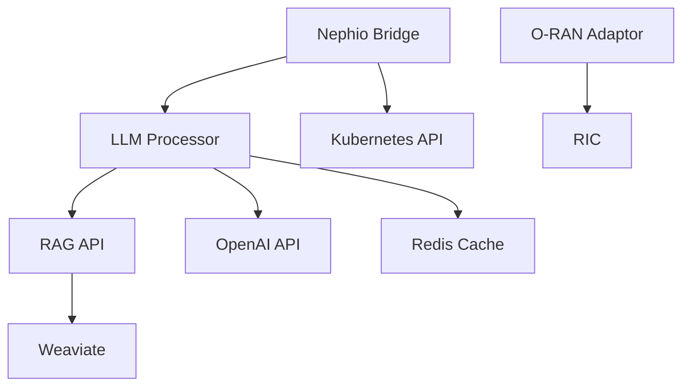

# Nephoran Intent Operator - Operational Runbook

## Table of Contents

1. [Overview](#overview)
2. [Service Architecture](#service-architecture)
3. [Monitoring and Observability](#monitoring-and-observability)
4. [Alerting Configuration](#alerting-configuration)
5. [Operational Procedures](#operational-procedures)
6. [Incident Response](#incident-response)
7. [Disaster Recovery](#disaster-recovery)
8. [Performance Tuning](#performance-tuning)
9. [Security Operations](#security-operations)
10. [Maintenance Windows](#maintenance-windows)

## Overview

This operational runbook provides comprehensive guidance for operating, monitoring, and maintaining the Nephoran Intent Operator in production environments. It covers monitoring setup, alerting rules, incident response procedures, and disaster recovery processes.

### Service Components

- **LLM Processor Service**: Natural language intent processing
- **RAG API Service**: Vector database and knowledge retrieval
- **Nephio Bridge Controller**: Kubernetes controller for NetworkIntent CRDs
- **O-RAN Adaptor Service**: O-RAN interface implementations
- **Weaviate Vector Database**: Knowledge base storage

### Critical Dependencies

- OpenAI API (or configured LLM provider)
- Kubernetes cluster (1.28+)
- Weaviate vector database
- Redis (for caching)
- Git repository (for GitOps)

## Service Architecture

### Component Health Matrix

| Component | Port | Health Endpoint | Critical | SLA |
|-----------|------|----------------|----------|-----|
| LLM Processor | 8080 | /healthz, /readyz | Yes | 99.9% |
| RAG API | 5001 | /health, /ready | Yes | 99.9% |
| Nephio Bridge | N/A | Controller metrics | Yes | 99.9% |
| O-RAN Adaptor | 8082 | /healthz | Yes | 99.5% |
| Weaviate | 8080 | /v1/.well-known/ready | Yes | 99.9% |

### Service Dependencies



## Monitoring and Observability

### Prometheus Metrics

#### Key Metrics to Monitor

**LLM Processor Metrics**
```prometheus
# Request rate
rate(nephoran_llm_requests_total[5m])

# Error rate
rate(nephoran_llm_requests_total{status="error"}[5m]) / rate(nephoran_llm_requests_total[5m])

# Request duration (P95)
histogram_quantile(0.95, rate(nephoran_llm_request_duration_seconds_bucket[5m]))

# Token usage rate
rate(nephoran_llm_tokens_used_total[5m])

# Circuit breaker state
nephoran_circuit_breaker_state

# Active streaming sessions
nephoran_streaming_active_sessions
```

**RAG API Metrics**
```prometheus
# Query rate
rate(nephoran_rag_queries_total[5m])

# Vector search latency (P95)
histogram_quantile(0.95, rate(nephoran_rag_vector_search_latency_seconds_bucket[5m]))

# Document count
nephoran_rag_documents_indexed_total

# Cache hit rate
rate(nephoran_rag_cache_hits_total[5m]) / rate(nephoran_rag_queries_total[5m])
```

**Controller Metrics**
```prometheus
# Reconciliation rate
rate(nephoran_controller_reconcile_total[5m])

# Reconciliation errors
rate(nephoran_controller_reconcile_errors_total[5m])

# NetworkIntent processing time
histogram_quantile(0.95, rate(nephoran_networkintent_processing_duration_seconds_bucket[5m]))

# E2NodeSet scaling operations
rate(nephoran_e2nodeset_scaling_total[5m])
```

### Grafana Dashboards

#### System Overview Dashboard
- Service health status
- Request rates across all services
- Error rates and success rates
- Resource utilization (CPU, Memory, Network)
- Active connections and sessions

#### LLM Processing Dashboard
- Intent processing rate
- Token usage and costs
- Model performance metrics
- Cache hit rates
- Circuit breaker status

#### RAG Performance Dashboard
- Query performance metrics
- Vector database health
- Knowledge base statistics
- Embedding generation times

### Logging Configuration

#### Structured Logging Format
```json
{
  "timestamp": "2025-01-30T10:30:15Z",
  "level": "INFO",
  "service": "llm-processor",
  "trace_id": "abc123",
  "span_id": "def456",
  "user_id": "operator-001",
  "request_id": "req-12345",
  "message": "Intent processed successfully",
  "metadata": {
    "intent_type": "network_deployment",
    "processing_time_ms": 2345,
    "tokens_used": 1456
  }
}
```

#### Log Aggregation Queries

**Error Detection**
```kusto
index=nephoran
| where level="ERROR"
| stats count by service, error_code
| where count > 10
```

**Slow Request Detection**
```kusto
index=nephoran service="llm-processor"
| where processing_time_ms > 5000
| timechart span=5m avg(processing_time_ms) by intent_type
```

### Distributed Tracing

#### Key Traces to Monitor
1. **End-to-End Intent Processing**
   - Trace from NetworkIntent creation to deployment
   - Expected duration: < 30s
   - Critical spans: LLM processing, RAG retrieval, GitOps commit

2. **RAG Query Flow**
   - Trace from query to response
   - Expected duration: < 2s
   - Critical spans: Embedding generation, vector search, reranking

## Alerting Configuration

### Critical Alerts

#### Service Availability
```yaml
- alert: LLMProcessorDown
  expr: up{job="llm-processor"} == 0
  for: 2m
  labels:
    severity: critical
    team: platform
  annotations:
    summary: "LLM Processor service is down"
    description: "LLM Processor has been down for more than 2 minutes"
    runbook: "https://wiki/runbooks/llm-processor-down"

- alert: RAGAPIDown
  expr: up{job="rag-api"} == 0
  for: 2m
  labels:
    severity: critical
    team: platform
  annotations:
    summary: "RAG API service is down"
    description: "RAG API has been down for more than 2 minutes"
```

#### Performance Degradation
```yaml
- alert: HighErrorRate
  expr: |
    rate(nephoran_llm_requests_total{status="error"}[5m]) / 
    rate(nephoran_llm_requests_total[5m]) > 0.05
  for: 5m
  labels:
    severity: warning
    team: platform
  annotations:
    summary: "High error rate detected"
    description: "Error rate is above 5% for 5 minutes"

- alert: SlowProcessing
  expr: |
    histogram_quantile(0.95, 
      rate(nephoran_llm_request_duration_seconds_bucket[5m])
    ) > 10
  for: 10m
  labels:
    severity: warning
    team: platform
  annotations:
    summary: "Slow intent processing detected"
    description: "P95 latency is above 10 seconds"
```

#### Resource Alerts
```yaml
- alert: HighMemoryUsage
  expr: |
    container_memory_usage_bytes{pod=~"llm-processor-.*"} / 
    container_spec_memory_limit_bytes > 0.9
  for: 5m
  labels:
    severity: warning
    team: platform
  annotations:
    summary: "High memory usage in LLM Processor"
    description: "Memory usage is above 90% of limit"

- alert: PersistentVolumeSpaceLow
  expr: |
    kubelet_volume_stats_available_bytes{persistentvolumeclaim=~"weaviate-.*"} / 
    kubelet_volume_stats_capacity_bytes < 0.1
  for: 10m
  labels:
    severity: critical
    team: platform
  annotations:
    summary: "Weaviate storage space low"
    description: "Less than 10% storage remaining"
```

### Alert Routing

```yaml
route:
  receiver: 'default'
  group_by: ['alertname', 'cluster', 'service']
  group_wait: 10s
  group_interval: 10s
  repeat_interval: 12h
  routes:
  - match:
      severity: critical
    receiver: pagerduty-critical
    continue: true
  - match:
      severity: warning
    receiver: slack-warnings
  - match:
      team: platform
    receiver: platform-team

receivers:
- name: 'pagerduty-critical'
  pagerduty_configs:
  - service_key: '<service-key>'
    severity: 'critical'
    
- name: 'slack-warnings'
  slack_configs:
  - api_url: '<webhook-url>'
    channel: '#nephoran-alerts'
    title: 'Nephoran Alert'
```

## Operational Procedures

### Service Health Checks

#### Daily Health Check Procedure
1. **Check Service Status**
   ```bash
   kubectl get pods -n nephoran-system
   kubectl get deployments -n nephoran-system
   ```

2. **Verify Metrics Collection**
   ```bash
   curl -s http://prometheus:9090/api/v1/query?query=up | jq '.data.result'
   ```

3. **Check Error Rates**
   ```bash
   kubectl logs -n nephoran-system deployment/llm-processor --since=1h | grep ERROR | wc -l
   ```

4. **Validate Knowledge Base**
   ```bash
   curl -s http://rag-api:5001/knowledge/stats | jq '.total_documents'
   ```

### Scaling Operations

#### Manual Scaling Procedure
```bash
# Scale LLM Processor
kubectl scale deployment llm-processor -n nephoran-system --replicas=5

# Scale RAG API
kubectl scale deployment rag-api -n nephoran-system --replicas=3

# Verify scaling
kubectl get hpa -n nephoran-system
```

#### Auto-scaling Configuration
```yaml
apiVersion: autoscaling/v2
kind: HorizontalPodAutoscaler
metadata:
  name: llm-processor-hpa
  namespace: nephoran-system
spec:
  scaleTargetRef:
    apiVersion: apps/v1
    kind: Deployment
    name: llm-processor
  minReplicas: 2
  maxReplicas: 10
  metrics:
  - type: Resource
    resource:
      name: cpu
      target:
        type: Utilization
        averageUtilization: 70
  - type: Resource
    resource:
      name: memory
      target:
        type: Utilization
        averageUtilization: 80
  - type: Pods
    pods:
      metric:
        name: nephoran_llm_requests_per_second
      target:
        type: AverageValue
        averageValue: "100"
```

### Cache Management

#### Cache Warming Procedure
```bash
# Warm L1 cache with popular queries
curl -X POST http://llm-processor:8080/cache/warm \
  -H "Content-Type: application/json" \
  -d '{
    "strategy": "popular_queries",
    "limit": 100,
    "categories": ["network_deployment", "scaling_operations"]
  }'

# Verify cache statistics
curl http://llm-processor:8080/cache/stats | jq '.'
```

#### Cache Invalidation
```bash
# Clear specific cache entries
curl -X DELETE "http://llm-processor:8080/cache/clear?pattern=intent:*"

# Full cache reset (use with caution)
curl -X DELETE http://llm-processor:8080/cache/clear
```

### Knowledge Base Management

#### Update Knowledge Base
```bash
# Upload new documents
./scripts/update-knowledge-base.sh /path/to/documents/

# Verify indexing
curl http://rag-api:5001/knowledge/stats

# Trigger reindexing if needed
curl -X POST http://rag-api:5001/knowledge/reindex
```

## Incident Response

### Incident Classification

| Severity | Response Time | Examples |
|----------|--------------|----------|
| P1 - Critical | 15 minutes | Service down, data loss, security breach |
| P2 - High | 1 hour | Performance degradation > 50%, partial outage |
| P3 - Medium | 4 hours | Non-critical errors, minor performance issues |
| P4 - Low | 24 hours | Cosmetic issues, minor bugs |

### Response Procedures

#### P1 - Service Outage Response
1. **Immediate Actions**
   ```bash
   # Check service status
   kubectl get pods -n nephoran-system -o wide
   kubectl describe pods -n nephoran-system
   
   # Check recent events
   kubectl get events -n nephoran-system --sort-by='.lastTimestamp'
   
   # Check logs
   kubectl logs -n nephoran-system deployment/llm-processor --tail=100
   ```

2. **Mitigation**
   ```bash
   # Restart failed pods
   kubectl delete pod <pod-name> -n nephoran-system
   
   # Scale up healthy instances
   kubectl scale deployment <deployment> -n nephoran-system --replicas=5
   
   # Enable circuit breaker if needed
   curl -X POST http://llm-processor:8080/circuit-breaker/control \
     -d '{"action": "force_open", "circuit_name": "llm-processor"}'
   ```

3. **Communication**
   - Update status page
   - Notify stakeholders via Slack/PagerDuty
   - Create incident ticket

#### P2 - Performance Degradation Response
1. **Diagnosis**
   ```bash
   # Check resource usage
   kubectl top pods -n nephoran-system
   kubectl top nodes
   
   # Check slow queries
   kubectl exec -n nephoran-system deployment/rag-api -- \
     psql -U postgres -c "SELECT * FROM pg_stat_statements ORDER BY mean_time DESC LIMIT 10;"
   ```

2. **Optimization**
   ```bash
   # Increase resource limits
   kubectl patch deployment llm-processor -n nephoran-system -p \
     '{"spec":{"template":{"spec":{"containers":[{"name":"llm-processor","resources":{"limits":{"memory":"8Gi","cpu":"4"}}}]}}}}'
   
   # Enable performance optimizations
   curl -X POST http://llm-processor:8080/performance/optimize \
     -d '{"target_metrics": ["latency", "throughput"], "optimization_level": "aggressive"}'
   ```

### Post-Incident Activities

1. **Root Cause Analysis**
   - Timeline reconstruction
   - Log analysis
   - Metric correlation
   - Contributing factors

2. **Documentation**
   - Incident report
   - Lessons learned
   - Action items
   - Runbook updates

3. **Prevention**
   - Implement additional monitoring
   - Update alerting thresholds
   - Improve automation
   - Conduct game days

## Disaster Recovery

### Backup Strategy

#### Automated Backups
```yaml
apiVersion: batch/v1
kind: CronJob
metadata:
  name: weaviate-backup
  namespace: nephoran-system
spec:
  schedule: "0 2 * * *"  # Daily at 2 AM
  jobTemplate:
    spec:
      template:
        spec:
          containers:
          - name: backup
            image: weaviate/weaviate:latest
            command:
            - /bin/sh
            - -c
            - |
              # Create backup
              curl -X POST http://weaviate:8080/v1/backups \
                -H "Content-Type: application/json" \
                -d '{
                  "id": "backup-$(date +%Y%m%d-%H%M%S)",
                  "backend": "s3",
                  "include": ["telecom_knowledge"]
                }'
              
              # Verify backup
              sleep 60
              curl http://weaviate:8080/v1/backups
```

#### Manual Backup Procedure
```bash
# 1. Backup Weaviate data
./scripts/backup-weaviate.sh

# 2. Backup Kubernetes resources
kubectl get all,cm,secrets,pvc -n nephoran-system -o yaml > nephoran-backup-$(date +%Y%m%d).yaml

# 3. Backup Redis cache (optional)
kubectl exec -n nephoran-system redis-master-0 -- redis-cli BGSAVE

# 4. Export Prometheus metrics (optional)
curl -X POST http://prometheus:9090/api/v1/admin/tsdb/snapshot
```

### Recovery Procedures

#### Full System Recovery
```bash
# 1. Restore Kubernetes resources
kubectl apply -f nephoran-backup-20250130.yaml

# 2. Wait for pods to be ready
kubectl wait --for=condition=ready pod -l app.kubernetes.io/part-of=nephoran --timeout=600s

# 3. Restore Weaviate data
curl -X POST http://weaviate:8080/v1/backups/backup-20250130/restore \
  -H "Content-Type: application/json" \
  -d '{"include": ["telecom_knowledge"]}'

# 4. Verify restoration
./scripts/verify-restoration.sh

# 5. Run smoke tests
./scripts/smoke-tests.sh
```

#### Partial Recovery (Single Service)
```bash
# Example: Recover LLM Processor only
kubectl delete deployment llm-processor -n nephoran-system
kubectl apply -f deployments/llm-processor/deployment.yaml
kubectl rollout status deployment/llm-processor -n nephoran-system
```

### Business Continuity

#### RTO/RPO Targets
- **RTO (Recovery Time Objective)**: 4 hours
- **RPO (Recovery Point Objective)**: 24 hours

#### Failover Procedures
1. **Multi-Region Failover**
   ```bash
   # Switch traffic to backup region
   kubectl patch service llm-processor -n nephoran-system \
     -p '{"spec":{"selector":{"region":"backup"}}}'
   
   # Update DNS
   ./scripts/update-dns.sh backup-region
   ```

2. **Database Failover**
   ```bash
   # Promote replica to primary
   kubectl exec -n nephoran-system weaviate-1 -- weaviate-admin promote
   
   # Update service endpoints
   kubectl patch cm weaviate-config -n nephoran-system \
     --type merge -p '{"data":{"WEAVIATE_HOST":"weaviate-1"}}'
   ```

## Performance Tuning

### LLM Processor Optimization

#### Token Usage Optimization
```bash
# Configure token limits
kubectl set env deployment/llm-processor -n nephoran-system \
  MAX_TOKENS=2048 \
  CONTEXT_WINDOW=4096 \
  TRUNCATION_STRATEGY=sliding_window
```

#### Batching Configuration
```yaml
apiVersion: v1
kind: ConfigMap
metadata:
  name: llm-processor-config
data:
  batching.yaml: |
    batch_size: 10
    batch_timeout: 500ms
    max_batch_delay: 1s
    priority_queues:
      critical: 
        size: 100
        timeout: 100ms
      high:
        size: 500
        timeout: 250ms
      normal:
        size: 1000
        timeout: 500ms
```

### RAG Performance Tuning

#### Vector Search Optimization
```bash
# Optimize HNSW parameters
curl -X PUT http://weaviate:8080/v1/schema/telecom_knowledge \
  -H "Content-Type: application/json" \
  -d '{
    "vectorIndexConfig": {
      "ef": 256,
      "efConstruction": 512,
      "maxConnections": 32
    }
  }'
```

#### Embedding Cache Configuration
```yaml
redis_cache:
  embedding_ttl: 7d
  max_cache_size: 10GB
  eviction_policy: allkeys-lru
  compression: enabled
  compression_threshold: 1KB
```

### Kubernetes Optimization

#### Resource Allocation
```yaml
resources:
  llm-processor:
    requests:
      cpu: 2
      memory: 4Gi
    limits:
      cpu: 4
      memory: 8Gi
  rag-api:
    requests:
      cpu: 1
      memory: 2Gi
    limits:
      cpu: 2
      memory: 4Gi
  weaviate:
    requests:
      cpu: 2
      memory: 8Gi
    limits:
      cpu: 4
      memory: 16Gi
```

#### Node Affinity Configuration
```yaml
affinity:
  nodeAffinity:
    preferredDuringSchedulingIgnoredDuringExecution:
    - weight: 100
      preference:
        matchExpressions:
        - key: workload-type
          operator: In
          values:
          - compute-optimized
  podAntiAffinity:
    preferredDuringSchedulingIgnoredDuringExecution:
    - weight: 100
      podAffinityTerm:
        labelSelector:
          matchExpressions:
          - key: app
            operator: In
            values:
            - llm-processor
        topologyKey: kubernetes.io/hostname
```

## Security Operations

### Security Monitoring

#### Security Events to Monitor
```prometheus
# Failed authentication attempts
rate(nephoran_auth_failures_total[5m]) > 5

# Unusual API usage patterns
rate(nephoran_api_requests_total[5m]) by (user_id) > 1000

# Privilege escalation attempts
nephoran_rbac_violations_total > 0

# Suspicious network traffic
rate(network_bytes_total{direction="egress"}[5m]) > 1000000000
```

### Security Procedures

#### Secret Rotation
```bash
# 1. Generate new secrets
./scripts/generate-secrets.sh

# 2. Update Kubernetes secrets
kubectl create secret generic llm-processor-secrets \
  --from-file=openai-key=./new-openai-key \
  --dry-run=client -o yaml | kubectl apply -f -

# 3. Restart pods to pick up new secrets
kubectl rollout restart deployment/llm-processor -n nephoran-system

# 4. Verify secret usage
kubectl logs deployment/llm-processor -n nephoran-system | grep "Secret loaded"
```

#### Security Scanning
```bash
# Container image scanning
./scripts/scan-images.sh

# RBAC audit
kubectl auth can-i --list --as=system:serviceaccount:nephoran-system:llm-processor

# Network policy validation
kubectl describe networkpolicies -n nephoran-system
```

### Compliance Monitoring

#### Audit Log Collection
```bash
# Enable audit logging
kubectl patch deployment llm-processor -n nephoran-system \
  --type merge -p '{"spec":{"template":{"spec":{"containers":[{"name":"llm-processor","env":[{"name":"AUDIT_LOG_ENABLED","value":"true"}]}]}}}}'

# Query audit logs
kubectl logs -n nephoran-system -l app=llm-processor --since=24h | grep AUDIT
```

## Maintenance Windows

### Scheduled Maintenance

#### Weekly Maintenance Tasks
- **Monday**: Security patches and updates
- **Wednesday**: Performance optimization review
- **Friday**: Backup verification and testing

#### Monthly Maintenance Tasks
- First Tuesday: Kubernetes cluster updates
- Second Thursday: Database optimization
- Third Monday: Disaster recovery drill
- Last Friday: Capacity planning review

### Maintenance Procedures

#### Zero-Downtime Updates
```bash
# 1. Pre-update checks
./scripts/pre-update-checks.sh

# 2. Create canary deployment
kubectl apply -f deployments/llm-processor/canary-deployment.yaml

# 3. Gradual traffic shift
kubectl patch service llm-processor -n nephoran-system \
  --type merge -p '{"spec":{"selector":{"version":"canary"}}}'

# 4. Monitor canary
./scripts/monitor-canary.sh

# 5. Complete rollout or rollback
kubectl set image deployment/llm-processor llm-processor=nephoran/llm-processor:v2.1.0
```

#### Database Maintenance
```bash
# 1. Put Weaviate in maintenance mode
curl -X PUT http://weaviate:8080/v1/maintenance/mode \
  -d '{"enabled": true}'

# 2. Run optimization
curl -X POST http://weaviate:8080/v1/maintenance/optimize

# 3. Verify and exit maintenance mode
curl -X PUT http://weaviate:8080/v1/maintenance/mode \
  -d '{"enabled": false}'
```

### Emergency Maintenance

#### Emergency Patch Procedure
1. **Assessment**
   - Identify affected components
   - Assess risk and impact
   - Determine patch strategy

2. **Communication**
   - Notify stakeholders
   - Update status page
   - Schedule emergency window

3. **Execution**
   ```bash
   # Apply emergency patch
   kubectl set image deployment/llm-processor \
     llm-processor=nephoran/llm-processor:hotfix-cve-2025-001
   
   # Monitor rollout
   kubectl rollout status deployment/llm-processor -n nephoran-system
   
   # Verify fix
   ./scripts/verify-security-fix.sh CVE-2025-001
   ```

## Appendix

### Useful Commands Reference

```bash
# Get all resources in namespace
kubectl get all -n nephoran-system

# Describe recent events
kubectl get events -n nephoran-system --sort-by='.lastTimestamp'

# Follow logs for all pods
kubectl logs -n nephoran-system -l app.kubernetes.io/part-of=nephoran -f

# Port forward for debugging
kubectl port-forward -n nephoran-system svc/llm-processor 8080:8080

# Execute commands in pod
kubectl exec -it -n nephoran-system deployment/rag-api -- /bin/bash

# Check resource usage
kubectl top pods -n nephoran-system --containers

# Get pod distribution across nodes
kubectl get pods -n nephoran-system -o wide

# Check persistent volume usage
kubectl exec -n nephoran-system deployment/weaviate -- df -h

# Test service connectivity
kubectl run debug --image=nicolaka/netshoot --rm -it -- /bin/bash
```

### Contact Information

**On-Call Rotation**: PagerDuty - Nephoran Team  
**Escalation Path**:
1. On-call engineer
2. Team lead
3. Platform architect
4. VP of Engineering

**External Contacts**:
- OpenAI Support: support@openai.com
- Weaviate Support: support@weaviate.io
- Cloud Provider: [Provider specific]

This runbook is a living document and should be updated regularly based on operational experience and system changes.