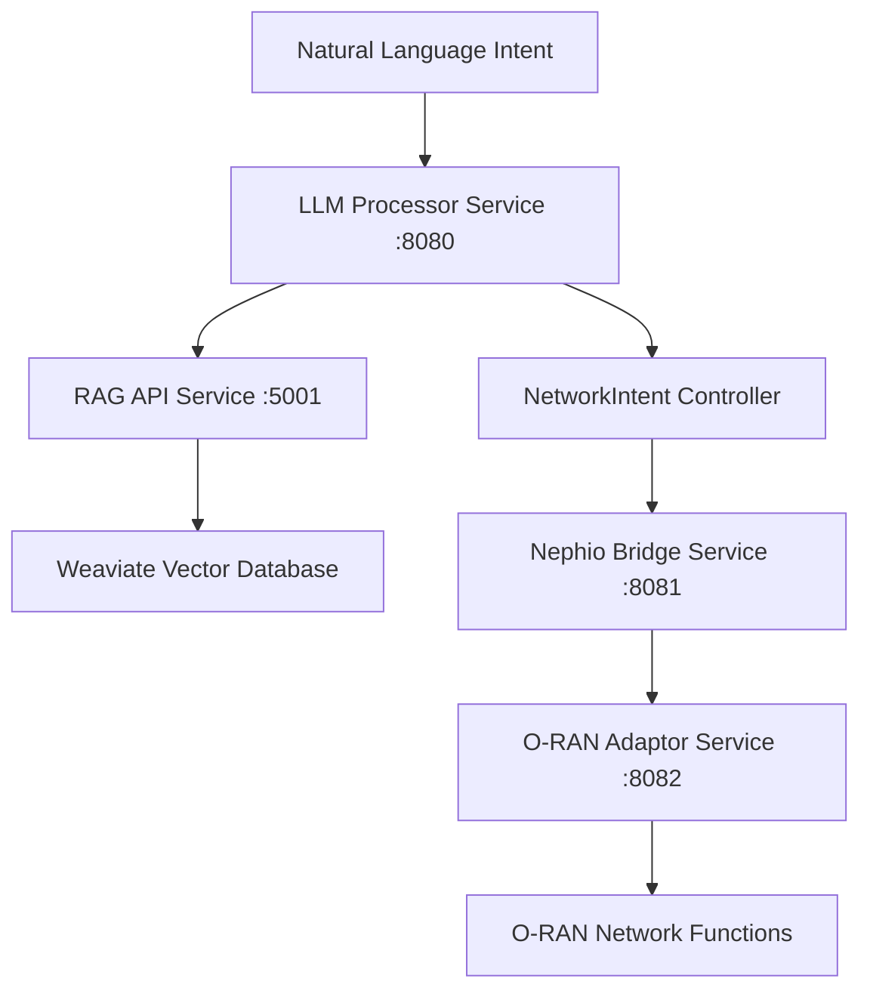

# Nephoran Intent Operator - API Reference

## Overview

This document provides comprehensive API documentation for the Nephoran Intent Operator system. The system consists of four main services that work together to process natural language intents and deploy O-RAN network functions through GitOps workflows, along with Custom Resource Definitions (CRDs) for Kubernetes-native resource management.

## Service Architecture



## Service APIs

### LLM Processor Service API

**Base URL**: `http://llm-processor:8080`
**Service**: Enterprise-grade LLM processing with circuit breakers and rate limiting
**Authentication**: OAuth2, API Key (configurable)

#### Core Endpoints

##### Process Natural Language Intent
Convert natural language intents into structured network operations.

**Endpoint**: `POST /process`
**Authentication**: Required if `REQUIRE_AUTH=true`

**Request Body**:
```json
{
  "intent": "Deploy AMF with 3 replicas for network slice eMBB with high throughput requirements",
  "metadata": {
    "namespace": "telecom-core",
    "priority": "high",
    "user_id": "operator-001"
  },
  "config": {
    "model": "gpt-4o-mini",
    "max_tokens": 2048,
    "enable_rag": true
  }
}
```

**Response**:
```json
{
  "result": "Generated Kubernetes YAML configuration for AMF deployment with 3 replicas, including Service, Deployment, and ConfigMap resources with optimized settings for eMBB network slice requirements.",
  "status": "success",
  "processing_time": "2.345s",
  "request_id": "req-1641024000123456789",
  "metadata": {
    "tokens_used": 1456,
    "model_used": "gpt-4o-mini",
    "confidence_score": 0.94,
    "rag_context_used": true,
    "context_length": 4096
  },
  "structured_output": {
    "action": "deploy",
    "resources": [
      {
        "type": "Deployment",
        "name": "amf-deployment",
        "replicas": 3,
        "namespace": "telecom-core"
      },
      {
        "type": "Service",
        "name": "amf-service", 
        "namespace": "telecom-core"
      }
    ]
  }
}
```

**Response Codes**:
- `200 OK`: Intent processed successfully
- `400 Bad Request`: Invalid request format or missing required fields
- `401 Unauthorized`: Authentication required or invalid credentials
- `403 Forbidden`: Insufficient permissions for this operation
- `429 Too Many Requests`: Rate limit exceeded
- `500 Internal Server Error`: Internal processing error
- `503 Service Unavailable`: Circuit breaker open or service overloaded

##### Streaming Intent Processing
Real-time streaming processing with Server-Sent Events for large intents.

**Endpoint**: `POST /stream`
**Authentication**: Required if `REQUIRE_AUTH=true`

**Request Body**:
```json
{
  "query": "Configure complete 5G network slice for enhanced mobile broadband with AMF, SMF, UPF, and network optimization",
  "intent_type": "network_configuration",
  "model_name": "gpt-4o-mini",
  "max_tokens": 4096,
  "enable_rag": true,
  "session_id": "session_demo_001"
}
```

**Response**: Server-Sent Events stream
```
event: start
data: {"session_id":"session_demo_001","status":"started","timestamp":"2025-01-30T10:30:15Z"}

event: context_injection
data: {"type":"context_injection","content":"Retrieved 3GPP TS 23.501 and O-RAN specifications","metadata":{"context_length":15420,"injection_time":"85ms"}}

event: chunk
data: {"type":"content","delta":"Based on 3GPP specifications, configuring 5G network slice for eMBB requires the following components:\n\n1. Access and Mobility Management Function (AMF)","timestamp":"2025-01-30T10:30:16Z","chunk_index":0}

event: completion
data: {"type":"completion","is_complete":true,"metadata":{"total_chunks":25,"total_bytes":16384,"processing_time":"4.7s","tokens_used":3456}}
```

#### Health and Status Endpoints

##### Health Check (Liveness Probe)
**Endpoint**: `GET /healthz`
**Authentication**: None

**Response**:
```json
{
  "status": "healthy",
  "version": "v2.0.0",
  "uptime": "2h34m18s",
  "timestamp": "2025-01-30T10:30:15Z"
}
```

##### Readiness Check
**Endpoint**: `GET /readyz`
**Authentication**: None

**Response**:
```json
{
  "status": "ready",
  "version": "v2.0.0",
  "dependencies": {
    "rag_api": "healthy",
    "circuit_breaker": "closed",
    "token_manager": "operational",
    "openai_api": "available"
  },
  "timestamp": "2025-01-30T10:30:15Z"
}
```

### RAG API Service

**Base URL**: `http://rag-api:5001`
**Service**: Vector database integration with Weaviate for telecom knowledge
**Authentication**: API Key (optional)

#### Core Endpoints

##### Process Intent with RAG Enhancement
**Endpoint**: `POST /process_intent`
**Content-Type**: `application/json`

**Request Body**:
```json
{
  "intent": "Scale E2 nodes to 5 replicas for increased capacity",
  "intent_id": "intent-12345",
  "context": {
    "namespace": "telecom-ran",
    "user": "operator-001",
    "environment": "production"
  }
}
```

**Response**:
```json
{
  "intent_id": "intent-12345",
  "original_intent": "Scale E2 nodes to 5 replicas for increased capacity",
  "enhanced_context": "Based on O-RAN E2 interface specifications and scaling best practices...",
  "structured_output": {
    "action": "scale",
    "resource_type": "E2NodeSet",
    "name": "e2-nodes",
    "namespace": "telecom-ran",
    "spec": {
      "replicas": 5,
      "scaling_policy": "horizontal",
      "resources": {
        "cpu": "500m",
        "memory": "1Gi"
      },
      "e2_configuration": {
        "ric_endpoint": "http://near-rt-ric:8080",
        "service_models": ["KPM", "RC"]
      }
    }
  },
  "status": "completed",
  "metrics": {
    "processing_time_ms": 1847.3,
    "context_retrieval_time_ms": 156.2,
    "llm_processing_time_ms": 1691.1,
    "confidence_score": 0.92,
    "retrieval_score": 0.89,
    "cache_hit": false
  },
  "timestamp": 1641024000.123
}
```

### O-RAN Adaptor Service API

**Base URL**: `http://oran-adaptor:8082`
**Service**: O-RAN interface implementations (A1, O1, O2)
**Authentication**: API Key

#### A1 Interface (Policy Management)

##### Create Policy Type
**Endpoint**: `POST /a1/policy-types`
**Authentication**: Required

**Request Body**:
```json
{
  "policyTypeId": "1001",
  "name": "QoS Management Policy",
  "description": "Quality of Service policy for network slice management",
  "version": "1.0.0",
  "schema": {
    "type": "object",
    "properties": {
      "sliceId": {
        "type": "string",
        "description": "Network slice identifier"
      },
      "qosParameters": {
        "type": "object",
        "properties": {
          "latency": {
            "type": "number",
            "minimum": 1,
            "maximum": 1000,
            "description": "Maximum latency in milliseconds"
          },
          "throughput": {
            "type": "number",
            "minimum": 1,
            "description": "Minimum throughput in Mbps"
          }
        },
        "required": ["latency", "throughput"]
      }
    },
    "required": ["sliceId", "qosParameters"]
  }
}
```

**Response**:
```json
{
  "policyTypeId": "1001",
  "status": "created",
  "message": "Policy type created successfully",
  "timestamp": "2025-01-30T10:30:15Z"
}
```

## Kubernetes CRD APIs

The Nephoran Intent Operator provides Custom Resource Definitions (CRDs) for Kubernetes-native resource management.

**API Group Information**:
- **API Group**: `nephoran.com`
- **API Version**: `v1`
- **Full API Version**: `nephoran.com/v1`

### Resources

### 1. NetworkIntent

The NetworkIntent resource allows users to express network automation requirements in natural language, which are then processed by the LLM-enhanced controller to generate structured network configurations.

#### API Specification

```yaml
apiVersion: nephoran.com/v1
kind: NetworkIntent
metadata:
  name: <intent-name>
  namespace: <namespace>
spec:
  intent: <natural-language-description>
  parameters: <structured-parameters>  # Optional, auto-generated by LLM processor
status:
  conditions: []
  phase: <processing-phase>
  processingStartTime: <timestamp>
  processingCompletionTime: <timestamp>
  deploymentStartTime: <timestamp>
  deploymentCompletionTime: <timestamp>
  gitCommitHash: <commit-hash>
  lastRetryTime: <timestamp>
  observedGeneration: <generation-number>
```

#### Field Descriptions

**Spec Fields:**
- `intent` (string, required): Natural language description of the desired network configuration or automation task
- `parameters` (object, optional): Structured parameters generated by the LLM processor from the natural language intent

**Status Fields:**
- `conditions` (array): Standard Kubernetes conditions array indicating resource state
- `phase` (string): Current processing phase (e.g., "Processing", "Deployed", "Failed")
- `processingStartTime` (timestamp): When intent processing began
- `processingCompletionTime` (timestamp): When intent processing completed
- `deploymentStartTime` (timestamp): When GitOps deployment started
- `deploymentCompletionTime` (timestamp): When GitOps deployment completed
- `gitCommitHash` (string): Commit hash of the deployed configuration
- `lastRetryTime` (timestamp): Last retry attempt timestamp
- `observedGeneration` (int64): Generation of the most recently observed resource

#### Usage Examples

**Basic Network Configuration Intent:**
```yaml
apiVersion: nephoran.com/v1
kind: NetworkIntent
metadata:
  name: configure-5g-network
  namespace: default
  labels:
    app.kubernetes.io/name: networkintent
    app.kubernetes.io/instance: configure-5g-network
spec:
  intent: "Configure a 5G network slice for IoT devices with low latency requirements. Set up bandwidth allocation of 100 Mbps, enable QoS with priority level 5, and configure network isolation for security."
```

**Edge Computing Setup Intent:**
```yaml
apiVersion: nephoran.com/v1
kind: NetworkIntent
metadata:
  name: setup-edge-computing
  namespace: default
spec:
  intent: "Deploy edge computing resources for real-time video processing. Configure compute nodes with GPU acceleration, set up container orchestration, and enable low-latency networking between edge nodes and central cloud."
```

**Network Security Policies Intent:**
```yaml
apiVersion: nephoran.com/v1
kind: NetworkIntent
metadata:
  name: configure-network-policies
  namespace: telecom
spec:
  intent: "Set up network security policies for a multi-tenant telecom environment. Create namespace isolation, configure ingress/egress rules, and enable network monitoring for compliance."
```

#### API Operations

**Create NetworkIntent:**
```bash
kubectl apply -f networkintent.yaml
```

**Get NetworkIntent:**
```bash
kubectl get networkintent <name> -n <namespace>
kubectl get networkintent <name> -n <namespace> -o yaml
```

**List NetworkIntents:**
```bash
kubectl get networkintents -n <namespace>
kubectl get networkintents --all-namespaces
```

**Check Status:**
```bash
kubectl describe networkintent <name> -n <namespace>
kubectl get networkintent <name> -n <namespace> -o jsonpath='{.status.phase}'
```

**Delete NetworkIntent:**
```bash
kubectl delete networkintent <name> -n <namespace>
```

### 2. E2NodeSet

The E2NodeSet resource manages collections of simulated E2 nodes for O-RAN testing and development. It provides replica-based scaling of E2 node simulations.

#### API Specification

```yaml
apiVersion: nephoran.com/v1
kind: E2NodeSet
metadata:
  name: <nodeset-name>
  namespace: <namespace>
spec:
  replicas: <number-of-nodes>
status:
  readyReplicas: <ready-node-count>
```

#### Field Descriptions

**Spec Fields:**
- `replicas` (int32, required): Number of simulated E2 nodes to run (minimum: 0)

**Status Fields:**
- `readyReplicas` (int32): Number of E2 nodes that are currently ready and operational

#### Validation Rules

- `replicas`: Must be >= 0 (enforced by kubebuilder validation)

#### Usage Examples

**Basic E2NodeSet:**
```yaml
apiVersion: nephoran.com/v1
kind: E2NodeSet
metadata:
  name: sample-e2nodeset
  namespace: default
spec:
  replicas: 3
```

**Scaled E2NodeSet:**
```yaml
apiVersion: nephoran.com/v1
kind: E2NodeSet
metadata:
  name: scaled-e2nodeset
  namespace: default
spec:
  replicas: 5
```

#### API Operations

**Create E2NodeSet:**
```bash
kubectl apply -f e2nodeset.yaml
```

**Get E2NodeSet:**
```bash
kubectl get e2nodeset <name> -n <namespace>
kubectl get e2nodeset <name> -n <namespace> -o yaml
```

**Scale E2NodeSet:**
```bash
kubectl patch e2nodeset <name> -n <namespace> -p '{"spec":{"replicas":5}}'
kubectl scale e2nodeset <name> --replicas=5 -n <namespace>
```

**Check Ready Status:**
```bash
kubectl get e2nodeset <name> -n <namespace> -o jsonpath='{.status.readyReplicas}'
```

**Delete E2NodeSet:**
```bash
kubectl delete e2nodeset <name> -n <namespace>
```

### 3. ManagedElement

The ManagedElement resource represents O-RAN network elements with their associated configurations, policies, and management interfaces.

#### API Specification

```yaml
apiVersion: nephoran.com/v1
kind: ManagedElement
metadata:
  name: <element-name>
  namespace: <namespace>
spec:
  deploymentName: <deployment-reference>
  o1Config: <o1-configuration>     # Optional
  a1Policy: <a1-policy-data>       # Optional
  e2Configuration: <e2-config>     # Optional
status:
  conditions: []
```

#### Field Descriptions

**Spec Fields:**
- `deploymentName` (string, required): Reference to the Kubernetes deployment name
- `o1Config` (string, optional): O1 interface configuration for FCAPS management
- `a1Policy` (object, optional): A1 interface policy configuration (preserves unknown fields)
- `e2Configuration` (object, optional): E2 interface configuration (preserves unknown fields)

**Status Fields:**
- `conditions` (array): Standard Kubernetes conditions array indicating element state

#### Usage Examples

**Basic ManagedElement:**
```yaml
apiVersion: nephoran.com/v1
kind: ManagedElement
metadata:
  name: amf-element
  namespace: telecom-core
spec:
  deploymentName: "amf-deployment"
  o1Config: |
    management:
      endpoint: "https://amf.telecom-core.svc.cluster.local:8080"
      protocol: "NETCONF"
```

**Advanced ManagedElement with Policies:**
```yaml
apiVersion: nephoran.com/v1
kind: ManagedElement
metadata:
  name: cu-element
  namespace: ran
spec:
  deploymentName: "cu-deployment"
  o1Config: |
    management:
      endpoint: "https://cu.ran.svc.cluster.local:8080"
      fcaps:
        fault_management: true
        performance_management: true
  a1Policy:
    policyTypeId: "1000"
    policyData:
      qosParameters:
        latency: "10ms"
        throughput: "1Gbps"
  e2Configuration:
    ricAddress: "10.0.1.100:36421"
    connectionType: "sctp"
```

#### API Operations

**Create ManagedElement:**
```bash
kubectl apply -f managedelement.yaml
```

**Get ManagedElement:**
```bash
kubectl get managedelement <name> -n <namespace>
kubectl get managedelement <name> -n <namespace> -o yaml
```

**List ManagedElements:**
```bash
kubectl get managedelements -n <namespace>
kubectl get managedelements --all-namespaces
```

**Update Configuration:**
```bash
kubectl patch managedelement <name> -n <namespace> --type merge -p '{"spec":{"o1Config":"new-config"}}'
```

**Delete ManagedElement:**
```bash
kubectl delete managedelement <name> -n <namespace>
```

## Common API Patterns

### Resource Naming Conventions

- Use lowercase alphanumeric characters and hyphens
- Names should be descriptive and include the function or role
- Examples: `amf-core-element`, `edge-computing-intent`, `test-e2nodeset`

### Namespace Organization

- Use namespaces to organize resources by function or environment
- Common namespaces: `telecom-core`, `ran`, `edge`, `monitoring`
- Development/testing: `dev`, `test`, `staging`

### Labels and Annotations

**Recommended Labels:**
```yaml
metadata:
  labels:
    app.kubernetes.io/name: <resource-type>
    app.kubernetes.io/instance: <resource-name>
    app.kubernetes.io/component: <component-name>
    app.kubernetes.io/part-of: nephoran-intent-operator
    environment: <env-name>
```

**Useful Annotations:**
```yaml
metadata:
  annotations:
    nephoran.com/description: "Human readable description"
    nephoran.com/created-by: "operator-name"
    nephoran.com/last-updated: "2025-08-03T12:00:00Z"
```

### Status Monitoring

**Check Resource Status:**
```bash
# Check overall status
kubectl get <resource-type> <name> -n <namespace> -o wide

# Get detailed status information
kubectl describe <resource-type> <name> -n <namespace>

# Watch for changes
kubectl get <resource-type> <name> -n <namespace> -w
```

**Common Status Conditions:**
- `Ready`: Resource is operational
- `Progressing`: Resource is being processed
- `Degraded`: Resource has issues but is partially functional
- `Failed`: Resource processing failed

## Error Handling and Troubleshooting

### Common Error Scenarios

**Invalid Intent Format:**
```yaml
# Problem: Empty or invalid intent
spec:
  intent: ""  # This will cause validation errors
```

**Solution:** Provide a meaningful natural language description:
```yaml
spec:
  intent: "Deploy a secure 5G core network with AMF and SMF components"
```

**Resource Not Found:**
```bash
# Error: the server could not find the requested resource
kubectl get networkintent test-intent
```

**Solution:** Check if CRDs are installed:
```bash
kubectl get crd | grep nephoran.com
kubectl api-resources | grep nephoran
```

**Processing Failures:**
Check the controller logs:
```bash
kubectl logs -n nephoran-system deployment/nephio-bridge
kubectl logs -n nephoran-system deployment/llm-processor
```

### Best Practices

1. **Intent Clarity**: Write clear, specific natural language intents
2. **Resource Naming**: Use descriptive names that indicate purpose
3. **Namespace Usage**: Organize resources logically across namespaces
4. **Status Monitoring**: Regularly check resource status and conditions
5. **Cleanup**: Remove unused resources to avoid cluster bloat

## API Versioning

The Nephoran Intent Operator follows Kubernetes API versioning conventions:

- **v1**: Stable API suitable for production use
- **v1alpha1**: Alpha versions for experimental features (deprecated, migrated to v1)
- **v1beta1**: Beta versions for pre-release features

Current stable version: `nephoran.com/v1`

## Integration Examples

### Complete Workflow Example

```bash
# 1. Create a NetworkIntent
cat <<EOF | kubectl apply -f -
apiVersion: nephoran.com/v1
kind: NetworkIntent
metadata:
  name: deploy-5g-core
  namespace: telecom
spec:
  intent: "Deploy a complete 5G core network with AMF, SMF, and UPF functions. Configure for high availability with 3 replicas each and enable monitoring."
EOF

# 2. Monitor processing
kubectl get networkintent deploy-5g-core -n telecom -w

# 3. Create supporting E2 nodes
cat <<EOF | kubectl apply -f -
apiVersion: nephoran.com/v1
kind: E2NodeSet
metadata:
  name: core-e2nodes
  namespace: telecom
spec:
  replicas: 3
EOF

# 4. Set up managed elements
cat <<EOF | kubectl apply -f -
apiVersion: nephoran.com/v1
kind: ManagedElement
metadata:
  name: amf-mgmt
  namespace: telecom
spec:
  deploymentName: "amf-deployment"
  o1Config: |
    management:
      endpoint: "https://amf.telecom.svc.cluster.local:8080"
EOF

# 5. Check overall status
kubectl get networkintents,e2nodesets,managedelements -n telecom
```

## Authentication and Authorization

### OAuth2 Authentication

#### Supported Providers
- Azure Active Directory
- Google Workspace
- Okta
- Keycloak
- Custom OIDC providers

#### OAuth2 Flow
```bash
# 1. Initiate login
curl -X GET "http://llm-processor:8080/auth/login/azure"
# Returns redirect URL

# 2. After OAuth2 flow completion, get token
curl -X GET "http://llm-processor:8080/auth/callback/azure?code=AUTH_CODE&state=STATE"
```

**Token Response**:
```json
{
  "access_token": "eyJhbGciOiJIUzI1NiIsInR5cCI6IkpXVCJ9...",
  "refresh_token": "eyJhbGciOiJIUzI1NiIsInR5cCI6IkpXVCJ9...",
  "expires_in": 3600,
  "token_type": "Bearer",
  "user_info": {
    "id": "user-123",
    "email": "operator@company.com",
    "name": "Network Operator",
    "roles": ["operator"]
  }
}
```

### API Key Authentication

For services that support API key authentication:

```bash
curl -X POST http://rag-api:5001/process_intent \
  -H "X-API-Key: your-api-key-here" \
  -H "Content-Type: application/json" \
  -d '{"intent":"Scale E2 nodes to 5 replicas"}'
```

## Error Handling

### Standard Error Response Format

All services return errors in a consistent format:

```json
{
  "error": {
    "code": "INTENT_PROCESSING_FAILED",
    "type": "processing_error",
    "message": "Failed to process network intent due to invalid parameters",
    "details": {
      "validation_errors": [
        "replicas must be between 1 and 100",
        "namespace is required"
      ],
      "input": "Deploy AMF with 200 replicas",
      "suggestion": "Specify a valid replica count (1-100) and target namespace"
    },
    "timestamp": "2025-01-30T10:30:15Z",
    "request_id": "req-12345",
    "correlation_id": "corr-67890"
  }
}
```

### Common Error Codes

| Code | HTTP Status | Description | Retryable |
|------|-------------|-------------|-----------|
| `INTENT_PROCESSING_FAILED` | 400/500 | LLM processing failed | Yes |
| `INVALID_INTENT_FORMAT` | 400 | Invalid intent structure | No |
| `AUTHENTICATION_FAILED` | 401 | Authentication failed | No |
| `AUTHORIZATION_FAILED` | 403 | Insufficient permissions | No |
| `RATE_LIMIT_EXCEEDED` | 429 | Too many requests | Yes |
| `RAG_SERVICE_UNAVAILABLE` | 503 | RAG API unavailable | Yes |
| `CIRCUIT_BREAKER_OPEN` | 503 | Circuit breaker active | Yes |
| `VECTOR_DB_ERROR` | 500 | Vector database error | Yes |
| `CRD_VALIDATION_FAILED` | 400 | Invalid CRD specification | No |
| `SCALING_FAILED` | 500 | E2NodeSet scaling failed | Yes |

## Enhanced Features

### Multi-Level Caching System

The enhanced caching system provides significant performance improvements with L1/L2 caching architecture.

#### Cache API Endpoints

**Get Cache Statistics:**
```bash
curl -X GET http://llm-processor:8080/cache/stats
```

**Response:**
```json
{
  "l1_stats": {
    "hits": 2456,
    "misses": 543,
    "hit_rate": 0.819
  },
  "l2_stats": {
    "hits": 1234,
    "misses": 456,
    "hit_rate": 0.730
  },
  "overall_stats": {
    "total_hits": 3690,
    "total_misses": 999,
    "overall_hit_rate": 0.787
  }
}
```

### Performance Optimization

**Get Performance Metrics:**
```bash
curl -X GET http://llm-processor:8080/performance/metrics
```

**Response:**
```json
{
  "cpu_usage": 0.65,
  "memory_usage": 0.72,
  "average_latency": "1.45s",
  "throughput_rpm": 850,
  "error_rate": 0.023,
  "cache_hit_rate": 0.787
}
```

## SDK Examples

### Go Client Example

```go
package main

import (
    "context"
    "fmt"
    "time"
    
    "github.com/thc1006/nephoran-intent-operator/pkg/client"
)

func main() {
    config := client.Config{
        LLMProcessorURL: "http://llm-processor:8080",
        RAGAPIUrl:      "http://rag-api:5001",
        APIKey:         "your-api-key",
        Timeout:        30 * time.Second,
    }
    
    client := client.NewNephoranClient(config)
    
    result, err := client.ProcessIntent(context.Background(), &client.IntentRequest{
        Intent: "Deploy AMF with 3 replicas for network slice eMBB",
        Metadata: map[string]string{
            "namespace": "telecom-core",
            "priority":  "high",
        },
    })
    
    if err != nil {
        fmt.Printf("Error: %v\n", err)
        return
    }
    
    fmt.Printf("Result: %s\n", result.Result)
}
```

### Python Client Example

```python
import requests
import json
from typing import Dict, Any, Optional

class NephoranClient:
    def __init__(self, base_url: str, api_key: Optional[str] = None):
        self.base_url = base_url
        self.session = requests.Session()
        if api_key:
            self.session.headers.update({'X-API-Key': api_key})
    
    def process_intent(self, intent: str, metadata: Optional[Dict[str, Any]] = None) -> Dict[str, Any]:
        payload = {
            'intent': intent,
            'metadata': metadata or {}
        }
        
        response = self.session.post(
            f'{self.base_url}/process',
            json=payload,
            timeout=60
        )
        response.raise_for_status()
        return response.json()

# Usage
client = NephoranClient('http://llm-processor:8080', 'your-api-key')
result = client.process_intent(
    'Deploy AMF with 3 replicas for network slice eMBB',
    {'namespace': 'telecom-core', 'priority': 'high'}
)
```

## Monitoring and Observability

### Prometheus Metrics

All services expose metrics at `/metrics` endpoint:

**LLM Processor Metrics**:
- `nephoran_llm_requests_total`: Total LLM requests
- `nephoran_llm_request_duration_seconds`: Request duration histogram
- `nephoran_llm_tokens_used_total`: Total tokens consumed
- `nephoran_streaming_active_sessions`: Active streaming sessions

**RAG API Metrics**:
- `nephoran_rag_queries_total`: Total RAG queries
- `nephoran_rag_query_duration_seconds`: Query duration histogram
- `nephoran_rag_documents_indexed_total`: Total documents indexed

### Health Check Endpoints

Standard health endpoints across all services:
- `/healthz`: Liveness probe (basic health)
- `/readyz`: Readiness probe (ready for traffic)
- `/metrics`: Prometheus metrics

This comprehensive API reference provides detailed information for integrating with all Nephoran Intent Operator services and resources, including both service APIs and Kubernetes CRDs, for effective network automation and O-RAN management.