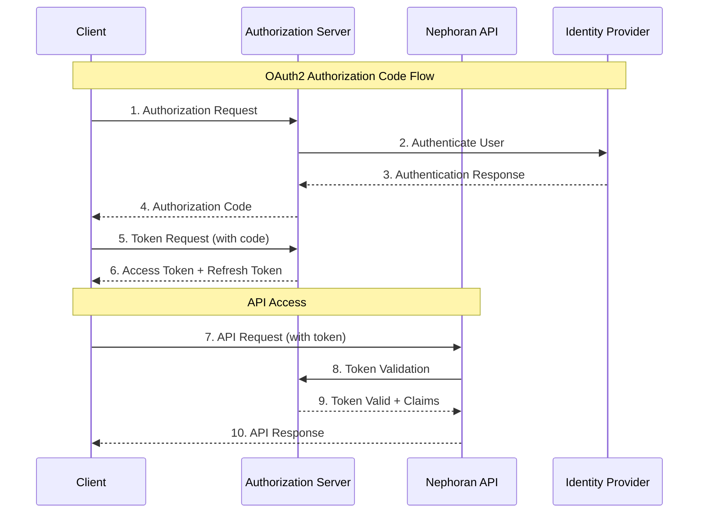

# Authentication and Authorization Guide

## Overview

The Nephoran Intent Operator API implements enterprise-grade security using OAuth2 authentication with JWT tokens. This production-ready (TRL 9) system supports multiple identity providers and provides fine-grained authorization controls suitable for telecommunications environments.

## Authentication Architecture



## Supported Authentication Methods

### 1. OAuth2 Authorization Code Flow (Recommended for Web Apps)

#### Step 1: Authorization Request

```http
GET https://auth.nephoran.com/oauth/authorize?
    response_type=code&
    client_id=your-client-id&
    redirect_uri=https://yourapp.com/auth/callback&
    scope=intent.read intent.write rag.query&
    state=random-state-string
```

**Parameters:**
- `response_type`: Always `code`
- `client_id`: Your registered client identifier
- `redirect_uri`: Registered callback URL
- `scope`: Space-separated list of requested permissions
- `state`: CSRF protection token (recommended)

#### Step 2: Authorization Callback

```http
GET https://yourapp.com/auth/callback?
    code=authorization-code&
    state=random-state-string
```

#### Step 3: Token Exchange

```http
POST https://auth.nephoran.com/oauth/token
Content-Type: application/x-www-form-urlencoded

grant_type=authorization_code&
code=authorization-code&
redirect_uri=https://yourapp.com/auth/callback&
client_id=your-client-id&
client_secret=your-client-secret
```

**Response:**
```json
{
  "access_token": "eyJhbGciOiJSUzI1NiIsInR5cCI6IkpXVCJ9...",
  "token_type": "Bearer",
  "expires_in": 3600,
  "refresh_token": "eyJhbGciOiJSUzI1NiIsInR5cCI6IkpXVCJ9...",
  "scope": "intent.read intent.write rag.query"
}
```

### 2. Client Credentials Flow (for Service-to-Service)

```http
POST https://auth.nephoran.com/oauth/token
Content-Type: application/x-www-form-urlencoded

grant_type=client_credentials&
client_id=your-service-client-id&
client_secret=your-service-client-secret&
scope=intent.execute rag.admin
```

### 3. Refresh Token Flow

```http
POST https://auth.nephoran.com/oauth/token
Content-Type: application/x-www-form-urlencoded

grant_type=refresh_token&
refresh_token=your-refresh-token&
client_id=your-client-id&
client_secret=your-client-secret
```

## JWT Token Structure

### Access Token Claims

```json
{
  "iss": "https://auth.nephoran.com",
  "sub": "user-12345",
  "aud": "nephoran-api",
  "exp": 1672531200,
  "iat": 1672527600,
  "jti": "token-id-12345",
  "scope": "intent.read intent.write rag.query",
  "client_id": "your-client-id",
  "tenant": "acme-telecom",
  "roles": ["network-engineer", "intent-operator"],
  "permissions": [
    "intent:read:*",
    "intent:write:telecom-5g/*",
    "rag:query:o-ran"
  ],
  "user_info": {
    "name": "John Doe",
    "email": "john.doe@acme-telecom.com",
    "department": "Network Operations"
  }
}
```

### Refresh Token Claims

```json
{
  "iss": "https://auth.nephoran.com",
  "sub": "user-12345",
  "aud": "nephoran-api",
  "exp": 1675209600,
  "iat": 1672527600,
  "jti": "refresh-token-id-12345",
  "token_type": "refresh",
  "client_id": "your-client-id",
  "scope": "intent.read intent.write rag.query"
}
```

## Authorization Scopes

### Core Scopes

| Scope | Description | Operations |
|-------|-------------|------------|
| `intent.read` | Read network intents | GET /intents, GET /intents/{namespace}/{name} |
| `intent.write` | Create and modify intents | POST /intents, PUT /intents/{namespace}/{name} |
| `intent.execute` | Execute intent deployments | All intent lifecycle operations |
| `intent.delete` | Delete network intents | DELETE /intents/{namespace}/{name} |
| `rag.query` | Query knowledge base | POST /rag/query, GET /rag/knowledge-base |
| `rag.admin` | Manage knowledge base | All RAG operations + administration |
| `monitoring.read` | Read monitoring data | GET /health, GET /metrics |
| `monitoring.admin` | Administer monitoring | All monitoring endpoints |
| `oran.read` | Read O-RAN configurations | GET /oran/a1/policies |
| `oran.write` | Modify O-RAN configs | POST /oran/a1/policies |
| `admin` | Full administrative access | All operations |

### Hierarchical Permissions

```yaml
# Fine-grained permissions support wildcards and hierarchies
permissions:
  # Namespace-specific permissions
  - "intent:read:telecom-5g/*"      # Read intents in telecom-5g namespace
  - "intent:write:test/*"           # Write intents in test namespace
  
  # Resource-specific permissions  
  - "intent:execute:production/*"   # Execute production intents only
  - "rag:query:o-ran"              # Query O-RAN knowledge only
  
  # Global permissions
  - "intent:read:*"                # Read all intents
  - "monitoring:*"                 # All monitoring operations
```

## Identity Providers

### Supported Providers

1. **Azure Active Directory (Azure AD)**
2. **Google Cloud Identity**
3. **Keycloak (Self-hosted)**
4. **Auth0**
5. **Okta**
6. **LDAP/Active Directory** (via Keycloak bridge)
7. **SAML 2.0** (via Keycloak)

### Azure AD Integration

```yaml
# Azure AD Configuration
auth:
  provider: azure-ad
  tenant_id: "your-tenant-id"
  client_id: "your-azure-app-id"
  client_secret: "your-azure-app-secret"
  authority: "https://login.microsoftonline.com/your-tenant-id"
  scopes:
    - "https://nephoran.onmicrosoft.com/api/intent.read"
    - "https://nephoran.onmicrosoft.com/api/intent.write"
```

**Azure AD App Registration:**
```json
{
  "appId": "your-azure-app-id",
  "displayName": "Nephoran Intent Operator",
  "signInAudience": "AzureADMyOrg",
  "web": {
    "redirectUris": [
      "https://yourapp.com/auth/callback"
    ],
    "implicitGrantSettings": {
      "enableIdTokenIssuance": true,
      "enableAccessTokenIssuance": true
    }
  },
  "requiredResourceAccess": [
    {
      "resourceAppId": "nephoran-api-app-id",
      "resourceAccess": [
        {
          "id": "intent-read-scope-id",
          "type": "Scope"
        }
      ]
    }
  ]
}
```

### Google Cloud Identity Integration

```yaml
# Google Cloud Identity Configuration
auth:
  provider: google
  project_id: "your-gcp-project"
  client_id: "your-google-client-id"
  client_secret: "your-google-client-secret"
  auth_uri: "https://accounts.google.com/o/oauth2/auth"
  token_uri: "https://oauth2.googleapis.com/token"
  auth_provider_x509_cert_url: "https://www.googleapis.com/oauth2/v1/certs"
```

### Keycloak Integration

```yaml
# Keycloak Configuration
auth:
  provider: keycloak
  server_url: "https://keycloak.yourcompany.com"
  realm: "nephoran"
  client_id: "nephoran-api"
  client_secret: "your-keycloak-secret"
  ssl_required: "external"
```

**Keycloak Realm Configuration:**
```json
{
  "realm": "nephoran",
  "enabled": true,
  "sslRequired": "external",
  "registrationAllowed": false,
  "loginWithEmailAllowed": true,
  "duplicateEmailsAllowed": false,
  "resetPasswordAllowed": true,
  "editUsernameAllowed": false,
  "bruteForceProtected": true,
  "clients": [
    {
      "clientId": "nephoran-api",
      "enabled": true,
      "clientAuthenticatorType": "client-secret",
      "secret": "your-keycloak-secret",
      "redirectUris": ["https://yourapp.com/auth/callback"],
      "webOrigins": ["https://yourapp.com"],
      "protocol": "openid-connect",
      "attributes": {
        "access.token.lifespan": "3600",
        "refresh.token.lifespan": "86400"
      }
    }
  ]
}
```

## Implementation Examples

### JavaScript/TypeScript

```typescript
import { AuthenticationClient } from '@nephoran/intent-operator-sdk';

class NephoranAuth {
  private authClient: AuthenticationClient;

  constructor(config: AuthConfig) {
    this.authClient = new AuthenticationClient({
      clientId: config.clientId,
      clientSecret: config.clientSecret,
      authUrl: 'https://auth.nephoran.com/oauth/authorize',
      tokenUrl: 'https://auth.nephoran.com/oauth/token',
      scopes: ['intent.read', 'intent.write', 'rag.query']
    });
  }

  // Authorization Code Flow
  async initiateLogin(): Promise<string> {
    const authUrl = this.authClient.getAuthorizationUrl({
      redirectUri: window.location.origin + '/auth/callback',
      state: this.generateState(),
      codeChallenge: await this.generateCodeChallenge(), // PKCE
      codeChallengeMethod: 'S256'
    });
    
    return authUrl;
  }

  async handleCallback(code: string, state: string): Promise<TokenResponse> {
    if (state !== this.getStoredState()) {
      throw new Error('State mismatch - possible CSRF attack');
    }

    const tokens = await this.authClient.exchangeCodeForTokens({
      code,
      redirectUri: window.location.origin + '/auth/callback',
      codeVerifier: this.getStoredCodeVerifier() // PKCE
    });

    // Store tokens securely
    this.storeTokens(tokens);
    return tokens;
  }

  // Client Credentials Flow (for backend services)
  async getServiceToken(): Promise<string> {
    const tokens = await this.authClient.clientCredentialsGrant({
      scopes: ['intent.execute', 'rag.admin']
    });

    return tokens.access_token;
  }

  // Token refresh
  async refreshAccessToken(): Promise<string> {
    const refreshToken = this.getStoredRefreshToken();
    if (!refreshToken) {
      throw new Error('No refresh token available');
    }

    const tokens = await this.authClient.refreshToken(refreshToken);
    this.storeTokens(tokens);
    return tokens.access_token;
  }

  // Automatic token management
  async getValidAccessToken(): Promise<string> {
    const currentToken = this.getStoredAccessToken();
    
    if (this.isTokenValid(currentToken)) {
      return currentToken;
    }

    if (this.hasRefreshToken()) {
      return this.refreshAccessToken();
    }

    throw new Error('No valid authentication - user must log in');
  }

  private generateState(): string {
    const state = crypto.randomUUID();
    localStorage.setItem('oauth_state', state);
    return state;
  }

  private async generateCodeChallenge(): Promise<string> {
    const codeVerifier = crypto.randomUUID() + crypto.randomUUID();
    localStorage.setItem('code_verifier', codeVerifier);
    
    const encoder = new TextEncoder();
    const data = encoder.encode(codeVerifier);
    const digest = await crypto.subtle.digest('SHA-256', data);
    
    return btoa(String.fromCharCode(...new Uint8Array(digest)))
      .replace(/\+/g, '-')
      .replace(/\//g, '_')
      .replace(/=/g, '');
  }

  private storeTokens(tokens: TokenResponse): void {
    // Store in secure HttpOnly cookies in production
    localStorage.setItem('access_token', tokens.access_token);
    localStorage.setItem('refresh_token', tokens.refresh_token);
    localStorage.setItem('token_expiry', 
      String(Date.now() + (tokens.expires_in * 1000)));
  }

  private isTokenValid(token: string): boolean {
    if (!token) return false;
    
    const expiry = localStorage.getItem('token_expiry');
    if (!expiry) return false;
    
    return Date.now() < parseInt(expiry) - 30000; // 30s buffer
  }
}

// Usage example
const auth = new NephoranAuth({
  clientId: 'your-client-id',
  clientSecret: 'your-client-secret'
});

// In your application
async function makeAuthenticatedRequest() {
  try {
    const token = await auth.getValidAccessToken();
    
    const response = await fetch('https://api.nephoran.com/v1/intents', {
      headers: {
        'Authorization': `Bearer ${token}`,
        'Content-Type': 'application/json'
      }
    });

    if (response.status === 401) {
      // Token might be invalid, try to refresh
      await auth.refreshAccessToken();
      // Retry the request...
    }

    return response.json();
  } catch (error) {
    console.error('Authentication error:', error);
    // Redirect to login
    window.location.href = await auth.initiateLogin();
  }
}
```

### Python

```python
import requests
import jwt
import time
from datetime import datetime, timedelta
from typing import Optional, Dict, Any
import hashlib
import base64
import secrets

class NephoranAuth:
    def __init__(self, client_id: str, client_secret: str, 
                 auth_url: str = "https://auth.nephoran.com/oauth/authorize",
                 token_url: str = "https://auth.nephoran.com/oauth/token"):
        self.client_id = client_id
        self.client_secret = client_secret
        self.auth_url = auth_url
        self.token_url = token_url
        self.access_token: Optional[str] = None
        self.refresh_token: Optional[str] = None
        self.token_expiry: Optional[datetime] = None

    def get_authorization_url(self, redirect_uri: str, scopes: list, 
                            state: Optional[str] = None) -> str:
        """Generate OAuth2 authorization URL"""
        if not state:
            state = secrets.token_urlsafe(32)
        
        params = {
            'response_type': 'code',
            'client_id': self.client_id,
            'redirect_uri': redirect_uri,
            'scope': ' '.join(scopes),
            'state': state
        }
        
        query_string = '&'.join([f"{k}={requests.utils.quote(str(v))}" 
                               for k, v in params.items()])
        return f"{self.auth_url}?{query_string}"

    def exchange_code_for_tokens(self, code: str, redirect_uri: str) -> Dict[str, Any]:
        """Exchange authorization code for access tokens"""
        data = {
            'grant_type': 'authorization_code',
            'code': code,
            'redirect_uri': redirect_uri,
            'client_id': self.client_id,
            'client_secret': self.client_secret
        }
        
        response = requests.post(self.token_url, data=data)
        response.raise_for_status()
        
        tokens = response.json()
        self._store_tokens(tokens)
        return tokens

    def client_credentials_grant(self, scopes: list) -> Dict[str, Any]:
        """Get access token using client credentials flow"""
        data = {
            'grant_type': 'client_credentials',
            'client_id': self.client_id,
            'client_secret': self.client_secret,
            'scope': ' '.join(scopes)
        }
        
        response = requests.post(self.token_url, data=data)
        response.raise_for_status()
        
        tokens = response.json()
        self._store_tokens(tokens)
        return tokens

    def refresh_access_token(self) -> Dict[str, Any]:
        """Refresh access token using refresh token"""
        if not self.refresh_token:
            raise ValueError("No refresh token available")
        
        data = {
            'grant_type': 'refresh_token',
            'refresh_token': self.refresh_token,
            'client_id': self.client_id,
            'client_secret': self.client_secret
        }
        
        response = requests.post(self.token_url, data=data)
        response.raise_for_status()
        
        tokens = response.json()
        self._store_tokens(tokens)
        return tokens

    def get_valid_access_token(self) -> str:
        """Get a valid access token, refreshing if necessary"""
        if self._is_token_valid():
            return self.access_token
        
        if self.refresh_token:
            self.refresh_access_token()
            return self.access_token
        
        raise RuntimeError("No valid authentication - need to authenticate")

    def _store_tokens(self, tokens: Dict[str, Any]) -> None:
        """Store tokens and calculate expiry"""
        self.access_token = tokens['access_token']
        self.refresh_token = tokens.get('refresh_token')
        
        expires_in = tokens.get('expires_in', 3600)
        self.token_expiry = datetime.now() + timedelta(seconds=expires_in - 30)

    def _is_token_valid(self) -> bool:
        """Check if current access token is valid"""
        return (self.access_token is not None and 
                self.token_expiry is not None and 
                datetime.now() < self.token_expiry)

    def decode_token(self, token: str) -> Dict[str, Any]:
        """Decode JWT token (without verification for debugging)"""
        # In production, verify the token signature
        return jwt.decode(token, options={"verify_signature": False})

    def get_user_info(self) -> Dict[str, Any]:
        """Extract user information from access token"""
        if not self.access_token:
            raise ValueError("No access token available")
        
        token_data = self.decode_token(self.access_token)
        return token_data.get('user_info', {})

# Usage example
auth = NephoranAuth(
    client_id="your-client-id",
    client_secret="your-client-secret"
)

# For web applications
authorization_url = auth.get_authorization_url(
    redirect_uri="https://yourapp.com/auth/callback",
    scopes=["intent.read", "intent.write", "rag.query"],
    state="random-state-string"
)

# For backend services
tokens = auth.client_credentials_grant(["intent.execute", "rag.admin"])

# Making authenticated requests
def make_api_request(url: str, method: str = "GET", data: Any = None) -> requests.Response:
    token = auth.get_valid_access_token()
    
    headers = {
        'Authorization': f'Bearer {token}',
        'Content-Type': 'application/json'
    }
    
    response = requests.request(method, url, headers=headers, json=data)
    
    if response.status_code == 401:
        # Token expired, try to refresh
        auth.refresh_access_token()
        headers['Authorization'] = f'Bearer {auth.access_token}'
        response = requests.request(method, url, headers=headers, json=data)
    
    return response
```

### Go

```go
package main

import (
    "context"
    "crypto/rand"
    "crypto/sha256"
    "encoding/base64"
    "encoding/json"
    "fmt"
    "net/http"
    "net/url"
    "strings"
    "time"
    
    "golang.org/x/oauth2"
)

type NephoranAuth struct {
    config       *oauth2.Config
    client       *http.Client
    accessToken  string
    refreshToken string
    expiry       time.Time
}

type TokenResponse struct {
    AccessToken  string `json:"access_token"`
    TokenType    string `json:"token_type"`
    ExpiresIn    int64  `json:"expires_in"`
    RefreshToken string `json:"refresh_token"`
    Scope        string `json:"scope"`
}

func NewNephoranAuth(clientID, clientSecret string) *NephoranAuth {
    return &NephoranAuth{
        config: &oauth2.Config{
            ClientID:     clientID,
            ClientSecret: clientSecret,
            Endpoint: oauth2.Endpoint{
                AuthURL:  "https://auth.nephoran.com/oauth/authorize",
                TokenURL: "https://auth.nephoran.com/oauth/token",
            },
            RedirectURL: "https://yourapp.com/auth/callback",
            Scopes:      []string{"intent.read", "intent.write", "rag.query"},
        },
        client: &http.Client{Timeout: 30 * time.Second},
    }
}

// Authorization Code Flow
func (na *NephoranAuth) GetAuthorizationURL(state string) string {
    return na.config.AuthCodeURL(state, oauth2.AccessTypeOffline)
}

func (na *NephoranAuth) ExchangeCodeForTokens(ctx context.Context, code string) (*TokenResponse, error) {
    token, err := na.config.Exchange(ctx, code)
    if err != nil {
        return nil, fmt.Errorf("failed to exchange code: %w", err)
    }
    
    na.storeTokens(token)
    
    return &TokenResponse{
        AccessToken:  token.AccessToken,
        TokenType:    token.TokenType,
        ExpiresIn:    int64(time.Until(token.Expiry).Seconds()),
        RefreshToken: token.RefreshToken,
    }, nil
}

// Client Credentials Flow
func (na *NephoranAuth) ClientCredentialsGrant(ctx context.Context, scopes []string) (*TokenResponse, error) {
    data := url.Values{}
    data.Set("grant_type", "client_credentials")
    data.Set("client_id", na.config.ClientID)
    data.Set("client_secret", na.config.ClientSecret)
    data.Set("scope", strings.Join(scopes, " "))
    
    req, err := http.NewRequestWithContext(ctx, "POST", na.config.Endpoint.TokenURL, 
        strings.NewReader(data.Encode()))
    if err != nil {
        return nil, err
    }
    
    req.Header.Set("Content-Type", "application/x-www-form-urlencoded")
    
    resp, err := na.client.Do(req)
    if err != nil {
        return nil, err
    }
    defer resp.Body.Close()
    
    var tokenResp TokenResponse
    if err := json.NewDecoder(resp.Body).Decode(&tokenResp); err != nil {
        return nil, err
    }
    
    // Store tokens
    na.accessToken = tokenResp.AccessToken
    na.refreshToken = tokenResp.RefreshToken
    na.expiry = time.Now().Add(time.Duration(tokenResp.ExpiresIn) * time.Second)
    
    return &tokenResp, nil
}

func (na *NephoranAuth) RefreshAccessToken(ctx context.Context) error {
    if na.refreshToken == "" {
        return fmt.Errorf("no refresh token available")
    }
    
    tokenSource := na.config.TokenSource(ctx, &oauth2.Token{
        RefreshToken: na.refreshToken,
    })
    
    token, err := tokenSource.Token()
    if err != nil {
        return fmt.Errorf("failed to refresh token: %w", err)
    }
    
    na.storeTokens(token)
    return nil
}

func (na *NephoranAuth) GetValidAccessToken(ctx context.Context) (string, error) {
    if na.isTokenValid() {
        return na.accessToken, nil
    }
    
    if na.refreshToken != "" {
        if err := na.RefreshAccessToken(ctx); err == nil {
            return na.accessToken, nil
        }
    }
    
    return "", fmt.Errorf("no valid authentication available")
}

func (na *NephoranAuth) storeTokens(token *oauth2.Token) {
    na.accessToken = token.AccessToken
    na.refreshToken = token.RefreshToken
    na.expiry = token.Expiry.Add(-30 * time.Second) // 30s buffer
}

func (na *NephoranAuth) isTokenValid() bool {
    return na.accessToken != "" && time.Now().Before(na.expiry)
}

// HTTP Client with automatic token management
func (na *NephoranAuth) NewAuthenticatedClient(ctx context.Context) *http.Client {
    return &http.Client{
        Transport: &AuthenticatedTransport{
            auth: na,
            ctx:  ctx,
            base: http.DefaultTransport,
        },
        Timeout: 60 * time.Second,
    }
}

type AuthenticatedTransport struct {
    auth *NephoranAuth
    ctx  context.Context
    base http.RoundTripper
}

func (t *AuthenticatedTransport) RoundTrip(req *http.Request) (*http.Response, error) {
    token, err := t.auth.GetValidAccessToken(t.ctx)
    if err != nil {
        return nil, fmt.Errorf("failed to get valid token: %w", err)
    }
    
    req.Header.Set("Authorization", "Bearer "+token)
    return t.base.RoundTrip(req)
}

// Usage example
func main() {
    auth := NewNephoranAuth("your-client-id", "your-client-secret")
    ctx := context.Background()
    
    // For web applications
    authURL := auth.GetAuthorizationURL("random-state-string")
    fmt.Printf("Visit: %s\n", authURL)
    
    // For backend services
    tokens, err := auth.ClientCredentialsGrant(ctx, []string{"intent.execute", "rag.admin"})
    if err != nil {
        panic(err)
    }
    
    fmt.Printf("Access token obtained: %s...\n", tokens.AccessToken[:20])
    
    // Create authenticated HTTP client
    client := auth.NewAuthenticatedClient(ctx)
    
    // Make API requests
    resp, err := client.Get("https://api.nephoran.com/v1/health")
    if err != nil {
        panic(err)
    }
    defer resp.Body.Close()
    
    fmt.Printf("API Response: %d\n", resp.StatusCode)
}
```

## Security Best Practices

### Token Storage

1. **Web Applications:**
   - Store tokens in HttpOnly, Secure, SameSite cookies
   - Never store tokens in localStorage for production apps
   - Use session storage for temporary tokens only

2. **Mobile Applications:**
   - Use secure keychain/keystore
   - Implement certificate pinning
   - Use PKCE for additional security

3. **Backend Services:**
   - Store credentials in environment variables or secret management systems
   - Rotate client secrets regularly
   - Use service accounts with minimal required permissions

### Token Validation

```typescript
// Client-side token validation (basic checks only)
function isTokenExpired(token: string): boolean {
  try {
    const payload = JSON.parse(atob(token.split('.')[1]));
    return Date.now() >= payload.exp * 1000;
  } catch {
    return true;
  }
}

function validateTokenClaims(token: string, requiredScopes: string[]): boolean {
  try {
    const payload = JSON.parse(atob(token.split('.')[1]));
    const tokenScopes = payload.scope ? payload.scope.split(' ') : [];
    
    return requiredScopes.every(scope => tokenScopes.includes(scope));
  } catch {
    return false;
  }
}
```

### Error Handling

```typescript
enum AuthErrorType {
  INVALID_CREDENTIALS = 'invalid_credentials',
  TOKEN_EXPIRED = 'token_expired',
  INSUFFICIENT_SCOPE = 'insufficient_scope',
  RATE_LIMITED = 'rate_limited',
  SERVER_ERROR = 'server_error'
}

class AuthError extends Error {
  constructor(
    public type: AuthErrorType,
    message: string,
    public statusCode?: number,
    public retryAfter?: number
  ) {
    super(message);
    this.name = 'AuthError';
  }
}

// Centralized error handling
function handleAuthError(error: any): AuthError {
  if (error.response?.status === 401) {
    return new AuthError(AuthErrorType.TOKEN_EXPIRED, 'Authentication required', 401);
  }
  
  if (error.response?.status === 403) {
    return new AuthError(AuthErrorType.INSUFFICIENT_SCOPE, 'Insufficient permissions', 403);
  }
  
  if (error.response?.status === 429) {
    const retryAfter = parseInt(error.response.headers['retry-after']) || 60;
    return new AuthError(AuthErrorType.RATE_LIMITED, 'Rate limit exceeded', 429, retryAfter);
  }
  
  return new AuthError(AuthErrorType.SERVER_ERROR, 'Authentication server error', 500);
}
```

This comprehensive authentication guide provides production-ready implementations for all major programming languages and covers enterprise security requirements for telecommunications environments.