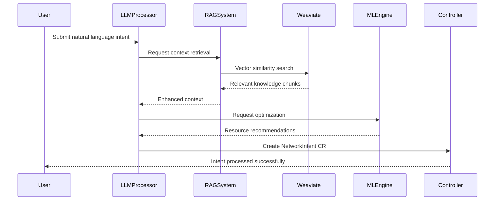
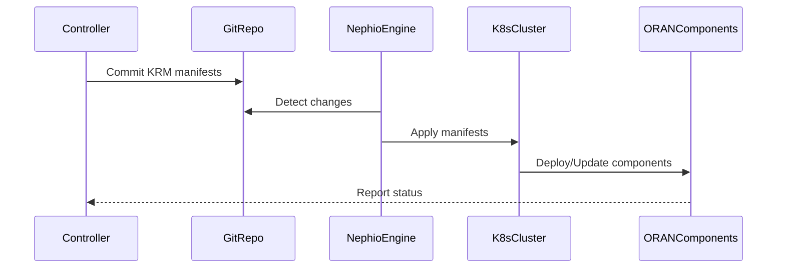
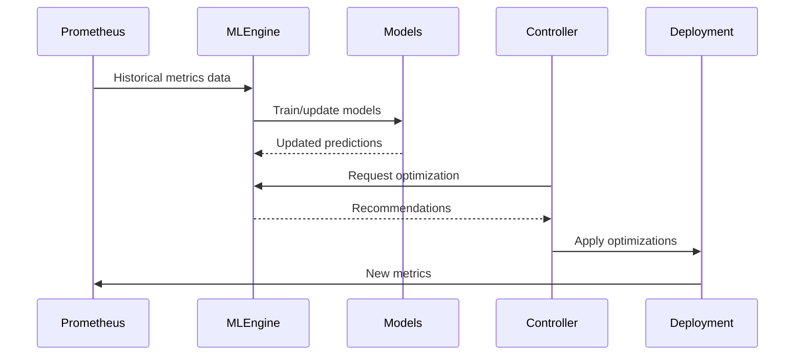

# Nephoran Intent Operator - System Architecture

## Overview

The Nephoran Intent Operator is a cloud-native orchestration system that bridges natural language network operations with O-RAN compliant deployments. The system combines Large Language Model (LLM) processing, Retrieval-Augmented Generation (RAG) capabilities, Machine Learning optimization, and GitOps principles to provide autonomous network function management.

## High-Level Architecture

```mermaid
graph TB
    subgraph "User Interface Layer"
        CLI["CLI/API Clients"]
        WebUI["Web Interface"]
        K8sAPI["Kubernetes API"]
    end

    subgraph "Enhanced Control & Intent Layer"
        NLIntent["Natural Language Intent"]
        LLMProcessor["LLM Processor Service"]
        RAGSystem["RAG System"]
        MLEngine["ML Optimization Engine"]
        ControlRepo["Git Repository (High-Level Intent)"]
    end

    subgraph "Knowledge & Vector Processing"
        Weaviate["Weaviate Vector DB"]
        KnowledgeBase["Telecom Knowledge Base"]
        StreamProcessor["Streaming Document Processor"]
        EmbeddingService["Cost-Aware Embedding Service"]
    end

    subgraph "AI/ML Processing Layer"
        TrafficPrediction["Traffic Prediction Model"]
        ResourceOptimizer["Resource Optimization Model"]
        AnomalyDetection["Anomaly Detection Model"]
        IntentClassifier["Intent Classification Model"]
    end

    subgraph "SMO / Non-RT RIC (Nephoran Implementation)"
        NephioBridge["Nephio Bridge Controller"]
        E2NodeController["E2NodeSet Controller"]
        DeploymentRepo["Git Repository (KRM Manifests)"]
        PackageGenerator["KRM Package Generator"]
    end

    subgraph "O-RAN Components (Running on Kubernetes)"
        NearRtRic["O-RAN Near-RT RIC"]
        E2Sim["E2 Node Simulators"]
        ORANAdaptor["O-RAN Adaptor (A1/O1/O2)"]
        xApps["xApps"]
    end

    subgraph "Observability & Monitoring"
        Prometheus["Prometheus"]
        Alertmanager["Alertmanager"]
        Grafana["Grafana Dashboards"]
        ServiceMonitors["ServiceMonitors"]
    end

    subgraph "GitOps Engine"
        NephioEngine["Nephio Engine"]
        FluxCD["Flux CD"]
        KptPackages["Kpt Packages"]
    end

    %% User interactions
    CLI --> K8sAPI
    WebUI --> K8sAPI
    K8sAPI --> NLIntent

    %% Intent processing flow
    NLIntent --> LLMProcessor
    LLMProcessor --> RAGSystem
    RAGSystem --> Weaviate
    Weaviate --> KnowledgeBase
    StreamProcessor --> Weaviate
    EmbeddingService --> Weaviate
    
    %% ML optimization
    LLMProcessor --> MLEngine
    MLEngine --> TrafficPrediction
    MLEngine --> ResourceOptimizer
    MLEngine --> AnomalyDetection
    MLEngine --> IntentClassifier
    MLEngine --> Prometheus
    
    %% GitOps flow
    LLMProcessor --> ControlRepo
    NephioBridge --> ControlRepo
    E2NodeController --> ControlRepo
    NephioBridge --> PackageGenerator
    PackageGenerator --> DeploymentRepo
    
    %% Orchestration
    NephioEngine --> DeploymentRepo
    FluxCD --> DeploymentRepo
    NephioEngine --> KptPackages
    NephioEngine --> NearRtRic
    NephioEngine --> E2Sim
    
    %% O-RAN interfaces
    ORANAdaptor --> NearRtRic
    NearRtRic --> E2Sim
    NearRtRic --> xApps
    
    %% Monitoring connections
    LLMProcessor --> ServiceMonitors
    RAGSystem --> ServiceMonitors
    NephioBridge --> ServiceMonitors
    ORANAdaptor --> ServiceMonitors
    Weaviate --> ServiceMonitors
    ServiceMonitors --> Prometheus
    Prometheus --> Alertmanager
    Prometheus --> Grafana

    %% Styling
    classDef userLayer fill:#e1f5fe
    classDef controlLayer fill:#f3e5f5
    classDef aiLayer fill:#fff3e0
    classDef gitopsLayer fill:#e8f5e8
    classDef oranLayer fill:#fce4ec
    classDef monitoringLayer fill:#fff8e1

    class CLI,WebUI,K8sAPI userLayer
    class NLIntent,LLMProcessor,RAGSystem,MLEngine,ControlRepo controlLayer
    class Weaviate,KnowledgeBase,StreamProcessor,EmbeddingService,TrafficPrediction,ResourceOptimizer,AnomalyDetection,IntentClassifier aiLayer
    class NephioBridge,E2NodeController,DeploymentRepo,PackageGenerator,NephioEngine,FluxCD,KptPackages gitopsLayer
    class NearRtRic,E2Sim,ORANAdaptor,xApps oranLayer
    class Prometheus,Alertmanager,Grafana,ServiceMonitors monitoringLayer
```



## Core Components

### 1. LLM Processor Service

**Purpose**: Processes natural language intents and translates them into structured Kubernetes resources.

**Key Features**:
- Natural language understanding using OpenAI GPT models
- Integration with RAG system for context-aware processing
- ML-enhanced optimization recommendations
- Authentication and authorization support
- Metrics collection and monitoring

**Build Configuration**:
```bash
# Standard build (RAG enabled by default)
go build ./cmd/llm-processor

# Disable RAG components
go build -tags disable_rag ./cmd/llm-processor
```

**Endpoints**:
- `POST /api/v1/intents` - Process natural language intents
- `GET /healthz` - Health check endpoint
- `GET /metrics` - Prometheus metrics
- `GET /ml/metrics` - ML model performance metrics (if ml build tag enabled)

### 2. RAG System (Retrieval-Augmented Generation)

**Purpose**: Provides context-aware natural language processing using telecom-specific knowledge base.

**Components**:
- **Weaviate Vector Database**: Stores and indexes document embeddings
- **Streaming Document Processor**: Processes large document sets efficiently
- **Cost-Aware Embedding Service**: Optimizes OpenAI API usage
- **Knowledge Base Manager**: Manages telecom specifications and best practices

**Build Configuration**:
```bash
# RAG enabled by default
go build ./cmd/rag-api

# Explicit RAG enable
go build -tags !disable_rag ./cmd/rag-api
```

**Key Features**:
- Streaming document ingestion with up to 1000+ documents/hour
- Telecom-specific keyword extraction and categorization
- Vector search with <500ms latency
- Intelligent caching with LRU and TTL policies
- Comprehensive metrics and monitoring

### 3. ML Optimization Engine

**Purpose**: Provides AI-driven network optimization using historical data and predictive models.

**Build Configuration**:
```bash
# ML components require explicit build tag
go build -tags ml ./cmd/ml-optimizer
```

**ML Models**:
- **Traffic Prediction Model**: Forecasts network load patterns using time series analysis
- **Resource Optimization Model**: Recommends optimal CPU, memory, and scaling parameters
- **Anomaly Detection Model**: Identifies deployment risks and unusual patterns
- **Intent Classification Model**: Categorizes and prioritizes network intents

**Data Sources**:
- Historical Prometheus metrics (30-day retention)
- Real-time system performance data
- Network function behavior patterns
- User intent history and outcomes

### 4. Nephio Bridge Controller

**Purpose**: Main controller that bridges high-level intents with Nephio orchestration.

**Responsibilities**:
- Watches NetworkIntent and E2NodeSet custom resources
- Generates KRM (Kubernetes Resource Model) manifests
- Integrates with GitOps repositories
- Manages O-RAN component lifecycle

**Custom Resource Definitions**:
```yaml
# NetworkIntent CRD
apiVersion: nephoran.com/v1alpha1
kind: NetworkIntent
metadata:
  name: example-intent
spec:
  intent: "Deploy AMF with 3 replicas for network slice eMBB"
  priority: "high"
  parameters:
    network_slice: "eMBB"
    replicas: 3

# E2NodeSet CRD
apiVersion: nephoran.com/v1alpha1
kind: E2NodeSet
metadata:
  name: example-e2nodes
spec:
  replicas: 5
  template:
    spec:
      nodeType: "gnb"
```

### 5. O-RAN Adaptor

**Purpose**: Provides standardized interfaces for O-RAN component communication.

**Supported Interfaces**:
- **A1 Interface**: Policy management between Non-RT RIC and Near-RT RIC
- **O1 Interface**: Management and orchestration interface
- **O2 Interface**: Cloud infrastructure management

**Features**:
- Protocol compliance with O-RAN specifications
- Real-time metrics collection
- Health monitoring and fault management
- Security and authentication support

### 6. Observability Stack

**Components**:
- **Prometheus**: Metrics collection and storage
- **Alertmanager**: Alert routing and notification management
- **Grafana**: Visualization and dashboards
- **ServiceMonitors**: Automatic service discovery

**Monitored Metrics**:
- Intent processing latency and success rates
- LLM token usage and costs
- RAG vector search performance
- ML model accuracy and predictions
- O-RAN interface statistics
- System resource utilization

## Data Flow

### 1. Natural Language Intent Processing



### 2. GitOps Deployment Flow



### 3. ML Optimization Cycle



## Security Architecture

### Authentication and Authorization

**LLM Processor Authentication**:
- OAuth2 integration with Azure AD, Google, GitHub
- JWT token-based authentication
- Environment-based security policies
- Production security enforcement

**Service Communication**:
- mTLS for inter-service communication
- Kubernetes RBAC for resource access
- Network policies for traffic segmentation
- Secret management for API keys

### Network Security

**Network Policies**:
```yaml
# Example network policy for RAG system
apiVersion: networking.k8s.io/v1
kind: NetworkPolicy
metadata:
  name: rag-system-policy
spec:
  podSelector:
    matchLabels:
      app.kubernetes.io/component: rag
  policyTypes:
  - Ingress
  - Egress
  ingress:
  - from:
    - podSelector:
        matchLabels:
          app.kubernetes.io/name: llm-processor
  egress:
  - to:
    - podSelector:
        matchLabels:
          app.kubernetes.io/name: weaviate
  - to: []
    ports:
    - protocol: TCP
      port: 443  # HTTPS for OpenAI API
```

## Deployment Patterns

### Local Development

```bash
# Set up development environment
export OPENAI_API_KEY="sk-your-api-key"
export GO_ENV="development"

# Build with ML and RAG components
make build-all TAGS="ml,!disable_rag"

# Deploy locally
./deploy.sh local

# Populate knowledge base
make populate-kb-enhanced
```

### Production Deployment

```bash
# Set production environment
export ENVIRONMENT="production"
export AUTH_ENABLED="true"

# Build production images
make docker-build TAGS="ml,!disable_rag"

# Deploy to cluster
./deploy.sh remote

# Verify deployment
make verify-deployment
```

### Multi-Region Deployment

The system supports multi-region deployment with:
- Distributed Weaviate clusters
- Regional GitOps repositories  
- Cross-region monitoring
- Disaster recovery capabilities

## Performance Characteristics

### Throughput and Latency

| Component | Throughput | Latency | Notes |
|-----------|------------|---------|-------|
| Intent Processing | 10+ intents/second | 2-5 seconds | Including RAG retrieval |
| Vector Search | 1000+ queries/second | <500ms | Semantic search |
| Document Ingestion | 1000+ docs/hour | - | Streaming processing |
| ML Predictions | 100+ predictions/second | <100ms | Cached results |

### Resource Requirements

**Minimum Development Setup**:
- 8GB RAM, 4 CPU cores
- 100GB storage for vector database
- Kubernetes cluster with ingress

**Recommended Production Setup**:
- 32GB RAM, 8 CPU cores per node
- 500GB+ persistent storage with backup
- Multi-node Kubernetes cluster
- Load balancer for high availability

## Scaling and High Availability

### Horizontal Scaling

**Auto-scaling Configuration**:
```yaml
# Weaviate auto-scaling
autoscaling:
  enabled: true
  minReplicas: 2
  maxReplicas: 5
  targetCPUUtilizationPercentage: 70
  targetMemoryUtilizationPercentage: 80

# RAG API scaling
replicas: 2
resources:
  limits:
    memory: "2Gi"
    cpu: "1000m"
  requests:
    memory: "1Gi"
    cpu: "500m"
```

### High Availability

- **Multi-replica deployments** for all critical components
- **Pod anti-affinity rules** for replica distribution
- **Persistent volume replication** for data durability
- **Health checks and readiness probes** for automated recovery
- **Circuit breakers** for external service dependencies

## Future Enhancements

### Planned Features

1. **Multi-Modal RAG**: Support for diagrams and visual specifications
2. **Federated Learning**: Distributed ML model training
3. **Real-time Streaming**: Event-driven architecture with Kafka
4. **Service Mesh Integration**: Istio for advanced traffic management
5. **Multi-Cloud Support**: Cross-cloud deployment and migration

### Research Areas

1. **Quantum-Safe Cryptography**: Future-proof security
2. **Edge AI Deployment**: On-device ML inference
3. **Autonomous Healing**: Self-repairing network functions
4. **Intent Optimization**: Automatic intent refinement based on outcomes

## Conclusion

The Nephoran Intent Operator represents a comprehensive approach to autonomous network operations, combining cutting-edge AI/ML techniques with proven GitOps practices. The modular architecture ensures scalability, maintainability, and extensibility while providing enterprise-grade security and observability.

The system's ability to process natural language intents, leverage telecom-specific knowledge, and optimize deployments through machine learning makes it a powerful tool for modern telecommunications infrastructure management.