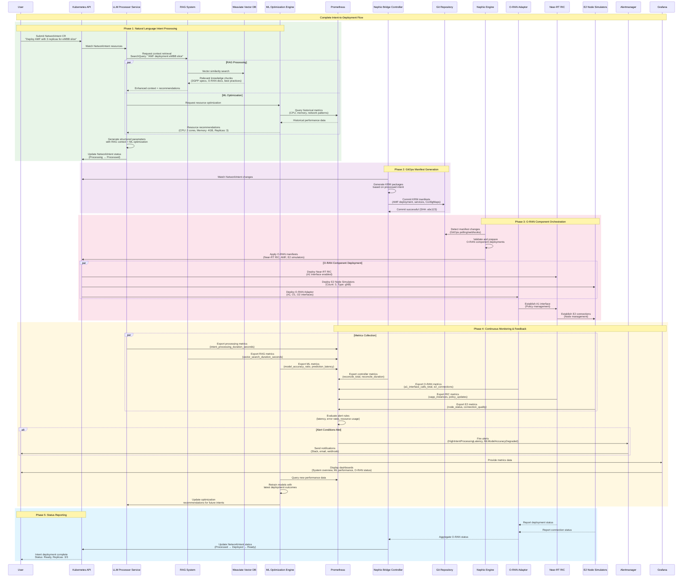
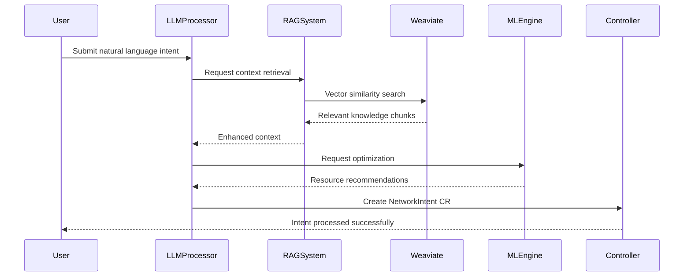
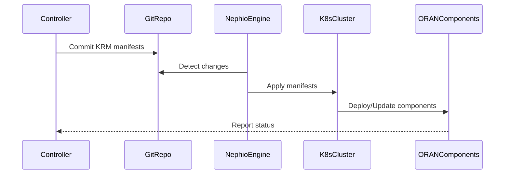
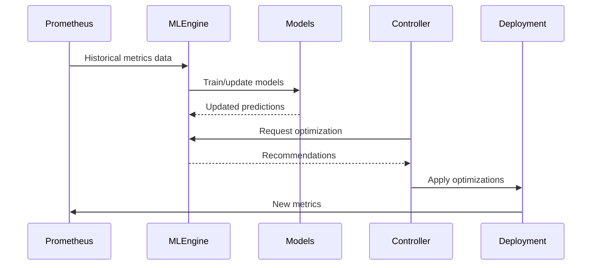

# Nephoran Intent Operator - System Architecture

## Overview

The Nephoran Intent Operator is a cloud-native orchestration system that bridges natural language network operations with O-RAN compliant deployments. The system combines Large Language Model (LLM) processing, Retrieval-Augmented Generation (RAG) capabilities, Machine Learning optimization, and GitOps principles to provide autonomous network function management.

## Prerequisites

### System Requirements

**Software Dependencies**:
- **Go**: Version 1.24 or higher for building from source
- **Kubernetes**: Version 1.30 or higher for cluster deployment
- **Docker**: Version 20.10 or higher for container operations
- **Helm**: Version 3.8 or higher for chart-based deployments (optional)

**Hardware Requirements**:
- Minimum 8GB RAM, 4 CPU cores for development
- Recommended 32GB RAM, 8 CPU cores for production
- Persistent storage with backup capabilities for vector database

## High-Level Architecture

```mermaid
graph TB
    subgraph "User Interface Layer"
        CLI["CLI/API Clients"]
        WebUI["Web Interface"]
        K8sAPI["Kubernetes API"]
    end

    subgraph "Enhanced Control & Intent Layer"
        NLIntent["Natural Language Intent"]
        LLMProcessor["LLM Processor Service"]
        RAGSystem["RAG System"]
        MLEngine["ML Optimization Engine"]
        ControlRepo["Git Repository (High-Level Intent)"]
    end

    subgraph "Knowledge & Vector Processing"
        Weaviate["Weaviate Vector DB"]
        KnowledgeBase["Telecom Knowledge Base"]
        StreamProcessor["Streaming Document Processor"]
        EmbeddingService["Cost-Aware Embedding Service"]
    end

    subgraph "AI/ML Processing Layer"
        TrafficPrediction["Traffic Prediction Model"]
        ResourceOptimizer["Resource Optimization Model"]
        AnomalyDetection["Anomaly Detection Model"]
        IntentClassifier["Intent Classification Model"]
    end

    subgraph "SMO / Non-RT RIC (Nephoran Implementation)"
        NephioBridge["Nephio Bridge Controller"]
        E2NodeController["E2NodeSet Controller"]
        DeploymentRepo["Git Repository (KRM Manifests)"]
        PackageGenerator["KRM Package Generator"]
    end

    subgraph "O-RAN Components (Running on Kubernetes)"
        NearRtRic["O-RAN Near-RT RIC"]
        E2Sim["E2 Node Simulators"]
        ORANAdaptor["O-RAN Adaptor (A1/O1/O2)"]
        xApps["xApps"]
    end

    subgraph "Observability & Monitoring"
        Prometheus["Prometheus"]
        Alertmanager["Alertmanager"]
        Grafana["Grafana Dashboards"]
        ServiceMonitors["ServiceMonitors"]
    end

    subgraph "GitOps Engine"
        NephioEngine["Nephio Engine"]
        FluxCD["Flux CD"]
        KptPackages["Kpt Packages"]
    end

    %% User interactions
    CLI --> K8sAPI
    WebUI --> K8sAPI
    K8sAPI --> NLIntent

    %% Intent processing flow
    NLIntent --> LLMProcessor
    LLMProcessor --> RAGSystem
    RAGSystem --> Weaviate
    Weaviate --> KnowledgeBase
    StreamProcessor --> Weaviate
    EmbeddingService --> Weaviate
    
    %% ML optimization
    LLMProcessor --> MLEngine
    MLEngine --> TrafficPrediction
    MLEngine --> ResourceOptimizer
    MLEngine --> AnomalyDetection
    MLEngine --> IntentClassifier
    MLEngine --> Prometheus
    
    %% GitOps flow
    LLMProcessor --> ControlRepo
    NephioBridge --> ControlRepo
    E2NodeController --> ControlRepo
    NephioBridge --> PackageGenerator
    PackageGenerator --> DeploymentRepo
    
    %% Orchestration
    NephioEngine --> DeploymentRepo
    FluxCD --> DeploymentRepo
    NephioEngine --> KptPackages
    NephioEngine --> NearRtRic
    NephioEngine --> E2Sim
    
    %% O-RAN interfaces
    ORANAdaptor --> NearRtRic
    NearRtRic --> E2Sim
    NearRtRic --> xApps
    
    %% Monitoring connections
    LLMProcessor --> ServiceMonitors
    RAGSystem --> ServiceMonitors
    NephioBridge --> ServiceMonitors
    ORANAdaptor --> ServiceMonitors
    Weaviate --> ServiceMonitors
    ServiceMonitors --> Prometheus
    Prometheus --> Alertmanager
    Prometheus --> Grafana

    %% Styling
    classDef userLayer fill:#e1f5fe
    classDef controlLayer fill:#f3e5f5
    classDef aiLayer fill:#fff3e0
    classDef gitopsLayer fill:#e8f5e8
    classDef oranLayer fill:#fce4ec
    classDef monitoringLayer fill:#fff8e1

    class CLI,WebUI,K8sAPI userLayer
    class NLIntent,LLMProcessor,RAGSystem,MLEngine,ControlRepo controlLayer
    class Weaviate,KnowledgeBase,StreamProcessor,EmbeddingService,TrafficPrediction,ResourceOptimizer,AnomalyDetection,IntentClassifier aiLayer
    class NephioBridge,E2NodeController,DeploymentRepo,PackageGenerator,NephioEngine,FluxCD,KptPackages gitopsLayer
    class NearRtRic,E2Sim,ORANAdaptor,xApps oranLayer
    class Prometheus,Alertmanager,Grafana,ServiceMonitors monitoringLayer
```



## Build Flags and Feature Configuration

The Nephoran Intent Operator uses compile-time build flags to enable or disable specific features, allowing for flexible deployment configurations based on operational requirements, resource constraints, and security policies. This modular approach ensures optimal resource utilization and deployment flexibility.

### Build Flag Overview

| Build Flag | Default State | Component Impact | Description |
|------------|---------------|------------------|-------------|
| `ml` | **Disabled** | ML Optimization Engine | Enables traffic prediction, resource optimization, and anomaly detection |
| `disable_rag` | **Enabled** (RAG active) | RAG Processing Pipeline | Disables retrieval-augmented generation and vector database integration |

### Feature Configuration Matrix

The following matrix shows the available deployment configurations:

| Configuration | ML Flag | RAG Flag | Use Case | Resource Requirements |
|---------------|---------|----------|----------|----------------------|
| **Full Stack** | `ml` | Default (enabled) | Production deployment with complete AI/ML capabilities | High (32GB+ RAM, 8+ CPU) |
| **RAG Only** | Not set | Default (enabled) | Standard deployment with context-aware processing | Medium (16GB RAM, 4+ CPU) |
| **ML Only** | `ml` | `disable_rag` | Specialized deployment for optimization without context | Medium (16GB RAM, 4+ CPU) |
| **Minimal** | Not set | `disable_rag` | Lightweight deployment for basic intent processing | Low (8GB RAM, 2+ CPU) |

### Build Flag Implementation

#### ML Optimization Engine (`ml` flag)

**Build Commands**:
```bash
# Enable ML optimization engine
go build -tags ml ./cmd/ml-optimizer
go build -tags ml ./cmd/llm-processor

# Docker build with ML support
make docker-build TAGS="ml"

# Makefile integration
make build-ml                    # Build ML-specific components
make deploy-ml                   # Deploy with ML support
```

**Feature Controls**:
```go
//go:build ml
// +build ml

// ML-specific code is only compiled when ml build tag is present
func initMLOptimizationEngine() {
    // Traffic prediction model initialization
    // Resource optimization algorithms
    // Anomaly detection setup
}
```

**Configuration Examples**:
```yaml
# Kubernetes ConfigMap for ML features
apiVersion: v1
kind: ConfigMap
metadata:
  name: ml-optimizer-config
data:
  # Core ML settings
  ml.enabled: "true"
  ml.models.path: "/models"
  ml.training.interval: "24h"
  
  # Traffic prediction
  traffic.prediction.enabled: "true"
  traffic.prediction.window: "1h"
  traffic.prediction.model: "lstm"
  
  # Resource optimization
  resource.optimization.enabled: "true"
  resource.optimization.cpu.threshold: "0.8"
  resource.optimization.memory.threshold: "0.85"
  
  # Anomaly detection
  anomaly.detection.enabled: "true"
  anomaly.detection.sensitivity: "0.7"
  anomaly.detection.window: "15m"
```

#### RAG Processing Pipeline (`disable_rag` flag)

**Build Commands**:
```bash
# Standard build (RAG enabled by default)
go build ./cmd/rag-api
go build ./cmd/llm-processor

# Disable RAG components
go build -tags disable_rag ./cmd/llm-processor
go build -tags disable_rag ./cmd/rag-api

# Docker build without RAG
make docker-build TAGS="disable_rag"
```

**Feature Controls**:
```go
//go:build !disable_rag
// +build !disable_rag

// RAG-specific code is compiled unless disable_rag tag is present
func initRAGProcessingPipeline() {
    // Weaviate client initialization
    // Vector search setup
    // Knowledge base management
}
```

**Configuration Examples**:
```yaml
# Kubernetes ConfigMap for RAG features
apiVersion: v1
kind: ConfigMap
metadata:
  name: rag-system-config
data:
  # Core RAG settings
  rag.enabled: "true"
  rag.cache.size: "1000"
  rag.cache.ttl: "1h"
  
  # Weaviate configuration
  weaviate.host: "weaviate"
  weaviate.port: "8080"
  weaviate.scheme: "http"
  weaviate.timeout: "30s"
  
  # Embedding configuration
  embedding.provider: "openai"
  embedding.model: "text-embedding-ada-002"
  embedding.cache.enabled: "true"
  
  # Document processing
  document.chunk.size: "1000"
  document.chunk.overlap: "200"
  document.processing.batch.size: "50"
```

### Advanced Build Configurations

#### Multi-Feature Builds

```bash
# Full stack with all features
make docker-build TAGS="ml"

# Minimal deployment
make docker-build TAGS="disable_rag,ml=false"

# Custom configuration
export BUILD_TAGS="ml,custom_auth,debug"
make build-all
```

#### Conditional Compilation Examples

**ML-Specific Code**:
```go
// File: internal/ml/optimizer.go
//go:build ml
// +build ml

package ml

import (
    "context"
    "github.com/nephoran/intent-operator/internal/metrics"
    "github.com/prometheus/client_golang/api"
)

type TrafficPredictor struct {
    prometheusClient api.Client
    modelPath        string
    predictionCache  *cache.LRUCache
}

func NewTrafficPredictor(cfg *Config) *TrafficPredictor {
    // Initialize ML models and prediction engine
    return &TrafficPredictor{
        prometheusClient: cfg.PrometheusClient,
        modelPath:        cfg.ModelPath,
        predictionCache:  cache.NewLRUCache(cfg.CacheSize),
    }
}

func (tp *TrafficPredictor) PredictTrafficLoad(ctx context.Context, intent *NetworkIntent) (*TrafficPrediction, error) {
    // ML-based traffic prediction logic
    return tp.generatePrediction(intent)
}
```

**RAG-Specific Code**:
```go
// File: internal/rag/processor.go
//go:build !disable_rag
// +build !disable_rag

package rag

import (
    "context"
    "github.com/weaviate/weaviate-go-client/v4/weaviate"
)

type DocumentProcessor struct {
    weaviateClient *weaviate.Client
    embeddingService *EmbeddingService
    knowledgeBase    *KnowledgeBase
}

func NewDocumentProcessor(cfg *Config) *DocumentProcessor {
    // Initialize RAG processing pipeline
    return &DocumentProcessor{
        weaviateClient:   cfg.WeaviateClient,
        embeddingService: NewEmbeddingService(cfg.OpenAIAPIKey),
        knowledgeBase:    NewKnowledgeBase(cfg.KnowledgeBasePath),
    }
}

func (dp *DocumentProcessor) ProcessIntent(ctx context.Context, intent string) (*RAGContext, error) {
    // RAG-enhanced intent processing
    return dp.retrieveAndAugment(intent)
}
```

### Runtime Feature Detection

The system provides runtime feature detection capabilities:

```go
// Feature detection utilities
package features

var (
    MLEnabled  = isMLEnabled()
    RAGEnabled = isRAGEnabled()
)

func isMLEnabled() bool {
    // Compile-time feature detection
    return true // Only compiled when ml build tag is present
}

func isRAGEnabled() bool {
    // Compile-time feature detection  
    return true // Only compiled when disable_rag tag is NOT present
}

// Runtime configuration
func GetFeatureMatrix() map[string]bool {
    return map[string]bool{
        "ml_optimization":     MLEnabled,
        "rag_processing":      RAGEnabled,
        "traffic_prediction":  MLEnabled,
        "resource_optimization": MLEnabled,
        "anomaly_detection":   MLEnabled,
        "vector_search":       RAGEnabled,
        "knowledge_base":      RAGEnabled,
    }
}
```

### Environment-Specific Build Configurations

#### Development Environment
```bash
# Development build with debugging and all features
export BUILD_TAGS="ml,debug,dev_tools"
export CGO_ENABLED=1
make build-dev

# Or using specific make target
make build-development
```

#### Production Environment
```bash
# Optimized production build
export BUILD_TAGS="ml,production"
export CGO_ENABLED=0
export GOOS=linux
export GOARCH=amd64
make build-production

# Multi-architecture production builds
make build-multi-arch TAGS="ml"
```

#### Testing Environment
```bash
# Testing build with mock services
export BUILD_TAGS="ml,testing,mocks"
make build-test

# Integration testing
make test-integration TAGS="ml"
```

### Performance Impact of Build Flags

| Configuration | Binary Size | Memory Usage | Startup Time | API Latency |
|---------------|------------|--------------|--------------|-------------|
| Full Stack (ML + RAG) | ~250MB | 1.5-2GB | 30-45s | 2-5s |
| RAG Only | ~180MB | 800MB-1.2GB | 15-25s | 1-3s |
| ML Only | ~200MB | 1-1.5GB | 20-30s | 1-2s |
| Minimal | ~120MB | 400-600MB | 5-10s | <1s |

### Security Considerations

#### Build-Time Security
```bash
# Security-focused builds
export BUILD_TAGS="ml,security,audit"
make build-secure

# Disable debug features in production
export BUILD_TAGS="ml,!debug,!dev_tools"
make build-production
```

#### Feature-Specific Security
- **ML Components**: Secure model storage, encrypted training data
- **RAG Components**: API key management, vector database security
- **Minimal Builds**: Reduced attack surface, fewer dependencies

### Migration Between Configurations

#### Upgrading from Minimal to Full Stack
```bash
# 1. Backup current deployment
kubectl create backup nephoran-minimal

# 2. Build new images with full features
make docker-build TAGS="ml"

# 3. Update deployment configuration
kubectl patch deployment llm-processor -p '{"spec":{"template":{"spec":{"containers":[{"name":"llm-processor","image":"nephoran/llm-processor:latest-ml"}]}}}}'

# 4. Deploy RAG components
make deploy-rag

# 5. Verify feature availability
curl http://llm-processor:8080/features
```

#### Downgrading for Resource Constraints
```bash
# 1. Create minimal build
make docker-build TAGS="disable_rag"

# 2. Remove RAG components
kubectl delete deployment weaviate
kubectl delete pvc weaviate-data

# 3. Update processor deployment
kubectl patch deployment llm-processor -p '{"spec":{"template":{"spec":{"containers":[{"name":"llm-processor","image":"nephoran/llm-processor:latest-minimal"}]}}}}'
```

## Core Components

### 1. LLM Processor Service

**Purpose**: Processes natural language intents and translates them into structured Kubernetes resources.

**Key Features**:
- Natural language understanding using OpenAI GPT models
- Integration with RAG system for context-aware processing
- ML-enhanced optimization recommendations
- Authentication and authorization support
- Metrics collection and monitoring

**Build Configuration**:
```bash
# Standard build (RAG enabled by default)
go build ./cmd/llm-processor

# Disable RAG components
go build -tags disable_rag ./cmd/llm-processor
```

**Endpoints**:
- `POST /api/v1/intents` - Process natural language intents
- `GET /healthz` - Liveness probe endpoint
- `GET /readyz` - Readiness probe endpoint
- `GET /metrics` - Prometheus metrics
- `GET /ml/metrics` - ML model performance metrics (if ml build tag enabled)

### 2. RAG System (Retrieval-Augmented Generation)

**Purpose**: Provides context-aware natural language processing using telecom-specific knowledge base.

**Components**:
- **Weaviate Vector Database**: Stores and indexes document embeddings
- **Streaming Document Processor**: Processes large document sets efficiently
- **Cost-Aware Embedding Service**: Optimizes OpenAI API usage
- **Knowledge Base Manager**: Manages telecom specifications and best practices

**Build Configuration**:
```bash
# RAG enabled by default
go build ./cmd/rag-api

# Explicit RAG enable
go build -tags !disable_rag ./cmd/rag-api
```

**API Endpoints**:
- `POST /process` - Primary intent processing endpoint (preferred)
- `POST /stream` - Streaming intent processing with Server-Sent Events (preferred)  
- `POST /process_intent` - Legacy endpoint (supported when enabled via configuration)

**Key Features**:
- Streaming document ingestion with up to 1000+ documents/hour
- Telecom-specific keyword extraction and categorization
- Vector search with <500ms latency
- Intelligent caching with LRU and TTL policies
- Comprehensive metrics and monitoring

### 3. ML Optimization Engine

**Purpose**: Provides AI-driven network optimization using historical data and predictive models.

**Build Configuration**:
```bash
# ML components require explicit build tag
go build -tags ml ./cmd/ml-optimizer
```

**ML Models**:
- **Traffic Prediction Model**: Forecasts network load patterns using time series analysis
- **Resource Optimization Model**: Recommends optimal CPU, memory, and scaling parameters
- **Anomaly Detection Model**: Identifies deployment risks and unusual patterns
- **Intent Classification Model**: Categorizes and prioritizes network intents

**Data Sources**:
- Historical Prometheus metrics (30-day retention)
- Real-time system performance data
- Network function behavior patterns
- User intent history and outcomes

### 4. Nephio Bridge Controller

**Purpose**: Main controller that bridges high-level intents with Nephio orchestration.

**Responsibilities**:
- Watches NetworkIntent and E2NodeSet custom resources
- Generates KRM (Kubernetes Resource Model) manifests
- Integrates with GitOps repositories
- Manages O-RAN component lifecycle

**Custom Resource Definitions**:
```yaml
# NetworkIntent CRD
apiVersion: nephoran.com/v1alpha1
kind: NetworkIntent
metadata:
  name: example-intent
spec:
  intent: "Deploy AMF with 3 replicas for network slice eMBB"
  priority: "high"
  parameters:
    network_slice: "eMBB"
    replicas: 3

# E2NodeSet CRD
apiVersion: nephoran.com/v1alpha1
kind: E2NodeSet
metadata:
  name: example-e2nodes
spec:
  replicas: 5
  template:
    spec:
      nodeType: "gnb"
```

### 5. O-RAN Adaptor

**Purpose**: Provides standardized interfaces for O-RAN component communication.

**Supported Interfaces**:
- **A1 Interface**: Policy management between Non-RT RIC and Near-RT RIC
- **O1 Interface**: Management and orchestration interface
- **O2 Interface**: Cloud infrastructure management

**Features**:
- Protocol compliance with O-RAN specifications
- Real-time metrics collection
- Health monitoring and fault management
- Security and authentication support

### 6. Observability Stack

The Nephoran Intent Operator includes a comprehensive observability stack designed for production-grade monitoring, alerting, and troubleshooting of all system components.

**Components**:
- **Prometheus**: Metrics collection, storage, and alerting rules engine
- **Alertmanager**: Multi-channel alert routing, grouping, and notification management
- **Grafana**: Real-time visualization, dashboards, and operational insights
- **ServiceMonitors**: Kubernetes-native service discovery and scraping configuration

#### Comprehensive Metrics Collection

**Core System Metrics**:
```yaml
# NetworkIntent Controller Metrics
nephoran_controller_reconcile_total{controller="networkintent"} - Reconciliation attempts counter
nephoran_controller_reconcile_duration_seconds{controller="networkintent"} - Reconciliation latency histogram
nephoran_controller_reconcile_errors_total{controller="networkintent"} - Reconciliation error counter

# E2NodeSet Controller Metrics  
nephoran_e2nodeset_replicas{name="$nodeset"} - Current replica count gauge
nephoran_e2nodeset_desired_replicas{name="$nodeset"} - Desired replica count gauge
nephoran_e2nodeset_ready_replicas{name="$nodeset"} - Ready replica count gauge
```

**LLM Processor Service Metrics**:
```yaml
# Intent Processing Performance
nephoran_intent_processing_total{status="success|failure"} - Intent processing attempts counter
nephoran_intent_processing_duration_seconds - Intent processing latency histogram (p50, p95, p99)
nephoran_intent_processing_queue_size - Current processing queue size gauge

# LLM API Integration
nephoran_llm_api_calls_total{provider="openai",model="gpt-4"} - LLM API call counter
nephoran_llm_token_usage_total{type="prompt|completion"} - Token usage counter
nephoran_llm_api_latency_seconds{provider="openai"} - LLM API response latency histogram
nephoran_llm_api_errors_total{provider="openai",error_type="rate_limit|timeout"} - LLM API error counter
nephoran_llm_cost_usd_total{provider="openai"} - Cumulative LLM API costs counter
```

**RAG System Metrics**:
```yaml
# Vector Search Performance
nephoran_rag_vector_search_total{status="hit|miss"} - Vector search attempts counter
nephoran_rag_vector_search_duration_seconds - Vector search latency histogram
nephoran_rag_search_results_count - Number of results returned histogram
nephoran_rag_cache_hits_total - Cache hit counter
nephoran_rag_cache_misses_total - Cache miss counter

# Document Processing
nephoran_rag_documents_ingested_total - Documents processed counter
nephoran_rag_document_processing_duration_seconds - Document processing latency
nephoran_rag_embedding_generation_total - Embedding generation counter
nephoran_rag_embedding_cache_size - Current embedding cache size gauge

# Knowledge Base Status
nephoran_rag_knowledge_base_documents_total - Total documents in knowledge base
nephoran_rag_knowledge_base_size_bytes - Knowledge base storage size
nephoran_rag_knowledge_base_last_update_timestamp - Last update timestamp
```

**ML Optimization Engine Metrics** (when `ml` build tag enabled):
```yaml
# Model Performance
nephoran_ml_model_accuracy_ratio{model="traffic_prediction"} - Model accuracy score gauge
nephoran_ml_model_prediction_latency_seconds{model="resource_optimizer"} - Prediction latency histogram
nephoran_ml_model_training_duration_seconds{model="anomaly_detection"} - Training duration histogram
nephoran_ml_model_last_training_timestamp{model="intent_classifier"} - Last training timestamp

# Predictions and Recommendations
nephoran_ml_predictions_total{model="traffic_prediction",status="success|failure"} - Prediction counter
nephoran_ml_resource_recommendations_total{type="cpu|memory|replicas"} - Resource recommendation counter
nephoran_ml_anomalies_detected_total{severity="low|medium|high"} - Anomaly detection counter
nephoran_ml_model_drift_score{model="traffic_prediction"} - Model drift detection score
```

**Weaviate Vector Database Metrics**:
```yaml
# Database Operations
weaviate_objects_total{class="TelecomDocument"} - Total objects in database
weaviate_queries_total{operation="search|get|create"} - Database query counter
weaviate_query_duration_seconds{operation="search"} - Query latency histogram
weaviate_memory_usage_bytes - Memory usage gauge
weaviate_disk_usage_bytes - Disk usage gauge

# Vector Operations
weaviate_vector_index_size{class="TelecomDocument"} - Vector index size
weaviate_vector_search_operations_total - Vector search operations counter
weaviate_vector_similarity_scores - Similarity score distribution histogram
weaviate_backup_operations_total{status="success|failure"} - Backup operations counter
```

**O-RAN Component Metrics**:
```yaml
# O-RAN Adaptor Interface Metrics
nephoran_oran_a1_interface_calls_total{endpoint="/policies",status="2xx|4xx|5xx"} - A1 interface calls
nephoran_oran_o1_interface_calls_total{endpoint="/management",status="2xx|4xx|5xx"} - O1 interface calls
nephoran_oran_o2_interface_calls_total{endpoint="/infrastructure",status="2xx|4xx|5xx"} - O2 interface calls

# Near-RT RIC Metrics
nephoran_oran_ric_xapps_total{status="running|stopped|error"} - xApp instance counter
nephoran_oran_ric_policies_total{type="insert|update|delete"} - Policy management counter
nephoran_oran_ric_subscriptions_total{service="kpm|rc"} - E2 subscription counter

# E2 Node Simulator Metrics
nephoran_oran_e2_connections_total{status="connected|disconnected"} - E2 connection status
nephoran_oran_e2_messages_total{type="subscription|control|indication"} - E2 message counter
nephoran_oran_e2_connection_quality{node_id="$id"} - Connection quality score gauge
```

#### Advanced Alerting Rules

**Critical System Alerts**:
```yaml
# Core System Health
- alert: NephoranControllerDown
    expr: up{job="nephio-bridge"} == 0
    for: 1m
    labels:
        severity: critical
    annotations:
        summary: "Nephoran main controller is down"
        description: "The Nephio Bridge controller has been down for {{ $value }}m"

- alert: LLMProcessorHighLatency
    expr: histogram_quantile(0.95, rate(nephoran_intent_processing_duration_seconds_bucket[5m])) > 10
    for: 5m
    labels:
        severity: warning
    annotations:
        summary: "Intent processing latency is high"
        description: "95th percentile latency is {{ $value }}s (threshold: 10s)"

- alert: LLMAPIRateLimitExceeded
    expr: rate(nephoran_llm_api_errors_total{error_type="rate_limit"}[5m]) > 0.1
    for: 2m
    labels:
        severity: critical
    annotations:
        summary: "LLM API rate limit exceeded"
        description: "Rate limiting detected at {{ $value }} errors/sec"
```

**RAG System Alerts**:
```yaml
- alert: RAGSystemVectorDBUnavailable
    expr: up{job="weaviate"} == 0
    for: 30s
    labels:
        severity: critical
    annotations:
        summary: "Weaviate vector database is unavailable"
        description: "RAG system cannot perform vector searches"

- alert: RAGSearchLatencyHigh
    expr: histogram_quantile(0.95, rate(nephoran_rag_vector_search_duration_seconds_bucket[5m])) > 2
    for: 3m
    labels:
        severity: warning
    annotations:
        summary: "RAG vector search latency is high" 
        description: "95th percentile search latency is {{ $value }}s (threshold: 2s)"

- alert: RAGCacheHitRateLow
    expr: rate(nephoran_rag_cache_hits_total[10m]) / (rate(nephoran_rag_cache_hits_total[10m]) + rate(nephoran_rag_cache_misses_total[10m])) < 0.7
    for: 5m
    labels:
        severity: warning
    annotations:
        summary: "RAG cache hit rate is low"
        description: "Cache hit rate is {{ $value | humanizePercentage }} (threshold: 70%)"
```

**ML Engine Alerts** (when ML features enabled):
```yaml
- alert: MLModelAccuracyDegraded
    expr: nephoran_ml_model_accuracy_ratio{model="traffic_prediction"} < 0.8
    for: 10m
    labels:
        severity: warning
    annotations:
        summary: "ML model accuracy has degraded"
        description: "{{ $labels.model }} accuracy is {{ $value | humanizePercentage }} (threshold: 80%)"

- alert: MLModelDriftDetected
    expr: nephoran_ml_model_drift_score > 0.3
    for: 15m
    labels:
        severity: warning
    annotations:
        summary: "ML model drift detected"
        description: "Model {{ $labels.model }} drift score is {{ $value }} (threshold: 0.3)"

- alert: MLPredictionLatencyHigh
    expr: histogram_quantile(0.95, rate(nephoran_ml_model_prediction_latency_seconds_bucket[5m])) > 1
    for: 5m
    labels:
        severity: warning
    annotations:
        summary: "ML prediction latency is high"
        description: "95th percentile prediction latency is {{ $value }}s (threshold: 1s)"
```

**Resource and Performance Alerts**:
```yaml
- alert: WeaviateHighMemoryUsage
    expr: weaviate_memory_usage_bytes / (6 * 1024 * 1024 * 1024) > 0.9
    for: 5m
    labels:
        severity: warning
    annotations:
        summary: "Weaviate memory usage is high"
        description: "Memory usage is {{ $value | humanizePercentage }} of 6GB limit"

- alert: IntentProcessingQueueBacklog
    expr: nephoran_intent_processing_queue_size > 50
    for: 3m
    labels:
        severity: warning
    annotations:
        summary: "Intent processing queue has backlog"
        description: "{{ $value }} intents queued for processing (threshold: 50)"

- alert: HighLLMAPICosts
    expr: increase(nephoran_llm_cost_usd_total[1h]) > 100
    for: 5m
    labels:
        severity: warning
    annotations:
        summary: "LLM API costs are high"
        description: "Hourly LLM costs: ${{ $value }} (threshold: $100/hour)"
```

#### Alertmanager Configuration

**Multi-Channel Notification Setup**:
```yaml
# alertmanager.yml
global:
  smtp_smarthost: 'localhost:587'
  smtp_from: 'alerts@nephoran.com'

route:
  group_by: ['alertname', 'severity']
  group_wait: 10s
  group_interval: 10s
  repeat_interval: 1h
  receiver: 'default'
  routes:
  - match:
      severity: critical
    receiver: 'critical-alerts'
  - match:
      severity: warning
    receiver: 'warning-alerts'

receivers:
- name: 'default'
  slack_configs:
  - api_url: '${SLACK_WEBHOOK_URL}'
    channel: '#nephoran-alerts'
    title: 'Nephoran Alert'
    text: '{{ range .Alerts }}{{ .Annotations.summary }}{{ end }}'

- name: 'critical-alerts'
  slack_configs:
  - api_url: '${SLACK_WEBHOOK_URL}'
    channel: '#nephoran-critical'
    title: '🚨 CRITICAL: Nephoran Alert'
    text: '{{ range .Alerts }}{{ .Annotations.summary }}\n{{ .Annotations.description }}{{ end }}'
  email_configs:
  - to: 'ops-team@nephoran.com'
    subject: 'CRITICAL: Nephoran System Alert'
    body: |
      Alert: {{ .GroupLabels.alertname }}
      Severity: {{ .GroupLabels.severity }}
      {{ range .Alerts }}
      Description: {{ .Annotations.description }}
      {{ end }}

- name: 'warning-alerts'
  slack_configs:
  - api_url: '${SLACK_WEBHOOK_URL}'
    channel: '#nephoran-warnings'
    title: '⚠️ WARNING: Nephoran Alert'
    text: '{{ range .Alerts }}{{ .Annotations.summary }}{{ end }}'
```

#### Grafana Dashboard Configuration

**Pre-configured Dashboards**:

1. **System Overview Dashboard**:
   - Intent processing rates and latency
   - System resource utilization
   - Error rates and availability SLOs
   - Component health status matrix

2. **LLM Processing Dashboard**:
   - Token usage and costs over time
   - API latency and error rates
   - Queue depth and processing throughput
   - Model performance comparisons

3. **RAG System Dashboard**:
   - Vector search performance metrics
   - Knowledge base growth and utilization
   - Cache hit rates and optimization
   - Document processing pipeline status

4. **ML Models Dashboard** (when ML enabled):
   - Model accuracy trends over time
   - Prediction latency and throughput
   - Training cycles and performance
   - Anomaly detection statistics

5. **O-RAN Operations Dashboard**:
   - Interface call volumes (A1, O1, O2)
   - E2 connection health and quality
   - Near-RT RIC xApp management
   - Policy deployment success rates

**Dashboard Export Configuration**:
```yaml
# grafana-dashboard-config.yaml
apiVersion: v1
kind: ConfigMap
metadata:
  name: nephoran-dashboards
data:
  system-overview.json: |
    {
      "dashboard": {
        "title": "Nephoran System Overview",
        "panels": [
          {
            "title": "Intent Processing Rate",
            "type": "stat",
            "targets": [{
              "expr": "rate(nephoran_intent_processing_total[5m])"
            }]
          }
        ]
      }
    }
```

## Detailed Component Interaction Flow

The following diagram illustrates the complete end-to-end flow from natural language intent through all system components to final O-RAN deployment:



## Data Flow

### 1. Natural Language Intent Processing



### 2. GitOps Deployment Flow



### 3. ML Optimization Cycle



## Security Architecture

### Authentication and Authorization

**LLM Processor Authentication**:
- OAuth2 integration with Azure AD, Google, GitHub
- JWT token-based authentication
- Environment-based security policies
- Production security enforcement

**Metrics Security Configuration**:
- **Metrics Exposure Control**: Configure metrics endpoint availability via `METRICS_ENABLED` environment variable
- **IP Allowlist**: Restrict metrics endpoint access using `METRICS_ALLOWED_IPS` configuration
- **Endpoint Security**: Metrics endpoints protected with authentication in production environments

**HTTP Security Headers**:
The system automatically applies comprehensive security headers:
- `Strict-Transport-Security` (HSTS): Enforces HTTPS connections and prevents protocol downgrade attacks
- `Content-Security-Policy` (CSP): Prevents cross-site scripting (XSS) attacks by controlling resource loading
- `X-Frame-Options`: Protects against clickjacking attacks by controlling iframe embedding
- `X-Content-Type-Options`: Prevents MIME type sniffing attacks by enforcing declared content types
- `Referrer-Policy`: Controls referrer information sent with requests for privacy protection

**Service Communication**:
- mTLS for inter-service communication
- Kubernetes RBAC for resource access
- Network policies for traffic segmentation
- Secret management for API keys

### Network Security

**Network Policies**:
```yaml
# Example network policy for RAG system
apiVersion: networking.k8s.io/v1
kind: NetworkPolicy
metadata:
  name: rag-system-policy
spec:
  podSelector:
    matchLabels:
      app.kubernetes.io/component: rag
  policyTypes:
  - Ingress
  - Egress
  ingress:
  - from:
    - podSelector:
        matchLabels:
          app.kubernetes.io/name: llm-processor
  egress:
  - to:
    - podSelector:
        matchLabels:
          app.kubernetes.io/name: weaviate
  - to: []
    ports:
    - protocol: TCP
      port: 443  # HTTPS for OpenAI API
```

## Deployment Patterns

### Local Development

```bash
# Set up development environment
export OPENAI_API_KEY="sk-your-api-key"
export GO_ENV="development"

# Build with ML and RAG components
make build-all TAGS="ml,!disable_rag"

# Deploy locally
./deploy.sh local

# Populate knowledge base
make populate-kb-enhanced
```

### Production Deployment

```bash
# Set production environment
export ENVIRONMENT="production"
export AUTH_ENABLED="true"

# Build production images
make docker-build TAGS="ml,!disable_rag"

# Deploy to cluster
./deploy.sh remote

# Verify deployment
make verify-deployment
```

### Multi-Region Deployment

The system supports multi-region deployment with:
- Distributed Weaviate clusters
- Regional GitOps repositories  
- Cross-region monitoring
- Disaster recovery capabilities

## Performance Characteristics

### Throughput and Latency

| Component | Throughput | Latency | Notes |
|-----------|------------|---------|-------|
| Intent Processing | 10+ intents/second | 2-5 seconds | Including RAG retrieval |
| Vector Search | 1000+ queries/second | <500ms | Semantic search |
| Document Ingestion | 1000+ docs/hour | - | Streaming processing |
| ML Predictions | 100+ predictions/second | <100ms | Cached results |

### Resource Requirements

**Minimum Development Setup**:
- 8GB RAM, 4 CPU cores
- 100GB storage for vector database
- Kubernetes cluster with ingress

**Recommended Production Setup**:
- 32GB RAM, 8 CPU cores per node
- 500GB+ persistent storage with backup
- Multi-node Kubernetes cluster
- Load balancer for high availability

## Scaling and High Availability

### Horizontal Scaling

**Auto-scaling Configuration**:
```yaml
# Weaviate auto-scaling
autoscaling:
  enabled: true
  minReplicas: 2
  maxReplicas: 5
  targetCPUUtilizationPercentage: 70
  targetMemoryUtilizationPercentage: 80

# RAG API scaling
replicas: 2
resources:
  limits:
    memory: "2Gi"
    cpu: "1000m"
  requests:
    memory: "1Gi"
    cpu: "500m"
```

### High Availability

- **Multi-replica deployments** for all critical components
- **Pod anti-affinity rules** for replica distribution
- **Persistent volume replication** for data durability
- **Health checks and readiness probes** for automated recovery
- **Circuit breakers** for external service dependencies

## Future Enhancements

### Planned Features

1. **Multi-Modal RAG**: Support for diagrams and visual specifications
2. **Federated Learning**: Distributed ML model training
3. **Real-time Streaming**: Event-driven architecture with Kafka
4. **Service Mesh Integration**: Istio for advanced traffic management
5. **Multi-Cloud Support**: Cross-cloud deployment and migration

### Research Areas

1. **Quantum-Safe Cryptography**: Future-proof security
2. **Edge AI Deployment**: On-device ML inference
3. **Autonomous Healing**: Self-repairing network functions
4. **Intent Optimization**: Automatic intent refinement based on outcomes

## Conclusion

The Nephoran Intent Operator represents a comprehensive approach to autonomous network operations, combining cutting-edge AI/ML techniques with proven GitOps practices. The modular architecture ensures scalability, maintainability, and extensibility while providing enterprise-grade security and observability.

The system's ability to process natural language intents, leverage telecom-specific knowledge, and optimize deployments through machine learning makes it a powerful tool for modern telecommunications infrastructure management.