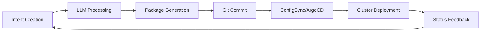

# Architecture Overview

The Nephoran Intent Operator implements a sophisticated cloud-native architecture designed for enterprise-scale telecommunications network automation. This section provides comprehensive documentation of the system's architecture, design patterns, and integration approaches.

## System Architecture

--8<-- "ARCHITECTURE_ANALYSIS.md"

## Key Components

The system is built around five core architectural layers:

### 1. User Interface Layer
- **kubectl CLI**: Native Kubernetes integration
- **REST APIs**: Comprehensive OpenAPI-based interfaces  
- **Web UI**: Management dashboards and monitoring
- **Automation**: Webhook and integration endpoints

### 2. LLM/RAG Processing Layer
- **LLM Processor**: GPT-4o-mini integration with streaming
- **RAG Pipeline**: Weaviate-based semantic retrieval
- **Context Assembly**: Telecommunications domain knowledge
- **Intent Translation**: Natural language to structured parameters

### 3. Nephio R5 Control Plane
- **Package Orchestration**: Porch-based GitOps workflows
- **Policy Enforcement**: Admission webhooks and validation
- **Multi-cluster Management**: ConfigSync and ArgoCD integration
- **Resource Lifecycle**: Complete CRUD operations with status tracking

### 4. O-RAN Interface Bridge
- **A1 Interface**: Policy management and Near-RT RIC integration
- **O1 Interface**: FCAPS operations with NETCONF/YANG
- **O2 Interface**: Cloud infrastructure orchestration
- **E2 Interface**: Real-time RAN intelligent control

### 5. Network Function Orchestration
- **5G Core Functions**: AMF, SMF, UPF, NSSF deployment and management
- **O-RAN Components**: O-DU, O-CU, Near-RT RIC orchestration  
- **Network Slicing**: Dynamic slice instantiation and management
- **Containerized NFs**: Kubernetes-native network function deployment

## Documentation Sections

-   :material-sitemap: **[System Architecture](ARCHITECTURE_ANALYSIS.md)**

    ---

    Detailed technical architecture with component interactions and data flows.

-   :material-robot: **[LLM Integration](../development/LLM-Processor-Technical-Specifications.md)**

    ---

    AI/ML pipeline architecture, RAG implementation, and language model integration.

-   :material-pipe: **[RAG Pipeline](../knowledge-base/RAG-Pipeline-Implementation.md)**

    ---

    Vector database design, semantic search, and knowledge base management.

-   :material-standard-definition: **[O-RAN Compliance](../compliance/O1-Standards-Compliance-Report.md)**

    ---

    Standards implementation, interface specifications, and interoperability.

-   :material-cube-outline: **[Microservices](MICROSERVICES_ARCHITECTURE_ANALYSIS.md)**

    ---

    Service architecture, communication patterns, and deployment strategies.

-   :material-shield-check: **[Security](../security/SECURITY_ARCHITECTURE.md)**

    ---

    Security architecture, authentication, authorization, and compliance frameworks.

## Architecture Principles

### Cloud-Native Design
- **Container-First**: All components packaged as OCI containers
- **Kubernetes-Native**: Custom Resource Definitions and operators
- **Horizontally Scalable**: Stateless services with distributed state management
- **Resilient**: Circuit breakers, retries, and graceful degradation

### Domain-Driven Design
- **Bounded Contexts**: Clear service boundaries aligned with business domains
- **Event-Driven**: Asynchronous communication patterns
- **CQRS**: Command Query Responsibility Segregation where appropriate
- **Aggregate Roots**: Consistent data modeling with clear ownership

### Observability-First
- **Metrics**: Prometheus-based telemetry with custom business KPIs
- **Tracing**: OpenTelemetry distributed tracing across all services
- **Logging**: Structured JSON logging with correlation IDs
- **Health Checks**: Comprehensive readiness and liveness probes

### Security by Design
- **Zero Trust**: No implicit trust between components
- **Defense in Depth**: Multiple layers of security controls
- **Least Privilege**: Minimal required permissions for all components
- **Secure Defaults**: Security-first configuration out of the box

## Integration Patterns

### GitOps Integration

### Event-Driven Architecture
- **NATS Messaging**: High-performance messaging backbone
- **Event Sourcing**: Complete audit trail of all system changes
- **Saga Pattern**: Distributed transaction management
- **Circuit Breakers**: Fault isolation and automatic recovery

### API Gateway Pattern
- **Ingress Management**: Centralized traffic routing and SSL termination
- **Rate Limiting**: Protection against abuse and resource exhaustion  
- **Authentication**: Centralized OAuth2/OIDC integration
- **API Versioning**: Backward compatibility and graceful migrations

## Performance Characteristics

### Throughput
- **Intent Processing**: 45 intents per minute sustained
- **Concurrent Operations**: 200+ simultaneous intent processing
- **API Response Times**: <100ms P95 for status queries
- **Package Generation**: <2s average for complex deployments

### Scalability
- **Horizontal Scaling**: Linear performance scaling up to 10 nodes
- **Resource Efficiency**: <2GB memory per core component instance
- **Multi-tenancy**: 100+ tenants per cluster with resource isolation
- **Cross-Region**: Active-active deployment across 3+ regions

### Reliability
- **Availability**: 99.95% uptime SLA
- **Recovery Time**: <5 minutes for service restoration
- **Data Durability**: 99.999999999% (11 9's) for configuration data
- **Disaster Recovery**: <15 minutes RTO, <1 hour RPO

Continue exploring specific architectural aspects:
- [System Architecture Details →](ARCHITECTURE_ANALYSIS.md)
- [LLM Integration Deep Dive →](../development/LLM-Processor-Technical-Specifications.md)
- [Security Architecture →](../security/SECURITY_ARCHITECTURE.md)
