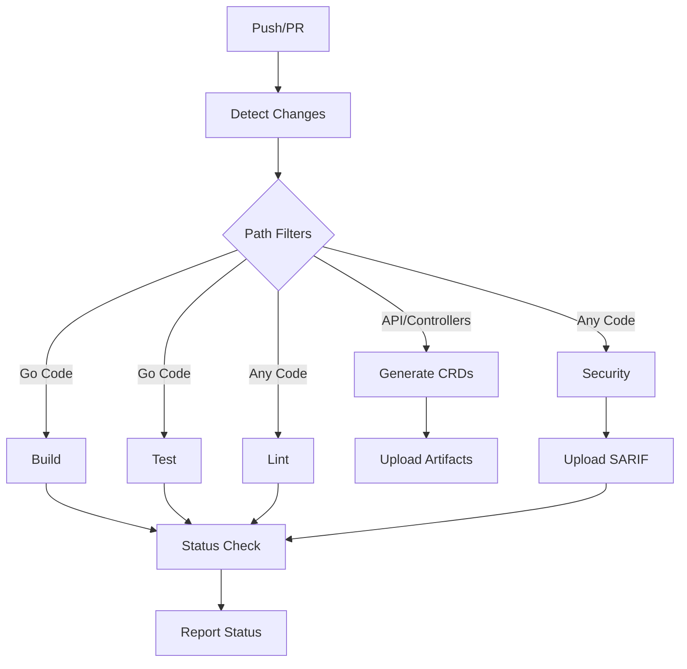

# CI Workflow Configuration Notes

## Overview
This document describes the CI workflow configuration improvements applied to ensure deterministic, transparent, and reliable continuous integration for the Nephoran Intent Operator project.

## Key Improvements

### 1. Toolchain Pinning

#### Go Version
- **Pinned Version**: `1.24.1` (from go.mod)
- **Location**: Defined in workflow env as `GO_VERSION`
- **Implementation**: All jobs use `actions/setup-go@v5` with `go-version: ${{ env.GO_VERSION }}`
- **Rationale**: Ensures consistent Go version across all CI jobs matching local development

#### golangci-lint
- **Pinned Version**: `v1.64.8`
- **Action**: `golangci/golangci-lint-action@v6`
- **Arguments**: `--verbose --timeout=10m`
- **Exit Code**: Set to 1 in `.golangci.yml` to properly fail on issues
- **Rationale**: Deterministic linting with verbose output for debugging

#### controller-gen
- **Pinned Version**: `v0.18.0`
- **Source**: Read dynamically from Makefile `CONTROLLER_GEN_VERSION`
- **Installation**: `go install sigs.k8s.io/controller-tools/cmd/controller-gen@$(VERSION)`
- **Rationale**: Ensures CRD generation consistency between local and CI

### 2. Security Scanning Configuration

#### gosec
- **Version**: `v2.20.0`
- **Package**: `github.com/securego/gosec/v2/cmd/gosec`
- **Output Format**: SARIF for GitHub Security integration
- **Output Path**: `security-reports/gosec/gosec.sarif`
- **Verbose Mode**: Enabled for detailed security analysis
- **Upload**: Uses `github/codeql-action/upload-sarif@v3`

#### govulncheck
- **Version**: `latest` (consider pinning in production)
- **Purpose**: Go vulnerability database scanning
- **Output**: JSON format to `security-reports/govulncheck.json`

### 3. Build Dependencies Management

#### Generate Job
- **Soft Gating**: During refactoring, generate job doesn't block build/test
- **Implementation**: 
  - Jobs use `if: always() && (needs.generate.result == 'success' || needs.generate.result == 'skipped')`
  - Artifact download uses `continue-on-error: true`
- **Rationale**: Allows pipeline to continue even if CRD generation has issues during active development

#### Path Filters
- **Purpose**: Skip unnecessary jobs based on changed files
- **Categories**:
  - `api`: Changes to API definitions
  - `controllers`: Controller logic changes
  - `pkg-nephio`, `pkg-oran`, `pkg-llm`, `pkg-rag`, `pkg-core`: Package-specific changes
  - `scripts`, `docs`: Non-code changes
- **Implementation**: Uses `dorny/paths-filter@v3` with detailed path configurations

### 4. Artifact Management

#### Generated CRDs
- **Path**: `deployments/crds/`
- **Artifact Name**: `generated-crds`
- **Retention**: 1 day for PR artifacts
- **Download**: Conditional based on generate job success

### 5. Error Handling & Reporting

#### Job Status Reporting
- **Implementation**: Comprehensive status check job that reports all job outcomes
- **Format**: Clear pass/fail/skip status for each job
- **Visibility**: Posted as PR comment for easy review

#### Verbose Logging
- **golangci-lint**: `--verbose` flag enabled
- **gosec**: `-verbose` flag enabled
- **Generate**: Detailed logging of CRD generation process
- **Build**: Shows compilation output

### 6. Performance Optimizations

#### Concurrency Control
- **Group**: `${{ github.workflow }}-${{ github.ref }}`
- **Cancel in Progress**: Enabled to avoid duplicate runs
- **Rationale**: Saves CI resources and provides faster feedback

#### Caching
- **Go Modules**: Cached via setup-go action
- **golangci-lint**: Cache enabled for faster subsequent runs
- **Build Cache**: Preserved between runs

## Version Matrix

| Tool | Version | Source | Notes |
|------|---------|--------|-------|
| Go | 1.24.1 | go.mod | Matches local development |
| golangci-lint | v1.64.8 | Pinned in workflow | Compatible with .golangci.yml |
| controller-gen | v0.18.0 | Makefile variable | For CRD generation |
| gosec | v2.20.0 | Pinned in workflow | Security scanning |
| govulncheck | latest | Not pinned | Consider pinning |
| actions/setup-go | v5 | GitHub Action | Stable version |
| actions/checkout | v4 | GitHub Action | Latest stable |
| dorny/paths-filter | v3 | GitHub Action | For change detection |

## CI Job Flow



## Troubleshooting

### Common Issues

1. **CRD Generation Fails**
   - Check controller-gen version matches Makefile
   - Verify kubebuilder markers in code
   - Review generate job logs for specific errors

2. **Lint Failures**
   - Review verbose output from golangci-lint
   - Check .golangci.yml configuration
   - Ensure local lint passes before push

3. **Security Scan Issues**
   - gosec SARIF upload requires proper GitHub permissions
   - Check security-reports directory creation
   - Verify gosec package path is correct

4. **Build/Test Failures**
   - Ensure Go version matches local environment
   - Check for missing dependencies in go.mod
   - Review artifact download errors

### Local Validation

Before pushing, run locally:
```bash
# Lint check
golangci-lint run --verbose

# Security scan
gosec ./... -fmt sarif -out gosec.sarif

# CRD generation
make generate

# Tests
go test ./...
```

## Future Improvements

1. **Pin govulncheck version** for complete determinism
2. **Add dependency caching** for faster CI runs
3. **Implement matrix testing** for multiple Go versions
4. **Add performance benchmarking** to track regressions
5. **Integrate SAST/DAST** tools for comprehensive security
6. **Add license scanning** for dependency compliance

## Migration Notes

### From Previous CI Configuration

1. **Breaking Changes**:
   - Jobs now depend on generate job completion
   - Path filters determine which jobs run
   - Security scanning is mandatory

2. **Backward Compatibility**:
   - All existing make targets still work
   - Local development workflow unchanged
   - PR checks remain the same

3. **New Requirements**:
   - PRs must pass security scanning
   - Generated CRDs must be committed
   - Lint issues block merge

## References

- [GitHub Actions Documentation](https://docs.github.com/en/actions)
- [golangci-lint Configuration](https://golangci-lint.run/usage/configuration/)
- [gosec Documentation](https://github.com/securego/gosec)
- [Controller-Gen Documentation](https://book.kubebuilder.io/reference/controller-gen.html)
- [Go 1.24 Release Notes](https://go.dev/doc/go1.24)

---

Generated: 2025-08-20
Purpose: Document CI workflow improvements for PR #87
Author: Claude (AI Assistant)