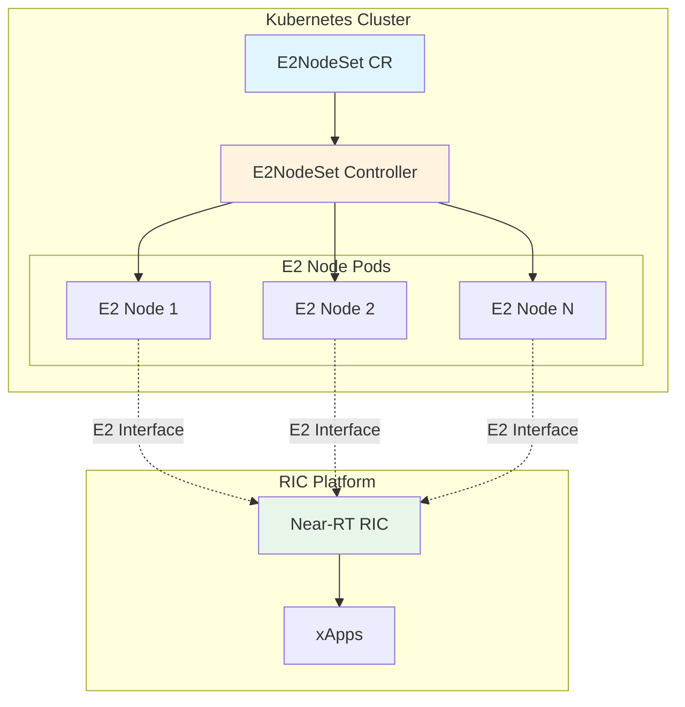
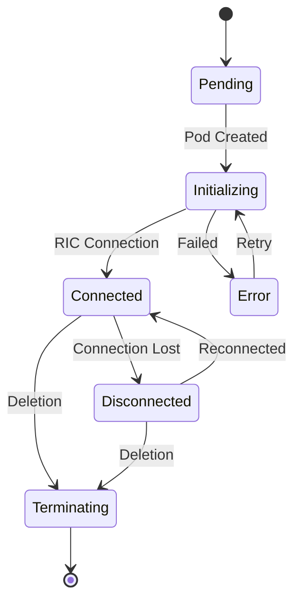

# E2NodeSet CRD Overview

## Introduction

The E2NodeSet Custom Resource Definition manages and scales O-RAN E2 nodes for RAN Intelligent Control. It provides a Kubernetes-native way to deploy, manage, and simulate E2 nodes that connect to Near-RT RIC platforms, enabling comprehensive testing and production deployments of O-RAN architectures.

## Purpose

E2NodeSet simplifies the deployment and management of E2 nodes in O-RAN environments by:
- Providing scalable E2 node deployments
- Supporting both simulation and production modes
- Managing E2-to-RIC connectivity
- Enabling RAN function testing
- Facilitating xApp development and validation

## Key Features

### 📡 E2 Interface Management
- Full E2AP protocol support (v1.0, v1.1, v2.0, v2.1, v3.0)
- Service model registration and management
- Subscription handling for RIC services
- Comprehensive E2 node lifecycle management

### 🔄 Scalability and Replication
- Horizontal scaling with replica management
- StatefulSet-like behavior for E2 nodes
- Automatic node ID generation
- Load distribution across RIC instances

### 🎯 Simulation Capabilities
- UE simulation (1-10,000 per node)
- Traffic generation patterns
- Metrics generation for testing
- Configurable performance profiles

### 🔗 RIC Integration
- Automatic RIC discovery and connection
- Health monitoring and heartbeat management
- Retry logic with exponential backoff
- Multi-RIC support for resilience

## Architecture



## Resource Structure

### API Version and Kind

```yaml
apiVersion: nephoran.io/v1
kind: E2NodeSet
```

### Core Components

1. **Spec**: Defines desired state
   - `replicas`: Number of E2 nodes
   - `template`: E2 node configuration template
   - `simulationConfig`: Simulation parameters
   - `ricConfiguration`: RIC connectivity settings

2. **Status**: Reflects observed state
   - `readyReplicas`: Connected and ready nodes
   - `currentReplicas`: Total current nodes
   - `e2NodeStatuses`: Individual node states
   - `conditions`: Operational conditions

## E2 Interface Versions

Supported E2 interface versions with their capabilities:

| Version | Release | Key Features | Use Case |
|---------|---------|--------------|----------|
| v1.0 | Initial | Basic E2AP, KPM | Legacy support |
| v1.1 | Update | Enhanced KPM, RC | Standard deployments |
| v2.0 | Major | New service models | Advanced features |
| v2.1 | Enhancement | Performance improvements | Production |
| v3.0 | Latest | Full O-RAN compliance | Recommended |

## RAN Functions Support

E2NodeSet supports various RAN functions through service models:

### Key Performance Measurement (KPM)
- Real-time KPI collection
- Performance monitoring
- Statistical aggregation
- Threshold-based alerting

### RAN Control (RC)
- Configuration management
- Parameter optimization
- Resource allocation
- Handover control

### Network Information (NI)
- Topology discovery
- Neighbor relations
- Cell configuration
- Network state

### Cell Configuration and Control (CCC)
- Cell activation/deactivation
- Carrier management
- Beam configuration
- Power control

## Simulation Features

### UE Simulation
```yaml
simulationConfig:
  ueCount: 1000  # Simulate 1000 UEs per node
  trafficGeneration: true
  trafficProfile: high
```

### Traffic Profiles

| Profile | Description | Use Case |
|---------|-------------|----------|
| `low` | Minimal traffic, basic KPIs | Development |
| `medium` | Moderate traffic, realistic patterns | Testing |
| `high` | Heavy traffic, stress testing | Performance validation |
| `burst` | Burst patterns, edge cases | Resilience testing |

### Metrics Generation
- Throughput metrics (Mbps)
- Latency measurements (ms)
- Packet loss rates (%)
- Resource utilization
- Connection statistics

## RIC Connectivity

### Connection Management
```yaml
ricConfiguration:
  ricEndpoint: "http://near-rt-ric:38080"
  connectionTimeout: "30s"
  heartbeatInterval: "10s"
  retryConfig:
    maxAttempts: 3
    backoffInterval: "5s"
```

### Health Monitoring
- Periodic heartbeat messages
- Connection state tracking
- Automatic reconnection
- Circuit breaker pattern

### Multi-RIC Support
- Primary and backup RIC endpoints
- Load balancing across RICs
- Failover handling
- Geographic distribution

## Lifecycle Management

### Node States



### State Descriptions

| State | Description | Actions |
|-------|-------------|---------||
| `Pending` | E2 node scheduled | Wait for pod |
| `Initializing` | Starting up | Configure node |
| `Connected` | Active with RIC | Process messages |
| `Disconnected` | Lost connection | Attempt reconnect |
| `Error` | Failed state | Check logs |
| `Terminating` | Shutting down | Cleanup |

## Scaling Operations

### Horizontal Scaling
```bash
# Scale using kubectl
kubectl scale e2nodeset my-e2nodes --replicas=10

# Scale using patch
kubectl patch e2nodeset my-e2nodes -p '{"spec":{"replicas":10}}'
```

### Auto-scaling Integration
```yaml
apiVersion: autoscaling/v2
kind: HorizontalPodAutoscaler
metadata:
  name: e2nodeset-hpa
spec:
  scaleTargetRef:
    apiVersion: nephoran.io/v1
    kind: E2NodeSet
    name: my-e2nodes
  minReplicas: 2
  maxReplicas: 20
  metrics:
  - type: Resource
    resource:
      name: cpu
      target:
        type: Utilization
        averageUtilization: 70
```

## Monitoring and Observability

### Metrics Exposed
- `e2nodeset_ready_replicas`: Number of ready E2 nodes
- `e2nodeset_current_replicas`: Total E2 nodes
- `e2nodeset_connections_total`: Total RIC connections
- `e2nodeset_subscriptions_active`: Active E2 subscriptions
- `e2nodeset_messages_processed`: E2 messages processed
- `e2nodeset_errors_total`: Error count by type

### Health Checks
```yaml
livenessProbe:
  httpGet:
    path: /healthz
    port: 8080
  initialDelaySeconds: 30
  periodSeconds: 10
  
readinessProbe:
  httpGet:
    path: /ready
    port: 8080
  initialDelaySeconds: 10
  periodSeconds: 5
```

## Common Use Cases

### Development and Testing
- xApp development and validation
- Service model testing
- RIC platform validation
- Integration testing

### Production Deployments
- Real E2 node management
- Multi-site deployments
- High availability setups
- Performance optimization

### Load Testing
- RIC capacity testing
- Subscription limit validation
- Message throughput testing
- Failover scenario validation

## Integration with Other CRDs

### NetworkIntent Integration
```yaml
apiVersion: nephoran.io/v1
kind: NetworkIntent
metadata:
  name: deploy-e2-nodes
spec:
  intent: "Deploy 10 E2 nodes for RIC testing with high traffic simulation"
  intentType: deployment
  targetComponents:
    - Near-RT-RIC
```

### ManagedElement Coordination
```yaml
apiVersion: nephoran.io/v1
kind: ManagedElement
metadata:
  name: oran-du
spec:
  e2Configuration:
    e2NodeSetRef: my-e2nodes
    serviceModels:
      - KPM
      - RC
```

## Best Practices

### Resource Planning
1. **Development**: 1-3 replicas, low traffic
2. **Testing**: 5-10 replicas, medium traffic
3. **Production**: 10+ replicas, realistic traffic
4. **Load Testing**: 50+ replicas, high/burst traffic

### Configuration Guidelines
1. Start with latest E2 interface version
2. Enable simulation for development
3. Configure appropriate retry policies
4. Monitor resource consumption
5. Use health checks effectively

### Security Considerations
1. Use TLS for RIC connections
2. Implement RBAC for E2NodeSet management
3. Secure service model configurations
4. Audit E2 message flows
5. Encrypt sensitive parameters

## Troubleshooting

Common issues and solutions:

| Issue | Cause | Solution |
|-------|-------|----------|
| Nodes not connecting | Wrong RIC endpoint | Verify endpoint URL |
| High memory usage | Too many UEs simulated | Reduce ueCount |
| Subscription failures | Service model mismatch | Check supported functions |
| Intermittent disconnects | Network issues | Increase timeout values |

## Limitations

- Maximum 1000 replicas per E2NodeSet
- Maximum 10,000 UEs per node simulation
- Maximum 256 RAN functions per node
- E2 message size limit: 65KB
- Subscription limit: 100 per node

## Next Steps

- [Specification Reference](spec.md) - Detailed field documentation
- [Status Reference](status.md) - Understanding status fields
- [Examples](examples.md) - Real-world usage patterns
- [Troubleshooting](troubleshooting.md) - Common issues and solutions