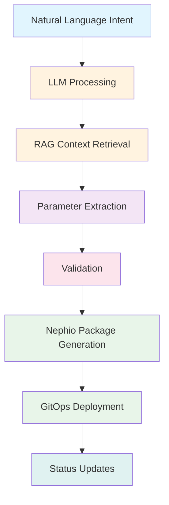

# NetworkIntent CRD Overview

## Introduction

The NetworkIntent Custom Resource Definition (CRD) is the core resource of the Nephoran Intent Operator, enabling declarative network operations through natural language intents. It bridges the gap between high-level business requirements and complex telecommunications network configurations.

## Purpose

NetworkIntent transforms human-readable intents into concrete network function deployments, scaling operations, and optimizations. It leverages AI/ML processing to understand context and generate appropriate configurations for O-RAN and 5G Core network functions.

## Key Features

### 🤖 Natural Language Processing
- Express network operations in plain English
- Context-aware understanding with telecommunications domain knowledge
- Automatic parameter extraction and validation
- Multi-intent support for complex operations

### 🌐 Network Function Support
- **5G Core Functions**: AMF, SMF, UPF, NRF, AUSF, UDM, PCF, NSSF, NEF, and more
- **O-RAN Components**: O-DU, O-CU, Near-RT RIC, Non-RT RIC, xApps, rApps
- **Network Slicing**: E2E slice orchestration with QoS differentiation
- **Multi-vendor**: Standards-based approach for vendor independence

### ⚡ Processing Pipeline



## Resource Structure

### API Version and Kind

```yaml
apiVersion: nephoran.io/v1
kind: NetworkIntent
```

### Core Components

1. **Spec**: Defines the desired state
   - `intent`: Natural language description
   - `intentType`: Category of operation
   - `priority`: Processing priority
   - `targetComponents`: Network functions involved
   - `resourceConstraints`: Resource requirements

2. **Status**: Reflects the observed state
   - `phase`: Current processing phase
   - `conditions`: Detailed status conditions
   - `deployedComponents`: Successfully deployed functions
   - Processing and deployment timestamps

## Intent Types

NetworkIntent supports four primary operation types:

### Deployment
Deploy new network functions or services
```yaml
intentType: deployment
```
Examples:
- "Deploy a high-availability AMF in production"
- "Create a new network slice for IoT services"
- "Install Near-RT RIC with xApp support"

### Scaling
Adjust capacity of existing deployments
```yaml
intentType: scaling
```
Examples:
- "Scale UPF to handle 10000 sessions"
- "Increase SMF replicas to 5"
- "Auto-scale based on CPU utilization"

### Optimization
Improve performance or efficiency
```yaml
intentType: optimization
```
Examples:
- "Optimize latency for URLLC slice"
- "Reduce resource consumption by 20%"
- "Balance load across O-DU instances"

### Maintenance
Perform updates and maintenance tasks
```yaml
intentType: maintenance
```
Examples:
- "Update AMF to latest version"
- "Apply security patches to all components"
- "Perform rolling restart of UPF pods"

## Processing Workflow

### 1. Intent Submission
User creates NetworkIntent resource with natural language description

### 2. Validation
- Schema validation
- Telecommunications keyword verification
- Resource constraint checking
- Priority validation

### 3. LLM Processing
- Intent parsing and understanding
- Context retrieval from knowledge base
- Parameter extraction
- Structured output generation

### 4. Package Generation
- Nephio package creation
- KRM function configuration
- Policy attachment
- Dependency resolution

### 5. Deployment
- GitOps commit to repository
- ArgoCD/ConfigSync synchronization
- Multi-cluster deployment
- Status monitoring

### 6. Reconciliation
- Continuous status updates
- Error handling and retry
- Drift detection
- Compliance verification

## Priority Levels

| Priority | Description | Use Case | Processing Order |
|----------|-------------|----------|------------------|
| `critical` | Emergency operations | System failures, security incidents | Immediate |
| `high` | Expedited processing | Production deployments | Within 1 minute |
| `medium` | Standard operations | Regular deployments | Within 5 minutes |
| `low` | Batch processing | Non-urgent tasks | Best effort |

## Target Components

NetworkIntent can target multiple component types simultaneously:

### 5G Core Network Functions
- **Control Plane**: AMF, SMF, NRF, AUSF, UDM, PCF, NSSF
- **User Plane**: UPF, N3IWF, TNGF, TWIF
- **Data Management**: UDR, UDSF, BSF
- **Analytics**: NWDAF, CHF
- **Security**: SEPP, SCP

### O-RAN Components
- **RAN Units**: O-DU, O-CU-CP, O-CU-UP, O-eNB
- **RIC Platform**: Near-RT RIC, Non-RT RIC
- **Applications**: xApps, rApps
- **Management**: SMO

## Resource Management

### Resource Constraints
Define resource requirements and limits:

```yaml
resourceConstraints:
  cpu: "2"           # 2 CPU cores
  memory: "4Gi"      # 4 GiB memory
  storage: "10Gi"    # 10 GiB storage
  maxCpu: "4"        # Maximum 4 CPU cores
  maxMemory: "8Gi"   # Maximum 8 GiB memory
```

### Automatic Resource Optimization
- Right-sizing based on workload
- Vertical and horizontal scaling
- Resource pooling and sharing
- Cost optimization strategies

## Multi-Cluster Support

### Cluster Selection
```yaml
targetCluster: "edge-cluster-1"
targetNamespace: "5g-core"
region: "us-west-2"
```

### Deployment Strategies
- Single cluster deployment
- Multi-cluster replication
- Geo-distributed deployment
- Edge computing scenarios

## Network Slicing

### Slice Identification
```yaml
networkSlice: "001122-334455"  # S-NSSAI format
```

### Slice Types
- **eMBB**: Enhanced Mobile Broadband
- **URLLC**: Ultra-Reliable Low-Latency Communication
- **mMTC**: Massive Machine-Type Communications
- **Custom**: Application-specific slices

## Integration Points

### Nephio Integration
- Package orchestration via Porch
- KRM function execution
- ConfigSync deployment
- Policy management

### O-RAN Interfaces
- **A1**: Policy management
- **O1**: FCAPS operations
- **O2**: Cloud infrastructure
- **E2**: RAN control

### Observability
- Prometheus metrics
- Grafana dashboards
- Jaeger tracing
- Custom alerts

## Status Phases

| Phase | Description | Next Actions |
|-------|-------------|-------------|
| `Pending` | Intent created, awaiting processing | Validation |
| `Processing` | LLM/RAG processing active | Parameter extraction |
| `Deploying` | GitOps deployment initiated | Monitor progress |
| `Ready` | Deployment successful | Operational |
| `Failed` | Error occurred | Check conditions |
| `Terminating` | Deletion in progress | Cleanup |

## Best Practices

### Intent Writing
1. **Be Specific**: Include component names and requirements
2. **Use Keywords**: Include telecommunications terminology
3. **Specify Constraints**: Define resource and performance needs
4. **Set Priority**: Choose appropriate priority level

### Resource Planning
1. **Start Small**: Begin with minimal resources
2. **Monitor Usage**: Track actual consumption
3. **Scale Gradually**: Increase resources as needed
4. **Set Limits**: Define maximum boundaries

### Error Handling
1. **Check Conditions**: Review status conditions
2. **Validate Intent**: Ensure proper keywords
3. **Verify Resources**: Check cluster capacity
4. **Review Logs**: Examine controller logs

## Common Use Cases

### Production Deployment
```yaml
apiVersion: nephoran.io/v1
kind: NetworkIntent
metadata:
  name: prod-5g-core
spec:
  intent: "Deploy production 5G core with AMF, SMF, and UPF for 10000 subscribers"
  intentType: deployment
  priority: high
  targetComponents:
    - AMF
    - SMF
    - UPF
  resourceConstraints:
    cpu: "8"
    memory: "16Gi"
  targetNamespace: "5g-core-prod"
```

### Auto-Scaling Configuration
```yaml
apiVersion: nephoran.io/v1
kind: NetworkIntent
metadata:
  name: autoscale-upf
spec:
  intent: "Configure auto-scaling for UPF based on session count with min 2 and max 10 replicas"
  intentType: scaling
  priority: medium
  targetComponents:
    - UPF
```

### Network Slice Creation
```yaml
apiVersion: nephoran.io/v1
kind: NetworkIntent
metadata:
  name: urllc-slice
spec:
  intent: "Create URLLC network slice with 1ms latency target for autonomous vehicles"
  intentType: deployment
  priority: high
  networkSlice: "000001-000001"
```

## Limitations

- Maximum intent length: 2000 characters
- Maximum 20 target components per intent
- Processing timeout: 3600 seconds
- Maximum 10 retries per intent

## Next Steps

- [Specification Reference](spec.md) - Detailed field documentation
- [Status Reference](spec.md) - Understanding status fields
- [Examples](examples.md) - Real-world usage patterns
- [Troubleshooting](../../../../runbooks/troubleshooting.md) - Common issues and solutions
