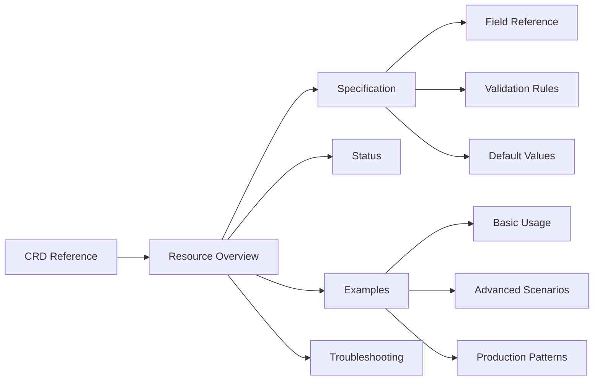

# Nephoran Intent Operator - CRD Reference Documentation

<div align="center">
  
  <h3>Transform Natural Language into Network Operations</h3>
  <p>
    <a href="https://github.com/nephoran/intent-operator/releases"></a>
    <a href="https://kubernetes.io/"></a>
    <a href="https://o-ran.org/"></a>
    <a href="LICENSE"></a>
  </p>
</div>

## Welcome to the CRD Reference

This comprehensive documentation provides detailed information about all Custom Resource Definitions (CRDs) in the Nephoran Intent Operator. Whether you're deploying network functions, managing O-RAN components, or implementing disaster recovery strategies, this reference guide will help you understand and utilize the full capabilities of the platform.

## Available Custom Resources

### Core Resources

<div class="grid cards" markdown>

- :material-network: **[NetworkIntent](crds/networkintent/overview.md)**
  
    Transform natural language intents into deployed network functions. The primary CRD for expressing desired network operations.
    
    ```yaml
    apiVersion: nephoran.io/v1
    kind: NetworkIntent
    ```

- :material-radio-tower: **[E2NodeSet](crds/e2nodeset/overview.md)**
  
    Manage and scale O-RAN E2 nodes for RAN intelligent control. Supports simulation and production deployments.
    
    ```yaml
    apiVersion: nephoran.io/v1
    kind: E2NodeSet
    ```

- :material-server-network: **[ManagedElement](crds/e2nodeset/overview.md)**
  
    Configure O-RAN managed elements with O1, A1, and E2 interfaces for comprehensive network function management.
    
    ```yaml
    apiVersion: nephoran.io/v1
    kind: ManagedElement
    ```

</div>

### Disaster Recovery Resources

<div class="grid cards" markdown>

- :material-shield-check: **[DisasterRecoveryPlan](../../runbooks/disaster-recovery.md)**
  
    Define comprehensive disaster recovery strategies with automated failover and recovery procedures.
    
    ```yaml
    apiVersion: nephoran.io/v1
    kind: DisasterRecoveryPlan
    ```

- :material-backup-restore: **[BackupPolicy](../../operations/BACKUP-RECOVERY.md)**
  
    Automate backup operations with retention policies, encryption, and validation.
    
    ```yaml
    apiVersion: nephoran.io/v1
    kind: BackupPolicy
    ```

- :material-swap-horizontal: **[FailoverPolicy](../../runbooks/disaster-recovery-runbook.md)**
  
    Configure automatic regional failover with health checking and traffic management.
    
    ```yaml
    apiVersion: nephoran.io/v1
    kind: FailoverPolicy
    ```

</div>

## Quick Start

### Prerequisites

- Kubernetes cluster v1.28+
- kubectl CLI configured
- Nephoran Intent Operator installed
- Appropriate RBAC permissions

### Basic Usage

=== "Deploy a Network Function"

    ```yaml
    apiVersion: nephoran.io/v1
    kind: NetworkIntent
    metadata:
      name: deploy-amf
      namespace: nephoran-system
    spec:
      intent: "Deploy a production-ready AMF with high availability"
      intentType: deployment
      priority: high
      targetComponents:
        - AMF
      resourceConstraints:
        cpu: "2"
        memory: "4Gi"
    ```

=== "Scale E2 Nodes"

    ```yaml
    apiVersion: nephoran.io/v1
    kind: E2NodeSet
    metadata:
      name: e2-nodes-prod
      namespace: oran-system
    spec:
      replicas: 10
      template:
        spec:
          nodeID: "e2-node"
          e2InterfaceVersion: "v3.0"
          supportedRANFunctions:
            - functionID: 1
              revision: 1
              description: "KPM Service Model"
              oid: "1.3.6.1.4.1.1.1.2.2"
    ```

=== "Configure Backup"

    ```yaml
    apiVersion: nephoran.io/v1
    kind: BackupPolicy
    metadata:
      name: daily-backup
      namespace: nephoran-system
    spec:
      schedule: "0 2 * * *"
      components:
        - AMF
        - SMF
        - UPF
      storageConfig:
        provider: s3
        location: "s3://backups/nephoran"
      retention:
        dailyBackups: 7
        weeklyBackups: 4
        monthlyBackups: 12
    ```

## Features Overview

### 🤖 AI-Powered Intent Processing
- Natural language understanding with GPT-4o-mini
- Context-aware processing with RAG
- Telecommunications domain optimization
- Multi-language support

### 🌐 O-RAN Compliance
- Full O-RAN interface support (A1, O1, O2, E2)
- Service model compliance
- xApp/rApp orchestration
- Near-RT and Non-RT RIC integration

### 🚀 Production Ready
- High availability configurations
- Auto-scaling support
- Comprehensive monitoring
- Enterprise security features

### 🛡️ Disaster Recovery
- Automated backup strategies
- Multi-region failover
- RTO/RPO optimization
- Data consistency guarantees

## Documentation Structure



## Version Compatibility

| Nephoran Version | Kubernetes | O-RAN Spec | Nephio | Status |
|------------------|------------|------------|--------|--------|
| v1.0.0 | 1.28-1.30 | WG2 v3.0 | R5 | Stable |
| v0.9.0 | 1.27-1.29 | WG2 v2.1 | R4 | EOL |
| v0.8.0 | 1.26-1.28 | WG2 v2.0 | R3 | EOL |

## Getting Help

### 📚 Resources
- [Architecture Guide](../../architecture/CONDUCTOR-LOOP-DESIGN.md) - System design and components
- [Operations Guide](../../operations/README.md) - Deployment and management
- [API Reference](../../api/API_REFERENCE.md) - REST and gRPC APIs
- [Examples](crds/networkintent/examples.md) - Real-world usage patterns

### 🤝 Community
- [GitHub Issues](https://github.com/nephoran/intent-operator/issues) - Report bugs and request features
- [Slack Channel](https://nephoran.slack.com) - Real-time discussions
- [Discussion Forum](https://github.com/nephoran/intent-operator/discussions) - Q&A and announcements

### 🔧 Support
- Enterprise support available
- Professional services for deployment
- Training and certification programs

## Contributing

We welcome contributions! See our [Contributing Guide](../../../CONTRIBUTING.md) for:
- Development setup
- Code standards
- Testing requirements
- Documentation guidelines

## License

The Nephoran Intent Operator is licensed under the [Apache License 2.0](https://www.apache.org/licenses/LICENSE-2.0).

---

<div align="center">
  <p>Built with ❤️ by the Nephoran Team</p>
  <p><a href="#top">Back to top</a></p>
</div>
