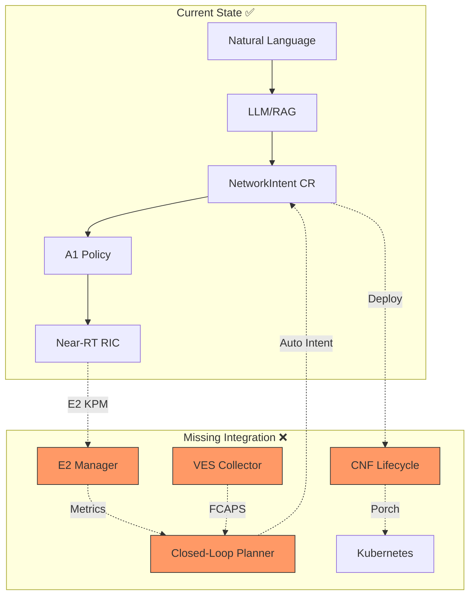
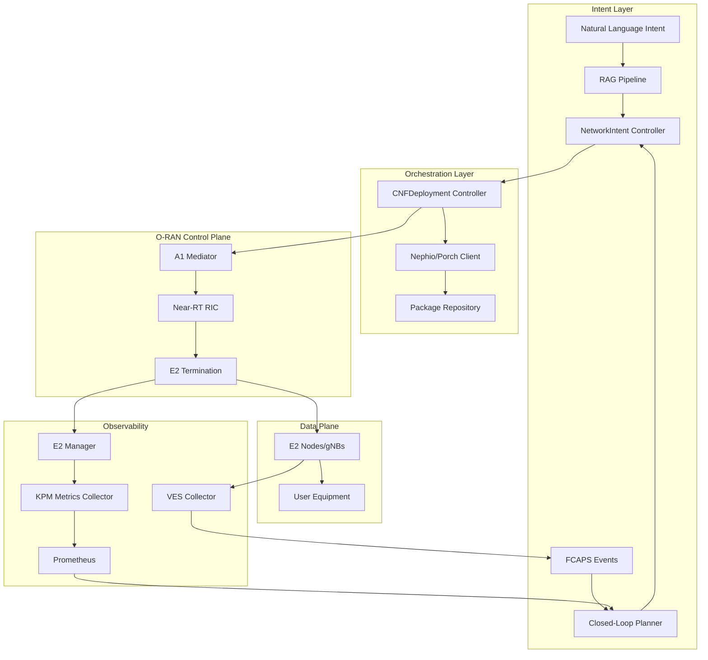

# O-RAN Network Function Integration Design

**Document Version:** 1.0
**Date:** 2026-02-16
**Status:** Design Phase
**Owner:** Backend Architect

## Executive Summary

This document outlines the design and implementation plan for integrating O-RAN network function lifecycle management into the Nephoran Intent Operator. The integration will enable the operator to manage actual CNF deployments (beyond A1 policies), integrate with Near-RT RIC components, collect E2 KPM metrics, and implement FCAPS-driven closed-loop automation.

**Current State:** Intent Operator with A1 policy integration, RAG pipeline, and basic scaling operations.

**Target State:** Full O-RAN network function orchestration with CNF lifecycle management, E2 interface integration, and closed-loop automation.

---

## 1. Current State Analysis

### 1.1 Existing Components

#### ✅ Implemented
- **NetworkIntent CRD**: Natural language → structured intent
- **A1 Policy Integration**: Policy-based scaling via A1 mediator (`pkg/oran/a1/`)
- **E2NodeSet CRD**: E2 node simulation and management (`api/v1/e2nodeset_types.go`)
- **E2 Manager**: Comprehensive E2 interface management (`pkg/oran/e2/e2_manager.go`)
- **CNFDeployment CRD**: CNF specification types (`api/v1/cnfdeployment_types.go`)
- **FCAPS/VES Schema**: Event structure defined (`docs/contracts/fcaps.ves.examples.json`)
- **E2 KPM Profile**: Metrics contract defined (`docs/contracts/e2.kpm.profile.md`)
- **RAG Pipeline**: Ollama + Weaviate for intent processing
- **Monitoring Stack**: Prometheus + Grafana
- **RIC Deployment**: Near-RT RIC infrastructure (`deployments/ric/`)

#### ⚠️ Partially Implemented
- **CNFDeployment Controller**: Stub implementation exists but not fully integrated
- **E2 Subscription Management**: Infrastructure exists but no metrics collection
- **Nephio/Porch Integration**: Package generator present but not wired to CNF lifecycle

#### ❌ Missing Components
- **CNF Lifecycle Orchestration**: No actual CNF deployment/scaling workflow
- **E2 KPM Metrics Collection**: E2 subscriptions not connected to closed-loop
- **FCAPS Event Processing**: VES events not triggering NetworkIntent creation
- **RIC Integration**: E2 Manager not connected to actual Near-RT RIC endpoints
- **Closed-Loop Feedback**: No FCAPS → Intent → A1 → CNF workflow

### 1.2 Architecture Gaps



---

## 2. Target Architecture

### 2.1 High-Level Design



### 2.2 Component Interactions

#### Workflow 1: User-Initiated CNF Deployment
```
User Input → RAG → NetworkIntent CR → CNFDeployment Controller → Nephio/Porch → Kubernetes
                                    ↓
                                A1 Policy → Near-RT RIC → E2 Nodes
```

#### Workflow 2: Closed-Loop Auto-Scaling
```
E2 Nodes → E2 KPM Metrics → Prometheus → Planner → NetworkIntent CR (auto-generated)
                                                    ↓
                                              CNFDeployment Controller → Scale CNF
```

#### Workflow 3: FCAPS Event Response
```
E2 Nodes → VES Events → VES Collector → Planner → NetworkIntent CR (remediation)
                                                   ↓
                                             CNFDeployment Controller → Healing/Migration
```

---

## 3. Detailed Component Design

### 3.1 CNF Lifecycle Manager

**New Component:** `pkg/cnf/lifecycle_manager.go`

```go
type CNFLifecycleManager struct {
    client          client.Client
    nephioClient    *nephio.PorchClient
    e2Manager       *e2.E2Manager
    a1Client        *a1.A1Adaptor
    stateStore      *CNFStateStore
}

// Core Operations
func (m *CNFLifecycleManager) Deploy(ctx context.Context, cnf *CNFDeployment) error
func (m *CNFLifecycleManager) Scale(ctx context.Context, name string, replicas int32) error
func (m *CNFLifecycleManager) Update(ctx context.Context, cnf *CNFDeployment) error
func (m *CNFLifecycleManager) Delete(ctx context.Context, name string) error
func (m *CNFLifecycleManager) GetStatus(ctx context.Context, name string) (*CNFStatus, error)
```

**Responsibilities:**
1. Translate CNFDeployment CR to Nephio package
2. Submit package to Porch repository
3. Monitor deployment status
4. Configure A1 policies for deployed CNF
5. Setup E2 subscriptions for metrics
6. Handle CNF lifecycle events (scale, update, migrate)

**State Machine:**
```
Pending → Provisioning → Configuring → Active → Scaling/Updating → Active
                                              ↓
                                           Degraded → Healing → Active
                                              ↓
                                          Terminating → Deleted
```

### 3.2 E2 KPM Metrics Collector

**Enhanced Component:** `pkg/oran/e2/kpm_collector.go`

```go
type KPMCollector struct {
    e2Manager       *e2.E2Manager
    metricsRegistry *prometheus.Registry
    subscriptions   map[string]*E2Subscription
    config          *KPMCollectorConfig
}

type KPMMetrics struct {
    P95LatencyMs      float64  // From E2 KPM
    PRBUtilization    float64  // Physical Resource Block usage
    UECount           int32    // Connected UE count
    Throughput        float64  // Mbps
    NodeID            string
    Timestamp         time.Time
}

func (c *KPMCollector) Start(ctx context.Context) error
func (c *KPMCollector) Subscribe(nodeID string, reportingPeriod time.Duration) error
func (c *KPMCollector) GetMetrics(nodeID string) (*KPMMetrics, error)
func (c *KPMCollector) ExportToPrometheus() error
```

**Integration Points:**
- E2 Manager for subscription management
- Prometheus for metrics export
- Closed-Loop Planner for metric consumption

### 3.3 FCAPS Event Processor

**New Component:** `pkg/oran/fcaps/event_processor.go`

```go
type FCAPSEventProcessor struct {
    vesClient       *ves.VESClient
    intentGenerator *IntentGenerator
    eventStore      *EventStore
    rules           []*FCAPSRule
}

type FCAPSRule struct {
    EventDomain     string   // "fault", "measurementsForVfScaling", "thresholdCrossingAlert"
    Severity        string   // "CRITICAL", "MAJOR", "MINOR"
    Condition       string   // CEL expression
    Action          string   // "scale_out", "scale_in", "migrate", "heal"
    IntentTemplate  string   // NetworkIntent template
}

func (p *FCAPSEventProcessor) ProcessEvent(event *VESEvent) error
func (p *FCAPSEventProcessor) GenerateIntent(event *VESEvent, rule *FCAPSRule) (*NetworkIntent, error)
func (p *FCAPSEventProcessor) SubmitIntent(intent *NetworkIntent) error
```

**Example Rules:**
```yaml
- eventDomain: fault
  severity: CRITICAL
  condition: "event.faultFields.alarmCondition == 'LINK_DOWN'"
  action: migrate
  intentTemplate: "Migrate {{ .SourceName }} due to link failure"

- eventDomain: thresholdCrossingAlert
  condition: "event.thresholdCrossingAlertFields.alertValue > 0.9"
  action: scale_out
  intentTemplate: "Scale out {{ .NetworkService }} PRB utilization {{ .AlertValue }}"
```

### 3.4 Nephio/Porch Integration

**Enhanced Component:** `pkg/nephio/porch_client.go`

```go
type PorchClient struct {
    httpClient      *http.Client
    porchURL        string
    repository      string
    credentials     *Credentials
}

type PackageSpec struct {
    Name            string
    Namespace       string
    CNFType         string
    Function        string
    Replicas        int32
    Resources       ResourceRequirements
    Configuration   map[string]interface{}
    Dependencies    []string
}

func (c *PorchClient) CreatePackage(ctx context.Context, spec *PackageSpec) (*Package, error)
func (c *PorchClient) UpdatePackage(ctx context.Context, name string, spec *PackageSpec) error
func (c *PorchClient) DeletePackage(ctx context.Context, name string) error
func (c *PorchClient) GetPackageStatus(ctx context.Context, name string) (*PackageStatus, error)
func (c *PorchClient) ListPackages(ctx context.Context, filter *PackageFilter) ([]*Package, error)
```

**Package Structure:**
```
package/
├── Kptfile                    # Package metadata
├── deployment.yaml            # CNF Deployment manifest
├── service.yaml               # Service definitions
├── configmap.yaml             # Configuration
├── network-attachment-def.yaml # Multi-network interfaces
└── function-config.yaml       # CNF-specific configuration
```

### 3.5 Closed-Loop Planner Enhancement

**Enhanced Component:** `pkg/loop/planner.go`

```go
type ClosedLoopPlanner struct {
    kpmCollector    *KPMCollector
    fcapsProcessor  *FCAPSEventProcessor
    intentClient    client.Client
    rules           []*AutomationRule
    stateTracker    *StateTracker
}

type AutomationRule struct {
    ID              string
    Name            string
    MetricSource    string   // "kpm", "fcaps", "prometheus"
    Condition       string   // CEL expression
    Action          string   // "scale", "heal", "migrate"
    Cooldown        time.Duration
    MinReplicas     int32
    MaxReplicas     int32
    IntentTemplate  string
}

func (p *ClosedLoopPlanner) EvaluateRules(ctx context.Context) ([]*NetworkIntent, error)
func (p *ClosedLoopPlanner) GenerateIntent(rule *AutomationRule, metrics map[string]float64) (*NetworkIntent, error)
func (p *ClosedLoopPlanner) SubmitIntent(intent *NetworkIntent) error
```

---

## 4. API Contracts

### 4.1 CNF Lifecycle API

**Endpoint:** `POST /api/v1/cnf/deploy`
```json
{
  "name": "upf-instance-1",
  "type": "5G-Core",
  "function": "UPF",
  "replicas": 3,
  "resources": {
    "cpu": "4",
    "memory": "8Gi",
    "storage": "50Gi"
  },
  "configuration": {
    "dnn": "internet",
    "ueSubnet": "10.60.0.0/16"
  }
}
```

**Response:**
```json
{
  "deploymentId": "upf-instance-1-abc123",
  "status": "Provisioning",
  "packageRevision": "upf-instance-1-v1",
  "a1PolicyId": "policy-upf-scaling-001",
  "e2Subscriptions": ["sub-kpm-001"]
}
```

### 4.2 E2 KPM Metrics API

**Endpoint:** `GET /api/v1/metrics/e2/kpm/{nodeId}`
```json
{
  "nodeId": "gnb-001",
  "timestamp": "2026-02-16T10:30:00Z",
  "metrics": {
    "kpm.p95_latency_ms": 12.5,
    "kpm.prb_utilization": 0.68,
    "kpm.ue_count": 450
  },
  "subscriptionStatus": "ACTIVE",
  "lastUpdate": "2026-02-16T10:29:30Z"
}
```

### 4.3 FCAPS Event Webhook

**Endpoint:** `POST /api/v1/fcaps/events`
```json
{
  "event": {
    "commonEventHeader": {
      "domain": "thresholdCrossingAlert",
      "eventName": "TCA_PRB_High",
      "sourceName": "gnb-001",
      "priority": "High"
    },
    "thresholdCrossingAlertFields": {
      "alertValue": "0.92",
      "elementType": "RAN",
      "possibleRootCause": "High traffic load"
    }
  }
}
```

---

## 5. Implementation Phases

### Phase 1: CNF Lifecycle Foundation (Week 1-2)
**Goal:** Enable basic CNF deployment via Nephio/Porch

**Tasks:**
1. Implement `CNFLifecycleManager` core operations
2. Create Nephio `PorchClient` with package CRUD
3. Enhance `CNFDeploymentController` to use lifecycle manager
4. Add CNF state persistence
5. Implement deployment status monitoring
6. Create unit tests for lifecycle operations

**Deliverables:**
- CNF deployment working end-to-end
- Package creation in Porch repository
- Status tracking in CNFDeployment CR
- Test coverage >80%

**Acceptance Criteria:**
- Can deploy AMF CNF from NetworkIntent
- Package visible in Porch UI
- Status updates in real-time
- Rollback on deployment failure

### Phase 2: E2 KPM Integration (Week 3)
**Goal:** Collect real-time metrics from E2 nodes

**Tasks:**
1. Implement `KPMCollector` with E2 subscription management
2. Create Prometheus exporter for KPM metrics
3. Connect E2 Manager to actual Near-RT RIC endpoint
4. Implement metric aggregation and windowing
5. Add KPM metrics to Grafana dashboards
6. Create integration tests with E2 simulator

**Deliverables:**
- KPM metrics flowing to Prometheus
- E2 subscriptions automatically created for deployed CNFs
- Real-time dashboards showing RAN metrics
- E2 integration tests passing

**Acceptance Criteria:**
- Metrics collected within 30s window (per contract)
- No data loss during RIC restarts
- Subscription recovery after connection failure
- Metrics aligned with `docs/contracts/e2.kpm.profile.md`

### Phase 3: FCAPS Event Processing (Week 4)
**Goal:** React to FCAPS events automatically

**Tasks:**
1. Implement `FCAPSEventProcessor` with rule engine
2. Create VES collector webhook integration
3. Implement intent generation from events
4. Add event persistence and deduplication
5. Create FCAPS rule configuration CRD
6. Implement event-to-intent mapping

**Deliverables:**
- FCAPS events triggering NetworkIntents
- Configurable rule engine
- Event history and audit trail
- Integration with VES collector

**Acceptance Criteria:**
- Critical faults trigger remediation intents within 10s
- No duplicate intents for same event
- Event correlation working (burst suppression)
- Rule updates without operator restart

### Phase 4: Closed-Loop Automation (Week 5)
**Goal:** Complete automated scaling loop

**Tasks:**
1. Enhance `ClosedLoopPlanner` with KPM integration
2. Implement auto-intent generation from metrics
3. Add cooldown and hysteresis logic
4. Create automation rule CRD
5. Implement state tracking and reconciliation
6. Add comprehensive monitoring

**Deliverables:**
- Full closed-loop: Metrics → Intent → CNF Scale
- Configurable automation rules
- State persistence across restarts
- Performance metrics

**Acceptance Criteria:**
- Scale-out triggered within 90s of threshold breach
- No oscillation (cooldown working)
- State survives operator restart
- <5s processing latency for intent generation

### Phase 5: Integration & Testing (Week 6)
**Goal:** End-to-end validation and documentation

**Tasks:**
1. Create E2E test scenarios (10+ workflows)
2. Implement chaos testing (RIC failure, network partition)
3. Performance benchmarking (100+ CNFs)
4. Security audit (RBAC, mTLS, secrets)
5. Create operational runbooks
6. Write user documentation

**Deliverables:**
- E2E test suite (100% scenario coverage)
- Performance test results
- Security audit report
- Complete documentation

**Acceptance Criteria:**
- All E2E tests passing
- <1% error rate under load
- Zero critical security findings
- Documentation reviewed and approved

---

## 6. Risk Assessment

### 6.1 Technical Risks

| Risk | Impact | Probability | Mitigation |
|------|--------|-------------|------------|
| Porch API instability | High | Medium | Version pinning, adapter pattern |
| E2 interface complexity | High | High | Incremental integration, simulation mode |
| State synchronization | Medium | Medium | Event sourcing, conflict resolution |
| Metrics collection overhead | Medium | Low | Sampling, aggregation, caching |
| RIC integration failures | High | Medium | Circuit breaker, retry, fallback |

### 6.2 Operational Risks

| Risk | Impact | Probability | Mitigation |
|------|--------|-------------|------------|
| CNF deployment failures | High | Medium | Rollback automation, health checks |
| Runaway scaling | Critical | Low | Rate limiting, max replica bounds |
| Intent conflict | Medium | Medium | Priority queuing, conflict resolution |
| Observability gaps | Medium | Low | Comprehensive logging, tracing |

---

## 7. Testing Strategy

### 7.1 Unit Tests
- CNF lifecycle operations
- E2 subscription management
- FCAPS event parsing
- Intent generation logic
- Rule evaluation engine

**Coverage Target:** >85%

### 7.2 Integration Tests
- CNF → Porch → K8s deployment flow
- E2 → KPM → Prometheus metrics
- VES → FCAPS → Intent generation
- A1 → RIC policy enforcement

**Test Environments:**
- Simulated RIC (E2 simulator)
- Local Kubernetes (kind/k3s)
- Mocked external services

### 7.3 End-to-End Tests

**Scenario 1: User-Initiated Deployment**
```
Given: User submits "Deploy AMF with 3 replicas"
When: NetworkIntent created
Then: CNF deployed, A1 policy active, E2 subscription created
```

**Scenario 2: Auto-Scaling**
```
Given: UPF deployed with PRB threshold at 0.8
When: PRB utilization reaches 0.85
Then: Scale-out intent generated, replica count increased
```

**Scenario 3: Fault Recovery**
```
Given: gNB reports LINK_DOWN fault
When: VES event received
Then: Migration intent created, CNF moved to healthy node
```

### 7.4 Performance Tests
- 100 concurrent CNF deployments
- 1000 E2 subscriptions
- 10k FCAPS events/minute
- Intent processing latency <1s

---

## 8. Dependencies

### 8.1 External Components

| Component | Version | Purpose | Status |
|-----------|---------|---------|--------|
| Nephio Porch | R3+ | Package management | ✅ Deployed |
| Near-RT RIC | O-RAN SC E Release | E2 termination | ✅ Deployed |
| A1 Mediator | v2.7+ | Policy interface | ✅ Integrated |
| VES Collector | 7.3+ | FCAPS events | ⚠️ Needs config |
| Prometheus | v2.45+ | Metrics storage | ✅ Deployed |
| Weaviate | v1.24+ | RAG database | ✅ Deployed |

### 8.2 Internal Dependencies

| Module | Owner | Status |
|--------|-------|--------|
| NetworkIntent CRD | Core team | ✅ Complete |
| E2NodeSet CRD | RAN team | ✅ Complete |
| CNFDeployment CRD | Core team | ⚠️ Needs enhancement |
| E2 Manager | RAN team | ✅ Complete |
| RAG Pipeline | AI team | ✅ Complete |

---

## 9. Observability

### 9.1 Metrics

**CNF Lifecycle Metrics:**
- `cnf_deployments_total{status="success|failure"}`
- `cnf_deployment_duration_seconds`
- `cnf_scaling_operations_total{direction="out|in"}`
- `cnf_active_count{type="5G-Core|O-RAN"}`

**E2 Integration Metrics:**
- `e2_subscriptions_total{status="active|failed"}`
- `e2_kpm_latency_ms{node_id}`
- `e2_kpm_prb_utilization{node_id}`
- `e2_messages_received_total{type}`

**FCAPS Processing Metrics:**
- `fcaps_events_received_total{domain}`
- `fcaps_intents_generated_total{action}`
- `fcaps_processing_latency_seconds`

### 9.2 Logging

**Structured Logging Fields:**
```json
{
  "component": "cnf-lifecycle-manager",
  "operation": "deploy",
  "cnf_name": "upf-instance-1",
  "namespace": "telecom-core",
  "duration_ms": 3500,
  "status": "success",
  "trace_id": "abc123...",
  "correlation_id": "intent-456"
}
```

### 9.3 Distributed Tracing

**Trace Spans:**
```
NetworkIntent Creation
├─ LLM Processing
├─ CNF Lifecycle Deploy
│  ├─ Nephio Package Create
│  ├─ Porch Submission
│  ├─ A1 Policy Setup
│  └─ E2 Subscription Create
└─ Status Update
```

---

## 10. Security Considerations

### 10.1 Authentication & Authorization
- mTLS for all inter-component communication
- RBAC for CNF deployment permissions
- Service accounts with least privilege
- Webhook authentication for FCAPS events

### 10.2 Data Protection
- Secrets management via Kubernetes Secrets / Vault
- Configuration encryption at rest
- TLS 1.3 for all external APIs
- Certificate rotation automation

### 10.3 Audit Trail
- All CNF lifecycle operations logged
- Intent creation audit (user/system initiated)
- Policy enforcement audit (A1)
- Event processing audit (FCAPS)

---

## 11. Documentation Deliverables

### 11.1 Architecture Documentation
- Component interaction diagrams (Mermaid)
- API specifications (OpenAPI 3.0)
- Data flow diagrams
- Sequence diagrams for key workflows

### 11.2 Operational Runbooks
- CNF deployment procedure
- Troubleshooting guide (common errors)
- Disaster recovery procedure
- Monitoring and alerting setup

### 11.3 Developer Guides
- CNF template creation
- Custom automation rule creation
- E2 simulator usage
- Testing with mock components

---

## 12. Success Metrics

### 12.1 Functional Metrics
- ✅ CNF deployment success rate >99%
- ✅ E2 metrics collection reliability >99.9%
- ✅ FCAPS event processing latency <10s
- ✅ Closed-loop response time <90s

### 12.2 Operational Metrics
- ✅ Zero downtime deployments
- ✅ Automated rollback success rate >95%
- ✅ Intent processing throughput >100/min
- ✅ Resource utilization <70% under normal load

### 12.3 Quality Metrics
- ✅ Code coverage >85%
- ✅ E2E test coverage 100% scenarios
- ✅ Zero critical security vulnerabilities
- ✅ Documentation completeness 100%

---

## 13. Appendix

### 13.1 Glossary

- **CNF**: Cloud Native Network Function
- **E2**: Interface between Near-RT RIC and E2 Nodes (RAN)
- **KPM**: Key Performance Measurement (E2 service model)
- **FCAPS**: Fault, Configuration, Accounting, Performance, Security
- **VES**: Virtual Event Streaming
- **A1**: Interface between Non-RT RIC and Near-RT RIC
- **Porch**: Package Orchestration (Nephio component)

### 13.2 References

- O-RAN Alliance WG3: Near-RT RIC Architecture (v06.00)
- O-RAN Alliance WG2: A1 Interface Specification (v05.00)
- O-RAN Alliance WG3: E2 Service Model (KPM v03.00)
- Nephio R5 Documentation
- 3GPP TS 28.532: Management and orchestration; Generic management services
- VES Event Listener 7.3 Specification

### 13.3 Related Documents

- `/docs/contracts/intent.schema.json` - NetworkIntent schema
- `/docs/contracts/a1.policy.schema.json` - A1 policy schema
- `/docs/contracts/e2.kpm.profile.md` - E2 KPM contract
- `/docs/contracts/fcaps.ves.examples.json` - VES event examples
- `/api/v1/cnfdeployment_types.go` - CNFDeployment CRD
- `/api/v1/e2nodeset_types.go` - E2NodeSet CRD

---

**Document Control:**
- **Created:** 2026-02-16
- **Last Updated:** 2026-02-16
- **Review Schedule:** Weekly during implementation
- **Approval Required:** Architecture Review Board
