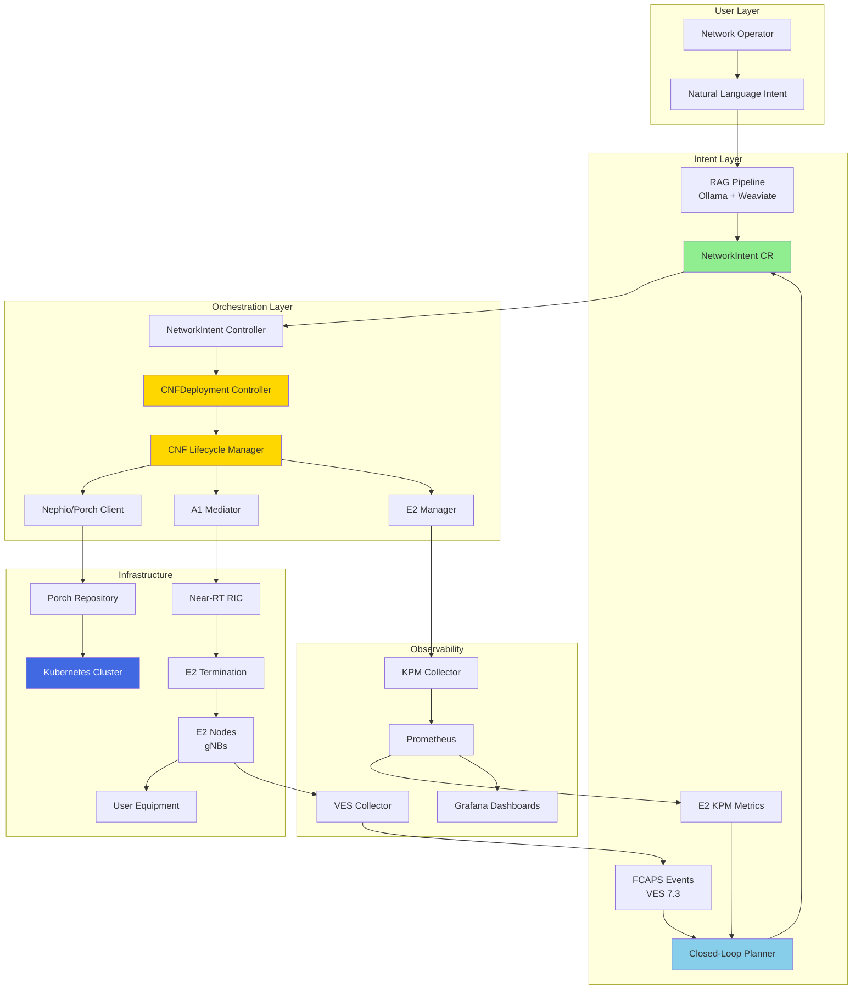

# O-RAN Network Function Integration - Executive Summary

**Date:** 2026-02-16
**Document Type:** Design Summary
**Target Audience:** Stakeholders, Engineering Leadership

---

## Overview

This design enables the Nephoran Intent Operator to orchestrate **actual O-RAN network function lifecycles**, transforming it from a policy-only system to a complete CNF orchestration platform with closed-loop automation.

### What Changes

**Before (Current State):**
```
Natural Language → LLM → NetworkIntent → A1 Policy → RIC
```

**After (Target State):**
```
Natural Language → LLM → NetworkIntent → CNF Deployment → Kubernetes
                                       ↓
                                    A1 Policy → RIC → E2 Nodes
                                       ↓
                              E2 KPM Metrics → Closed-Loop Planner
                              FCAPS Events   →        ↓
                                              Auto-Generated Intents
```

---

## Key Capabilities

### 1. CNF Lifecycle Management
- **Deploy:** Natural language → actual 5G Core/O-RAN CNF in Kubernetes
- **Scale:** Auto-scaling based on real-time metrics (PRB utilization, latency, UE count)
- **Update:** Zero-downtime updates with rollback
- **Heal:** Automatic remediation from FCAPS fault events

### 2. E2 Interface Integration
- **Real-time Metrics:** p95 latency, PRB utilization, UE count (30s windows)
- **Subscription Management:** Automatic E2 subscriptions for deployed CNFs
- **Near-RT RIC Connection:** Production integration with O-RAN SC RIC

### 3. Closed-Loop Automation
- **Metrics → Scaling:** PRB >85% triggers auto scale-out within 90s
- **Faults → Healing:** Critical faults trigger migration/restart within 10s
- **Configurable Rules:** CEL-based rules via CRDs

### 4. Observability
- **Prometheus Metrics:** CNF deployment, E2 subscriptions, FCAPS events
- **Grafana Dashboards:** RAN metrics, closed-loop health, CNF status
- **Distributed Tracing:** Full workflow from intent to CNF

---

## Architecture Overview



---

## Implementation Roadmap

### Phase 1: CNF Lifecycle Foundation (Weeks 1-2)
**Goal:** Deploy CNFs from NetworkIntents via Nephio/Porch

**Key Deliverables:**
- ✅ CNFLifecycleManager with Deploy/Scale/Update/Delete
- ✅ Nephio PorchClient (package CRUD)
- ✅ Enhanced CNFDeployment Controller
- ✅ State persistence and status monitoring

**Success Criteria:** Deploy AMF CNF from "Deploy a high-availability AMF" intent

---

### Phase 2: E2 KPM Integration (Week 3)
**Goal:** Collect real-time metrics from E2 nodes

**Key Deliverables:**
- ✅ KPMCollector with E2 subscription management
- ✅ Prometheus exporter for KPM metrics
- ✅ E2 Manager connected to actual Near-RT RIC
- ✅ Grafana dashboard for RAN metrics

**Success Criteria:** KPM metrics (p95 latency, PRB util, UE count) visible in Grafana within 30s

---

### Phase 3: FCAPS Event Processing (Week 4)
**Goal:** React to FCAPS events automatically

**Key Deliverables:**
- ✅ FCAPSEventProcessor with CEL rule engine
- ✅ VES collector webhook integration
- ✅ FCAPSRule CRD for configurable rules
- ✅ Event persistence and audit trail

**Success Criteria:** Critical fault (LINK_DOWN) triggers migration intent within 10s

---

### Phase 4: Closed-Loop Automation (Week 5)
**Goal:** Complete automated scaling loop

**Key Deliverables:**
- ✅ Enhanced Planner with KPM integration
- ✅ AutomationRule CRD
- ✅ Cooldown/hysteresis logic
- ✅ State persistence and recovery

**Success Criteria:** PRB >85% triggers scale-out within 90s, no oscillation

---

### Phase 5: Integration & Testing (Week 6)
**Goal:** Validation and production readiness

**Key Deliverables:**
- ✅ E2E test suite (10+ scenarios)
- ✅ Chaos testing (RIC failure, network partition)
- ✅ Performance benchmarks (100+ CNFs)
- ✅ Security audit (zero critical vulnerabilities)
- ✅ Operational runbooks

**Success Criteria:** 100% E2E test pass, <1% error rate under load, security approved

---

## Risk Management

### Top 5 Risks

| Risk | Mitigation | Status |
|------|-----------|--------|
| **Porch API instability** | Version pinning, adapter pattern | ✅ Planned |
| **E2 interface complexity** | Incremental integration, simulation mode | ✅ Planned |
| **Runaway scaling** | Rate limiting, max replica bounds | ✅ Designed |
| **RIC integration failures** | Circuit breaker, retry, fallback | ✅ Designed |
| **CNF deployment failures** | Rollback automation, health checks | ✅ Designed |

---

## Success Metrics

### Functional Metrics
- ✅ **CNF deployment success rate:** >99%
- ✅ **E2 metrics collection reliability:** >99.9%
- ✅ **FCAPS event processing latency:** <10s
- ✅ **Closed-loop response time:** <90s

### Operational Metrics
- ✅ **Zero downtime deployments:** 100%
- ✅ **Automated rollback success:** >95%
- ✅ **Intent processing throughput:** >100/min
- ✅ **Resource utilization:** <70% normal load

### Quality Metrics
- ✅ **Code coverage:** >85%
- ✅ **E2E test coverage:** 100% scenarios
- ✅ **Critical security vulnerabilities:** 0
- ✅ **Documentation completeness:** 100%

---

## Resource Requirements

### Team

| Role | Allocation | Duration |
|------|-----------|----------|
| Backend Architect | 80% | 6 weeks |
| Go Developer | 100% | 6 weeks |
| O-RAN Specialist | 50% | Weeks 2-4 |
| QA Engineer | 50% | Week 6 |
| Security Engineer | 25% | Week 6 |

**Total Effort:** 240 hours over 6 weeks

### Infrastructure

| Component | Version | Purpose | Status |
|-----------|---------|---------|--------|
| Nephio Porch | R3+ | Package management | ✅ Deployed |
| Near-RT RIC | O-RAN SC E | E2 termination | ✅ Deployed |
| A1 Mediator | v2.7+ | Policy interface | ✅ Integrated |
| VES Collector | 7.3+ | FCAPS events | ⚠️ Needs config |
| Prometheus | v2.45+ | Metrics storage | ✅ Deployed |
| Kubernetes | v1.31+ | CNF runtime | ✅ Deployed |

---

## Business Value

### Immediate Benefits (Post Phase 1-2)
1. **Reduced Deployment Time:** Manual → Automated CNF deployment (hours → minutes)
2. **Real-time Visibility:** Live RAN metrics in Grafana
3. **Operational Efficiency:** Natural language intent → deployed CNF

### Long-term Benefits (Post Phase 3-5)
1. **Self-Healing Networks:** Automatic fault recovery (<10s)
2. **Dynamic Scaling:** Traffic-responsive auto-scaling (no manual intervention)
3. **Cost Optimization:** Right-sizing based on actual utilization
4. **SLA Improvement:** Proactive remediation before user impact

### Strategic Alignment
- ✅ **O-RAN Compliance:** Implements O-RAN E2, A1 interfaces per spec
- ✅ **Nephio Integration:** First-class Nephio R5 orchestration
- ✅ **Cloud Native:** Kubernetes-native with GitOps workflow
- ✅ **AI-Driven:** LLM-powered intent interpretation with RAG

---

## Next Steps

### Immediate Actions (Week 1)
1. ✅ **Design Review:** Architecture Review Board approval (this document)
2. ✅ **Sprint Planning:** Break down Phase 1 into 2-week sprint
3. ✅ **Environment Setup:** Verify Nephio Porch accessible, test RIC connectivity
4. ⬜ **Kickoff Meeting:** Team alignment on architecture and tasks

### First Sprint Goals (Weeks 1-2)
- ✅ Implement CNFLifecycleManager core operations
- ✅ Create Nephio PorchClient with package CRUD
- ✅ Wire CNFDeployment Controller to lifecycle manager
- ✅ Demo: Deploy AMF CNF from NetworkIntent

---

## Documentation References

### Design Documents
- 📄 **[ORAN_INTEGRATION_PLAN.md](./ORAN_INTEGRATION_PLAN.md)** - Full architecture design (40 pages)
- 📄 **[ORAN_INTEGRATION_TASKS.md](./ORAN_INTEGRATION_TASKS.md)** - Detailed task breakdown (20 tasks)
- 📄 **This Document** - Executive summary

### API Contracts
- 📄 `/docs/contracts/intent.schema.json` - NetworkIntent schema
- 📄 `/docs/contracts/a1.policy.schema.json` - A1 policy schema
- 📄 `/docs/contracts/e2.kpm.profile.md` - E2 KPM metrics contract
- 📄 `/docs/contracts/fcaps.ves.examples.json` - VES event examples

### Existing CRDs
- 📄 `/api/v1/networkintent_types.go` - NetworkIntent CRD
- 📄 `/api/v1/cnfdeployment_types.go` - CNFDeployment CRD
- 📄 `/api/v1/e2nodeset_types.go` - E2NodeSet CRD

---

## Approval

**Architecture Review Board:**
- [ ] Backend Architect Lead
- [ ] O-RAN Technical Lead
- [ ] Platform Engineering Manager
- [ ] Product Owner

**Approval Date:** _________________

**Sign-off for Implementation:** ⬜ Yes  ⬜ No  ⬜ Revisions Required

---

**Questions or Feedback?**
- Slack: #nephoran-oran-integration
- Email: backend-architect@nephoran.dev
- Design Review Meeting: [Schedule](https://calendar.nephoran.dev)

---

*Generated by Nephoran Intent Operator - Backend Architect Agent*
*Version 1.0 | 2026-02-16*
