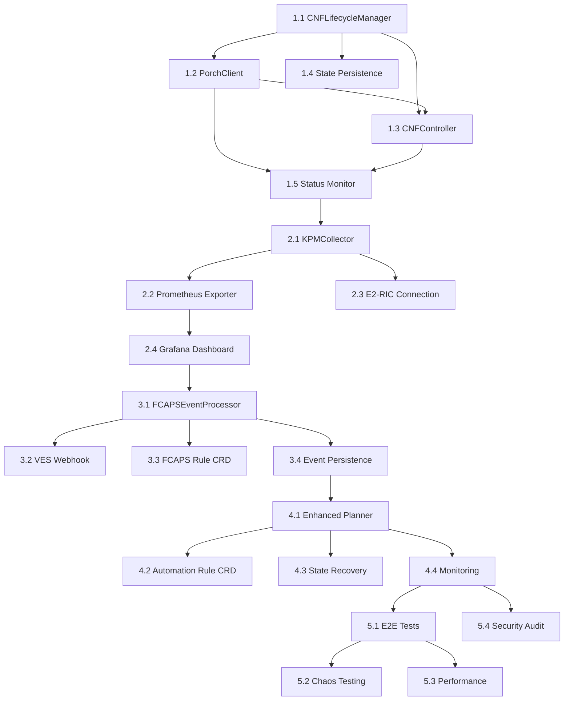

# O-RAN Integration Implementation Tasks

**Parent Epic:** O-RAN Network Function Integration (#3)
**Generated:** 2026-02-16
**Total Estimated Effort:** 6 weeks (240 hours)

---

## Phase 1: CNF Lifecycle Foundation (Week 1-2, 80 hours)

### Task 1.1: Implement CNFLifecycleManager Core
**Priority:** P0 (Critical)
**Effort:** 20 hours
**Dependencies:** None
**Owner:** Backend Architect

**Scope:**
- Create `pkg/cnf/lifecycle_manager.go`
- Implement state machine (Pending → Provisioning → Active)
- Add CNFStateStore for persistence
- Implement Deploy/Scale/Update/Delete operations
- Add comprehensive error handling

**Deliverables:**
- [ ] CNFLifecycleManager struct with all operations
- [ ] State machine implementation with transitions
- [ ] Unit tests (>85% coverage)
- [ ] Error handling with proper logging

**Acceptance Criteria:**
- Deploy operation creates CNF in Pending state
- State transitions follow defined flow
- All errors properly categorized and logged
- Unit tests pass

---

### Task 1.2: Create Nephio PorchClient
**Priority:** P0 (Critical)
**Effort:** 16 hours
**Dependencies:** Task 1.1
**Owner:** Backend Architect

**Scope:**
- Enhance `pkg/nephio/porch_client.go`
- Implement CreatePackage/UpdatePackage/DeletePackage
- Add package template generation
- Implement status polling
- Add authentication (mTLS/token)

**Deliverables:**
- [ ] PorchClient with full CRUD operations
- [ ] Package template engine (Kptfile, manifests)
- [ ] Integration tests with mock Porch server
- [ ] Connection pooling and retry logic

**Acceptance Criteria:**
- Can create package in Porch repository
- Package contains all required files (Kptfile, deployment.yaml)
- Status polling returns accurate state
- Handles Porch API errors gracefully

**Test Commands:**
```bash
# Unit tests
go test ./pkg/nephio/... -v -run TestPorchClient

# Integration test with mock
go test ./pkg/nephio/... -v -run TestPorchIntegration -tags=integration
```

---

### Task 1.3: Enhance CNFDeploymentController
**Priority:** P0 (Critical)
**Effort:** 20 hours
**Dependencies:** Task 1.1, Task 1.2
**Owner:** Backend Architect

**Scope:**
- Update `pkg/controllers/cnfdeployment_controller.go`
- Wire CNFLifecycleManager into reconcile loop
- Implement status updates
- Add event recording
- Implement reconciliation logic

**Deliverables:**
- [ ] Controller using CNFLifecycleManager
- [ ] Status subresource updates working
- [ ] Events emitted for lifecycle changes
- [ ] Controller tests with envtest

**Acceptance Criteria:**
- CNFDeployment CR triggers package creation
- Status reflects actual deployment state
- Events visible via `kubectl describe`
- Reconciliation handles errors with backoff

**Test Commands:**
```bash
# Controller tests
make test-controllers

# E2E test
./hack/test-cnf-deployment.sh
```

---

### Task 1.4: CNF State Persistence
**Priority:** P1 (High)
**Effort:** 12 hours
**Dependencies:** Task 1.1
**Owner:** Backend Architect

**Scope:**
- Implement `pkg/cnf/state_store.go`
- Add etcd/ConfigMap backend
- Implement state recovery on restart
- Add state snapshot/restore

**Deliverables:**
- [ ] CNFStateStore interface and implementation
- [ ] State persistence in ConfigMaps
- [ ] State recovery logic
- [ ] Unit tests for state operations

**Acceptance Criteria:**
- State survives controller restart
- No state loss during crashes
- State recovery completes within 10s
- Tests verify persistence

---

### Task 1.5: Deployment Status Monitoring
**Priority:** P1 (High)
**Effort:** 12 hours
**Dependencies:** Task 1.2, Task 1.3
**Owner:** Backend Architect

**Scope:**
- Implement `pkg/cnf/status_monitor.go`
- Poll Porch/Kubernetes for deployment status
- Implement health check aggregation
- Add readiness/liveness tracking

**Deliverables:**
- [ ] StatusMonitor watching deployments
- [ ] Health check aggregation
- [ ] Metrics for deployment status
- [ ] Integration tests

**Acceptance Criteria:**
- Status updates within 5s of change
- Health checks accurately reflect readiness
- Failed deployments detected immediately
- Metrics exported to Prometheus

---

## Phase 2: E2 KPM Integration (Week 3, 40 hours)

### Task 2.1: Implement KPMCollector
**Priority:** P0 (Critical)
**Effort:** 16 hours
**Dependencies:** Phase 1 complete
**Owner:** Backend Architect

**Scope:**
- Create `pkg/oran/e2/kpm_collector.go`
- Implement E2 subscription management
- Add metric parsing (p95_latency, prb_utilization, ue_count)
- Implement 30s window aggregation
- Add staleness detection (90s max)

**Deliverables:**
- [ ] KPMCollector with subscription CRUD
- [ ] Metric parsing and aggregation
- [ ] Staleness detection logic
- [ ] Unit tests with mock E2 Manager

**Acceptance Criteria:**
- Subscriptions created automatically for CNFs
- Metrics aggregated over 30s windows
- Stale metrics (>90s) rejected
- Aligns with `docs/contracts/e2.kpm.profile.md`

**Test Commands:**
```bash
# Unit tests
go test ./pkg/oran/e2/... -v -run TestKPMCollector

# Integration with E2 simulator
./tests/e2e/run_e2_kpm_test.sh
```

---

### Task 2.2: Prometheus Exporter for KPM
**Priority:** P0 (Critical)
**Effort:** 8 hours
**Dependencies:** Task 2.1
**Owner:** Backend Architect

**Scope:**
- Create `pkg/oran/e2/prometheus_exporter.go`
- Implement Prometheus metrics registration
- Add metric labels (node_id, cell_id)
- Implement scrape endpoint

**Deliverables:**
- [ ] Prometheus exporter with KPM metrics
- [ ] `/metrics` endpoint exposed
- [ ] Grafana dashboard JSON
- [ ] Integration tests

**Acceptance Criteria:**
- Metrics visible in Prometheus within 30s
- Labels allow per-node filtering
- Grafana dashboard shows RAN metrics
- No metric gaps during scrapes

**Prometheus Metrics:**
```
e2_kpm_p95_latency_ms{node_id="gnb-001"} 12.5
e2_kpm_prb_utilization{node_id="gnb-001"} 0.68
e2_kpm_ue_count{node_id="gnb-001"} 450
```

---

### Task 2.3: Connect E2 Manager to RIC
**Priority:** P0 (Critical)
**Effort:** 8 hours
**Dependencies:** Task 2.1
**Owner:** Backend Architect

**Scope:**
- Update `pkg/oran/e2/e2_manager.go`
- Configure actual Near-RT RIC endpoint
- Implement E2 Setup procedure
- Add connection health monitoring
- Implement reconnection logic

**Deliverables:**
- [ ] E2 Manager connected to real RIC
- [ ] E2 Setup procedure working
- [ ] Health monitoring with metrics
- [ ] Reconnection on failure

**Acceptance Criteria:**
- E2 connection established within 30s
- E2 Setup completes successfully
- Connection survives RIC restart
- Health status accurate

**Configuration:**
```yaml
# config/manager/e2-config.yaml
e2Manager:
  ricEndpoint: "http://near-rt-ric:38080"
  apiVersion: "v1"
  timeout: 30s
  heartbeatInterval: 10s
```

---

### Task 2.4: Grafana Dashboard for KPM
**Priority:** P2 (Medium)
**Effort:** 8 hours
**Dependencies:** Task 2.2
**Owner:** Backend Architect

**Scope:**
- Create Grafana dashboard JSON
- Add panels for p95 latency, PRB util, UE count
- Implement alerts for thresholds
- Add per-node views

**Deliverables:**
- [ ] `deployments/monitoring/grafana-kpm-dashboard.json`
- [ ] Alert rules for high PRB utilization
- [ ] Documentation for dashboard usage

**Acceptance Criteria:**
- Dashboard shows real-time KPM metrics
- Alerts trigger at configured thresholds
- Per-node filtering works
- Dashboard loads without errors

---

## Phase 3: FCAPS Event Processing (Week 4, 40 hours)

### Task 3.1: Implement FCAPSEventProcessor
**Priority:** P0 (Critical)
**Effort:** 16 hours
**Dependencies:** Phase 2 complete
**Owner:** Backend Architect

**Scope:**
- Create `pkg/oran/fcaps/event_processor.go`
- Implement rule engine with CEL expressions
- Add intent generation from events
- Implement event deduplication
- Add event correlation (burst suppression)

**Deliverables:**
- [ ] FCAPSEventProcessor with rule engine
- [ ] Intent generation logic
- [ ] Event deduplication (5min window)
- [ ] Unit tests with sample VES events

**Acceptance Criteria:**
- Critical faults trigger intents within 10s
- No duplicate intents for same event
- Burst events (>5/min) correlated
- Rules match `docs/contracts/fcaps.ves.examples.json`

**Example Rule:**
```yaml
# config/fcaps-rules.yaml
rules:
  - name: link-down-migration
    eventDomain: fault
    severity: CRITICAL
    condition: "event.faultFields.alarmCondition == 'LINK_DOWN'"
    action: migrate
    intentTemplate: "Migrate {.SourceName} due to link failure"
    cooldown: 300s
```

---

### Task 3.2: VES Collector Webhook Integration
**Priority:** P0 (Critical)
**Effort:** 8 hours
**Dependencies:** Task 3.1
**Owner:** Backend Architect

**Scope:**
- Create webhook endpoint `/api/v1/fcaps/events`
- Implement VES event parsing (VES 7.3)
- Add authentication (HMAC signature)
- Implement event validation

**Deliverables:**
- [ ] Webhook endpoint accepting VES events
- [ ] Event parsing for all domains
- [ ] HMAC signature validation
- [ ] Integration tests with mock VES collector

**Acceptance Criteria:**
- Webhook accepts VES 7.3 events
- Invalid events rejected with 400
- Signature verification working
- Event processing latency <100ms

**Webhook Configuration:**
```yaml
# VES Collector config
ves:
  webhooks:
    - url: "http://intent-operator-webhook:8080/api/v1/fcaps/events"
      secret: "${WEBHOOK_SECRET}"
      eventDomains: ["fault", "thresholdCrossingAlert", "measurementsForVfScaling"]
```

---

### Task 3.3: FCAPS Rule CRD
**Priority:** P1 (High)
**Effort:** 8 hours
**Dependencies:** Task 3.1
**Owner:** Backend Architect

**Scope:**
- Create `api/v1/fcapsrule_types.go`
- Implement FCAPSRule controller
- Add rule validation webhook
- Implement hot-reload of rules

**Deliverables:**
- [ ] FCAPSRule CRD definition
- [ ] Controller for rule lifecycle
- [ ] Validating webhook
- [ ] Hot-reload without operator restart

**Acceptance Criteria:**
- Rules updatable via kubectl
- Invalid rules rejected by webhook
- Rule changes applied within 10s
- No downtime during rule updates

**Example CR:**
```yaml
apiVersion: nephoran.com/v1
kind: FCAPSRule
metadata:
  name: high-prb-scaling
spec:
  eventDomain: thresholdCrossingAlert
  condition: "event.thresholdCrossingAlertFields.alertValue > 0.9"
  action: scale_out
  intentTemplate: "Scale out due to PRB {.AlertValue}"
  cooldown: 180s
```

---

### Task 3.4: Event Persistence and Audit
**Priority:** P2 (Medium)
**Effort:** 8 hours
**Dependencies:** Task 3.1
**Owner:** Backend Architect

**Scope:**
- Implement `pkg/oran/fcaps/event_store.go`
- Add event persistence (etcd/database)
- Implement event query API
- Add audit trail for processed events

**Deliverables:**
- [ ] EventStore with query capabilities
- [ ] REST API for event history
- [ ] Audit log with processing results
- [ ] Event retention policy (7 days)

**Acceptance Criteria:**
- Events queryable via API
- Audit trail shows processing decisions
- Old events auto-deleted after 7 days
- Query performance <100ms

---

## Phase 4: Closed-Loop Automation (Week 5, 40 hours)

### Task 4.1: Enhance Closed-Loop Planner
**Priority:** P0 (Critical)
**Effort:** 16 hours
**Dependencies:** Phase 3 complete
**Owner:** Backend Architect

**Scope:**
- Update `pkg/loop/planner.go`
- Integrate KPMCollector
- Add auto-intent generation
- Implement cooldown and hysteresis
- Add state tracking

**Deliverables:**
- [ ] Planner consuming KPM metrics
- [ ] Auto-intent generation logic
- [ ] Cooldown tracking (per CNF)
- [ ] Hysteresis to prevent oscillation

**Acceptance Criteria:**
- Scale-out triggered within 90s of threshold
- Cooldown prevents rapid scaling (<5min)
- Hysteresis prevents oscillation
- State persists across restarts

**Cooldown Logic:**
```go
// Prevent scaling if last action was <5min ago
if time.Since(state.LastScaleTime) < 5*time.Minute {
    return nil, ErrCooldownActive
}
```

---

### Task 4.2: Automation Rule CRD
**Priority:** P0 (Critical)
**Effort:** 8 hours
**Dependencies:** Task 4.1
**Owner:** Backend Architect

**Scope:**
- Create `api/v1/automationrule_types.go`
- Implement AutomationRule controller
- Add rule validation (min < max replicas)
- Implement rule priority

**Deliverables:**
- [ ] AutomationRule CRD
- [ ] Controller managing rules
- [ ] Validation webhook
- [ ] Rule priority handling

**Acceptance Criteria:**
- Rules configurable via kubectl
- Priority determines execution order
- Invalid rules rejected
- Rule updates applied immediately

**Example CR:**
```yaml
apiVersion: nephoran.com/v1
kind: AutomationRule
metadata:
  name: upf-prb-scaling
spec:
  metricSource: kpm
  condition: "metrics['kpm.prb_utilization'] > 0.85"
  action: scale_out
  cooldown: 300s
  minReplicas: 2
  maxReplicas: 10
  priority: 10
  intentTemplate: "Scale out UPF due to PRB utilization {.Value}"
```

---

### Task 4.3: State Persistence and Recovery
**Priority:** P1 (High)
**Effort:** 8 hours
**Dependencies:** Task 4.1
**Owner:** Backend Architect

**Scope:**
- Implement state persistence for planner
- Add recovery on restart
- Implement state snapshot
- Add state reconciliation

**Deliverables:**
- [ ] StateTracker with persistence
- [ ] Recovery logic on startup
- [ ] State snapshot API
- [ ] Reconciliation on mismatch

**Acceptance Criteria:**
- State survives operator restart
- Recovery completes within 30s
- No cooldown reset on restart
- State reconciliation detects drift

---

### Task 4.4: Comprehensive Monitoring
**Priority:** P1 (High)
**Effort:** 8 hours
**Dependencies:** Task 4.1
**Owner:** Backend Architect

**Scope:**
- Add Prometheus metrics for planner
- Implement distributed tracing
- Add structured logging
- Create Grafana dashboard

**Deliverables:**
- [ ] Planner metrics exported
- [ ] Trace spans for intent flow
- [ ] Structured logs with correlation IDs
- [ ] Grafana dashboard

**Acceptance Criteria:**
- Metrics show intent processing latency
- Traces visualize full workflow
- Logs allow debugging
- Dashboard shows closed-loop health

**Metrics:**
```
planner_intents_generated_total{action="scale_out|scale_in"} 42
planner_rule_evaluation_duration_seconds 0.015
planner_cooldown_active{cnf="upf-001"} 1
planner_metrics_staleness_seconds 25
```

---

## Phase 5: Integration & Testing (Week 6, 40 hours)

### Task 5.1: E2E Test Scenarios
**Priority:** P0 (Critical)
**Effort:** 16 hours
**Dependencies:** Phase 4 complete
**Owner:** Backend Architect + QA

**Scope:**
- Create 10+ E2E test scenarios
- Implement test framework
- Add test data generation
- Create CI integration

**Test Scenarios:**
1. User-initiated CNF deployment
2. Auto-scaling on PRB threshold
3. FCAPS fault recovery
4. Multi-CNF orchestration
5. Concurrent scaling operations
6. State recovery after crash
7. Rule update without downtime
8. Metrics collection reliability
9. A1 policy enforcement
10. Full closed-loop (E2 → Intent → CNF)

**Deliverables:**
- [ ] `tests/e2e/oran_integration_test.go`
- [ ] Test data fixtures
- [ ] CI workflow `.github/workflows/e2e-oran.yml`
- [ ] Test report generation

**Acceptance Criteria:**
- All 10 scenarios passing
- <5min total test execution
- Tests runnable locally and in CI
- Test reports published

**Test Commands:**
```bash
# Run all E2E tests
make test-e2e-oran

# Run specific scenario
go test ./tests/e2e/... -v -run TestAutoScaling

# CI execution
act -j e2e-oran-integration
```

---

### Task 5.2: Chaos Testing
**Priority:** P1 (High)
**Effort:** 8 hours
**Dependencies:** Task 5.1
**Owner:** Backend Architect + SRE

**Scope:**
- Implement chaos scenarios
- Test RIC failure recovery
- Test network partition handling
- Test operator crash recovery

**Chaos Scenarios:**
1. RIC pod deletion
2. Network partition (E2 interface)
3. Porch API unavailability
4. etcd failure
5. Prometheus outage
6. Operator pod crash

**Deliverables:**
- [ ] Chaos test scripts `tests/chaos/`
- [ ] Recovery verification
- [ ] MTTR measurements
- [ ] Chaos test report

**Acceptance Criteria:**
- All chaos scenarios handled gracefully
- MTTR <5min for all scenarios
- No data loss
- Automatic recovery without manual intervention

---

### Task 5.3: Performance Benchmarking
**Priority:** P1 (High)
**Effort:** 8 hours
**Dependencies:** Task 5.1
**Owner:** Backend Architect + Performance Engineer

**Scope:**
- Create performance test suite
- Benchmark CNF deployment throughput
- Benchmark intent processing latency
- Load test with 100+ CNFs

**Benchmarks:**
1. CNF deployment throughput (CNFs/min)
2. Intent processing latency (ms)
3. E2 subscription scalability (subscriptions)
4. FCAPS event processing rate (events/sec)
5. Closed-loop response time (E2 → CNF scale)

**Deliverables:**
- [ ] `tests/performance/benchmark_test.go`
- [ ] Load test scripts
- [ ] Performance report
- [ ] Resource utilization analysis

**Acceptance Criteria:**
- >10 CNF deployments/min
- <1s intent processing latency
- >1000 E2 subscriptions
- >1000 FCAPS events/sec
- <90s closed-loop response time

**Performance Report Sections:**
- Throughput measurements
- Latency percentiles (p50, p95, p99)
- Resource utilization (CPU, memory, network)
- Scalability limits
- Bottleneck analysis

---

### Task 5.4: Security Audit
**Priority:** P0 (Critical)
**Effort:** 8 hours
**Dependencies:** Phase 4 complete
**Owner:** Security Auditor

**Scope:**
- Audit RBAC policies
- Verify mTLS configuration
- Check secrets management
- Validate webhook authentication
- Test for injection vulnerabilities

**Security Checklist:**
- [ ] RBAC least privilege verified
- [ ] mTLS enabled for all inter-component comms
- [ ] Secrets not in code/logs
- [ ] Webhook HMAC validation working
- [ ] Input validation prevents injection
- [ ] Network policies restrict traffic
- [ ] Container images scanned
- [ ] Audit logging enabled

**Deliverables:**
- [ ] Security audit report
- [ ] Vulnerability assessment
- [ ] Remediation plan (if issues found)
- [ ] Security hardening guide

**Acceptance Criteria:**
- Zero critical vulnerabilities
- <3 high-severity issues
- All medium issues documented
- Remediation plan approved

---

## Task Dependencies Graph



---

## Resource Allocation

| Phase | Duration | FTE Required | Skills Needed |
|-------|----------|--------------|---------------|
| Phase 1 | 2 weeks | 2.0 FTE | Go, K8s, Nephio |
| Phase 2 | 1 week | 1.5 FTE | O-RAN, E2, Metrics |
| Phase 3 | 1 week | 1.5 FTE | Event processing, CEL |
| Phase 4 | 1 week | 1.5 FTE | State management, Control theory |
| Phase 5 | 1 week | 2.0 FTE | Testing, Security, Performance |

**Total Effort:** 240 hours (6 weeks @ 40 hours/week)

---

## Tracking and Reporting

### Daily Standup Topics
- Completed tasks from previous day
- Blockers and dependencies
- Tasks planned for today
- Risk updates

### Weekly Status Report
- Tasks completed (% of phase)
- Tasks in progress
- Blockers and risks
- Next week's plan
- Resource needs

### Milestone Gates
- **Phase 1 Complete:** CNF deployment working E2E
- **Phase 2 Complete:** KPM metrics in Grafana
- **Phase 3 Complete:** FCAPS events triggering intents
- **Phase 4 Complete:** Full closed-loop automation
- **Phase 5 Complete:** All tests passing, documentation done

---

## Contacts and Escalation

**Project Lead:** Backend Architect
**Technical Escalation:** Engineering Manager
**Product Escalation:** Product Owner
**Security Escalation:** CISO

**Communication Channels:**
- Daily: Slack #nephoran-oran-integration
- Blockers: Immediate escalation via Slack mention
- Weekly: Status email to stakeholders
- Ad-hoc: Video calls for design discussions

---

**Generated by:** Nephoran Intent Operator - Backend Architect Agent
**Document Version:** 1.0
**Last Updated:** 2026-02-16
