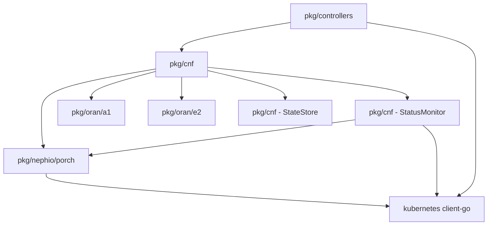

# O-RAN Phase 1 - File Structure

**Phase:** CNF Lifecycle Foundation
**Date:** 2026-02-16

---

## New Files to Create

### Core CNF Package (`pkg/cnf/`)

```
pkg/cnf/
├── lifecycle_manager.go           # CNFLifecycleManager - orchestrates all operations
├── lifecycle_manager_test.go      # Unit tests for lifecycle manager
├── state_machine.go                # State machine logic and transitions
├── state_machine_test.go          # State machine unit tests
├── state_store.go                  # StateStore interface definition
├── state_store_configmap.go       # ConfigMap-based state persistence
├── state_store_etcd.go            # Etcd-based state persistence (optional)
├── state_store_test.go            # State storage unit tests
├── status_monitor.go               # Active status monitoring
├── status_monitor_test.go         # Monitoring unit tests
├── health_checker.go               # Health check aggregation
├── health_checker_test.go         # Health check unit tests
├── metrics.go                      # Prometheus metrics definitions
├── types.go                        # Common types (CNFStatus, CNFState, etc.)
├── errors.go                       # Error definitions and categorization
└── constants.go                    # Constants (timeouts, defaults)
```

### Nephio/Porch Extensions (`pkg/nephio/porch/`)

```
pkg/nephio/porch/
├── client.go                       # EXISTING - enhance with CNF operations
├── package_builder.go              # NEW - CNF package template builder
├── package_builder_test.go        # NEW - Package builder tests
├── status_poller.go                # NEW - Package status polling
├── status_poller_test.go          # NEW - Status poller tests
├── client_cnf_test.go             # NEW - CNF-specific client tests
└── templates/                      # NEW - Package templates directory
    ├── amf/                        # AMF CNF template
    │   ├── Kptfile.tmpl
    │   ├── deployment.yaml.tmpl
    │   ├── service.yaml.tmpl
    │   └── configmap.yaml.tmpl
    ├── smf/                        # SMF CNF template
    ├── upf/                        # UPF CNF template
    └── common/                     # Common templates
        ├── network-attachment-def.yaml.tmpl
        └── function-config.yaml.tmpl
```

### Controller Enhancements (`pkg/controllers/`)

```
pkg/controllers/
├── cnfdeployment_controller.go          # EXISTING - enhance reconcile loop
├── cnfdeployment_status.go              # NEW - Status update logic
├── cnfdeployment_status_test.go         # NEW - Status tests
├── cnfdeployment_finalizer.go           # NEW - Finalizer handling
├── cnfdeployment_finalizer_test.go      # NEW - Finalizer tests
├── cnfdeployment_controller_test.go     # EXISTING - enhance tests
└── suite_test.go                         # EXISTING - ensure envtest setup
```

### Test Utilities (`tests/`)

```
tests/
├── e2e/
│   ├── cnf_deployment_test.go       # NEW - E2E tests for CNF deployment
│   ├── fixtures/                    # NEW - Test fixtures
│   │   ├── cnf-amf.yaml
│   │   ├── cnf-upf.yaml
│   │   └── porch-mock-responses.json
│   └── helpers/                     # NEW - Test helper functions
│       ├── porch_mock.go
│       └── assertions.go
└── integration/
    └── cnf/
        ├── lifecycle_integration_test.go    # NEW - Integration tests
        └── porch_integration_test.go        # NEW - Porch integration
```

### Scripts and Utilities (`hack/`)

```
hack/
├── test-cnf-deployment.sh          # NEW - E2E test script
├── setup-test-env.sh               # NEW - Test environment setup
└── cleanup-test-resources.sh       # NEW - Test cleanup
```

### Configuration (`config/`)

```
config/
└── manager/
    └── cnf-config.yaml              # NEW - CNF manager configuration
```

---

## Modified Files

### Existing Files to Enhance

1. **`pkg/nephio/porch/client.go`**
   - Add CNF-specific operations
   - Enhance package CRUD methods
   - Add retry logic and connection pooling

2. **`pkg/controllers/cnfdeployment_controller.go`**
   - Wire CNFLifecycleManager into reconcile loop
   - Add status update calls
   - Implement finalizer logic

3. **`pkg/controllers/cnfdeployment_controller_test.go`**
   - Add tests for lifecycle manager integration
   - Add status update tests
   - Add finalizer tests

4. **`api/v1/cnfdeployment_types.go`** (if needed)
   - May need to add status fields
   - Add conditions for state machine

---

## Directory Structure (Complete)

```
nephoran-intent-operator/
├── api/
│   └── v1/
│       ├── cnfdeployment_types.go              # EXISTING
│       └── ...
├── pkg/
│   ├── cnf/                                    # MAIN NEW PACKAGE
│   │   ├── lifecycle_manager.go
│   │   ├── lifecycle_manager_test.go
│   │   ├── state_machine.go
│   │   ├── state_machine_test.go
│   │   ├── state_store.go
│   │   ├── state_store_configmap.go
│   │   ├── state_store_etcd.go
│   │   ├── state_store_test.go
│   │   ├── status_monitor.go
│   │   ├── status_monitor_test.go
│   │   ├── health_checker.go
│   │   ├── health_checker_test.go
│   │   ├── metrics.go
│   │   ├── types.go
│   │   ├── errors.go
│   │   └── constants.go
│   ├── controllers/
│   │   ├── cnfdeployment_controller.go         # ENHANCED
│   │   ├── cnfdeployment_status.go             # NEW
│   │   ├── cnfdeployment_status_test.go        # NEW
│   │   ├── cnfdeployment_finalizer.go          # NEW
│   │   ├── cnfdeployment_finalizer_test.go     # NEW
│   │   ├── cnfdeployment_controller_test.go    # ENHANCED
│   │   └── suite_test.go                       # EXISTING
│   ├── nephio/
│   │   └── porch/
│   │       ├── client.go                       # ENHANCED
│   │       ├── package_builder.go              # NEW
│   │       ├── package_builder_test.go         # NEW
│   │       ├── status_poller.go                # NEW
│   │       ├── status_poller_test.go           # NEW
│   │       ├── client_cnf_test.go              # NEW
│   │       └── templates/                      # NEW DIRECTORY
│   │           ├── amf/
│   │           ├── smf/
│   │           ├── upf/
│   │           └── common/
│   └── oran/
│       ├── a1/                                 # EXISTING
│       └── e2/                                 # EXISTING
├── tests/
│   ├── e2e/
│   │   ├── cnf_deployment_test.go              # NEW
│   │   ├── fixtures/                           # NEW
│   │   └── helpers/                            # NEW
│   └── integration/
│       └── cnf/
│           ├── lifecycle_integration_test.go   # NEW
│           └── porch_integration_test.go       # NEW
├── hack/
│   ├── test-cnf-deployment.sh                  # NEW
│   ├── setup-test-env.sh                       # NEW
│   └── cleanup-test-resources.sh               # NEW
├── config/
│   └── manager/
│       └── cnf-config.yaml                     # NEW
└── docs/
    └── implementation/
        ├── ORAN_PHASE1_TASKS.md                # THIS DOC
        ├── ORAN_PHASE1_FILE_STRUCTURE.md       # YOU ARE HERE
        └── ORAN_PHASE1_TEST_PLAN.md            # NEXT
```

---

## Package Boundaries

### `pkg/cnf/` - CNF Lifecycle Package
**Owner:** Backend Architect
**Purpose:** Core CNF lifecycle orchestration

**Responsibilities:**
- CNF lifecycle state machine
- State persistence
- Status monitoring
- Health checking
- Metrics collection

**Dependencies:**
- `pkg/nephio/porch` - Package operations
- `pkg/oran/a1` - A1 policy management
- `pkg/oran/e2` - E2 subscriptions
- `sigs.k8s.io/controller-runtime` - Kubernetes client

**Exports:**
- `CNFLifecycleManager` - Main orchestrator
- `StateStore` - State persistence interface
- `StatusMonitor` - Active monitoring

---

### `pkg/nephio/porch/` - Nephio/Porch Integration
**Owner:** Backend Architect
**Purpose:** Nephio package lifecycle operations

**Responsibilities:**
- Package CRUD operations
- Package template generation
- Status polling
- Repository management

**Dependencies:**
- `k8s.io/client-go` - Kubernetes client
- `sigs.k8s.io/controller-runtime` - Dynamic client

**Exports:**
- `Client` - Porch client (enhanced)
- `PackageBuilder` - Template builder
- `StatusPoller` - Status polling

---

### `pkg/controllers/` - Kubernetes Controllers
**Owner:** Backend Architect
**Purpose:** Reconcile CNFDeployment CRs

**Responsibilities:**
- CR reconciliation
- Status updates
- Event recording
- Finalizer handling

**Dependencies:**
- `pkg/cnf` - Lifecycle operations
- `sigs.k8s.io/controller-runtime` - Controller runtime

**Exports:**
- `CNFDeploymentReconciler` - Main controller

---

## Module Dependencies



---

## File Size Estimates

| File | Lines of Code | Complexity |
|------|---------------|------------|
| lifecycle_manager.go | 300-400 | High |
| state_machine.go | 150-200 | Medium |
| state_store_configmap.go | 200-250 | Medium |
| status_monitor.go | 250-300 | Medium |
| health_checker.go | 150-200 | Low |
| package_builder.go | 300-400 | High |
| cnfdeployment_controller.go | 200-250 (additions) | Medium |
| cnfdeployment_status.go | 150-200 | Low |

**Total New Code:** ~2000-2500 lines (excluding tests)
**Total Test Code:** ~1500-2000 lines

---

## Code Organization Principles

### 1. Separation of Concerns
- **Lifecycle logic** in `pkg/cnf/lifecycle_manager.go`
- **State management** in `pkg/cnf/state_store*.go`
- **Monitoring** in `pkg/cnf/status_monitor.go`
- **Controller wiring** in `pkg/controllers/`

### 2. Interface-Based Design
- All major components use interfaces
- Enables testing with mocks
- Allows swapping implementations (ConfigMap → etcd)

### 3. Test Co-location
- Tests in same package as code
- Integration tests in `tests/integration/`
- E2E tests in `tests/e2e/`

### 4. Configuration
- Default values in code (constants.go)
- Overridable via ConfigMaps
- Environment variables for sensitive data

---

## Naming Conventions

### Files
- **Implementation:** `{component}.go`
- **Tests:** `{component}_test.go`
- **Interfaces:** `types.go` (contains interfaces + types)
- **Mocks:** `{component}_mock.go` (if needed)

### Packages
- All lowercase
- Single word preferred
- Example: `cnf`, `porch`, `controllers`

### Types
- **Structs:** PascalCase (e.g., `CNFLifecycleManager`)
- **Interfaces:** PascalCase (e.g., `StateStore`)
- **Constants:** PascalCase (e.g., `DefaultCNFDeployTimeout`)

### Functions
- **Exported:** PascalCase (e.g., `Deploy`, `GetStatus`)
- **Internal:** camelCase (e.g., `updateStatus`, `handleError`)

---

## Import Organization

```go
import (
    // Standard library
    "context"
    "fmt"
    "time"

    // Third-party
    "github.com/prometheus/client_golang/prometheus"
    "helm.sh/helm/v3/pkg/action"

    // Kubernetes
    metav1 "k8s.io/apimachinery/pkg/apis/meta/v1"
    "sigs.k8s.io/controller-runtime/pkg/client"

    // Internal - API
    nephoranv1 "github.com/thc1006/nephoran-intent-operator/api/v1"

    // Internal - Packages
    "github.com/thc1006/nephoran-intent-operator/pkg/nephio/porch"
    "github.com/thc1006/nephoran-intent-operator/pkg/oran/a1"
)
```

---

## Build Tags

### Integration Tests
```go
// +build integration

package cnf_test
```

### E2E Tests
```go
// +build e2e

package e2e_test
```

### Usage
```bash
# Run unit tests only (default)
go test ./pkg/cnf/...

# Run integration tests
go test ./pkg/cnf/... -tags=integration

# Run E2E tests
go test ./tests/e2e/... -tags=e2e
```

---

**Document Version:** 1.0
**Created:** 2026-02-16
**Owner:** Backend Architect
