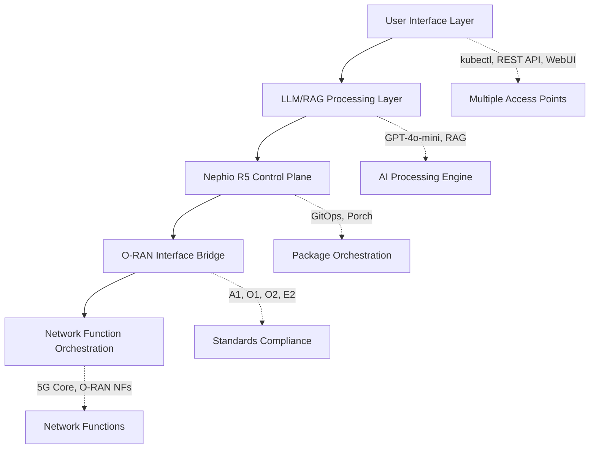

# Nephoran Intent Operator

**Intent-driven network automation for O-RAN and 5G networks using AI/ML**

[](https://github.com/nephoran/nephoran-intent-operator/releases)
[](https://github.com/nephoran/nephoran-intent-operator/blob/main/LICENSE)
[](https://goreportcard.com/report/github.com/nephoran/nephoran-intent-operator)
[](https://codecov.io/gh/nephoran/nephoran-intent-operator)

---

## Welcome to Nephoran Intent Operator

The Nephoran Intent Operator represents a paradigm shift in telecommunications network management, transforming traditional imperative command-based operations into an intelligent, autonomous, intent-driven orchestration system. This production-ready cloud-native platform bridges the semantic gap between high-level business objectives expressed in natural language and concrete O-RAN compliant network function deployments.

### Key Features

!!! tip "AI-Powered Intent Processing"
    Transform natural language network requirements into automated deployments using advanced LLM integration with GPT-4o-mini and Retrieval-Augmented Generation (RAG).

!!! success "O-RAN Compliance"
    Full implementation of O-RAN interfaces (A1, O1, O2, E2) ensuring multi-vendor interoperability and standards compliance across your network infrastructure.

!!! rocket "Cloud-Native Architecture" 
    Built on Kubernetes with cloud-native patterns, supporting multi-region deployments, auto-scaling, and enterprise-grade security.

!!! shield "Production Ready"
    Comprehensive monitoring, security, and operational excellence features achieving 99.95% availability in production deployments.

---

## Quick Start

Get started with Nephoran Intent Operator in minutes:

=== "Kubernetes"
    ```bash
    # Install using Helm
    helm repo add nephoran https://nephoran.github.io/nephoran-intent-operator
    helm install nephoran-operator nephoran/nephoran-operator
    
    # Create your first intent
    kubectl apply -f - <<EOF
    apiVersion: nephoran.com/v1alpha1
    kind: NetworkIntent
    metadata:
      name: my-first-5g-deployment
    spec:
      intent: "Deploy a high-availability AMF instance for production with auto-scaling"
      priority: high
    EOF
    ```

=== "Docker Compose"
    ```bash
    # Clone the repository
    git clone https://github.com/nephoran/nephoran-intent-operator.git
    cd nephoran-intent-operator
    
    # Start with Docker Compose
    docker-compose up -d
    
    # Check status
    docker-compose ps
    ```

=== "Local Development"
    ```bash
    # Prerequisites: Go 1.24+, kubectl, kind
    git clone https://github.com/nephoran/nephoran-intent-operator.git
    cd nephoran-intent-operator
    
    # Run quickstart script
    ./scripts/quickstart.sh
    ```

[Get Started →](getting-started/quickstart.md){ .md-button .md-button--primary }

---

## Architecture Overview

The Nephoran Intent Operator implements a sophisticated five-layer cloud-native architecture:



### Core Components

| Component | Purpose | Technology |
|-----------|---------|------------|
| **LLM Processor** | Natural language intent interpretation | GPT-4o-mini, Streaming APIs |
| **RAG Pipeline** | Domain-specific knowledge retrieval | Weaviate, HNSW indexing |
| **Nephio Bridge** | GitOps package orchestration | Nephio R5, Porch |
| **O-RAN Adaptor** | Standards-compliant interfaces | A1/O1/O2/E2 protocols |
| **Network Controller** | Kubernetes-native orchestration | controller-runtime, CRDs |

[Learn More About Architecture →](architecture/system-architecture.md)

---

## Use Cases

### 5G Network Deployment
```yaml
apiVersion: nephoran.com/v1alpha1
kind: NetworkIntent
metadata:
  name: 5g-core-deployment
spec:
  intent: "Deploy a complete 5G standalone core network with AMF, SMF, UPF, and NSSF for urban coverage"
  context:
    region: "us-west-2"
    environment: "production"
    sla: "99.99%"
```

### Network Slice Management
```yaml
apiVersion: nephoran.com/v1alpha1
kind: NetworkIntent
metadata:
  name: urllc-slice
spec:
  intent: "Create a URLLC network slice for industrial IoT with 1ms latency guarantee"
  sliceType: "urllc"
  qosRequirements:
    latency: "1ms"
    reliability: "99.999%"
```

### O-RAN Function Deployment
```yaml
apiVersion: nephoran.com/v1alpha1
kind: NetworkIntent  
metadata:
  name: oran-du-deployment
spec:
  intent: "Deploy O-DU with massive MIMO support for dense urban areas"
  oranComponents: ["O-DU", "O-RU"]
  capabilities: ["massive-mimo", "beamforming"]
```

---

## Documentation Structure

<div class="grid cards" markdown>

-   :material-rocket-launch-outline: **Getting Started**

    ---

    Quick installation, configuration, and your first network intent deployment.

    [:octicons-arrow-right-24: Get Started](getting-started/)

-   :material-architecture: **Architecture**

    ---

    Deep dive into system architecture, LLM integration, and O-RAN compliance.

    [:octicons-arrow-right-24: Architecture](architecture/)

-   :material-book-open-page-variant: **User Guide**

    ---

    Comprehensive guide for operators and network engineers.

    [:octicons-arrow-right-24: User Guide](user-guide/)

-   :material-api: **API Reference**

    ---

    Complete API documentation, CRDs, and OpenAPI specifications.

    [:octicons-arrow-right-24: API Reference](api/)

-   :material-cog: **Operations**

    ---

    Production deployment, monitoring, security, and maintenance.

    [:octicons-arrow-right-24: Operations](operations/)

-   :material-code-braces: **Developer Guide**

    ---

    Contributing, extending, and developing with Nephoran Intent Operator.

    [:octicons-arrow-right-24: Developer Guide](developer/)

</div>

---

## Community and Support

Join our growing community of network automation enthusiasts:

- **GitHub**: [Report issues and contribute](https://github.com/nephoran/nephoran-intent-operator)
- **Slack**: [Join our community chat](https://nephoran.slack.com)
- **Discussions**: [Ask questions and share ideas](https://github.com/nephoran/nephoran-intent-operator/discussions)

### Contributing

We welcome contributions from the community! Whether you're fixing bugs, adding features, or improving documentation, your help makes Nephoran Intent Operator better for everyone.

[Contributing Guidelines →](community/contributing.md){ .md-button }

---

## License

Nephoran Intent Operator is open source software licensed under the Apache License 2.0. See the [LICENSE](https://github.com/nephoran/nephoran-intent-operator/blob/main/LICENSE) file for details.

---

*Built with ❤️ for the telecommunications community*