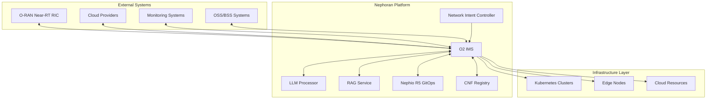

# O2 Infrastructure Management Service Integration Guide

## Overview

This guide provides comprehensive instructions for integrating the O2 Infrastructure Management Service (IMS) with existing Nephoran components and external systems. The O2 IMS serves as the central orchestration layer for cloud infrastructure management while maintaining seamless integration with the broader Nephoran ecosystem.

## Architecture Integration

### Component Relationships



### Integration Patterns

1. **Event-Driven Integration**: Asynchronous communication via message queues
2. **API Gateway Pattern**: Centralized API management and routing
3. **Service Mesh Integration**: Istio-based service-to-service communication
4. **GitOps Synchronization**: Nephio R5 package lifecycle management
5. **Observability Integration**: Unified monitoring and tracing

## Prerequisites

### System Requirements

- Kubernetes 1.24+ with RBAC enabled
- Istio service mesh 1.18+
- Prometheus and Grafana for monitoring
- Nephio R5 GitOps controller
- OAuth 2.0 identity provider (Keycloak, Auth0, or similar)

### Network Requirements

```yaml
# Network connectivity requirements
apiVersion: networking.istio.io/v1beta1
kind: VirtualService
metadata:
  name: o2ims-routing
  namespace: nephoran-system
spec:
  hosts:
  - o2ims.nephoran.svc.cluster.local
  http:
  - match:
    - uri:
        prefix: /o2ims/v1/
    route:
    - destination:
        host: o2ims-service
        port:
          number: 8080
    timeout: 30s
    retries:
      attempts: 3
      perTryTimeout: 10s
```

### Authentication Setup

```yaml
# OAuth 2.0 configuration
apiVersion: v1
kind: Secret
metadata:
  name: o2ims-oauth-config
  namespace: nephoran-system
type: Opaque
stringData:
  client-id: "o2ims-service"
  client-secret: "your-client-secret"
  issuer-url: "https://auth.nephoran.io/realms/nephoran"
  jwks-url: "https://auth.nephoran.io/realms/nephoran/protocol/openid-connect/certs"
```

## Integration with Network Intent Controller

### Configuration

The Network Intent Controller integrates with O2 IMS to translate high-level intents into infrastructure operations.

```yaml
# NetworkIntent Controller configuration
apiVersion: v1
kind: ConfigMap
metadata:
  name: network-intent-config
  namespace: nephoran-system
data:
  config.yaml: |
    o2ims:
      enabled: true
      endpoint: "https://o2ims.nephoran.svc.cluster.local:8080"
      authentication:
        type: "oauth2"
        tokenUrl: "https://auth.nephoran.io/realms/nephoran/protocol/openid-connect/token"
        clientId: "network-intent-controller"
        scopes: ["o2ims:write", "o2ims:read"]
      integration:
        intentToInfrastructure: true
        autoResourceAllocation: true
        failoverSupport: true
        scalingIntegration: true
    
    processors:
      - type: "infrastructure-intent"
        priority: 100
        config:
          targetProviders: ["kubernetes", "aws", "edge"]
          resourcePoolSelection: "automatic"
          capacityReservation: true
```

### Intent Processing Flow

```go
// Example integration code for intent processing
package integration

import (
    "context"
    "github.com/thc1006/nephoran-intent-operator/pkg/oran/o2"
    nephiov1 "github.com/thc1006/nephoran-intent-operator/api/v1"
)

type IntentProcessor struct {
    o2Client *o2.Client
}

func (p *IntentProcessor) ProcessIntent(ctx context.Context, intent *nephiov1.NetworkIntent) error {
    // Step 1: Analyze intent requirements
    requirements, err := p.analyzeIntentRequirements(intent)
    if err != nil {
        return fmt.Errorf("failed to analyze intent: %w", err)
    }
    
    // Step 2: Select appropriate resource pools
    pools, err := p.o2Client.ResourcePools().List(ctx, o2.ListOptions{
        Filter: fmt.Sprintf("provider,in,%s", strings.Join(requirements.Providers, ";")),
        MinCapacity: requirements.Resources,
    })
    if err != nil {
        return fmt.Errorf("failed to query resource pools: %w", err)
    }
    
    // Step 3: Create deployment specification
    deployment := &o2.DeploymentSpec{
        Name: intent.Name + "-deployment",
        Components: requirements.Components,
        ResourcePools: pools,
        NetworkRequirements: requirements.Network,
    }
    
    // Step 4: Submit deployment to O2 IMS
    result, err := p.o2Client.Deployments().Create(ctx, deployment)
    if err != nil {
        return fmt.Errorf("failed to create deployment: %w", err)
    }
    
    // Step 5: Update intent status
    intent.Status.Phase = nephiov1.IntentPhaseDeploying
    intent.Status.DeploymentID = result.DeploymentID
    
    return nil
}
```

## Integration with LLM Processor

### LLM-Enhanced Infrastructure Recommendations

```yaml
# LLM Processor integration configuration
apiVersion: v1
kind: ConfigMap
metadata:
  name: llm-processor-config
  namespace: nephoran-system
data:
  config.yaml: |
    integrations:
      o2ims:
        enabled: true
        endpoint: "https://o2ims.nephoran.svc.cluster.local:8080"
        features:
          infrastructureRecommendations: true
          capacityPrediction: true
          costOptimization: true
          providerSelection: true
    
    processors:
      infrastructure-advisor:
        model: "gpt-4o-mini"
        systemPrompt: |
          You are an expert infrastructure advisor for telecommunications networks.
          Analyze the provided intent and infrastructure state to recommend optimal
          resource allocation and provider selection.
        
        contextSources:
          - type: "o2ims-inventory"
            priority: 1
          - type: "performance-metrics"
            priority: 2
          - type: "cost-data"
            priority: 3
```

### Enhanced Intent Processing

```python
# Python integration example for LLM-enhanced processing
import asyncio
from nephoran_llm import LLMProcessor
from nephoran_o2ims import O2IMSClient

class EnhancedIntentProcessor:
    def __init__(self):
        self.llm = LLMProcessor()
        self.o2ims = O2IMSClient()
    
    async def process_intent_with_ai(self, intent_text: str):
        # Step 1: Get current infrastructure state
        pools = await self.o2ims.resource_pools.list()
        providers = await self.o2ims.providers.list()
        
        # Step 2: Analyze intent with infrastructure context
        context = {
            "intent": intent_text,
            "available_pools": [p.dict() for p in pools],
            "providers": [p.dict() for p in providers],
            "current_utilization": await self.get_utilization_metrics()
        }
        
        # Step 3: Get AI recommendations
        recommendation = await self.llm.process(
            prompt="infrastructure-advisor",
            context=context
        )
        
        # Step 4: Validate and apply recommendations
        validated_plan = await self.validate_plan(recommendation)
        deployment = await self.o2ims.deployments.create(validated_plan)
        
        return {
            "deployment_id": deployment.id,
            "recommendations": recommendation,
            "estimated_cost": validated_plan.cost,
            "timeline": validated_plan.timeline
        }
```

## Integration with RAG Service

### Infrastructure Knowledge Enhancement

```yaml
# RAG Service integration for infrastructure knowledge
apiVersion: v1
kind: ConfigMap
metadata:
  name: rag-service-config
  namespace: nephoran-system
data:
  config.yaml: |
    knowledge_sources:
      o2ims_integration:
        enabled: true
        sources:
          - type: "infrastructure-inventory"
            endpoint: "https://o2ims.nephoran.svc.cluster.local:8080/o2ims/v1/resourcePools"
            updateInterval: "5m"
            
          - type: "deployment-patterns"
            endpoint: "https://o2ims.nephoran.svc.cluster.local:8080/o2ims/v1/deployments"
            updateInterval: "15m"
            
          - type: "performance-data"
            endpoint: "https://o2ims.nephoran.svc.cluster.local:8080/o2ims/v1/metrics"
            updateInterval: "1m"
    
    indexing:
      infrastructure_docs:
        vectorizer: "openai-text-embedding-3-large"
        chunkSize: 1000
        overlap: 200
        metadata:
          - "provider"
          - "region"
          - "resourceType"
          - "performanceProfile"
```

### Contextual Infrastructure Queries

```python
# RAG-enhanced infrastructure queries
from nephoran_rag import RAGService
from weaviate import Client

class InfrastructureRAG:
    def __init__(self):
        self.rag = RAGService()
        self.weaviate = Client("https://weaviate.nephoran.svc.cluster.local")
    
    async def query_infrastructure_context(self, query: str, filters: dict = None):
        """Get infrastructure context using RAG"""
        
        # Step 1: Vector search for relevant infrastructure docs
        search_results = await self.rag.semantic_search(
            query=query,
            collection="infrastructure_knowledge",
            limit=10,
            filters=filters
        )
        
        # Step 2: Hybrid search combining vector and metadata
        hybrid_results = await self.weaviate.query.hybrid(
            query=query,
            collection="InfrastructurePattern",
            properties=["content", "metadata"],
            where={
                "path": ["provider"],
                "operator": "Equal",
                "valueString": filters.get("provider")
            } if filters and "provider" in filters else None
        )
        
        # Step 3: Combine and rank results
        combined_context = self.combine_search_results(
            search_results, hybrid_results
        )
        
        return {
            "context": combined_context,
            "confidence": self.calculate_confidence(combined_context),
            "sources": [r.metadata for r in combined_context]
        }
    
    async def recommend_infrastructure_pattern(self, requirements: dict):
        """Recommend infrastructure patterns based on requirements"""
        
        query = f"""
        Requirements: {requirements}
        Find similar successful deployment patterns with:
        - Resource requirements: {requirements.get('resources')}
        - Performance requirements: {requirements.get('performance')}
        - Provider preferences: {requirements.get('providers')}
        """
        
        context = await self.query_infrastructure_context(query)
        
        # Use context to generate recommendations
        recommendation = await self.rag.generate_with_context(
            prompt="infrastructure-pattern-recommendation",
            context=context["context"],
            requirements=requirements
        )
        
        return recommendation
```

## Integration with Nephio R5 GitOps

### Package Repository Configuration

```yaml
# Nephio PackageRepository for O2 IMS packages
apiVersion: config.porch.kpt.dev/v1alpha1
kind: Repository
metadata:
  name: o2ims-packages
  namespace: porch-system
spec:
  type: git
  content: Package
  git:
    repo: https://github.com/nephoran/o2ims-packages
    branch: main
    directory: /packages
  deployment: true
---
apiVersion: config.porch.kpt.dev/v1alpha1
kind: Repository
metadata:
  name: o2ims-deployments
  namespace: porch-system
spec:
  type: git
  content: Package
  git:
    repo: https://github.com/nephoran/o2ims-deployments
    branch: main
    directory: /deployments
  deployment: true
```

### GitOps Synchronization

```go
// GitOps integration for O2 IMS deployments
package gitops

import (
    "context"
    porchapi "github.com/GoogleContainerTools/kpt/porch/api/porch/v1alpha1"
    "github.com/thc1006/nephoran-intent-operator/pkg/oran/o2"
)

type GitOpsIntegration struct {
    porchClient porchapi.PorchInterface
    o2Client    *o2.Client
}

func (g *GitOpsIntegration) SyncDeployment(ctx context.Context, deployment *o2.Deployment) error {
    // Step 1: Create package revision for deployment
    packageRev := &porchapi.PackageRevision{
        ObjectMeta: metav1.ObjectMeta{
            Name: fmt.Sprintf("o2ims-%s-v1", deployment.Name),
            Namespace: "default",
        },
        Spec: porchapi.PackageRevisionSpec{
            PackageName:    fmt.Sprintf("o2ims-%s", deployment.Name),
            WorkspaceName:  deployment.Name,
            RepositoryName: "o2ims-deployments",
            Tasks: []porchapi.Task{
                {
                    Type: "apply-replacements",
                    ApplyReplacements: &porchapi.ApplyReplacements{
                        Replacements: []porchapi.ApplyReplacementsReplacement{
                            {
                                Source: &porchapi.ApplyReplacementsSource{
                                    Value: deployment.Spec.ResourcePools[0].ID,
                                },
                                Target: porchapi.ApplyReplacementsTarget{
                                    Select: porchapi.ApplyReplacementsTargetSelect{
                                        Kind: "ConfigMap",
                                        Name: "deployment-config",
                                    },
                                    FieldPaths: []string{"data.resourcePoolId"},
                                },
                            },
                        },
                    },
                },
            },
        },
    }
    
    // Step 2: Create package revision
    createdRev, err := g.porchClient.PackageRevisions("default").
        Create(ctx, packageRev, metav1.CreateOptions{})
    if err != nil {
        return fmt.Errorf("failed to create package revision: %w", err)
    }
    
    // Step 3: Propose the package for deployment
    createdRev.Spec.Lifecycle = porchapi.PackageRevisionLifecycleProposed
    _, err = g.porchClient.PackageRevisions("default").
        Update(ctx, createdRev, metav1.UpdateOptions{})
    if err != nil {
        return fmt.Errorf("failed to propose package: %w", err)
    }
    
    // Step 4: Update deployment status in O2 IMS
    deployment.Status.Phase = o2.DeploymentPhaseDeploying
    deployment.Status.PackageRevision = createdRev.Name
    
    return g.o2Client.Deployments().UpdateStatus(ctx, deployment)
}
```

### Package Templates

```yaml
# KRM function for O2 IMS resource generation
apiVersion: v1
kind: ConfigMap
metadata:
  name: o2ims-package-template
  namespace: config-management-system
data:
  template.yaml: |
    apiVersion: kpt.dev/v1
    kind: Kptfile
    metadata:
      name: o2ims-deployment
    pipeline:
      mutators:
        - image: gcr.io/kpt-fn/apply-replacements:v0.1.1
          configPath: apply-replacements.yaml
    ---
    apiVersion: v1
    kind: ConfigMap
    metadata:
      name: deployment-config
    data:
      resourcePoolId: RESOURCE_POOL_ID # kpt-set: ${resource-pool-id}
      provider: PROVIDER # kpt-set: ${provider}
      region: REGION # kpt-set: ${region}
    ---
    apiVersion: apps/v1
    kind: Deployment
    metadata:
      name: cnf-workload
    spec:
      selector:
        matchLabels:
          app: cnf-workload
      template:
        metadata:
          labels:
            app: cnf-workload
        spec:
          nodeSelector:
            nephoran.io/resource-pool: RESOURCE_POOL_ID # kpt-set: ${resource-pool-id}
          containers:
          - name: workload
            image: CNF_IMAGE # kpt-set: ${cnf-image}
            resources:
              requests:
                cpu: CPU_REQUEST # kpt-set: ${cpu-request}
                memory: MEMORY_REQUEST # kpt-set: ${memory-request}
```

## Integration with External O-RAN Components

### Near-RT RIC Integration

```yaml
# Near-RT RIC integration configuration
apiVersion: v1
kind: ConfigMap
metadata:
  name: ric-integration-config
  namespace: nephoran-system
data:
  config.yaml: |
    ric_integration:
      enabled: true
      endpoints:
        a1_policy: "http://near-rt-ric.oran.svc.cluster.local:8080/a1-p"
        e2_interface: "http://near-rt-ric.oran.svc.cluster.local:8081/e2"
      
      policy_synchronization:
        enabled: true
        sync_interval: "30s"
        policy_templates:
          - name: "qos-optimization"
            scope: "resource-pool-level"
          - name: "traffic-steering"  
            scope: "deployment-level"
      
      resource_reporting:
        enabled: true
        metrics:
          - "resource-utilization"
          - "network-performance"
          - "qos-metrics"
        report_interval: "60s"
```

### RIC Policy Integration

```python
# A1 Policy integration with O2 IMS
import asyncio
from nephoran_ric import A1PolicyClient
from nephoran_o2ims import O2IMSClient

class RICPolicyIntegration:
    def __init__(self):
        self.ric_client = A1PolicyClient()
        self.o2ims_client = O2IMSClient()
    
    async def sync_policies_with_infrastructure(self):
        """Synchronize RIC policies with infrastructure state"""
        
        # Step 1: Get current infrastructure state
        resource_pools = await self.o2ims_client.resource_pools.list()
        deployments = await self.o2ims_client.deployments.list()
        
        # Step 2: Get current RIC policies
        policies = await self.ric_client.policies.list()
        
        # Step 3: Analyze policy-infrastructure alignment
        for deployment in deployments:
            # Check if deployment has associated policies
            deployment_policies = [
                p for p in policies 
                if p.scope.get("deploymentId") == deployment.id
            ]
            
            # Create/update policies based on infrastructure changes
            if deployment.status.phase == "SCALED":
                await self.update_scaling_policies(deployment, deployment_policies)
            elif deployment.status.phase == "DEGRADED":
                await self.create_recovery_policies(deployment)
    
    async def update_scaling_policies(self, deployment, policies):
        """Update RIC policies when infrastructure scales"""
        
        qos_policy = next((p for p in policies if p.type == "qos-optimization"), None)
        
        if qos_policy:
            # Update policy parameters based on new scale
            updated_params = {
                **qos_policy.parameters,
                "target_instances": deployment.spec.replicas,
                "resource_allocation": deployment.status.allocated_resources
            }
            
            await self.ric_client.policies.update(
                policy_id=qos_policy.id,
                parameters=updated_params
            )
        else:
            # Create new QoS policy for scaled deployment
            await self.ric_client.policies.create({
                "type": "qos-optimization",
                "scope": {"deploymentId": deployment.id},
                "parameters": {
                    "target_instances": deployment.spec.replicas,
                    "resource_allocation": deployment.status.allocated_resources
                }
            })
```

## Cloud Provider Integration

### AWS Integration

```yaml
# AWS provider configuration
apiVersion: v1
kind: Secret
metadata:
  name: aws-provider-config
  namespace: nephoran-system
type: Opaque
stringData:
  config.yaml: |
    aws:
      region: "us-west-2"
      credentials:
        accessKeyId: "YOUR_ACCESS_KEY"
        secretAccessKey: "YOUR_SECRET_KEY"
        sessionToken: "" # Optional for STS
      
      vpc:
        vpcId: "vpc-12345678"
        subnets:
          - id: "subnet-12345678"
            zone: "us-west-2a"
            type: "public"
          - id: "subnet-87654321"
            zone: "us-west-2b"
            type: "private"
      
      instance_types:
        supported: ["t3.micro", "t3.small", "t3.medium", "c5.large", "m5.xlarge"]
        default: "t3.medium"
      
      tags:
        default:
          Environment: "production"
          Project: "nephoran"
          ManagedBy: "o2ims"
---
# AWS CloudFormation integration
apiVersion: v1
kind: ConfigMap
metadata:
  name: aws-cloudformation-templates
  namespace: nephoran-system
data:
  compute-stack.yaml: |
    AWSTemplateFormatVersion: '2010-09-09'
    Description: 'O2 IMS Compute Resources'
    Parameters:
      InstanceType:
        Type: String
        Default: t3.medium
      KeyPairName:
        Type: String
        Description: EC2 Key Pair for SSH access
    Resources:
      ComputeInstance:
        Type: AWS::EC2::Instance
        Properties:
          ImageId: ami-0c55b159cbfafe1d0
          InstanceType: !Ref InstanceType
          KeyName: !Ref KeyPairName
          SecurityGroupIds:
            - !Ref ComputeSecurityGroup
          UserData:
            Fn::Base64: !Sub |
              #!/bin/bash
              yum update -y
              yum install -y docker
              systemctl start docker
              systemctl enable docker
              # Install O2 IMS agent
              curl -sSL https://install.nephoran.io/o2-agent | bash
      ComputeSecurityGroup:
        Type: AWS::EC2::SecurityGroup
        Properties:
          GroupDescription: Security group for O2 IMS compute instances
          SecurityGroupIngress:
            - IpProtocol: tcp
              FromPort: 22
              ToPort: 22
              CidrIp: 10.0.0.0/8
            - IpProtocol: tcp
              FromPort: 8080
              ToPort: 8080
              CidrIp: 10.0.0.0/8
```

### Azure Integration

```yaml
# Azure provider configuration
apiVersion: v1
kind: Secret
metadata:
  name: azure-provider-config
  namespace: nephoran-system
type: Opaque
stringData:
  config.yaml: |
    azure:
      subscriptionId: "your-subscription-id"
      tenantId: "your-tenant-id"
      clientId: "your-client-id"
      clientSecret: "your-client-secret"
      
      resourceGroup: "nephoran-infrastructure"
      location: "West US 2"
      
      networking:
        vnetName: "nephoran-vnet"
        vnetAddressSpace: "10.0.0.0/16"
        subnets:
          - name: "compute-subnet"
            addressPrefix: "10.0.1.0/24"
          - name: "storage-subnet"
            addressPrefix: "10.0.2.0/24"
      
      vmSizes:
        supported: ["Standard_B2s", "Standard_D2s_v3", "Standard_F4s_v2"]
        default: "Standard_B2s"
---
# Azure Resource Manager template
apiVersion: v1
kind: ConfigMap
metadata:
  name: azure-arm-templates
  namespace: nephoran-system
data:
  compute-template.json: |
    {
      "$schema": "https://schema.management.azure.com/schemas/2019-04-01/deploymentTemplate.json#",
      "contentVersion": "1.0.0.0",
      "parameters": {
        "vmName": {
          "type": "string",
          "defaultValue": "o2ims-compute"
        },
        "vmSize": {
          "type": "string",
          "defaultValue": "Standard_B2s"
        }
      },
      "resources": [
        {
          "type": "Microsoft.Compute/virtualMachines",
          "apiVersion": "2021-11-01",
          "name": "[parameters('vmName')]",
          "location": "[resourceGroup().location]",
          "properties": {
            "hardwareProfile": {
              "vmSize": "[parameters('vmSize')]"
            },
            "osProfile": {
              "computerName": "[parameters('vmName')]",
              "adminUsername": "nephoran",
              "customData": "[base64('#!/bin/bash\napt update && apt install -y docker.io\nsystemctl start docker\nsystemctl enable docker\ncurl -sSL https://install.nephoran.io/o2-agent | bash')]"
            },
            "storageProfile": {
              "imageReference": {
                "publisher": "Canonical",
                "offer": "0001-com-ubuntu-server-focal",
                "sku": "20_04-lts-gen2",
                "version": "latest"
              }
            }
          }
        }
      ]
    }
```

## Monitoring Integration

### Prometheus Configuration

```yaml
# Prometheus configuration for O2 IMS monitoring
apiVersion: v1
kind: ConfigMap
metadata:
  name: prometheus-o2ims-config
  namespace: monitoring
data:
  o2ims-scrape.yml: |
    global:
      scrape_interval: 15s
      evaluation_interval: 15s
    
    rule_files:
      - "o2ims-alerts.yml"
    
    scrape_configs:
      - job_name: 'o2ims-api'
        static_configs:
          - targets: ['o2ims.nephoran.svc.cluster.local:8080']
        metrics_path: /metrics
        scrape_interval: 30s
        
      - job_name: 'o2ims-providers'
        static_configs:
          - targets: ['o2ims.nephoran.svc.cluster.local:8080']
        metrics_path: /o2ims/v1/providers/metrics
        scrape_interval: 60s
        
      - job_name: 'o2ims-resources'
        static_configs:
          - targets: ['o2ims.nephoran.svc.cluster.local:8080']
        metrics_path: /o2ims/v1/resources/metrics
        scrape_interval: 120s
        
  o2ims-alerts.yml: |
    groups:
      - name: o2ims.rules
        rules:
          - alert: O2IMSHighLatency
            expr: histogram_quantile(0.95, o2ims_api_request_duration_seconds_bucket) > 1.0
            for: 2m
            labels:
              severity: warning
            annotations:
              summary: "O2 IMS API high latency"
              description: "95th percentile latency is {{ $value }} seconds"
              
          - alert: O2IMSProviderDown
            expr: o2ims_provider_health == 0
            for: 1m
            labels:
              severity: critical
            annotations:
              summary: "O2 IMS provider {{ $labels.provider }} is down"
              
          - alert: O2IMSResourcePoolUtilization
            expr: o2ims_resource_pool_utilization > 0.9
            for: 5m
            labels:
              severity: warning
            annotations:
              summary: "High utilization in resource pool {{ $labels.pool_id }}"
```

### Grafana Dashboards

```json
{
  "dashboard": {
    "title": "O2 Infrastructure Management Service",
    "tags": ["o2ims", "infrastructure", "nephoran"],
    "time": {
      "from": "now-1h",
      "to": "now"
    },
    "panels": [
      {
        "title": "API Request Rate",
        "type": "stat",
        "targets": [
          {
            "expr": "rate(o2ims_api_requests_total[5m])",
            "legendFormat": "{{method}} {{endpoint}}"
          }
        ]
      },
      {
        "title": "Response Time Percentiles",
        "type": "graph",
        "targets": [
          {
            "expr": "histogram_quantile(0.50, o2ims_api_request_duration_seconds_bucket)",
            "legendFormat": "P50"
          },
          {
            "expr": "histogram_quantile(0.95, o2ims_api_request_duration_seconds_bucket)",
            "legendFormat": "P95"
          },
          {
            "expr": "histogram_quantile(0.99, o2ims_api_request_duration_seconds_bucket)",
            "legendFormat": "P99"
          }
        ]
      },
      {
        "title": "Resource Pool Utilization",
        "type": "heatmap",
        "targets": [
          {
            "expr": "o2ims_resource_pool_utilization",
            "legendFormat": "{{pool_id}}"
          }
        ]
      },
      {
        "title": "CNF Deployment Status",
        "type": "piechart",
        "targets": [
          {
            "expr": "count by (state) (o2ims_cnf_instances{state=~\"INSTANTIATED|FAILED|TERMINATING\"})",
            "legendFormat": "{{state}}"
          }
        ]
      }
    ]
  }
}
```

## Testing Integration

### Integration Test Framework

```go
// Integration test framework for O2 IMS
package integration_test

import (
    "context"
    "testing"
    "time"
    
    "github.com/stretchr/testify/suite"
    "github.com/thc1006/nephoran-intent-operator/pkg/oran/o2"
    nephiov1 "github.com/thc1006/nephoran-intent-operator/api/v1"
)

type IntegrationTestSuite struct {
    suite.Suite
    ctx       context.Context
    o2Client  *o2.Client
    k8sClient client.Client
}

func (s *IntegrationTestSuite) SetupSuite() {
    s.ctx = context.Background()
    
    // Setup O2 IMS client
    config := &o2.Config{
        Endpoint: "http://localhost:8080",
        Authentication: &o2.AuthConfig{
            Type: "oauth2",
            OAuth2: &o2.OAuth2Config{
                TokenURL: "http://localhost:8081/oauth/token",
                ClientID: "test-client",
                ClientSecret: "test-secret",
            },
        },
    }
    
    var err error
    s.o2Client, err = o2.NewClient(config)
    s.Require().NoError(err)
}

func (s *IntegrationTestSuite) TestEndToEndIntentProcessing() {
    // Test complete flow from Network Intent to Infrastructure deployment
    intent := &nephiov1.NetworkIntent{
        ObjectMeta: metav1.ObjectMeta{
            Name:      "test-intent-e2e",
            Namespace: "default",
        },
        Spec: nephiov1.NetworkIntentSpec{
            Intent: "Deploy 5G AMF with high availability in US West region",
            IntentType: nephiov1.IntentTypeDeployment,
            TargetComponents: []nephiov1.TargetComponent{
                nephiov1.TargetComponent5GAMF,
            },
        },
    }
    
    // Create Network Intent
    err := s.k8sClient.Create(s.ctx, intent)
    s.Require().NoError(err)
    
    // Wait for O2 IMS deployment creation
    s.Eventually(func() bool {
        deployments, err := s.o2Client.Deployments().List(s.ctx, o2.ListOptions{
            Filter: fmt.Sprintf("name,contains,%s", intent.Name),
        })
        return err == nil && len(deployments) > 0
    }, 2*time.Minute, 5*time.Second)
    
    // Verify deployment status
    deployments, err := s.o2Client.Deployments().List(s.ctx, o2.ListOptions{
        Filter: fmt.Sprintf("name,contains,%s", intent.Name),
    })
    s.Require().NoError(err)
    s.Require().Len(deployments, 1)
    
    deployment := deployments[0]
    s.Equal("ACTIVE", deployment.Status.Phase)
    s.Greater(len(deployment.Status.Components), 0)
}

func (s *IntegrationTestSuite) TestCNFLifecycleIntegration() {
    // Test CNF package to instance lifecycle
    packageID := "test-cnf-package"
    
    // Register CNF package
    cnfPackage := &o2.CNFPackage{
        PackageID: packageID,
        Name:      "Test CNF Package",
        Version:   "1.0.0",
        VNFDInfo: &o2.VNFDInfo{
            VNFDID:      "test-vnfd",
            VNFProvider: "TestProvider",
        },
    }
    
    err := s.o2Client.CNFPackages().Create(s.ctx, cnfPackage)
    s.Require().NoError(err)
    
    // Create CNF instance
    instanceRequest := &o2.CNFInstanceRequest{
        VNFInstanceName: "Test CNF Instance",
        VNFDID:          "test-vnfd",
        FlavorID:        "small",
    }
    
    instance, err := s.o2Client.CNFInstances().Create(s.ctx, instanceRequest)
    s.Require().NoError(err)
    
    // Wait for instantiation
    s.Eventually(func() bool {
        updated, err := s.o2Client.CNFInstances().Get(s.ctx, instance.VNFInstanceID)
        return err == nil && updated.InstantiationState == "INSTANTIATED"
    }, 5*time.Minute, 10*time.Second)
    
    // Scale instance
    scaleRequest := &o2.ScaleRequest{
        Type:          "SCALE_OUT",
        AspectID:      "default",
        NumberOfSteps: 1,
    }
    
    err = s.o2Client.CNFInstances().Scale(s.ctx, instance.VNFInstanceID, scaleRequest)
    s.Require().NoError(err)
    
    // Verify scaling
    s.Eventually(func() bool {
        updated, err := s.o2Client.CNFInstances().Get(s.ctx, instance.VNFInstanceID)
        return err == nil && updated.Spec.Replicas == 2
    }, 2*time.Minute, 5*time.Second)
}

func TestIntegrationSuite(t *testing.T) {
    suite.Run(t, new(IntegrationTestSuite))
}
```

## Troubleshooting

### Common Integration Issues

1. **Authentication Failures**
   ```bash
   # Check OAuth configuration
   kubectl get secret o2ims-oauth-config -o yaml
   kubectl logs deployment/o2ims-api -c auth-proxy
   ```

2. **Provider Connection Issues**
   ```bash
   # Test provider connectivity
   curl -X GET "http://o2ims:8080/o2ims/v1/providers/health" \
     -H "Authorization: Bearer $TOKEN"
   ```

3. **GitOps Synchronization Problems**
   ```bash
   # Check Porch package revisions
   kubectl get packagerevisions -A
   kubectl describe packagerevision o2ims-deployment-v1
   ```

### Debug Configuration

```yaml
# Debug logging configuration
apiVersion: v1
kind: ConfigMap
metadata:
  name: o2ims-debug-config
  namespace: nephoran-system
data:
  config.yaml: |
    logging:
      level: debug
      format: json
      outputs:
        - stdout
        - file:/var/log/o2ims/debug.log
    
    debug:
      enabled: true
      endpoints:
        - /debug/pprof/
        - /debug/vars
      
    tracing:
      enabled: true
      jaeger:
        endpoint: "http://jaeger-collector.observability.svc.cluster.local:14268/api/traces"
        samplingRate: 1.0
```

## Best Practices

### Performance Optimization

1. **Connection Pooling**: Configure appropriate pool sizes for database and API clients
2. **Caching**: Implement Redis caching for frequently accessed data
3. **Async Processing**: Use message queues for long-running operations
4. **Resource Limits**: Set appropriate CPU and memory limits

### Security Considerations

1. **Network Policies**: Implement Kubernetes network policies
2. **RBAC**: Configure fine-grained role-based access control
3. **Secret Management**: Use external secret managers (Vault, AWS Secrets Manager)
4. **TLS Everywhere**: Enable TLS for all inter-service communication

### Operational Excellence

1. **Monitoring**: Comprehensive metrics and alerting
2. **Logging**: Structured logging with correlation IDs
3. **Backup**: Regular backup of configuration and state
4. **Disaster Recovery**: Multi-region deployment capabilities

## Migration Guide

### Upgrading from Previous Versions

1. **Backup Current Configuration**
   ```bash
   kubectl get configmaps -n nephoran-system -o yaml > o2ims-config-backup.yaml
   kubectl get secrets -n nephoran-system -o yaml > o2ims-secrets-backup.yaml
   ```

2. **Update API Versions**
   - Review breaking changes in API specification
   - Update client libraries and integrations
   - Test with new API endpoints

3. **Database Migration**
   ```bash
   # Run database migration scripts
   kubectl exec -it deployment/o2ims-api -- /opt/o2ims/migrate --to-version=v1.1.0
   ```

4. **Rolling Update**
   ```bash
   # Update O2 IMS deployment
   kubectl set image deployment/o2ims-api o2ims=nephoran/o2ims:v1.1.0
   kubectl rollout status deployment/o2ims-api
   ```

This comprehensive integration guide provides the foundation for successfully integrating O2 IMS with the broader Nephoran ecosystem and external systems. Follow the patterns and examples provided to ensure reliable, scalable, and maintainable integrations.