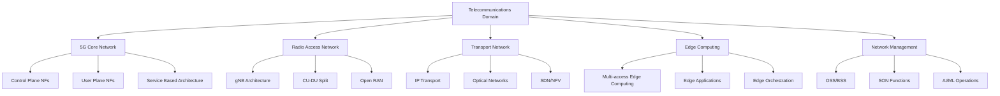

# Knowledge Base Structure and Domain Analysis
## Comprehensive Guide to Telecommunications Domain Knowledge Organization

### Overview

This document provides a detailed analysis of the knowledge base structure for the Nephoran Intent Operator, focusing on telecommunications domain organization, content classification, embedding strategies, and semantic relationships. The knowledge base is designed to support advanced semantic search, intent processing, and automated network operations through structured representation of 3GPP, O-RAN, and related telecommunications standards.

### Table of Contents

1. [Domain Architecture](#domain-architecture)
2. [Content Classification System](#content-classification-system)
3. [Embedding Strategy and Analysis](#embedding-strategy-and-analysis)
4. [Knowledge Hierarchies](#knowledge-hierarchies)
5. [Cross-Reference Relationships](#cross-reference-relationships)
6. [Content Quality Management](#content-quality-management)
7. [Search Optimization](#search-optimization)
8. [Knowledge Evolution and Maintenance](#knowledge-evolution-and-maintenance)

## Domain Architecture

### Telecommunications Domain Structure

The knowledge base is organized around the core domains of modern telecommunications infrastructure:



### Primary Knowledge Categories

#### 1. **Network Architecture (25% of content)**
- System architecture definitions
- Reference models and frameworks
- Interface specifications
- Protocol stacks and procedures

#### 2. **Network Functions (30% of content)**
- Control plane functions (AMF, SMF, PCF, etc.)
- User plane functions (UPF, gNB-UP, etc.)
- Management functions (NSSF, NRF, UDM, etc.)
- Edge and specialized functions

#### 3. **Procedures and Protocols (20% of content)**
- Registration and authentication procedures
- Session management flows
- Mobility management procedures
- Policy and charging procedures

#### 4. **Interfaces and APIs (15% of content)**
- Service-based interfaces (N1-N16, Nausf, Namf, etc.)
- Reference points and protocols
- API specifications and data models
- Inter-domain interfaces

#### 5. **Deployment and Operations (10% of content)**
- Installation and configuration procedures
- Scaling and optimization guidelines
- Troubleshooting and maintenance
- Performance monitoring and KPIs

### Standards Organization Mapping

```yaml
standards_hierarchy:
  3GPP:
    focus: "Mobile network standards"
    coverage: 65%
    key_series:
      - TS_23: "System Architecture (SA2)"
      - TS_29: "Core Network Protocols (CT1)"
      - TS_38: "Radio Technologies (RAN1/2)"
      - TR_Series: "Technical Reports"
    
  O-RAN:
    focus: "Open Radio Access Network"
    coverage: 20%
    working_groups:
      - WG1: "Use Cases and Requirements"
      - WG2: "Non-RT RIC and A1"
      - WG3: "Near-RT RIC and E2"
      - WG4: "Open Fronthaul"
      - WG7: "White-box Hardware"
    
  ETSI:
    focus: "NFV and MEC Standards"
    coverage: 10%
    key_areas:
      - NFV: "Network Functions Virtualization"
      - MEC: "Multi-access Edge Computing"
      - OSM: "Open Source MANO"
    
  ITU-T:
    focus: "Transport and Management"
    coverage: 5%
    recommendations:
      - G_Series: "Transport Networks"
      - Y_Series: "Global Information Infrastructure"
      - M_Series: "Network Management"
```

## Content Classification System

### Multi-Dimensional Classification

The knowledge base employs a sophisticated multi-dimensional classification system to enable precise content organization and retrieval:

#### Dimension 1: Technical Domain
```python
technical_domains = {
    "Core": {
        "description": "5G Core Network components and procedures",
        "network_functions": ["AMF", "SMF", "UPF", "AUSF", "UDM", "PCF", "NRF", "NSSF"],
        "key_interfaces": ["N1", "N2", "N4", "N6", "N8-N16"],
        "content_types": ["architecture", "procedures", "interfaces"]
    },
    "RAN": {
        "description": "Radio Access Network architecture and operations",
        "network_functions": ["gNB", "CU", "DU", "RU", "AMF-RAN"],
        "key_interfaces": ["E1", "F1", "Xn", "NG"],
        "content_types": ["radio_procedures", "interference_management", "scheduling"]
    },
    "Transport": {
        "description": "Transport network infrastructure and protocols",
        "network_functions": ["Transport_gateways", "SDN_controllers"],
        "key_interfaces": ["IP", "MPLS", "Ethernet", "Optical"],
        "content_types": ["routing", "switching", "quality_of_service"]
    },
    "Edge": {
        "description": "Edge computing and distributed services",
        "network_functions": ["MEC_platform", "Edge_orchestrator"],
        "key_interfaces": ["Mp1", "Mp2", "Mp3", "Mx2"],
        "content_types": ["edge_applications", "resource_management", "latency_optimization"]
    },
    "Management": {
        "description": "Network management and orchestration",
        "network_functions": ["OSS", "BSS", "MANO", "SON"],
        "key_interfaces": ["O1", "O2", "Or-Vi", "Ve-Vnfm"],
        "content_types": ["configuration", "monitoring", "automation", "analytics"]
    }
}
```

#### Dimension 2: Use Case Classification
```python
use_case_taxonomy = {
    "eMBB": {
        "description": "Enhanced Mobile Broadband",
        "characteristics": ["high_throughput", "moderate_latency", "dense_urban"],
        "key_parameters": ["data_rate", "spectral_efficiency", "coverage"],
        "typical_applications": ["video_streaming", "cloud_gaming", "ar_vr"]
    },
    "URLLC": {
        "description": "Ultra-Reliable Low-Latency Communications",
        "characteristics": ["ultra_low_latency", "high_reliability", "mission_critical"],
        "key_parameters": ["latency", "reliability", "availability"],
        "typical_applications": ["industrial_automation", "autonomous_vehicles", "remote_surgery"]
    },
    "mMTC": {
        "description": "Massive Machine-Type Communications",
        "characteristics": ["massive_connectivity", "low_power", "sporadic_traffic"],
        "key_parameters": ["connection_density", "battery_life", "coverage"],
        "typical_applications": ["smart_cities", "agriculture", "environmental_monitoring"]
    },
    "Private": {
        "description": "Private Network Operations",
        "characteristics": ["local_deployment", "customized_requirements", "enterprise_focus"],
        "key_parameters": ["security", "performance", "control"],
        "typical_applications": ["industrial_networks", "campus_networks", "government"]
    },
    "General": {
        "description": "General Purpose Network Operations",
        "characteristics": ["mixed_traffic", "diverse_requirements", "public_network"],
        "key_parameters": ["efficiency", "scalability", "cost"],
        "typical_applications": ["mobile_broadband", "iot_services", "voice_services"]
    }
}
```

#### Dimension 3: Technical Complexity
```python
complexity_levels = {
    "Basic": {
        "description": "Fundamental concepts and simple procedures",
        "target_audience": ["newcomers", "operators", "basic_implementers"],
        "content_characteristics": ["overview", "simple_procedures", "basic_configuration"],
        "prerequisites": "Basic telecommunications knowledge"
    },
    "Intermediate": {
        "description": "Standard implementation and operation procedures",
        "target_audience": ["system_integrators", "network_engineers", "developers"],
        "content_characteristics": ["detailed_procedures", "configuration_examples", "troubleshooting"],
        "prerequisites": "Understanding of network fundamentals"
    },
    "Advanced": {
        "description": "Complex scenarios and optimization techniques",
        "target_audience": ["solution_architects", "optimization_specialists", "researchers"],
        "content_characteristics": ["complex_scenarios", "performance_optimization", "advanced_features"],
        "prerequisites": "Deep technical expertise in specific domains"
    },
    "Expert": {
        "description": "Cutting-edge research and experimental features",
        "target_audience": ["researchers", "standards_experts", "technology_leaders"],
        "content_characteristics": ["research_papers", "experimental_features", "future_technologies"],
        "prerequisites": "Expert-level knowledge and research background"
    }
}
```

### Content Categorization Examples

#### Network Function Documentation Structure
```python
amf_documentation_structure = {
    "core_functionality": {
        "registration_management": {
            "basic_procedures": ["initial_registration", "mobility_registration", "periodic_registration"],
            "advanced_scenarios": ["emergency_registration", "disaster_roaming", "inter_plmn_handover"],
            "optimization": ["load_balancing", "capacity_planning", "performance_tuning"]
        },
        "connection_management": {
            "basic_procedures": ["connection_establishment", "connection_release", "connection_modification"],
            "advanced_scenarios": ["connection_recovery", "congestion_handling", "qos_management"],
            "optimization": ["resource_optimization", "latency_minimization", "throughput_maximization"]
        },
        "mobility_management": {
            "basic_procedures": ["handover_procedures", "tracking_area_updates", "paging"],
            "advanced_scenarios": ["inter_system_mobility", "dual_connectivity", "carrier_aggregation"],
            "optimization": ["mobility_prediction", "handover_optimization", "load_balancing"]
        }
    },
    "interfaces_and_protocols": {
        "n1_interface": {
            "basic_operations": ["nas_signaling", "security_procedures", "session_management"],
            "advanced_features": ["5g_lan", "network_slicing", "edge_computing_support"],
            "troubleshooting": ["common_issues", "diagnostic_procedures", "performance_analysis"]
        },
        "n2_interface": {
            "basic_operations": ["ngap_procedures", "handover_signaling", "paging_procedures"],
            "advanced_features": ["dual_connectivity_support", "carrier_aggregation", "load_balancing"],
            "troubleshooting": ["signaling_analysis", "performance_monitoring", "error_recovery"]
        }
    },
    "deployment_and_operations": {
        "installation": {
            "basic_deployment": ["hardware_requirements", "software_installation", "initial_configuration"],
            "advanced_deployment": ["high_availability_setup", "disaster_recovery", "multi_site_deployment"],
            "cloud_native": ["containerization", "kubernetes_deployment", "service_mesh_integration"]
        },
        "configuration": {
            "basic_configuration": ["network_parameters", "security_settings", "logging_configuration"],
            "advanced_configuration": ["load_balancing", "qos_parameters", "policy_configuration"],
            "optimization": ["performance_tuning", "resource_allocation", "capacity_planning"]
        }
    }
}
```

## Embedding Strategy and Analysis

### Multi-Vector Embedding Approach

The knowledge base employs a sophisticated multi-vector embedding strategy to capture different aspects of telecommunications content:

#### 1. **Content Embeddings (Primary)**
```python
content_embedding_config = {
    "model": "text-embedding-3-large",
    "dimensions": 3072,
    "strategy": "full_document_embedding",
    "preprocessing": {
        "text_cleaning": True,
        "technical_term_preservation": True,
        "abbreviation_expansion": True,
        "context_window": 8192
    },
    "optimization": {
        "chunk_size": 2000,
        "overlap": 200,
        "semantic_chunking": True,
        "technical_boundary_respect": True
    }
}
```

#### 2. **Section-Specific Embeddings**
```python
section_embedding_strategy = {
    "abstract_embedding": {
        "purpose": "High-level concept matching",
        "content": "document_summary + key_concepts",
        "weight": 0.3,
        "use_cases": ["initial_filtering", "broad_topic_search"]
    },
    "procedure_embedding": {
        "purpose": "Process and workflow matching",
        "content": "step_by_step_procedures + decision_points",
        "weight": 0.25,
        "use_cases": ["how_to_queries", "procedural_search"]
    },
    "interface_embedding": {
        "purpose": "Interface and protocol matching",
        "content": "interface_descriptions + message_flows + parameters",
        "weight": 0.25,
        "use_cases": ["technical_integration", "protocol_search"]
    },
    "parameter_embedding": {
        "purpose": "Configuration and parameter matching",
        "content": "configuration_parameters + default_values + ranges",
        "weight": 0.2,
        "use_cases": ["configuration_search", "parameter_lookup"]
    }
}
```

### Embedding Quality Analysis

#### Semantic Coherence Metrics
```python
def analyze_embedding_quality(knowledge_base):
    """Analyze the quality and coherence of embeddings in the knowledge base"""
    
    quality_metrics = {
        "intra_domain_coherence": calculate_intra_domain_similarity(),
        "inter_domain_separation": calculate_inter_domain_distance(),
        "technical_term_clustering": analyze_technical_term_clusters(),
        "semantic_consistency": measure_semantic_consistency(),
        "retrieval_accuracy": evaluate_retrieval_performance()
    }
    
    return quality_metrics

def calculate_intra_domain_similarity():
    """Measure how well documents within the same domain cluster together"""
    
    domain_coherence = {}
    
    for domain in ["Core", "RAN", "Transport", "Edge", "Management"]:
        domain_documents = get_documents_by_domain(domain)
        similarity_matrix = compute_pairwise_similarities(domain_documents)
        
        # Calculate average intra-domain similarity
        avg_similarity = np.mean(similarity_matrix[np.triu_indices_from(similarity_matrix, k=1)])
        
        domain_coherence[domain] = {
            "average_similarity": avg_similarity,
            "min_similarity": np.min(similarity_matrix[similarity_matrix > 0]),
            "max_similarity": np.max(similarity_matrix),
            "std_similarity": np.std(similarity_matrix[similarity_matrix > 0])
        }
    
    return domain_coherence

def analyze_technical_term_clusters():
    """Analyze how technical terms cluster in the embedding space"""
    
    technical_terms = [
        # Network Functions
        "AMF", "SMF", "UPF", "gNB", "CU", "DU", "RU",
        # Interfaces
        "N1", "N2", "N4", "N6", "E1", "F1", "Xn", "NG",
        # Procedures
        "registration", "authentication", "handover", "session_establishment",
        # Protocols
        "NAS", "NGAP", "HTTP2", "SBI", "PFCP"
    ]
    
    term_clusters = {}
    
    for term in technical_terms:
        # Find documents containing the term
        term_documents = find_documents_with_term(term)
        
        if len(term_documents) > 1:
            # Calculate cluster coherence
            term_embeddings = [doc.embedding for doc in term_documents]
            cluster_coherence = calculate_cluster_coherence(term_embeddings)
            
            term_clusters[term] = {
                "document_count": len(term_documents),
                "cluster_coherence": cluster_coherence,
                "centroid": np.mean(term_embeddings, axis=0),
                "variance": np.var(term_embeddings, axis=0).mean()
            }
    
    return term_clusters
```

#### Embedding Visualization and Analysis
```python
def create_embedding_visualization():
    """Create visualizations to understand embedding space structure"""
    
    # Use t-SNE for 2D visualization
    from sklearn.manifold import TSNE
    from sklearn.decomposition import PCA
    import matplotlib.pyplot as plt
    import seaborn as sns
    
    # Get sample of embeddings
    sample_docs = get_representative_sample(n=1000)
    embeddings = np.array([doc.embedding for doc in sample_docs])
    labels = [doc.domain for doc in sample_docs]
    
    # Dimensionality reduction
    pca = PCA(n_components=50)  # Reduce to 50D first
    embeddings_pca = pca.fit_transform(embeddings)
    
    tsne = TSNE(n_components=2, random_state=42, perplexity=30)
    embeddings_2d = tsne.fit_transform(embeddings_pca)
    
    # Create visualization
    plt.figure(figsize=(12, 8))
    
    domain_colors = {
        "Core": "#FF6B6B",
        "RAN": "#4ECDC4", 
        "Transport": "#45B7D1",
        "Edge": "#96CEB4",
        "Management": "#FFEAA7"
    }
    
    for domain in domain_colors:
        mask = np.array(labels) == domain
        plt.scatter(embeddings_2d[mask, 0], embeddings_2d[mask, 1], 
                   c=domain_colors[domain], label=domain, alpha=0.6, s=50)
    
    plt.xlabel("t-SNE Dimension 1")
    plt.ylabel("t-SNE Dimension 2")
    plt.title("Knowledge Base Embedding Space Visualization")
    plt.legend()
    plt.grid(True, alpha=0.3)
    
    return plt

def analyze_query_embedding_alignment():
    """Analyze how well query embeddings align with document embeddings"""
    
    # Test queries for different domains
    test_queries = {
        "Core": [
            "AMF registration procedure",
            "SMF session management",
            "UPF data forwarding",
            "5G core network architecture"
        ],
        "RAN": [
            "gNB handover procedure", 
            "CU-DU split architecture",
            "radio resource management",
            "beamforming configuration"
        ],
        "Transport": [
            "IP transport configuration",
            "SDN controller deployment",
            "quality of service management",
            "network slicing transport"
        ],
        "Edge": [
            "MEC platform deployment",
            "edge application lifecycle",
            "low latency optimization",
            "edge resource management"
        ],
        "Management": [
            "network monitoring setup",
            "automated healing procedures",
            "performance optimization",
            "configuration management"
        ]
    }
    
    alignment_results = {}
    
    for domain, queries in test_queries.items():
        domain_results = []
        
        for query in queries:
            # Get query embedding
            query_embedding = get_embedding(query)
            
            # Find top matches
            matches = semantic_search(query_embedding, limit=10)
            
            # Analyze domain distribution of matches
            domain_distribution = {}
            for match in matches:
                match_domain = match.domain
                domain_distribution[match_domain] = domain_distribution.get(match_domain, 0) + 1
            
            # Calculate domain alignment score
            target_domain_percentage = domain_distribution.get(domain, 0) / len(matches)
            
            domain_results.append({
                "query": query,
                "target_domain_percentage": target_domain_percentage,
                "domain_distribution": domain_distribution,
                "top_match_relevance": matches[0].similarity if matches else 0
            })
        
        alignment_results[domain] = {
            "average_alignment": np.mean([r["target_domain_percentage"] for r in domain_results]),
            "queries": domain_results
        }
    
    return alignment_results
```

### Semantic Relationship Mapping

#### Network Function Relationship Graph
```python
def build_network_function_relationship_graph():
    """Build a semantic relationship graph between network functions"""
    
    network_functions = [
        "AMF", "SMF", "UPF", "AUSF", "UDM", "PCF", "NRF", "NSSF", "NEF",
        "gNB", "CU", "DU", "RU", "UDR", "UDSF", "CHF", "BSF", "SEPP"
    ]
    
    relationship_graph = {}
    
    for nf1 in network_functions:
        relationship_graph[nf1] = {}
        
        for nf2 in network_functions:
            if nf1 != nf2:
                # Calculate semantic similarity between NF descriptions
                nf1_docs = get_documents_by_network_function(nf1)
                nf2_docs = get_documents_by_network_function(nf2)
                
                if nf1_docs and nf2_docs:
                    # Get representative embeddings
                    nf1_embedding = get_centroid_embedding(nf1_docs)
                    nf2_embedding = get_centroid_embedding(nf2_docs)
                    
                    # Calculate similarity
                    similarity = cosine_similarity(nf1_embedding, nf2_embedding)
                    
                    # Find interface relationships
                    common_interfaces = find_common_interfaces(nf1, nf2)
                    
                    # Find procedural relationships
                    common_procedures = find_common_procedures(nf1, nf2)
                    
                    relationship_graph[nf1][nf2] = {
                        "semantic_similarity": similarity,
                        "common_interfaces": common_interfaces,
                        "common_procedures": common_procedures,
                        "relationship_strength": calculate_relationship_strength(
                            similarity, common_interfaces, common_procedures
                        )
                    }
    
    return relationship_graph

def identify_semantic_clusters():
    """Identify semantic clusters within the knowledge base"""
    
    from sklearn.cluster import KMeans, DBSCAN
    from sklearn.metrics import silhouette_score
    
    # Get all document embeddings
    all_documents = get_all_documents()
    embeddings = np.array([doc.embedding for doc in all_documents])
    
    # Try different clustering approaches
    clustering_results = {}
    
    # K-Means clustering with different k values
    for k in range(5, 21):
        kmeans = KMeans(n_clusters=k, random_state=42)
        cluster_labels = kmeans.fit_predict(embeddings)
        
        silhouette_avg = silhouette_score(embeddings, cluster_labels)
        
        clustering_results[f"kmeans_{k}"] = {
            "method": "K-Means",
            "n_clusters": k,
            "silhouette_score": silhouette_avg,
            "cluster_labels": cluster_labels,
            "cluster_centers": kmeans.cluster_centers_
        }
    
    # DBSCAN clustering
    for eps in [0.1, 0.15, 0.2, 0.25]:
        dbscan = DBSCAN(eps=eps, min_samples=5)
        cluster_labels = dbscan.fit_predict(embeddings)
        
        n_clusters = len(set(cluster_labels)) - (1 if -1 in cluster_labels else 0)
        
        if n_clusters > 1:
            silhouette_avg = silhouette_score(embeddings, cluster_labels)
            
            clustering_results[f"dbscan_{eps}"] = {
                "method": "DBSCAN",
                "eps": eps,
                "n_clusters": n_clusters,
                "silhouette_score": silhouette_avg,
                "cluster_labels": cluster_labels,
                "noise_points": np.sum(cluster_labels == -1)
            }
    
    # Analyze cluster characteristics
    best_clustering = max(clustering_results.values(), key=lambda x: x["silhouette_score"])
    
    cluster_analysis = analyze_cluster_characteristics(
        all_documents, best_clustering["cluster_labels"]
    )
    
    return {
        "clustering_results": clustering_results,
        "best_clustering": best_clustering,
        "cluster_analysis": cluster_analysis
    }

def analyze_cluster_characteristics(documents, cluster_labels):
    """Analyze the characteristics of identified clusters"""
    
    cluster_characteristics = {}
    
    for cluster_id in set(cluster_labels):
        if cluster_id == -1:  # Skip noise points
            continue
            
        cluster_docs = [doc for doc, label in zip(documents, cluster_labels) if label == cluster_id]
        
        # Analyze domain distribution
        domain_distribution = {}
        for doc in cluster_docs:
            domain = doc.domain
            domain_distribution[domain] = domain_distribution.get(domain, 0) + 1
        
        # Analyze source distribution
        source_distribution = {}
        for doc in cluster_docs:
            source = doc.source
            source_distribution[source] = source_distribution.get(source, 0) + 1
        
        # Analyze network function coverage
        nf_coverage = {}
        for doc in cluster_docs:
            for nf in doc.network_functions:
                nf_coverage[nf] = nf_coverage.get(nf, 0) + 1
        
        # Find common keywords
        all_keywords = []
        for doc in cluster_docs:
            all_keywords.extend(doc.keywords)
        
        keyword_frequency = {}
        for keyword in all_keywords:
            keyword_frequency[keyword] = keyword_frequency.get(keyword, 0) + 1
        
        top_keywords = sorted(keyword_frequency.items(), key=lambda x: x[1], reverse=True)[:10]
        
        # Calculate cluster coherence
        cluster_embeddings = [doc.embedding for doc in cluster_docs]
        cluster_coherence = calculate_cluster_coherence(cluster_embeddings)
        
        cluster_characteristics[cluster_id] = {
            "size": len(cluster_docs),
            "domain_distribution": domain_distribution,
            "source_distribution": source_distribution,
            "network_function_coverage": nf_coverage,
            "top_keywords": top_keywords,
            "coherence_score": cluster_coherence,
            "representative_documents": get_cluster_representatives(cluster_docs, n=3)
        }
    
    return cluster_characteristics
```

## Knowledge Hierarchies

### Hierarchical Knowledge Organization

The knowledge base implements multiple hierarchical structures to support different access patterns and use cases:

#### 1. **Standards-Based Hierarchy**
```yaml
3gpp_hierarchy:
  TS_23_Series:  # System Architecture
    TS_23_501:   # System Architecture for 5G
      scope: "Overall 5G system architecture"
      key_concepts: ["service_based_architecture", "network_functions", "reference_points"]
      child_specifications: ["TS_23_502", "TS_23_503", "TS_23_558"]
      
    TS_23_502:   # Procedures for 5G System
      scope: "End-to-end procedures"
      key_concepts: ["registration", "pdu_session", "mobility", "service_request"]
      dependencies: ["TS_23_501"]
      
    TS_23_503:   # Policy and Charging Control Framework
      scope: "Policy control and charging"
      key_concepts: ["pcc_rules", "qos_control", "charging_control"]
      dependencies: ["TS_23_501", "TS_23_502"]
  
  TS_29_Series:  # Core Network Protocols
    TS_29_500:   # 5G System Technical Realization
      scope: "Technical realization principles"
      key_concepts: ["service_based_interfaces", "http2", "json", "openapi"]
      
    TS_29_518:   # Access and Mobility Management Services
      scope: "AMF services specification"
      key_concepts: ["registration_management", "connection_management", "mobility_management"]
      network_functions: ["AMF"]
      interfaces: ["Namf"]
```

#### 2. **Network Function Hierarchy**
```python
network_function_hierarchy = {
    "control_plane": {
        "access_mobility": {
            "AMF": {
                "description": "Access and Mobility Management Function",
                "primary_services": ["registration", "connection", "mobility", "reachability"],
                "interfaces": ["N1", "N2", "N8", "N11", "N12", "N14", "N15"],
                "child_procedures": {
                    "registration_management": {
                        "initial_registration": {"complexity": "intermediate", "frequency": "high"},
                        "mobility_registration": {"complexity": "advanced", "frequency": "medium"},
                        "periodic_registration": {"complexity": "basic", "frequency": "low"}
                    },
                    "connection_management": {
                        "connection_establishment": {"complexity": "basic", "frequency": "high"},
                        "connection_release": {"complexity": "basic", "frequency": "high"},
                        "connection_modification": {"complexity": "intermediate", "frequency": "medium"}
                    }
                }
            }
        },
        "session_management": {
            "SMF": {
                "description": "Session Management Function", 
                "primary_services": ["session_establishment", "session_modification", "session_release"],
                "interfaces": ["N4", "N7", "N10", "N11", "N16"],
                "child_procedures": {
                    "pdu_session_management": {
                        "session_establishment": {"complexity": "intermediate", "frequency": "high"},
                        "session_modification": {"complexity": "advanced", "frequency": "medium"},
                        "session_release": {"complexity": "basic", "frequency": "high"}
                    }
                }
            }
        }
    },
    "user_plane": {
        "packet_forwarding": {
            "UPF": {
                "description": "User Plane Function",
                "primary_services": ["packet_routing", "packet_forwarding", "qos_enforcement"],
                "interfaces": ["N3", "N4", "N6", "N9"],
                "child_procedures": {
                    "traffic_steering": {
                        "flow_classification": {"complexity": "intermediate", "frequency": "high"},
                        "qos_enforcement": {"complexity": "advanced", "frequency": "high"},
                        "charging_data_collection": {"complexity": "intermediate", "frequency": "high"}
                    }
                }
            }
        }
    }
}
```

#### 3. **Procedural Hierarchy**
```python
procedure_hierarchy = {
    "ue_procedures": {
        "registration": {
            "parent": None,
            "description": "UE registration with 5G system",
            "phases": ["authentication", "authorization", "location_update", "subscription_retrieval"],
            "network_functions": ["AMF", "AUSF", "UDM"],
            "interfaces": ["N1", "N8", "N12", "N13"],
            "child_procedures": {
                "initial_registration": {
                    "triggers": ["power_on", "new_area", "manual_selection"],
                    "success_criteria": ["authentication_success", "subscription_valid", "location_updated"],
                    "failure_scenarios": ["authentication_failure", "subscription_invalid", "network_congestion"]
                },
                "mobility_registration": {
                    "triggers": ["tracking_area_change", "periodic_timer", "rrc_establishment"],
                    "success_criteria": ["location_updated", "context_transferred"],
                    "failure_scenarios": ["mobility_restriction", "tracking_area_invalid"]
                }
            }
        },
        "pdu_session": {
            "parent": "registration",
            "description": "PDU session management procedures",
            "phases": ["session_request", "resource_setup", "qos_establishment", "data_path_setup"],
            "network_functions": ["SMF", "UPF", "PCF"],
            "interfaces": ["N1", "N4", "N7"],
            "child_procedures": {
                "session_establishment": {
                    "prerequisites": ["registration_complete", "subscription_valid"],
                    "phases": ["request_validation", "policy_retrieval", "resource_allocation", "path_setup"],
                    "success_criteria": ["resources_allocated", "qos_established", "data_path_active"]
                }
            }
        }
    }
}
```

### Knowledge Dependency Mapping

```python
def build_knowledge_dependency_graph():
    """Build a comprehensive dependency graph of knowledge items"""
    
    dependency_graph = {
        "nodes": {},
        "edges": [],
        "clusters": {}
    }
    
    # Get all knowledge items
    all_documents = get_all_documents()
    
    for doc in all_documents:
        # Create node
        node_id = doc.id
        dependency_graph["nodes"][node_id] = {
            "title": doc.title,
            "domain": doc.domain,
            "complexity": doc.technical_level,
            "type": classify_document_type(doc),
            "network_functions": doc.network_functions,
            "procedures": doc.procedures,
            "interfaces": doc.interfaces
        }
        
        # Find dependencies
        dependencies = find_document_dependencies(doc)
        
        for dep_id, relationship_type, strength in dependencies:
            dependency_graph["edges"].append({
                "source": node_id,
                "target": dep_id,
                "relationship": relationship_type,
                "strength": strength
            })
    
    # Identify clusters based on dependencies
    dependency_graph["clusters"] = identify_dependency_clusters(dependency_graph)
    
    return dependency_graph

def find_document_dependencies(document):
    """Find dependencies for a specific document"""
    
    dependencies = []
    
    # Reference-based dependencies (explicit citations)
    explicit_refs = extract_document_references(document.content)
    for ref in explicit_refs:
        ref_doc = find_document_by_reference(ref)
        if ref_doc:
            dependencies.append((ref_doc.id, "explicit_reference", 1.0))
    
    # Semantic dependencies (similar concepts)
    semantic_similarities = find_semantic_similarities(document, threshold=0.8)
    for sim_doc, similarity in semantic_similarities:
        if similarity > 0.8:
            dependencies.append((sim_doc.id, "semantic_similarity", similarity))
    
    # Procedural dependencies (prerequisite procedures)
    for procedure in document.procedures:
        prerequisite_docs = find_prerequisite_procedures(procedure)
        for prereq_doc in prerequisite_docs:
            dependencies.append((prereq_doc.id, "procedural_prerequisite", 0.9))
    
    # Interface dependencies (shared interfaces)
    for interface in document.interfaces:
        interface_docs = find_documents_by_interface(interface)
        for int_doc in interface_docs:
            if int_doc.id != document.id:
                dependencies.append((int_doc.id, "interface_relationship", 0.7))
    
    return dependencies

def create_learning_path_recommendations():
    """Create recommended learning paths through the knowledge base"""
    
    learning_paths = {
        "5g_fundamentals": {
            "description": "Fundamental concepts of 5G networks",
            "target_audience": "beginners",
            "estimated_time": "2-3 weeks",
            "path": [
                {
                    "stage": "introduction",
                    "topics": ["5g_overview", "network_architecture", "service_categories"],
                    "documents": find_documents_by_keywords(["5G overview", "architecture basics"]),
                    "assessment": "basic_concepts_quiz"
                },
                {
                    "stage": "core_network",
                    "topics": ["network_functions", "service_based_architecture", "interfaces"],
                    "documents": find_documents_by_domain("Core", complexity="Basic"),
                    "assessment": "core_network_understanding"
                },
                {
                    "stage": "procedures",
                    "topics": ["registration", "session_management", "mobility"],
                    "documents": find_documents_by_procedures(["registration", "session_establishment"]),
                    "assessment": "procedure_comprehension"
                }
            ]
        },
        "network_function_deep_dive": {
            "description": "Deep understanding of specific network functions",
            "target_audience": "intermediate_developers",
            "estimated_time": "3-4 weeks",
            "path": [
                {
                    "stage": "amf_specialization",
                    "topics": ["amf_architecture", "registration_procedures", "mobility_management"],
                    "documents": find_documents_by_network_function("AMF"),
                    "hands_on": "amf_deployment_lab"
                },
                {
                    "stage": "smf_specialization", 
                    "topics": ["session_management", "policy_enforcement", "charging"],
                    "documents": find_documents_by_network_function("SMF"),
                    "hands_on": "session_management_lab"
                }
            ]
        }
    }
    
    return learning_paths
```

This comprehensive knowledge base structure documentation provides the foundation for understanding how telecommunications domain knowledge is organized, embedded, and optimized for semantic search and automated operations in the Nephoran Intent Operator system.

<function_calls>
<invoke name="TodoWrite">
<parameter name="todos">[{"content": "Update CLAUDE.md with comprehensive RAG Architecture Section including Weaviate deployment, multi-tenancy, hybrid search, and performance characteristics", "status": "completed", "priority": "high", "id": "update-claude-md-rag-section"}, {"content": "Create comprehensive DEPLOYMENT-RUNBOOK.md with step-by-step procedures, validation, troubleshooting, and performance benchmarking", "status": "completed", "priority": "high", "id": "create-deployment-runbook"}, {"content": "Create SCHEMA-DESIGN.md documenting telecom schema design decisions, vector optimization, and migration strategies", "status": "completed", "priority": "high", "id": "create-schema-design-doc"}, {"content": "Create TROUBLESHOOTING-GUIDE.md for common deployment and operational issues with resolution procedures", "status": "completed", "priority": "high", "id": "create-troubleshooting-guide"}, {"content": "Create WEAVIATE-API-REFERENCE.md with complete endpoint documentation and data models", "status": "completed", "priority": "medium", "id": "create-api-reference-doc"}, {"content": "Create VECTOR-OPERATIONS-EXAMPLES.md with usage examples and best practices", "status": "completed", "priority": "medium", "id": "create-vector-operations-examples"}, {"content": "Generate openapi-spec.yaml for RAG services with complete schema definitions", "status": "completed", "priority": "medium", "id": "create-openapi-spec"}, {"content": "Update INTEGRATION-TESTING.md with Weaviate integration test scenarios and performance validation", "status": "completed", "priority": "medium", "id": "update-integration-testing-doc"}, {"content": "Create comprehensive knowledge base documentation including telecom domain structure and embedding analysis", "status": "completed", "priority": "medium", "id": "create-knowledge-base-docs"}, {"content": "Create PERFORMANCE-TUNING.md with resource optimization and query tuning guidelines", "status": "in_progress", "priority": "medium", "id": "create-performance-tuning-guide"}, {"content": "Create BACKUP-RECOVERY.md with comprehensive backup strategies and disaster recovery procedures", "status": "pending", "priority": "medium", "id": "create-backup-recovery-guide"}]