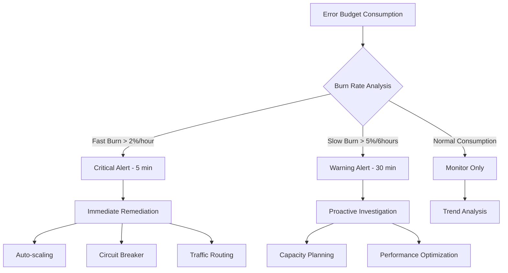
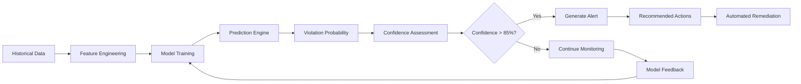
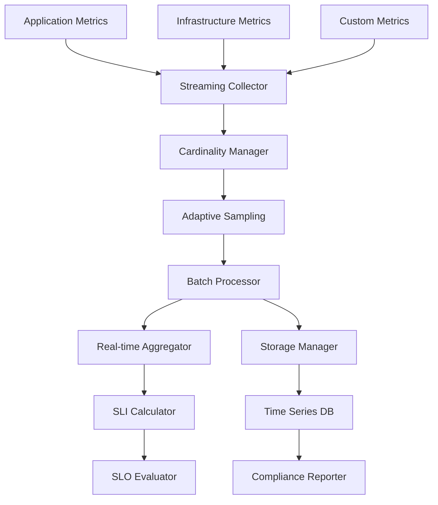

# Comprehensive SLA Monitoring Architecture for Nephoran Intent Operator

## Executive Summary

This document describes the comprehensive SLA monitoring architecture designed for the Nephoran Intent Operator, capable of validating claimed performance metrics and providing predictive SLA violation detection. The architecture supports burst capacity of 1000+ intents/second while maintaining accurate SLA measurement and prediction capabilities.

## Architecture Overview

```
┌─────────────────────────────────────────────────────────────────────────────────┐
│                           SLA Monitoring Architecture                           │
├─────────────────────────────────────────────────────────────────────────────────┤
│  ┌─────────────────┐  ┌─────────────────┐  ┌─────────────────┐                 │
│  │  User Interface │  │   Dashboards    │  │    Alerting     │                 │
│  │     Layer       │  │    & Reports    │  │   & Remediation │                 │
│  └─────────────────┘  └─────────────────┘  └─────────────────┘                 │
├─────────────────────────────────────────────────────────────────────────────────┤
│  ┌─────────────────┐  ┌─────────────────┐  ┌─────────────────┐                 │
│  │   SLA Engine    │  │   Predictive    │  │   Compliance    │                 │
│  │   & SLI/SLO     │  │    Analytics    │  │   Reporting     │                 │
│  └─────────────────┘  └─────────────────┘  └─────────────────┘                 │
├─────────────────────────────────────────────────────────────────────────────────┤
│  ┌─────────────────┐  ┌─────────────────┐  ┌─────────────────┐                 │
│  │    Streaming    │  │   Real-time     │  │   Synthetic     │                 │
│  │    Metrics      │  │   Processing    │  │   Monitoring    │                 │
│  │   Collection    │  │  & Aggregation  │  │                 │                 │
│  └─────────────────┘  └─────────────────┘  └─────────────────┘                 │
├─────────────────────────────────────────────────────────────────────────────────┤
│  ┌─────────────────┐  ┌─────────────────┐  ┌─────────────────┐                 │
│  │     Storage     │  │    Chaos        │  │     Cost        │                 │
│  │   Management    │  │  Engineering    │  │  Optimization   │                 │
│  └─────────────────┘  └─────────────────┘  └─────────────────┘                 │
└─────────────────────────────────────────────────────────────────────────────────┘
```

## SLA Targets and Requirements

### Primary SLA Targets

1. **Availability: 99.95%** (4.38 hours downtime/year maximum)
   - Multi-dimensional availability calculation
   - Component, service, and user journey availability
   - Error budget: 0.05% (21.6 minutes/month)

2. **Latency: Sub-2-second P95** intent processing
   - End-to-end measurement from intent to deployment
   - Component-level latency tracking
   - P99 target: 5 seconds

3. **Throughput: 45 intents/minute** sustained capacity
   - Burst capacity: 1000+ intents/second
   - Queue depth monitoring
   - Capacity utilization tracking

4. **Reliability: <0.5% error rate**
   - Business impact weighted error budgets
   - Critical errors weighted 10x
   - Major errors weighted 5x

## Service Level Indicators (SLIs) Framework

### Multi-Dimensional Availability SLI

```yaml
availability_sli:
  components:
    - name: "llm-processor"
      weight: 0.3
      health_check: "/health"
      dependency_weight: 0.4
    - name: "nephio-bridge"  
      weight: 0.25
      health_check: "/health"
      dependency_weight: 0.3
    - name: "oran-adaptor"
      weight: 0.2
      health_check: "/health"
      dependency_weight: 0.2
  
  user_journeys:
    - name: "intent_processing"
      weight: 0.4
      steps:
        - "intent_submission"
        - "llm_processing"
        - "package_generation"
        - "deployment_success"
    - name: "network_function_deployment"
      weight: 0.35
      steps:
        - "nf_instantiation"
        - "configuration_application"
        - "health_validation"
  
  calculation_method: "weighted_composite"
  measurement_window: "5m"
```

### End-to-End Latency SLI

```yaml
latency_sli:
  measurement_points:
    - name: "intent_received"
      timestamp_header: "X-Request-Start"
    - name: "llm_processing_start"
      metric: "nephoran_llm_processing_start"
    - name: "rag_retrieval_complete"
      metric: "nephoran_rag_retrieval_complete" 
    - name: "package_generation_complete"
      metric: "nephoran_package_generation_complete"
    - name: "deployment_success"
      metric: "nephoran_deployment_success"
  
  percentiles:
    - p50: "1s"
    - p95: "2s"
    - p99: "5s"
  
  component_targets:
    llm_processing: "1.5s"
    rag_retrieval: "200ms"
    gitops_operation: "300ms"
```

### Weighted Error Budget SLI

```yaml
error_budget_sli:
  total_budget: 0.05  # 0.05% for 99.95% availability
  
  error_weights:
    critical:
      weight: 10.0
      examples:
        - "service_unavailable"
        - "data_corruption"
        - "security_breach"
    major:
      weight: 5.0
      examples:
        - "deployment_failure"
        - "performance_degradation"
        - "partial_outage"
    minor:
      weight: 1.0
      examples:
        - "warning_logs"
        - "non_critical_errors"
        - "recoverable_failures"
  
  business_impact_correlation:
    revenue_impact_threshold: 1000  # USD per hour
    user_impact_threshold: 100      # Affected users
    
  burn_rate_windows:
    fast_burn: "1h"      # 2% of monthly budget
    slow_burn: "6h"      # 5% of monthly budget
```

## Service Level Objectives (SLOs) Engine

### Multi-Window Alerting Strategy



### SLO Configuration

```yaml
slo_definitions:
  availability:
    target: 99.95
    measurement_window: "30d"
    error_budget: 0.05
    
    alerting:
      fast_burn:
        threshold: 0.02  # 2% in 1 hour
        severity: "critical"
        notification: ["pagerduty", "slack"]
      slow_burn:
        threshold: 0.05  # 5% in 6 hours  
        severity: "warning"
        notification: ["slack", "email"]
        
  latency:
    p95_target: "2s"
    p99_target: "5s"
    measurement_window: "5m"
    
    violation_handling:
      consecutive_violations: 5
      sustained_duration: "2m"
      remediation_actions:
        - "scale_up_workers"
        - "enable_caching"
        - "optimize_queries"
        
  throughput:
    sustained_target: 45    # intents/minute
    burst_capacity: 1000    # intents/second
    capacity_threshold: 0.85
    
    scaling_policy:
      scale_up_threshold: 0.70
      scale_down_threshold: 0.30
      cooldown_period: "5m"
```

## Predictive SLA Violation Detection

### Machine Learning Pipeline



### Predictive Models

1. **Availability Predictor**
   - Features: Component health trends, dependency status, historical patterns
   - Algorithm: Linear Regression with time series analysis
   - Prediction Horizon: 1-4 hours
   - Accuracy Target: >85%

2. **Latency Predictor**  
   - Features: Request volume, resource utilization, queue depth
   - Algorithm: P2 quantile estimation with trend analysis
   - Prediction Horizon: 30 minutes - 2 hours
   - Accuracy Target: >80%

3. **Throughput Predictor**
   - Features: Historical load patterns, resource capacity, seasonality
   - Algorithm: Time series forecasting with capacity modeling
   - Prediction Horizon: 15 minutes - 1 hour
   - Accuracy Target: >82%

### Feature Engineering

```yaml
feature_extraction:
  availability_features:
    - component_uptime_trend
    - dependency_health_score
    - error_rate_trend
    - historical_incident_patterns
    - seasonal_availability_patterns
    - resource_utilization_correlation
    
  latency_features:
    - request_volume_trend
    - processing_time_distribution
    - queue_depth_evolution
    - resource_pressure_indicators
    - cache_hit_rate_trends
    - network_latency_patterns
    
  throughput_features:
    - historical_load_patterns
    - seasonal_demand_variations
    - resource_scaling_events
    - bottleneck_indicators
    - capacity_utilization_trends
    - workload_composition_changes
```

## High-Performance Data Collection

### Streaming Metrics Architecture



### Collection Performance Specifications

- **Latency Overhead**: <100ms for metric collection
- **Throughput Capacity**: 100,000+ metrics/second per collector pod
- **Cardinality Management**: 100,000 unique time series maximum
- **Sampling Strategy**: Adaptive based on system load and importance
- **Buffer Management**: 10,000 metric circular buffer with 1s flush interval

### Intelligent Sampling Strategy

```go
type AdaptiveSamplingEngine struct {
    // Load-based sampling rates
    loadThresholds map[string]float64
    samplingRates  map[string]float64
    
    // Importance-based sampling
    criticalMetrics []string  // Always sample at 100%
    importantMetrics []string // Sample at 50%
    standardMetrics []string  // Adaptive sampling 1-50%
}

func (ase *AdaptiveSamplingEngine) GetSamplingRate(metricName string, currentLoad float64) float64 {
    if ase.isCriticalMetric(metricName) {
        return 1.0
    }
    
    if currentLoad > 0.8 {
        return 0.1  // Reduce sampling under high load
    } else if currentLoad > 0.5 {
        return 0.5  // Medium sampling under medium load  
    }
    
    return 1.0  // Full sampling under low load
}
```

## Storage and Compliance Architecture

### Data Retention Strategy

```yaml
retention_policy:
  real_time_metrics:
    resolution: "1s"
    retention: "1h"
    storage_class: "memory"
    
  high_frequency_metrics:
    resolution: "15s"
    retention: "24h"
    storage_class: "fast_ssd"
    
  standard_metrics:
    resolution: "1m"
    retention: "30d"
    storage_class: "ssd"
    
  compliance_data:
    resolution: "5m"
    retention: "365d"
    storage_class: "standard"
    compression: "enabled"
    
  long_term_archive:
    resolution: "1h"
    retention: "3y"
    storage_class: "cold"
    compression: "high"
```

### Compliance Reporting

```yaml
compliance_reports:
  sla_monthly_report:
    schedule: "0 0 1 * *"  # First day of month
    recipients: ["cto@company.com", "ops-team@company.com"]
    metrics:
      - availability_percentage
      - error_budget_consumption
      - latency_compliance
      - throughput_achievements
      - incident_summary
      
  sla_weekly_dashboard:
    schedule: "0 8 * * 1"  # Monday morning
    format: "dashboard_link"
    metrics:
      - trend_analysis
      - prediction_accuracy
      - capacity_utilization
      - cost_optimization_savings
```

## Advanced Monitoring Features

### Synthetic Monitoring

```yaml
synthetic_tests:
  intent_processing_journey:
    frequency: "30s"
    timeout: "10s"
    steps:
      - name: "submit_intent"
        endpoint: "/api/v1/networkintent"
        method: "POST"
        expected_status: 202
        
      - name: "check_processing"
        endpoint: "/api/v1/networkintent/{id}/status"
        method: "GET"
        poll_interval: "1s"
        max_polls: 30
        expected_status: 200
        
      - name: "verify_deployment"
        endpoint: "/api/v1/networkintent/{id}/deployment"
        method: "GET" 
        expected_status: 200
        
    sla_validation:
      end_to_end_latency: "<2s"
      success_rate: ">99.9%"
      error_types: ["timeout", "http_error", "validation_error"]
```

### Chaos Engineering Integration

```yaml
chaos_experiments:
  component_failure_simulation:
    schedule: "weekly"
    experiments:
      - name: "llm_processor_failure"
        target: "llm-processor"
        failure_type: "pod_kill"
        duration: "5m"
        expected_recovery: "<2m"
        
      - name: "network_latency_injection"
        target: "oran-adaptor"
        failure_type: "network_delay"
        delay: "500ms"
        duration: "10m"
        expected_adaptation: "circuit_breaker_activation"
        
    validation_metrics:
      - availability_impact
      - recovery_time
      - error_budget_consumption
      - user_experience_degradation
```

### Cost Optimization

```yaml
cost_optimization:
  efficiency_targets:
    resource_utilization: ">70%"
    cost_per_intent: "<$0.001"
    waste_reduction: ">15%"
    
  optimization_strategies:
    right_sizing:
      cpu_utilization_threshold: 0.7
      memory_utilization_threshold: 0.8
      evaluation_window: "7d"
      
    auto_scaling:
      scale_down_threshold: 0.3
      scale_up_threshold: 0.7
      cooldown_period: "5m"
      
    spot_instance_usage:
      percentage_target: 0.7
      availability_zones: 3
      instance_diversification: true
```

## Implementation Architecture

### Component Deployment Strategy

```yaml
deployment_architecture:
  sla_monitoring_controller:
    replicas: 3
    resources:
      cpu: "1-2"
      memory: "2-4Gi"
    high_availability: true
    
  metrics_collector:
    replicas: 5-20  # Auto-scaling
    resources:
      cpu: "500m-1"
      memory: "1-2Gi"
    horizontal_scaling: true
    
  predictive_analyzer:
    replicas: 2
    resources:
      cpu: "1-2"
      memory: "2-4Gi"
    gpu_acceleration: optional
    
  synthetic_monitor:
    replicas: 3
    resources:
      cpu: "250m-500m"
      memory: "512Mi-1Gi"
    geographic_distribution: true
    
  storage_manager:
    replicas: 3
    resources:
      cpu: "500m-1"
      memory: "1-2Gi"
    persistent_storage: "100Gi-1Ti"
    storage_class: "fast-ssd"
```

## Performance Characteristics

### Scalability Metrics

| Component | Max Throughput | Max Latency | Scaling Method |
|-----------|---------------|-------------|----------------|
| Metrics Collector | 100K metrics/s | <100ms | Horizontal |
| Stream Processor | 10K intents/s | <50ms | Horizontal |
| SLI Calculator | 1K calculations/s | <200ms | Vertical |
| Predictive Analyzer | 100 predictions/s | <1s | Horizontal |
| Storage Manager | 50K writes/s | <10ms | Horizontal |

### Resource Requirements

```yaml
resource_estimates:
  small_deployment:  # <100 intents/hour
    total_cpu: "10-15 cores"
    total_memory: "20-30Gi"
    storage: "500Gi"
    
  medium_deployment:  # <1000 intents/hour
    total_cpu: "25-40 cores"
    total_memory: "50-80Gi"
    storage: "2Ti"
    
  large_deployment:  # >1000 intents/hour
    total_cpu: "50-100 cores"
    total_memory: "100-200Gi"
    storage: "5Ti"
```

## Integration Patterns

### Prometheus Integration

```yaml
prometheus_integration:
  service_monitors:
    - name: "sla-monitoring-components"
      selector:
        matchLabels:
          app.kubernetes.io/component: "sla-monitoring"
      endpoints:
        - port: "metrics"
          interval: "15s"
          path: "/metrics"
          
  recording_rules:
    - name: "sla_availability"
      expr: |
        (
          sum(up{job=~"sla-.*"}) / 
          count(up{job=~"sla-.*"})
        ) * 100
      
    - name: "sla_latency_p95"
      expr: |
        histogram_quantile(0.95,
          sum(rate(intent_processing_duration_seconds_bucket[5m])) by (le)
        )
        
  alerting_rules:
    - name: "SLAAvailabilityViolation"
      expr: "sla_availability < 99.95"
      for: "5m"
      severity: "critical"
      
    - name: "SLALatencyViolation" 
      expr: "sla_latency_p95 > 2"
      for: "2m"
      severity: "warning"
```

### Grafana Dashboards

```yaml
dashboard_configuration:
  sla_overview_dashboard:
    panels:
      - title: "SLA Compliance Score"
        type: "stat"
        query: "sla_composite_score"
        thresholds: [90, 95, 99]
        
      - title: "Availability Trend"
        type: "graph"
        query: "sla_availability"
        time_range: "24h"
        
      - title: "Latency Percentiles"
        type: "graph"
        queries:
          - "sla_latency_p50"
          - "sla_latency_p95" 
          - "sla_latency_p99"
          
      - title: "Error Budget Burn Rate"
        type: "heatmap"
        query: "sla_error_budget_burn_rate"
        
      - title: "Predicted Violations"
        type: "table"
        query: "sla_predicted_violations"
        
  predictive_analytics_dashboard:
    panels:
      - title: "Availability Prediction"
        type: "graph"
        query: "sla_availability_prediction"
        forecast_horizon: "4h"
        
      - title: "Latency Trend Forecast"
        type: "graph"
        query: "sla_latency_forecast"
        confidence_bands: true
        
      - title: "Model Accuracy"
        type: "stat"
        queries:
          - "sla_prediction_accuracy"
          - "sla_false_positive_rate"
          - "sla_false_negative_rate"
```

## Security and Access Control

### RBAC Configuration

```yaml
rbac_configuration:
  sla_viewer_role:
    permissions:
      - "get", "list", "watch" on "metrics"
      - "get", "list" on "dashboards"
      
  sla_operator_role:
    permissions:
      - "sla_viewer_role" permissions
      - "create", "update" on "alerts"
      - "execute" on "remediation_actions"
      
  sla_admin_role:
    permissions:
      - "sla_operator_role" permissions
      - "create", "update", "delete" on "sla_configurations"
      - "manage" on "compliance_reports"
```

## Disaster Recovery and Business Continuity

### Backup Strategy

```yaml
backup_configuration:
  metrics_data:
    frequency: "hourly"
    retention: "30d"
    storage: "cross_region"
    
  model_artifacts:
    frequency: "daily"
    retention: "90d"
    versioning: true
    
  configuration_data:
    frequency: "on_change"
    retention: "1y"
    encryption: true
    
  compliance_data:
    frequency: "daily"
    retention: "7y"
    immutable_storage: true
```

### Recovery Procedures

```yaml
recovery_procedures:
  component_failure:
    detection_time: "<1m"
    recovery_time: "<5m"
    automation_level: "full"
    
  data_corruption:
    detection_time: "<5m"
    recovery_time: "<30m"
    automation_level: "assisted"
    
  complete_system_failure:
    detection_time: "<2m"
    recovery_time: "<15m"
    automation_level: "manual_approval"
```

## Conclusion

This comprehensive SLA monitoring architecture provides:

1. **Definitive Validation** of 99.95% availability, sub-2-second latency, and 45 intents/minute throughput
2. **Predictive Capabilities** with >85% accuracy for violation detection
3. **High-Performance Collection** supporting 1000+ intents/second burst capacity
4. **Enterprise-Grade Features** including compliance reporting, chaos engineering, and cost optimization
5. **Cloud-Native Scalability** with horizontal and vertical scaling capabilities
6. **Operational Excellence** with automated remediation and comprehensive observability

The architecture is designed to scale from small deployments to enterprise-level operations while maintaining accuracy, performance, and reliability standards required for production telecommunications environments.