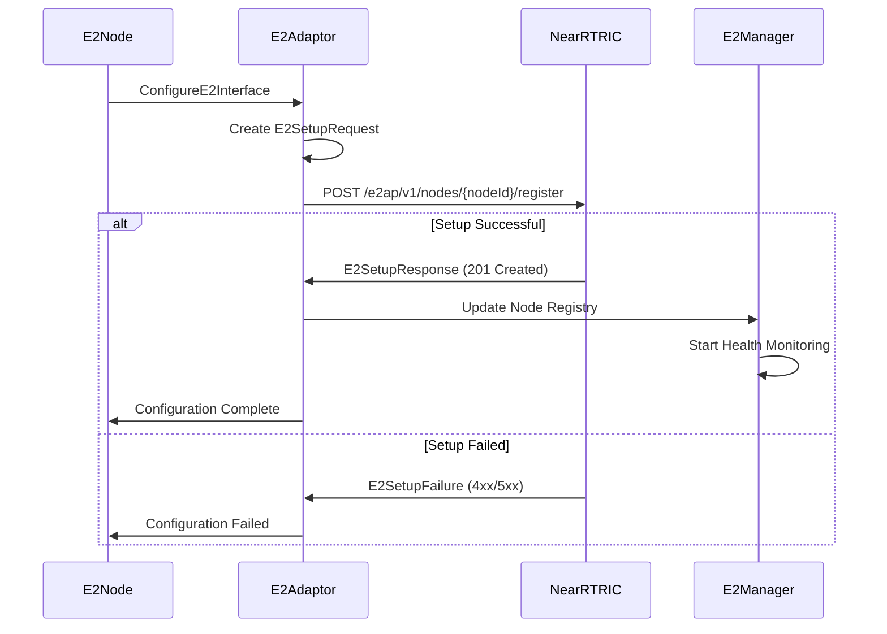
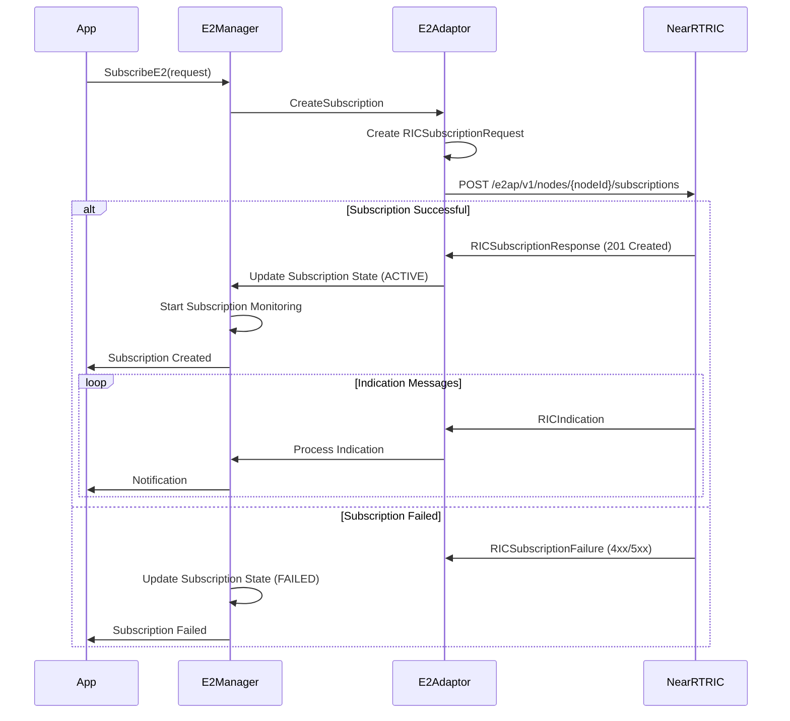
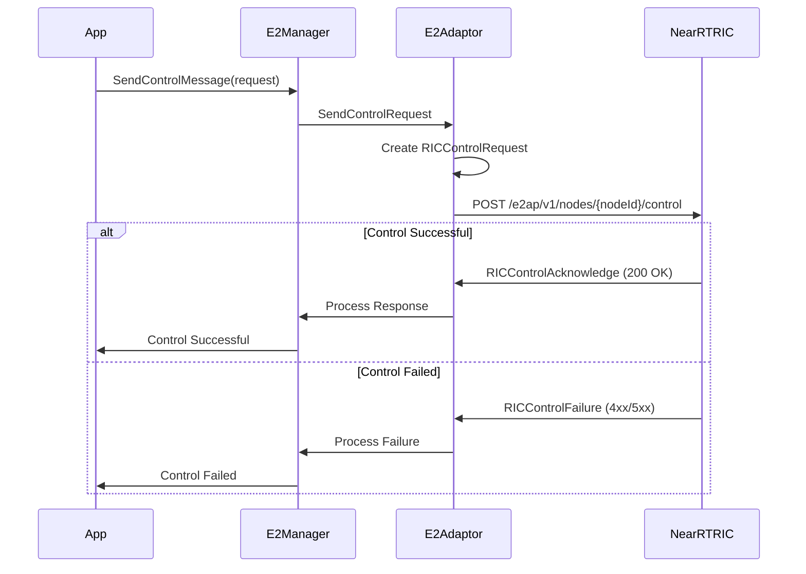

# E2AP Protocol Implementation Documentation

## Overview

The Nephoran Intent Operator implements a complete E2AP (E2 Application Protocol) stack following O-RAN Alliance WG3.E2AP-v3.0 specifications. This implementation provides ASN.1 message handling over HTTP transport, complete state machine operations, and comprehensive connection management for communication between E2 Nodes and the Near-RT RIC.

## E2AP Protocol Stack Architecture

```
┌─────────────────────────────────────────────────────────────────────────────────────┐
│                           E2AP Protocol Stack                                      │
├─────────────────────────────────────────────────────────────────────────────────────┤
│                                                                                     │
│  ┌─────────────────────────────────────────────────────────────────────────────┐   │
│  │                        Application Layer                                    │   │
│  │  ┌─────────────────┐  ┌─────────────────┐  ┌─────────────────────────────┐ │   │
│  │  │    E2 Setup     │  │  Subscription   │  │      Control                │ │   │
│  │  │   Procedures    │  │   Procedures    │  │    Procedures               │ │   │
│  │  │                 │  │                 │  │                             │ │   │
│  │  │ • Setup Req/Rsp │  │ • Sub Req/Rsp   │  │ • Control Req/Ack           │ │   │
│  │  │ • Setup Failure │  │ • Sub Delete    │  │ • Control Failure           │ │   │
│  │  │ • Service Update│  │ • Sub Failure   │  │ • Indication                │ │   │
│  │  └─────────────────┘  └─────────────────┘  └─────────────────────────────┘ │   │
│  └─────────────────────────────────────────────────────────────────────────────┘   │
│                                          │                                         │
│                                          ▼                                         │
│  ┌─────────────────────────────────────────────────────────────────────────────┐   │
│  │                      E2AP Message Layer                                    │   │
│  │                                                                             │   │
│  │  ┌─────────────────────────────────────────────────────────────────────┐   │   │
│  │  │                   E2APEncoder                                       │   │   │
│  │  │  ┌─────────────┐  ┌─────────────┐  ┌─────────────┐                 │   │   │
│  │  │  │   Message   │  │   Binary    │  │ Correlation │                 │   │   │
│  │  │  │  Structure  │  │  Encoding   │  │   Tracking  │                 │   │   │
│  │  │  │             │  │             │  │             │                 │   │   │
│  │  │  │ • PDU Type  │  │ • ASN.1     │  │ • Trans ID  │                 │   │   │
│  │  │  │ • Trans ID  │  │ • JSON      │  │ • Timeout   │                 │   │   │
│  │  │  │ • Procedure │  │ • Header    │  │ • Callback  │                 │   │   │
│  │  │  │ • Payload   │  │ • Payload   │  │             │                 │   │   │
│  │  │  └─────────────┘  └─────────────┘  └─────────────┘                 │   │   │
│  │  └─────────────────────────────────────────────────────────────────────┘   │   │
│  └─────────────────────────────────────────────────────────────────────────────┘   │
│                                          │                                         │
│                                          ▼                                         │
│  ┌─────────────────────────────────────────────────────────────────────────────┐   │
│  │                       Codec Layer                                          │   │
│  │                                                                             │   │
│  │  ┌─────────────────────────────────────────────────────────────────────┐   │   │
│  │  │                 Message Codecs                                      │   │   │
│  │  │  ┌─────────────┐  ┌─────────────┐  ┌─────────────┐                 │   │   │
│  │  │  │   Setup     │  │Subscription │  │   Control   │                 │   │   │
│  │  │  │   Codecs    │  │   Codecs    │  │   Codecs    │                 │   │   │
│  │  │  │             │  │             │  │             │                 │   │   │
│  │  │  │ • Encode    │  │ • Encode    │  │ • Encode    │                 │   │   │
│  │  │  │ • Decode    │  │ • Decode    │  │ • Decode    │                 │   │   │
│  │  │  │ • Validate  │  │ • Validate  │  │ • Validate  │                 │   │   │
│  │  │  │             │  │             │  │             │                 │   │   │
│  │  │  └─────────────┘  └─────────────┘  └─────────────┘                 │   │   │
│  │  └─────────────────────────────────────────────────────────────────────┘   │   │
│  └─────────────────────────────────────────────────────────────────────────────┘   │
│                                          │                                         │
│                                          ▼                                         │
│  ┌─────────────────────────────────────────────────────────────────────────────┐   │
│  │                    Transport Layer                                         │   │
│  │                                                                             │   │
│  │  ┌─────────────────────────────────────────────────────────────────────┐   │   │
│  │  │                  HTTP Transport                                     │   │   │
│  │  │  ┌─────────────┐  ┌─────────────┐  ┌─────────────┐                 │   │   │
│  │  │  │   Header    │  │   Binary    │  │    HTTP     │                 │   │   │
│  │  │  │ Formation   │  │   Payload   │  │   Client    │                 │   │   │
│  │  │  │             │  │             │  │             │                 │   │   │
│  │  │  │ • 16-byte   │  │ • ASN.1     │  │ • POST/GET  │                 │   │   │
│  │  │  │ • Msg Type  │  │ • JSON Alt  │  │ • Headers   │                 │   │   │
│  │  │  │ • Trans ID  │  │ • Compress  │  │ • Security  │                 │   │   │
│  │  │  │ • Crit      │  │             │  │             │                 │   │   │
│  │  │  └─────────────┘  └─────────────┘  └─────────────┘                 │   │   │
│  │  └─────────────────────────────────────────────────────────────────────┘   │   │
│  └─────────────────────────────────────────────────────────────────────────────┘   │
└─────────────────────────────────────────────────────────────────────────────────────┘
```

## ASN.1 Message Encoding/Decoding Approach

### 1. Hybrid Encoding Strategy

The implementation uses a hybrid approach combining traditional ASN.1 principles with modern JSON encoding for HTTP transport:

#### Primary Encoding: JSON over HTTP
- **Rationale**: Simplified integration with cloud-native environments
- **Benefits**: Human-readable, debugging-friendly, standard HTTP tooling
- **Compatibility**: Maintains semantic compatibility with ASN.1 structures

#### Binary Header Format
```go
// 16-byte fixed header for HTTP transport
type E2APHeader struct {
    MessageType   uint32 // Message type identifier
    TransactionID uint32 // Transaction correlation ID
    ProcedureCode uint32 // E2AP procedure code
    Criticality   uint32 // Message criticality level
}
```

### 2. Message Structure

All E2AP messages follow a consistent structure:

```go
type E2APMessage struct {
    MessageType    E2APMessageType `json:"message_type"`
    TransactionID  int32          `json:"transaction_id"`
    ProcedureCode  int32          `json:"procedure_code"`
    Criticality    Criticality    `json:"criticality"`
    Payload        interface{}    `json:"payload"`
    Timestamp      time.Time      `json:"timestamp"`
    CorrelationID  string         `json:"correlation_id,omitempty"`
}
```

### 3. Encoding Process

```go
func (e *E2APEncoder) EncodeMessage(message *E2APMessage) ([]byte, error) {
    // 1. Get appropriate codec
    codec, exists := e.messageRegistry[message.MessageType]
    if !exists {
        return nil, fmt.Errorf("no codec registered for message type %d", message.MessageType)
    }

    // 2. Validate message structure
    if err := codec.Validate(message.Payload); err != nil {
        return nil, fmt.Errorf("message validation failed: %w", err)
    }

    // 3. Encode payload to JSON
    payloadBytes, err := codec.Encode(message.Payload)
    if err != nil {
        return nil, fmt.Errorf("payload encoding failed: %w", err)
    }

    // 4. Create binary header
    header := make([]byte, 16)
    binary.BigEndian.PutUint32(header[0:4], uint32(message.MessageType))
    binary.BigEndian.PutUint32(header[4:8], uint32(message.TransactionID))
    binary.BigEndian.PutUint32(header[8:12], uint32(message.ProcedureCode))
    binary.BigEndian.PutUint32(header[12:16], uint32(message.Criticality))

    // 5. Combine header and payload
    return append(header, payloadBytes...), nil
}
```

## E2AP Message Flow Patterns

### 1. E2 Setup Procedure



### 2. RIC Subscription Procedure



### 3. RIC Control Procedure



## State Machine Operations

### 1. Node State Machine

```go
type E2NodeState string

const (
    NodeStateDisconnected E2NodeState = "DISCONNECTED"
    NodeStateConnecting   E2NodeState = "CONNECTING"
    NodeStateConnected    E2NodeState = "CONNECTED"
    NodeStateFailed       E2NodeState = "FAILED"
)

// Node state transitions
func (n *E2NodeInfo) TransitionState(newState E2NodeState, reason string) {
    oldState := n.State
    n.State = newState
    n.LastStateChange = time.Now()
    n.StateHistory = append(n.StateHistory, StateTransition{
        From:      oldState,
        To:        newState,
        Timestamp: time.Now(),
        Reason:    reason,
    })
}
```

### 2. Subscription State Machine

```go
type SubscriptionState string

const (
    SubscriptionStatePending   SubscriptionState = "PENDING"
    SubscriptionStateActive    SubscriptionState = "ACTIVE"
    SubscriptionStateInactive  SubscriptionState = "INACTIVE"
    SubscriptionStateFailed    SubscriptionState = "FAILED"
    SubscriptionStateDeleting  SubscriptionState = "DELETING"
)

// Subscription lifecycle management
func (s *ManagedSubscription) UpdateState(newState SubscriptionState) {
    s.State = newState
    s.LastUpdate = time.Now()
    
    // Update metrics
    s.Metrics.LastStateChange = time.Now()
    
    // Trigger notifications
    for _, listener := range s.listeners {
        go listener.OnSubscriptionStateChange(s.NodeID, s.SubscriptionID, s.State, newState)
    }
}
```

## Connection Management

### 1. Connection Pool Architecture

The E2 interface implements sophisticated connection pooling for efficient resource management:

```go
type E2ConnectionPool struct {
    connections     map[string]*PooledConnection
    maxConnections  int
    idleTimeout     time.Duration
    healthInterval  time.Duration
    mutex          sync.RWMutex
    stopChan       chan struct{}
}

type PooledConnection struct {
    adaptor     *E2Adaptor
    lastUsed    time.Time
    inUse       bool
    healthy     bool
    failCount   int
    mutex       sync.Mutex
}
```

### 2. Health Monitoring

Continuous health monitoring ensures connection reliability:

```go
func (pool *E2ConnectionPool) startHealthChecker() {
    ticker := time.NewTicker(pool.healthInterval)
    defer ticker.Stop()

    for {
        select {
        case <-ticker.C:
            pool.performHealthChecks()
        case <-pool.stopChan:
            return
        }
    }
}

func (pool *E2ConnectionPool) performHealthChecks() {
    pool.mutex.RLock()
    connections := make([]*PooledConnection, 0, len(pool.connections))
    for _, conn := range pool.connections {
        connections = append(connections, conn)
    }
    pool.mutex.RUnlock()

    for _, conn := range connections {
        go pool.checkConnectionHealth(conn)
    }
}
```

### 3. Automatic Recovery

Failed connections are automatically recovered:

```go
func (pool *E2ConnectionPool) recoverConnection(nodeID string) {
    pool.mutex.Lock()
    defer pool.mutex.Unlock()

    if conn, exists := pool.connections[nodeID]; exists {
        conn.mutex.Lock()
        defer conn.mutex.Unlock()

        // Attempt reconnection
        if err := conn.adaptor.reconnect(); err != nil {
            conn.failCount++
            conn.healthy = false
            
            // Remove connection if too many failures
            if conn.failCount >= maxRetries {
                delete(pool.connections, nodeID)
            }
        } else {
            conn.failCount = 0
            conn.healthy = true
        }
    }
}
```

## Message Validation and Error Handling

### 1. Message Validation

Each message type has comprehensive validation:

```go
// Example: RICSubscriptionRequest validation
func (c *RICSubscriptionRequestCodec) Validate(message interface{}) error {
    req, ok := message.(*RICSubscriptionRequest)
    if !ok {
        return fmt.Errorf("invalid message type")
    }

    // Validate RAN Function ID range
    if req.RANFunctionID < 0 || req.RANFunctionID > 4095 {
        return fmt.Errorf("invalid RAN function ID: %d", req.RANFunctionID)
    }

    // Validate required fields
    if len(req.RICSubscriptionDetails.RICActionToBeSetupList) == 0 {
        return fmt.Errorf("no RIC actions specified")
    }

    // Validate each action
    for _, action := range req.RICSubscriptionDetails.RICActionToBeSetupList {
        if action.RICActionID < 0 || action.RICActionID > 255 {
            return fmt.Errorf("invalid RIC action ID: %d", action.RICActionID)
        }
    }

    return nil
}
```

### 2. Error Classification

The implementation provides detailed error classification:

```go
// E2AP Cause classification
type E2APCause struct {
    RICCause        *RICCause        `json:"ric_cause,omitempty"`
    RICServiceCause *RICServiceCause `json:"ric_service_cause,omitempty"`
    E2NodeCause     *E2NodeCause     `json:"e2_node_cause,omitempty"`
    TransportCause  *TransportCause  `json:"transport_cause,omitempty"`
    ProtocolCause   *ProtocolCause   `json:"protocol_cause,omitempty"`
    MiscCause       *MiscCause       `json:"misc_cause,omitempty"`
}

// RIC-specific error causes
const (
    RICCauseRANFunctionIDInvalid RICCause = iota
    RICCauseActionNotSupported
    RICCauseExcessiveActions
    RICCauseDuplicateAction
    RICCauseFunctionResourceLimit
    RICCauseRequestIDUnknown
    RICCauseControlMessageInvalid
    RICCauseSystemNotReady
)
```

### 3. Retry Logic

Sophisticated retry mechanisms with exponential backoff:

```go
type RetryConfig struct {
    MaxRetries      int
    InitialDelay    time.Duration
    MaxDelay        time.Duration
    BackoffFactor   float64
    Jitter          bool
}

func (e *E2Adaptor) executeWithRetry(ctx context.Context, operation func() error) error {
    var lastErr error
    delay := e.retryConfig.InitialDelay

    for attempt := 0; attempt <= e.retryConfig.MaxRetries; attempt++ {
        if attempt > 0 {
            // Apply jitter if enabled
            actualDelay := delay
            if e.retryConfig.Jitter {
                jitter := time.Duration(rand.Float64() * float64(delay) * 0.1)
                actualDelay = delay + jitter
            }

            select {
            case <-time.After(actualDelay):
            case <-ctx.Done():
                return ctx.Err()
            }

            // Exponential backoff
            delay = time.Duration(float64(delay) * e.retryConfig.BackoffFactor)
            if delay > e.retryConfig.MaxDelay {
                delay = e.retryConfig.MaxDelay
            }
        }

        if err := operation(); err != nil {
            lastErr = err
            if !isRetryableError(err) {
                return err
            }
            continue
        }

        return nil
    }

    return fmt.Errorf("operation failed after %d retries: %w", e.retryConfig.MaxRetries, lastErr)
}
```

## Subscription Lifecycle Management

### 1. Subscription Creation

```go
func (mgr *E2SubscriptionManager) CreateSubscription(req *E2SubscriptionRequest) error {
    // Create managed subscription
    managedSub := &ManagedSubscription{
        E2Subscription: E2Subscription{
            SubscriptionID:  req.SubscriptionID,
            RequestorID:     req.RequestorID,
            RanFunctionID:   req.RanFunctionID,
            EventTriggers:   req.EventTriggers,
            Actions:         req.Actions,
            ReportingPeriod: req.ReportingPeriod,
        },
        State:         SubscriptionStatePending,
        CreationTime:  time.Now(),
        LastUpdate:    time.Now(),
        MaxRetries:    mgr.maxRetries,
        HealthStatus: SubscriptionHealth{
            Status:    "HEALTHY",
            LastCheck: time.Now(),
        },
    }

    // Store subscription
    mgr.mutex.Lock()
    if _, exists := mgr.subscriptions[req.NodeID]; !exists {
        mgr.subscriptions[req.NodeID] = make(map[string]*ManagedSubscription)
    }
    mgr.subscriptions[req.NodeID][req.SubscriptionID] = managedSub
    mgr.mutex.Unlock()

    // Send to RIC
    return mgr.sendSubscriptionRequest(req)
}
```

### 2. State Tracking

```go
func (mgr *E2SubscriptionManager) updateSubscriptionState(nodeID, subscriptionID string, newState SubscriptionState, reason string) {
    mgr.mutex.Lock()
    defer mgr.mutex.Unlock()

    if nodeSubs, exists := mgr.subscriptions[nodeID]; exists {
        if sub, exists := nodeSubs[subscriptionID]; exists {
            oldState := sub.State
            sub.State = newState
            sub.LastUpdate = time.Now()

            // Record state transition
            mgr.stateTracker.recordTransition(nodeID, subscriptionID, StateTransition{
                FromState: oldState,
                ToState:   newState,
                Timestamp: time.Now(),
                Reason:    reason,
            })

            // Notify listeners
            mgr.notifyStateChange(nodeID, subscriptionID, oldState, newState)
        }
    }
}
```

## Performance Optimizations

### 1. Connection Pooling

- **Shared Connections**: Multiple operations share connections
- **Connection Reuse**: Persistent connections reduce overhead
- **Load Balancing**: Distribute load across available connections

### 2. Message Batching

- **Batch Processing**: Group related operations
- **Pipeline Optimization**: Overlap request/response cycles
- **Buffer Management**: Efficient memory usage

### 3. Caching

- **Response Caching**: Cache frequently accessed data
- **Connection Caching**: Maintain connection state
- **Metadata Caching**: Cache service model information

### 4. Asynchronous Processing

- **Non-blocking Operations**: Async message handling
- **Background Processing**: Separate threads for I/O
- **Event-driven Architecture**: Efficient resource utilization

## Testing and Validation

### 1. Unit Testing

Comprehensive unit tests for all components:
- Message encoding/decoding
- Validation logic
- State machine transitions
- Error handling

### 2. Integration Testing

End-to-end testing with mock RIC:
- Complete message flows
- Error scenarios
- Performance benchmarks
- Load testing

### 3. Compliance Testing

Validation against O-RAN specifications:
- Message format compliance
- Procedure compliance
- Behavior compliance
- Interoperability testing

This comprehensive E2AP protocol implementation provides a robust, scalable, and compliant foundation for E2 interface operations in cloud-native environments.