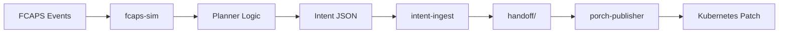

# FCAPS Simulator for Nephoran Intent Operator

## Overview

The FCAPS simulator (`cmd/fcaps-sim`) is a tool that demonstrates automated scaling decisions based on FCAPS (Fault, Configuration, Accounting, Performance, Security) events. It reads VES-formatted telecom events, applies threshold-based planning logic, and generates scaling intents that are processed through the Nephoran intent pipeline.

## Architecture

The simulator implements a simple planner that:
- Reads FCAPS events from JSON files (VES format)
- Detects threshold crossings in performance metrics
- Responds to critical fault events
- Generates scaling intents compatible with `intent.schema.json`
- POSTs intents to the intent-ingest service

## Threshold Logic

The planner makes scaling decisions based on:

| Event Type | Condition | Action |
|------------|-----------|---------|
| **Performance** | PRB utilization > 0.8 | Scale up by 1 replica |
| **Performance** | P95 latency > 100ms | Scale up by 1 replica |
| **Fault** | Severity = CRITICAL | Scale up by 2 replicas |
| **Heartbeat** | Normal operation | No action |

- Initial replica count: 1
- Maximum replicas: 10
- Minimum replicas: 1

## Installation

```bash
# Build the simulator
go build -o fcaps-sim ./cmd/fcaps-sim

# Or run directly
go run ./cmd/fcaps-sim
```

## Usage

### Basic Usage

```bash
# Run with default settings (uses docs/contracts/fcaps.ves.examples.json)
./fcaps-sim

# Run with verbose output
./fcaps-sim --verbose
```

### Command-Line Options

```bash
./fcaps-sim [OPTIONS]

Options:
  --input string     Input JSON file with FCAPS events (default: docs/contracts/fcaps.ves.examples.json)
  --delay int        Delay in seconds between events (default: 2)
  --target string    Target deployment name (default: nf-sim)
  --namespace string Kubernetes namespace (default: ran-a)
  --intent-url string Intent ingest API URL (default: http://localhost:8080/intent)
  --verbose         Enable verbose logging
  --help            Show help message
```

### Custom Event File

```bash
# Use custom FCAPS events
./fcaps-sim --input my-events.json --delay 3 --verbose
```

## End-to-End Pipeline Example

### 1. Start the Intent Ingest Service

```bash
# Terminal 1: Start intent-ingest
go run ./cmd/intent-ingest
# Output: intent-ingest listening on :8080
```

### 2. Run FCAPS Simulator

```bash
# Terminal 2: Run the simulator
./fcaps-sim --verbose --delay 1

# Expected output:
2025/08/12 13:54:47 FCAPS Simulator starting...
2025/08/12 13:54:47 Loaded 3 FCAPS events from docs/contracts/fcaps.ves.examples.json
2025/08/12 13:54:47 Processing event: Fault_NFSim_LinkDown (domain: fault)
2025/08/12 13:54:47 Fault event: severity=CRITICAL, condition=LINK_DOWN
2025/08/12 13:54:47 Scaling decision: scale nf-sim to 3 replicas
2025/08/12 13:54:47 Successfully sent scaling intent to http://localhost:8080/intent
...
FCAPS simulation completed. Final replica count: 3
```

### 3. Verify Generated Intent

```bash
# Check handoff directory
ls -la handoff/
# Output: intent-20250812T055447Z.json

# View the intent
cat handoff/intent-20250812T055447Z.json | jq .
```

Expected intent JSON:
```json
{
  "intent_type": "scaling",
  "target": "nf-sim",
  "namespace": "ran-a",
  "replicas": 3,
  "reason": "Critical fault detected: eth0 loss of signal (LINK_DOWN)",
  "source": "planner",
  "correlation_id": "fcaps-1754978087"
}
```

### 4. Generate Kubernetes Patch

```bash
# Run porch-publisher to create scaling patch
./porch-publisher -intent handoff/intent-20250812T055447Z.json

# Output: wrote: examples/packages/scaling/scaling-patch.yaml
```

Expected scaling-patch.yaml:
```yaml
apiVersion: apps/v1
kind: Deployment
metadata:
  name: nf-sim
  namespace: ran-a
spec:
  replicas: 3
```

## Testing High-Load Scenarios

Create a test file with high-load metrics:

```json
{
  "high_load": {
    "event": {
      "commonEventHeader": {
        "domain": "measurementsForVfScaling",
        "eventName": "Perf_NFSim_HighLoad",
        "sourceName": "nf-sim"
      },
      "measurementsForVfScalingFields": {
        "additionalFields": {
          "kpm.p95_latency_ms": 125.3,
          "kpm.prb_utilization": 0.95,
          "kpm.ue_count": 150
        }
      }
    }
  }
}
```

Run the simulator:
```bash
./fcaps-sim --input test-high-load.json --verbose
# Output: Scaling decision: scale nf-sim to 2 replicas (reason: PRB utilization exceeded threshold)
```

## Event Format

The simulator expects VES-formatted FCAPS events. See `docs/contracts/fcaps.ves.examples.json` for complete examples.

### Performance Event
```json
{
  "event": {
    "commonEventHeader": {
      "domain": "measurementsForVfScaling",
      "sourceName": "nf-sim"
    },
    "measurementsForVfScalingFields": {
      "additionalFields": {
        "kpm.p95_latency_ms": 85.3,
        "kpm.prb_utilization": 0.62
      }
    }
  }
}
```

### Fault Event
```json
{
  "event": {
    "commonEventHeader": {
      "domain": "fault",
      "sourceName": "nf-sim"
    },
    "faultFields": {
      "eventSeverity": "CRITICAL",
      "alarmCondition": "LINK_DOWN",
      "specificProblem": "eth0 loss of signal"
    }
  }
}
```

## Integration with Nephoran Pipeline

The FCAPS simulator integrates with the existing Nephoran intent pipeline:



1. **FCAPS Events**: VES-formatted telecom events
2. **Planner Logic**: Threshold detection and scaling decisions
3. **Intent Generation**: Creates JSON matching intent.schema.json
4. **Intent Ingest**: Validates and stores intents
5. **Porch Publisher**: Generates Kubernetes manifests

## Troubleshooting

### Intent-ingest not running
```bash
# Check if service is listening
curl http://localhost:8080/healthz
# Should return: ok
```

### Events not being processed
```bash
# Run with verbose mode
./fcaps-sim --verbose

# Check JSON format
jq . < your-events.json
```

### Scaling not triggered
- Verify thresholds: PRB > 0.8 or latency > 100ms
- Check current replica count (max is 10)
- Ensure fault severity is "CRITICAL"

## Development

### Project Structure
```
cmd/fcaps-sim/
  main.go           # CLI entry point
internal/fcaps/
  processor.go      # Event processing and planner logic
docs/contracts/
  fcaps.ves.examples.json  # Example FCAPS events
  intent.schema.json       # Intent JSON schema
```

### Adding New Thresholds

Edit `internal/fcaps/processor.go`:
```go
const (
    PRBUtilizationThreshold = 0.8  // Modify thresholds
    P95LatencyThreshold     = 100.0
)
```

### Extending Event Types

The processor can be extended to handle additional VES event domains:
- Configuration events
- Accounting events
- Security events

## See Also

- [Intent Schema](../contracts/intent.schema.json)
- [FCAPS VES Examples](../contracts/fcaps.ves.examples.json)
- [Intent Ingest Service](../../cmd/intent-ingest)
- [Porch Publisher](../../cmd/porch-publisher)
