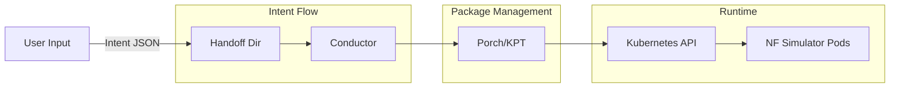

# MVP Demo Quickstart Guide

## Overview

This guide demonstrates the end-to-end flow of the Nephoran Intent Operator MVP:

**Natural Language → Intent JSON → Porch Package → Apply → NF Simulator Scales**

## Prerequisites

- Kubernetes cluster (Minikube, Kind, or cloud provider)
- kubectl configured and connected to your cluster
- Go 1.24+ (for running conductor)
- Internet access for downloading tools

### Platform Support
- ✅ Windows (PowerShell)
- ✅ Linux (Bash)
- ✅ macOS (Bash)

## Quick Start

### Option 1: Using Make (Recommended)

```bash
# Complete MVP demo in one command
make mvp-up

# Check status
make mvp-status

# Scale operations
make mvp-scale-up    # Scale to 5 replicas
make mvp-scale-down  # Scale to 1 replica

# Clean up
make mvp-clean
```

### Option 2: Step-by-Step Manual Execution

#### Step 1: Install Porch Components

```bash
cd examples/mvp-oran-sim

# Linux/Mac
./01-install-porch.sh

# Windows PowerShell
.\01-install-porch.ps1
```

**Expected Output:**
```
==== MVP Demo: Install Porch Components ====
✓ kpt: Installed (v1.0.0-beta.54)
✓ porchctl: Installed (v0.0.21)
✓ kubectl: Installed
```

#### Step 2: Prepare NF Simulator Package

```bash
# Linux/Mac
./02-prepare-nf-sim.sh

# Windows PowerShell
.\02-prepare-nf-sim.ps1
```

**Expected Output:**
```
==== MVP Demo: Prepare NF Simulator Package ====
Creating namespace: mvp-demo
Namespace mvp-demo created successfully
Creating package directory: ./package-nf-sim-package
✓ Created Kptfile
✓ Created nf-sim-deployment.yaml
✓ Created README.md
```

#### Step 3: Send Scaling Intent

```bash
# Linux/Mac
REPLICAS=3 ./03-send-intent.sh

# Windows PowerShell
.\03-send-intent.ps1 -Replicas 3
```

**Expected Output:**
```
==== MVP Demo: Send Scaling Intent ====
Intent JSON:
{
  "intent_type": "scaling",
  "target": "nf-sim",
  "namespace": "mvp-demo",
  "replicas": 3,
  "reason": "MVP demo scaling test",
  "source": "test",
  "correlation_id": "mvp-demo-20250814120000"
}
Intent written successfully!
File: intent-20250814T120000Z.json
```

#### Step 4: Apply Package with Porch/KPT

```bash
# Linux/Mac
./04-porch-apply.sh

# Windows PowerShell
.\04-porch-apply.ps1
```

**Expected Output:**
```
==== MVP Demo: Apply Package with Porch/KPT ====
Applying package directly with kubectl...
Applying nf-sim-deployment.yaml...
All resources applied successfully!
Waiting for deployment to be ready...
Status: 1/1 replicas ready
Deployment is ready!
```

#### Step 5: Validate Deployment

```bash
# Linux/Mac
./05-validate.sh

# Windows PowerShell
.\05-validate.ps1
```

**Expected Output:**
```
==== Deployment Validation Results ====
Deployment: nf-sim
Namespace: mvp-demo
Replica Status:
  Desired:   3
  Ready:     3
  Available: 3
✅ Deployment is healthy

==== Pod Details ====
✓ nf-sim-abc123 - Status: Running, Ready: 1/1
✓ nf-sim-def456 - Status: Running, Ready: 1/1
✓ nf-sim-ghi789 - Status: Running, Ready: 1/1
```

## Scaling Operations

### Scale Up to 5 Replicas

```bash
# Using Make
make mvp-scale-up

# Or manually
cd examples/mvp-oran-sim
./03-send-intent.sh  # with REPLICAS=5
kubectl patch deployment nf-sim -n mvp-demo -p '{"spec":{"replicas":5}}'
```

### Scale Down to 1 Replica

```bash
# Using Make
make mvp-scale-down

# Or manually
cd examples/mvp-oran-sim
./03-send-intent.sh  # with REPLICAS=1
kubectl patch deployment nf-sim -n mvp-demo -p '{"spec":{"replicas":1}}'
```

## Monitoring

### Watch Deployment Status
```bash
make mvp-watch
# Or
watch kubectl get deployment,pods -n mvp-demo
```

### View Logs
```bash
make mvp-logs
# Or
kubectl logs -n mvp-demo -l app=nf-sim --tail=50
```

### Continuous Validation
```bash
cd examples/mvp-oran-sim
./05-validate.sh  # with CONTINUOUS=true
```

## Architecture



## Intent Schema

The intent follows the schema defined in `docs/contracts/intent.schema.json`:

```json
{
  "intent_type": "scaling",
  "target": "nf-sim",
  "namespace": "mvp-demo",
  "replicas": 3,
  "reason": "High load detected",
  "source": "test",
  "correlation_id": "mvp-demo-12345"
}
```

## Troubleshooting

### Issue: Porch not installed
```bash
# Deploy Porch to cluster
kubectl apply -f https://github.com/nephio-project/porch/releases/download/v0.0.21/porch-server.yaml
```

### Issue: Namespace not found
```bash
kubectl create namespace mvp-demo
```

### Issue: Deployment not scaling
```bash
# Check deployment status
kubectl describe deployment nf-sim -n mvp-demo

# Check events
kubectl get events -n mvp-demo --sort-by='.lastTimestamp'

# Force scale manually
kubectl scale deployment nf-sim -n mvp-demo --replicas=3
```

### Issue: Conductor not processing intents
```bash
# Start conductor manually
go run ./cmd/conductor

# Check handoff directory
ls -la handoff/
```

## Clean Up

Remove all MVP demo resources:

```bash
make mvp-clean
# Or manually:
kubectl delete namespace mvp-demo
rm -rf examples/mvp-oran-sim/package-*
```

## Advanced Configuration

### Custom Namespace
```bash
export NAMESPACE=my-namespace
./02-prepare-nf-sim.sh
```

### Custom Package Name
```bash
export PACKAGE_NAME=my-package
./02-prepare-nf-sim.sh
```

### HTTP Intent Submission
```bash
# Start intent-ingest service
go run ./cmd/intent-ingest

# Send via HTTP
export METHOD=http
./03-send-intent.sh
```

## CI/CD Integration

Add to your CI pipeline:

```yaml
# GitHub Actions example
- name: Run MVP Demo
  run: |
    make mvp-up
    make mvp-status
    make mvp-clean
```

## Next Steps

1. **Explore the Code**: Review the scripts in `examples/mvp-oran-sim/`
2. **Customize the Package**: Modify `nf-sim-deployment.yaml`
3. **Integrate with O-RAN**: Connect to RIC and xApps
4. **Add FCAPS Events**: Enable VES event collection
5. **Production Deployment**: Use GitOps with Porch repositories

## Support

- **Documentation**: See `/docs` directory
- **Issues**: Report at GitHub Issues
- **Contracts**: Review `docs/contracts/*.json`

---

**Version**: 1.0.0  
**Last Updated**: 2025-08-14  
**Maintainer**: Nephoran Intent Operator Team