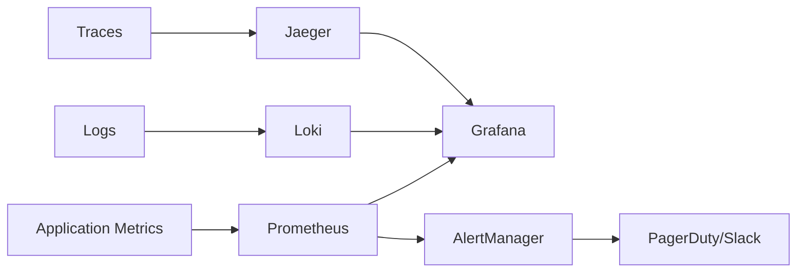

# Monitoring & Alerting Runbook - Nephoran Intent Operator

**Version:** 3.0  
**Last Updated:** January 2025  
**Audience:** SRE Teams, Operations Engineers, On-call Personnel  
**Scope:** Comprehensive monitoring setup, alert response, and observability procedures

## Table of Contents

1. [Monitoring Architecture](#monitoring-architecture)
2. [Metrics Collection](#metrics-collection)
3. [Alert Rules](#alert-rules)
4. [Alert Response Procedures](#alert-response-procedures)
5. [Dashboard Configuration](#dashboard-configuration)
6. [Log Analysis](#log-analysis)
7. [Distributed Tracing](#distributed-tracing)
8. [SLA Monitoring](#sla-monitoring)
9. [Capacity Planning](#capacity-planning)

## Monitoring Architecture

### Core Components

```yaml
Monitoring Stack:
  Metrics:
    - Prometheus: Time-series metrics storage
    - Prometheus Operator: Kubernetes-native deployment
    - Node Exporter: Host-level metrics
    - Kube State Metrics: Kubernetes object metrics
    
  Visualization:
    - Grafana: Dashboard and visualization
    - Grafana Loki: Log aggregation
    
  Alerting:
    - AlertManager: Alert routing and grouping
    - PagerDuty: Critical alert escalation
    - Slack: Team notifications
    
  Tracing:
    - Jaeger: Distributed tracing
    - OpenTelemetry: Trace collection
    
  APM:
    - Custom metrics: Business KPIs
    - SLA tracking: Availability and performance
```

### Monitoring Flow



## Metrics Collection

### Prometheus Configuration

```yaml
# prometheus-config.yaml
global:
  scrape_interval: 15s
  evaluation_interval: 15s
  external_labels:
    cluster: 'nephoran-prod'
    environment: 'production'

# Rule files
rule_files:
  - /etc/prometheus/rules/*.yml

# AlertManager configuration
alerting:
  alertmanagers:
    - static_configs:
        - targets:
          - alertmanager.monitoring:9093

# Scrape configurations
scrape_configs:
  # Nephoran Controllers
  - job_name: 'nephoran-controllers'
    kubernetes_sd_configs:
      - role: pod
        namespaces:
          names:
            - nephoran-system
    relabel_configs:
      - source_labels: [__meta_kubernetes_pod_label_app_kubernetes_io_part_of]
        action: keep
        regex: nephoran-intent-operator
      - source_labels: [__meta_kubernetes_pod_annotation_prometheus_io_scrape]
        action: keep
        regex: true
      - source_labels: [__meta_kubernetes_pod_annotation_prometheus_io_path]
        action: replace
        target_label: __metrics_path__
        regex: (.+)
      - source_labels: [__address__, __meta_kubernetes_pod_annotation_prometheus_io_port]
        action: replace
        regex: ([^:]+)(?::\d+)?;(\d+)
        replacement: $1:$2
        target_label: __address__
    scrape_interval: 15s

  # LLM Processor
  - job_name: 'llm-processor'
    static_configs:
      - targets: ['llm-processor.nephoran-system:8080']
    scrape_interval: 15s
    metrics_path: /metrics
    
  # RAG API
  - job_name: 'rag-api'
    static_configs:
      - targets: ['rag-api.nephoran-system:8080']
    scrape_interval: 30s
    metrics_path: /metrics

  # Weaviate
  - job_name: 'weaviate'
    static_configs:
      - targets: ['weaviate.nephoran-system:2112']
    scrape_interval: 30s
    metrics_path: /metrics

  # Kubernetes metrics
  - job_name: 'kubernetes-nodes'
    kubernetes_sd_configs:
      - role: node
    relabel_configs:
      - action: labelmap
        regex: __meta_kubernetes_node_label_(.+)
    scrape_interval: 30s

  # O-RAN Adaptors
  - job_name: 'oran-adaptors'
    kubernetes_sd_configs:
      - role: pod
        namespaces:
          names:
            - nephoran-system
    relabel_configs:
      - source_labels: [__meta_kubernetes_pod_label_component]
        action: keep
        regex: oran-adaptor
    scrape_interval: 15s
```

### Key Metrics to Monitor

```yaml
Golden Signals:
  Latency:
    - nephoran_llm_request_duration_seconds: LLM processing latency
    - nephoran_rag_query_latency_seconds: RAG retrieval latency
    - nephoran_networkintent_processing_duration_seconds: End-to-end intent processing
    - nephoran_database_query_duration_seconds: Database query latency
    
  Traffic:
    - nephoran_llm_requests_total: LLM request rate
    - nephoran_networkintent_total: Intent processing rate
    - nephoran_rag_queries_total: RAG query rate
    - nephoran_api_requests_total: API request rate
    
  Errors:
    - nephoran_llm_requests_failed_total: LLM processing failures
    - nephoran_networkintent_failed_total: Intent processing failures
    - nephoran_api_errors_total: API errors
    - nephoran_circuit_breaker_trips_total: Circuit breaker activations
    
  Saturation:
    - container_cpu_usage_seconds_total: CPU utilization
    - container_memory_usage_bytes: Memory utilization
    - nephoran_llm_queue_depth: Processing queue depth
    - nephoran_database_connections_active: Database connection pool

Business Metrics:
  - nephoran_intents_processed_total: Total intents processed
  - nephoran_intent_success_rate: Success rate percentage
  - nephoran_llm_tokens_used_total: LLM token consumption
  - nephoran_llm_cost_dollars_total: LLM API costs
  - nephoran_deployment_duration_seconds: Time to deploy
  - nephoran_policy_enforcement_total: O-RAN policies enforced
```

## Alert Rules

### Critical Alerts (P0/P1)

```yaml
# critical-alerts.yml
groups:
- name: nephoran-critical
  interval: 30s
  rules:
  # Service Down
  - alert: NephoranServiceDown
    expr: up{job=~"nephoran.*"} == 0
    for: 1m
    labels:
      severity: critical
      component: "{{ $labels.job }}"
      team: platform
    annotations:
      summary: "Nephoran service {{ $labels.job }} is down"
      description: "{{ $labels.job }} has been down for more than 1 minute. This is impacting intent processing."
      runbook_url: "https://docs.nephoran.com/runbooks/service-down#{{ $labels.job }}"
      dashboard_url: "https://grafana.company.com/d/nephoran-overview"

  # High Error Rate
  - alert: IntentProcessingFailureHigh
    expr: |
      (
        rate(nephoran_networkintent_failed_total[5m]) / 
        rate(nephoran_networkintent_total[5m])
      ) > 0.1
    for: 2m
    labels:
      severity: critical
      component: intent-processing
      team: platform
    annotations:
      summary: "High intent processing failure rate"
      description: "Intent processing failure rate is {{ $value | humanizePercentage }}, exceeding 10% threshold"
      impact: "Network deployments are failing. Customer operations impacted."
      runbook_url: "https://docs.nephoran.com/runbooks/intent-failures"

  # Memory Critical
  - alert: PodMemoryUsageCritical
    expr: |
      (
        container_memory_usage_bytes{namespace="nephoran-system"} / 
        container_spec_memory_limit_bytes{namespace="nephoran-system"}
      ) > 0.9
    for: 5m
    labels:
      severity: critical
      component: "{{ $labels.pod }}"
      team: platform
    annotations:
      summary: "Pod {{ $labels.pod }} memory usage critical"
      description: "Memory usage for {{ $labels.pod }} is {{ $value | humanizePercentage }}"
      action: "Immediate action required to prevent OOM kills"
      runbook_url: "https://docs.nephoran.com/runbooks/memory-critical"

  # Database Connection Pool Exhausted
  - alert: DatabaseConnectionPoolExhausted
    expr: nephoran_database_connections_active >= nephoran_database_connections_max
    for: 2m
    labels:
      severity: critical
      component: database
      team: platform
    annotations:
      summary: "Database connection pool exhausted"
      description: "All database connections are in use. New requests will fail."
      runbook_url: "https://docs.nephoran.com/runbooks/database-connections"

  # Weaviate Unavailable
  - alert: WeaviateUnavailable
    expr: up{job="weaviate"} == 0
    for: 2m
    labels:
      severity: critical
      component: weaviate
      team: platform
    annotations:
      summary: "Weaviate vector database is unavailable"
      description: "Weaviate has been down for more than 2 minutes. RAG functionality is impacted."
      runbook_url: "https://docs.nephoran.com/runbooks/weaviate-down"
```

### High Priority Alerts (P2)

```yaml
# high-priority-alerts.yml
groups:
- name: nephoran-high-priority
  interval: 30s
  rules:
  # Latency SLA Violation
  - alert: IntentProcessingLatencyHigh
    expr: |
      histogram_quantile(0.95, 
        rate(nephoran_networkintent_processing_duration_seconds_bucket[5m])
      ) > 3.0
    for: 5m
    labels:
      severity: high
      component: performance
      team: platform
    annotations:
      summary: "Intent processing latency exceeds SLA"
      description: "P95 latency is {{ $value }}s, exceeding 3.0s SLA"
      runbook_url: "https://docs.nephoran.com/runbooks/latency-high"

  # Throughput Degradation
  - alert: IntentThroughputLow
    expr: rate(nephoran_networkintent_processed_total[5m]) < 5
    for: 10m
    labels:
      severity: high
      component: throughput
      team: platform
    annotations:
      summary: "Intent processing throughput below target"
      description: "Current throughput is {{ $value }} intents/min, below 5/min target"
      runbook_url: "https://docs.nephoran.com/runbooks/throughput-low"

  # Circuit Breaker Open
  - alert: CircuitBreakerOpen
    expr: nephoran_circuit_breaker_state == 1
    for: 5m
    labels:
      severity: high
      component: "{{ $labels.circuit_name }}"
      team: platform
    annotations:
      summary: "Circuit breaker {{ $labels.circuit_name }} is open"
      description: "Circuit breaker has been open for 5 minutes, indicating persistent failures"
      runbook_url: "https://docs.nephoran.com/runbooks/circuit-breaker"

  # Cache Hit Rate Low
  - alert: CacheHitRateLow
    expr: |
      (
        rate(nephoran_cache_hits_total[5m]) / 
        rate(nephoran_cache_requests_total[5m])
      ) < 0.7
    for: 15m
    labels:
      severity: high
      component: cache
      team: platform
    annotations:
      summary: "Cache hit rate below threshold"
      description: "Cache hit rate is {{ $value | humanizePercentage }}, below 70% target"
      runbook_url: "https://docs.nephoran.com/runbooks/cache-performance"
```

### Medium Priority Alerts (P3)

```yaml
# medium-priority-alerts.yml
groups:
- name: nephoran-medium-priority
  interval: 60s
  rules:
  # Queue Depth High
  - alert: ProcessingQueueDepthHigh
    expr: nephoran_llm_queue_depth > 50
    for: 10m
    labels:
      severity: medium
      component: llm-processor
      team: platform
    annotations:
      summary: "LLM processing queue depth high"
      description: "Queue depth is {{ $value }}, indicating processing bottleneck"
      runbook_url: "https://docs.nephoran.com/runbooks/queue-management"

  # Certificate Expiring Soon
  - alert: CertificateExpiringSoon
    expr: certmanager_certificate_expiration_timestamp_seconds - time() < 30 * 24 * 3600
    for: 1h
    labels:
      severity: medium
      component: certificates
      team: platform
    annotations:
      summary: "Certificate {{ $labels.name }} expiring soon"
      description: "Certificate expires in {{ $value | humanizeDuration }}"
      runbook_url: "https://docs.nephoran.com/runbooks/certificate-renewal"

  # Disk Space Warning
  - alert: DiskSpaceWarning
    expr: |
      (
        node_filesystem_avail_bytes{mountpoint="/"} / 
        node_filesystem_size_bytes{mountpoint="/"}
      ) < 0.2
    for: 15m
    labels:
      severity: medium
      component: infrastructure
      team: platform
    annotations:
      summary: "Low disk space on {{ $labels.instance }}"
      description: "Only {{ $value | humanizePercentage }} disk space remaining"
      runbook_url: "https://docs.nephoran.com/runbooks/disk-space"
```

### Business Alerts

```yaml
# business-alerts.yml
groups:
- name: nephoran-business
  interval: 60s
  rules:
  # Cost Threshold Exceeded
  - alert: LLMCostThresholdExceeded
    expr: increase(nephoran_llm_cost_dollars_total[24h]) > 100
    for: 1h
    labels:
      severity: high
      component: cost-management
      team: finance
    annotations:
      summary: "Daily LLM costs exceed budget"
      description: "24-hour LLM costs are ${{ $value }}, exceeding $100 budget"
      runbook_url: "https://docs.nephoran.com/runbooks/cost-management"

  # Success Rate Below SLA
  - alert: IntentSuccessRateBelowSLA
    expr: |
      (
        rate(nephoran_networkintent_success_total[15m]) / 
        rate(nephoran_networkintent_total[15m])
      ) < 0.95
    for: 10m
    labels:
      severity: high
      component: sla
      team: platform
    annotations:
      summary: "Intent success rate below SLA"
      description: "Success rate is {{ $value | humanizePercentage }}, below 95% SLA"
      runbook_url: "https://docs.nephoran.com/runbooks/sla-violation"

  # Automation Rate Low
  - alert: AutomationRateLow
    expr: |
      (
        rate(nephoran_automated_deployments_total[1h]) / 
        rate(nephoran_total_deployments_total[1h])
      ) < 0.8
    for: 30m
    labels:
      severity: medium
      component: automation
      team: platform
    annotations:
      summary: "Deployment automation rate below target"
      description: "Automation rate is {{ $value | humanizePercentage }}, below 80% target"
      runbook_url: "https://docs.nephoran.com/runbooks/automation-rate"
```

## Alert Response Procedures

### Alert Response Matrix

| Alert | Severity | Response Time | First Response | Escalation |
|-------|----------|--------------|----------------|------------|
| Service Down | Critical | Immediate | Restart service, check dependencies | Manager in 15 min |
| High Error Rate | Critical | 5 min | Check logs, scale service | Technical lead in 30 min |
| High Latency | High | 15 min | Check resource usage, scale | Technical lead in 1 hour |
| Queue Depth High | Medium | 30 min | Monitor trend, prepare to scale | If persists > 1 hour |
| Certificate Expiring | Medium | 1 hour | Renew certificate | If renewal fails |
| Cost Threshold | High | 1 hour | Review usage, apply limits | Finance team immediately |

### P0/P1 Response Procedure

```bash
#!/bin/bash
# Critical alert response procedure

respond_to_critical_alert() {
  local ALERT_NAME=$1
  local SEVERITY=$2
  
  echo "=== CRITICAL ALERT RESPONSE: $ALERT_NAME ==="
  echo "Time: $(date)"
  echo "Severity: $SEVERITY"
  
  # 1. Acknowledge alert
  echo "--- Acknowledging Alert ---"
  curl -X POST "http://alertmanager.monitoring:9093/api/v1/alerts" \
    -H "Content-Type: application/json" \
    -d "{\"status\": \"acknowledged\", \"alertname\": \"$ALERT_NAME\"}"
  
  # 2. Initial assessment
  echo "--- System Status ---"
  kubectl get pods -n nephoran-system --no-headers | grep -v Running
  kubectl get nodes --no-headers | grep -v Ready
  
  # 3. Check recent events
  echo "--- Recent Events ---"
  kubectl get events -n nephoran-system --sort-by='.lastTimestamp' | head -20
  
  # 4. Service-specific checks
  case $ALERT_NAME in
    "NephoranServiceDown")
      echo "--- Service Recovery ---"
      kubectl get pods -n nephoran-system -o wide
      kubectl rollout restart deployment -n nephoran-system
      ;;
    
    "IntentProcessingFailureHigh")
      echo "--- Intent Processing Check ---"
      kubectl logs -n nephoran-system deployment/nephoran-controller --tail=50
      kubectl get networkintents --all-namespaces | grep -v Succeeded | head -20
      ;;
    
    "DatabaseConnectionPoolExhausted")
      echo "--- Database Connection Check ---"
      kubectl exec -n nephoran-system postgresql-0 -- \
        psql -U postgres -c "SELECT count(*) FROM pg_stat_activity;"
      kubectl exec -n nephoran-system postgresql-0 -- \
        psql -U postgres -c "SELECT pg_terminate_backend(pid) FROM pg_stat_activity WHERE state = 'idle' AND query_start < now() - interval '10 minutes';"
      ;;
    
    "WeaviateUnavailable")
      echo "--- Weaviate Recovery ---"
      kubectl get pods -n nephoran-system -l app=weaviate
      kubectl logs -n nephoran-system -l app=weaviate --tail=50
      kubectl delete pods -n nephoran-system -l app=weaviate
      ;;
  esac
  
  # 5. Create incident ticket
  echo "--- Creating Incident ---"
  ./scripts/create-incident.sh \
    --severity "$SEVERITY" \
    --title "$ALERT_NAME" \
    --description "Automated response initiated for $ALERT_NAME"
  
  # 6. Notify on-call
  echo "--- Notifying On-Call ---"
  ./scripts/notify-oncall.sh --alert "$ALERT_NAME" --severity "$SEVERITY"
  
  echo "Initial response completed at $(date)"
}
```

### P2/P3 Response Procedure

```bash
#!/bin/bash
# Non-critical alert response

respond_to_noncritical_alert() {
  local ALERT_NAME=$1
  local SEVERITY=$2
  
  echo "=== Alert Response: $ALERT_NAME ==="
  echo "Severity: $SEVERITY"
  
  case $ALERT_NAME in
    "ProcessingQueueDepthHigh")
      echo "Checking queue depth trend..."
      kubectl exec -n nephoran-system deployment/llm-processor -- \
        curl -s localhost:8080/metrics | grep queue_depth
      
      # Auto-scale if needed
      CURRENT_REPLICAS=$(kubectl get deployment llm-processor -n nephoran-system -o jsonpath='{.spec.replicas}')
      if [ $CURRENT_REPLICAS -lt 10 ]; then
        echo "Scaling llm-processor from $CURRENT_REPLICAS to $((CURRENT_REPLICAS + 2)) replicas"
        kubectl scale deployment llm-processor -n nephoran-system --replicas=$((CURRENT_REPLICAS + 2))
      fi
      ;;
    
    "CertificateExpiringSoon")
      echo "Triggering certificate renewal..."
      kubectl annotate certificate --all -n nephoran-system \
        cert-manager.io/force-renew=$(date +%s) --overwrite
      ;;
    
    "CacheHitRateLow")
      echo "Warming cache..."
      kubectl exec -n nephoran-system deployment/rag-api -- \
        curl -X POST localhost:5001/cache/warm
      ;;
    
    "DiskSpaceWarning")
      echo "Cleaning up old logs and data..."
      kubectl exec -n nephoran-system deployment/llm-processor -- \
        find /var/log -name "*.log" -mtime +7 -delete
      kubectl exec -n nephoran-system deployment/rag-api -- \
        find /var/log -name "*.log" -mtime +7 -delete
      ;;
  esac
  
  echo "Response completed at $(date)"
}
```

## Dashboard Configuration

### Executive Dashboard

```json
{
  "dashboard": {
    "title": "Nephoran Executive Dashboard",
    "uid": "nephoran-exec",
    "tags": ["nephoran", "executive"],
    "timezone": "browser",
    "refresh": "30s",
    "time": {
      "from": "now-24h",
      "to": "now"
    },
    "panels": [
      {
        "id": 1,
        "title": "System Availability",
        "type": "stat",
        "gridPos": {"h": 4, "w": 6, "x": 0, "y": 0},
        "targets": [
          {
            "expr": "avg(up{job=~\"nephoran.*\"})",
            "legendFormat": "Availability",
            "refId": "A"
          }
        ],
        "fieldConfig": {
          "defaults": {
            "unit": "percentunit",
            "thresholds": {
              "mode": "absolute",
              "steps": [
                {"color": "red", "value": 0},
                {"color": "yellow", "value": 0.95},
                {"color": "green", "value": 0.99}
              ]
            }
          }
        }
      },
      {
        "id": 2,
        "title": "Intent Processing Rate",
        "type": "graph",
        "gridPos": {"h": 8, "w": 12, "x": 0, "y": 4},
        "targets": [
          {
            "expr": "rate(nephoran_networkintent_processed_total[5m])",
            "legendFormat": "Processing Rate",
            "refId": "A"
          },
          {
            "expr": "rate(nephoran_networkintent_success_total[5m])",
            "legendFormat": "Success Rate",
            "refId": "B"
          },
          {
            "expr": "rate(nephoran_networkintent_failed_total[5m])",
            "legendFormat": "Failure Rate",
            "refId": "C"
          }
        ],
        "yaxes": [
          {"format": "ops", "label": "Intents/sec"},
          {"format": "short"}
        ]
      },
      {
        "id": 3,
        "title": "Response Time (P50/P95/P99)",
        "type": "graph",
        "gridPos": {"h": 8, "w": 12, "x": 12, "y": 4},
        "targets": [
          {
            "expr": "histogram_quantile(0.50, rate(nephoran_networkintent_processing_duration_seconds_bucket[5m]))",
            "legendFormat": "P50",
            "refId": "A"
          },
          {
            "expr": "histogram_quantile(0.95, rate(nephoran_networkintent_processing_duration_seconds_bucket[5m]))",
            "legendFormat": "P95",
            "refId": "B"
          },
          {
            "expr": "histogram_quantile(0.99, rate(nephoran_networkintent_processing_duration_seconds_bucket[5m]))",
            "legendFormat": "P99",
            "refId": "C"
          }
        ],
        "yaxes": [
          {"format": "s", "label": "Latency"},
          {"format": "short"}
        ]
      },
      {
        "id": 4,
        "title": "Daily Cost Tracking",
        "type": "stat",
        "gridPos": {"h": 4, "w": 6, "x": 18, "y": 0},
        "targets": [
          {
            "expr": "increase(nephoran_llm_cost_dollars_total[24h])",
            "legendFormat": "Daily Cost",
            "refId": "A"
          }
        ],
        "fieldConfig": {
          "defaults": {
            "unit": "currencyUSD",
            "thresholds": {
              "mode": "absolute",
              "steps": [
                {"color": "green", "value": 0},
                {"color": "yellow", "value": 50},
                {"color": "red", "value": 100}
              ]
            }
          }
        }
      }
    ]
  }
}
```

### Technical Operations Dashboard

```json
{
  "dashboard": {
    "title": "Nephoran Technical Operations",
    "uid": "nephoran-tech-ops",
    "tags": ["nephoran", "operations"],
    "panels": [
      {
        "id": 1,
        "title": "Service Health",
        "type": "table",
        "gridPos": {"h": 6, "w": 12, "x": 0, "y": 0},
        "targets": [
          {
            "expr": "up{job=~\"nephoran.*\"}",
            "format": "table",
            "instant": true,
            "refId": "A"
          }
        ],
        "transformations": [
          {
            "id": "organize",
            "options": {
              "excludeByName": {
                "Time": true,
                "__name__": true
              },
              "renameByName": {
                "job": "Service",
                "instance": "Instance",
                "Value": "Status"
              }
            }
          }
        ]
      },
      {
        "id": 2,
        "title": "Resource Utilization",
        "type": "graph",
        "gridPos": {"h": 8, "w": 12, "x": 0, "y": 6},
        "targets": [
          {
            "expr": "sum(rate(container_cpu_usage_seconds_total{namespace=\"nephoran-system\"}[5m])) by (pod)",
            "legendFormat": "{{ pod }} CPU",
            "refId": "A"
          },
          {
            "expr": "sum(container_memory_usage_bytes{namespace=\"nephoran-system\"}) by (pod) / 1024 / 1024 / 1024",
            "legendFormat": "{{ pod }} Memory (GB)",
            "refId": "B"
          }
        ]
      },
      {
        "id": 3,
        "title": "Queue Depth",
        "type": "graph",
        "gridPos": {"h": 6, "w": 12, "x": 12, "y": 0},
        "targets": [
          {
            "expr": "nephoran_llm_queue_depth",
            "legendFormat": "LLM Queue",
            "refId": "A"
          },
          {
            "expr": "nephoran_rag_queue_depth",
            "legendFormat": "RAG Queue",
            "refId": "B"
          }
        ]
      },
      {
        "id": 4,
        "title": "Error Rates by Component",
        "type": "graph",
        "gridPos": {"h": 8, "w": 12, "x": 12, "y": 6},
        "targets": [
          {
            "expr": "rate(nephoran_errors_total[5m])",
            "legendFormat": "{{ component }}",
            "refId": "A"
          }
        ]
      }
    ]
  }
}
```

## Log Analysis

### Structured Logging Configuration

```yaml
# logging-config.yaml
apiVersion: v1
kind: ConfigMap
metadata:
  name: logging-config
  namespace: nephoran-system
data:
  fluent-bit.conf: |
    [SERVICE]
        Flush         5
        Daemon        Off
        Log_Level     info
        Parsers_File  parsers.conf

    [INPUT]
        Name              tail
        Path              /var/log/containers/*nephoran*.log
        Parser            docker
        Tag               nephoran.*
        Refresh_Interval  5
        Mem_Buf_Limit     5MB
        Skip_Long_Lines   On

    [FILTER]
        Name         parser
        Match        nephoran.*
        Key_Name     log
        Parser       json
        Reserve_Data On

    [OUTPUT]
        Name   loki
        Match  nephoran.*
        Host   loki.monitoring
        Port   3100
        Labels job=nephoran,namespace=nephoran-system

  parsers.conf: |
    [PARSER]
        Name        json
        Format      json
        Time_Key    timestamp
        Time_Format %Y-%m-%dT%H:%M:%S.%LZ
```

### Log Query Examples

```bash
#!/bin/bash
# Common log queries

# Error analysis
error_analysis() {
  echo "=== Error Analysis ==="
  
  # Get error distribution
  kubectl logs -n nephoran-system -l app.kubernetes.io/part-of=nephoran --since=1h | \
    grep -E "ERROR|FATAL" | \
    awk '{print $4}' | \
    sort | uniq -c | sort -rn
  
  # Get stack traces
  kubectl logs -n nephoran-system deployment/llm-processor --since=1h | \
    grep -A 10 "panic\|fatal"
}

# Performance analysis
performance_analysis() {
  echo "=== Performance Analysis ==="
  
  # Slow queries
  kubectl logs -n nephoran-system deployment/rag-api --since=1h | \
    jq -r 'select(.duration_ms > 1000) | "\(.timestamp) \(.endpoint) \(.duration_ms)ms"'
  
  # Token usage
  kubectl logs -n nephoran-system deployment/llm-processor --since=1h | \
    jq -r 'select(.tokens_used) | "\(.timestamp) \(.intent_id) tokens:\(.tokens_used)"'
}

# Security analysis
security_analysis() {
  echo "=== Security Analysis ==="
  
  # Authentication failures
  kubectl logs -n nephoran-system --since=1h | \
    grep -i "auth.*fail\|unauthorized\|forbidden" | \
    tail -20
  
  # Suspicious activity
  kubectl logs -n nephoran-system --since=1h | \
    grep -E "sql.*injection|xss|csrf|suspicious" | \
    tail -20
}
```

## Distributed Tracing

### Jaeger Configuration

```yaml
# jaeger-config.yaml
apiVersion: v1
kind: ConfigMap
metadata:
  name: jaeger-config
  namespace: monitoring
data:
  sampling.json: |
    {
      "service_strategies": [
        {
          "service": "llm-processor",
          "type": "probabilistic",
          "param": 0.1
        },
        {
          "service": "rag-api",
          "type": "probabilistic",
          "param": 0.05
        },
        {
          "service": "nephoran-controller",
          "type": "adaptive",
          "max_traces_per_second": 100
        }
      ],
      "default_strategy": {
        "type": "probabilistic",
        "param": 0.01
      }
    }
```

### Key Traces to Monitor

```yaml
Critical Traces:
  End-to-End Intent Processing:
    - Span: NetworkIntent creation
    - Span: Controller reconciliation
    - Span: LLM processing
    - Span: RAG retrieval
    - Span: Package generation
    - Span: GitOps commit
    - Span: Deployment initiation
    Expected Duration: < 30s
    
  RAG Query Flow:
    - Span: Query reception
    - Span: Embedding generation
    - Span: Vector search
    - Span: Document retrieval
    - Span: Reranking
    - Span: Response generation
    Expected Duration: < 2s
    
  LLM Processing:
    - Span: Request validation
    - Span: Context preparation
    - Span: API call
    - Span: Response parsing
    - Span: Result caching
    Expected Duration: < 5s
```

### Trace Analysis Queries

```bash
#!/bin/bash
# Jaeger trace analysis

# Find slow traces
find_slow_traces() {
  curl -s "http://jaeger.monitoring:16686/api/traces?service=nephoran-controller&minDuration=10s&limit=20" | \
    jq -r '.data[] | "\(.traceID) \(.duration)μs \(.operationName)"'
}

# Find error traces
find_error_traces() {
  curl -s "http://jaeger.monitoring:16686/api/traces?service=nephoran-controller&tags=error%3Dtrue&limit=20" | \
    jq -r '.data[] | "\(.traceID) \(.spans[].tags[] | select(.key=="error.message") | .value)"'
}

# Analyze service dependencies
analyze_dependencies() {
  curl -s "http://jaeger.monitoring:16686/api/dependencies?endTs=$(date +%s)000" | \
    jq -r '.data[] | "\(.parent) -> \(.child) calls:\(.callCount)"'
}
```

## SLA Monitoring

### SLA Definitions

```yaml
SLA Targets:
  Availability:
    Target: 99.9%
    Measurement: avg(up{job=~"nephoran.*"})
    Window: 30 days
    
  Latency:
    P50 Target: 1s
    P95 Target: 3s
    P99 Target: 5s
    Measurement: histogram_quantile(0.95, rate(nephoran_networkintent_processing_duration_seconds_bucket[5m]))
    
  Success Rate:
    Target: 95%
    Measurement: rate(nephoran_networkintent_success_total) / rate(nephoran_networkintent_total)
    Window: 15 minutes
    
  Throughput:
    Target: 10 intents/minute
    Measurement: rate(nephoran_networkintent_processed_total[5m]) * 60
    
  Error Budget:
    Monthly Budget: 43.2 minutes (99.9% availability)
    Measurement: sum(1 - avg_over_time(up{job=~"nephoran.*"}[5m])) * 5
```

### SLA Monitoring Queries

```promql
# Availability SLA
100 * (
  1 - (
    sum(rate(nephoran_networkintent_failed_total[30d])) / 
    sum(rate(nephoran_networkintent_total[30d]))
  )
)

# Latency SLA Compliance
100 * (
  sum(rate(nephoran_networkintent_processing_duration_seconds_bucket{le="3.0"}[1d])) / 
  sum(rate(nephoran_networkintent_processing_duration_seconds_count[1d]))
)

# Error Budget Remaining
(1 - 0.999) * 30 * 24 * 60 - 
sum(increase(nephoran_downtime_minutes_total[30d]))

# Success Rate SLA
100 * (
  sum(rate(nephoran_networkintent_success_total[1h])) / 
  sum(rate(nephoran_networkintent_total[1h]))
)
```

### SLA Report Generation

```bash
#!/bin/bash
# Generate monthly SLA report

generate_sla_report() {
  local MONTH=${1:-$(date +%Y-%m)}
  
  echo "=== SLA Report for $MONTH ==="
  echo ""
  
  # Availability
  AVAILABILITY=$(prometheus_query "avg_over_time(up{job=~'nephoran.*'}[30d])")
  echo "Availability: ${AVAILABILITY}% (Target: 99.9%)"
  
  # Latency
  P95_LATENCY=$(prometheus_query "histogram_quantile(0.95, rate(nephoran_networkintent_processing_duration_seconds_bucket[30d]))")
  echo "P95 Latency: ${P95_LATENCY}s (Target: 3.0s)"
  
  # Success Rate
  SUCCESS_RATE=$(prometheus_query "sum(rate(nephoran_networkintent_success_total[30d]))/sum(rate(nephoran_networkintent_total[30d]))")
  echo "Success Rate: ${SUCCESS_RATE}% (Target: 95%)"
  
  # Throughput
  AVG_THROUGHPUT=$(prometheus_query "avg(rate(nephoran_networkintent_processed_total[30d])*60)")
  echo "Avg Throughput: ${AVG_THROUGHPUT}/min (Target: 10/min)"
  
  # Error Budget
  ERROR_BUDGET_USED=$(prometheus_query "sum(increase(nephoran_downtime_minutes_total[30d]))")
  ERROR_BUDGET_REMAINING=$((43.2 - ERROR_BUDGET_USED))
  echo "Error Budget Remaining: ${ERROR_BUDGET_REMAINING} minutes"
  
  echo ""
  echo "Report generated at $(date)"
}

prometheus_query() {
  local query=$1
  curl -s "http://prometheus.monitoring:9090/api/v1/query?query=${query}" | \
    jq -r '.data.result[0].value[1]'
}
```

## Capacity Planning

### Capacity Metrics Collection

```bash
#!/bin/bash
# Collect capacity planning metrics

collect_capacity_metrics() {
  echo "=== Capacity Planning Metrics ==="
  
  # Current usage
  echo "--- Current Resource Usage ---"
  kubectl top nodes
  kubectl top pods -n nephoran-system
  
  # Growth trends
  echo "--- Growth Trends (Last 30 Days) ---"
  
  # Intent volume growth
  INTENT_GROWTH=$(prometheus_query "
    (sum(increase(nephoran_networkintent_total[7d])) - 
     sum(increase(nephoran_networkintent_total[7d] offset 7d))) / 
     sum(increase(nephoran_networkintent_total[7d] offset 7d)) * 100
  ")
  echo "Intent Volume Growth: ${INTENT_GROWTH}% week-over-week"
  
  # Resource usage growth
  CPU_GROWTH=$(prometheus_query "
    (avg(rate(container_cpu_usage_seconds_total{namespace='nephoran-system'}[7d])) - 
     avg(rate(container_cpu_usage_seconds_total{namespace='nephoran-system'}[7d] offset 7d))) / 
     avg(rate(container_cpu_usage_seconds_total{namespace='nephoran-system'}[7d] offset 7d)) * 100
  ")
  echo "CPU Usage Growth: ${CPU_GROWTH}% week-over-week"
  
  # Predictions
  echo "--- 90-Day Predictions ---"
  
  # Predicted intent volume
  PREDICTED_INTENTS=$(prometheus_query "
    predict_linear(sum(rate(nephoran_networkintent_total[30d]))[30d:1d], 90*24*3600)
  ")
  echo "Predicted Intent Rate: ${PREDICTED_INTENTS}/sec"
  
  # Predicted resource needs
  PREDICTED_CPU=$(prometheus_query "
    predict_linear(avg(rate(container_cpu_usage_seconds_total{namespace='nephoran-system'}[30d]))[30d:1d], 90*24*3600)
  ")
  echo "Predicted CPU Cores Needed: ${PREDICTED_CPU}"
  
  # Recommendations
  echo "--- Capacity Recommendations ---"
  
  if (( $(echo "$INTENT_GROWTH > 20" | bc -l) )); then
    echo "⚠️  High growth detected. Consider scaling infrastructure."
    echo "   Recommended: Add 2 nodes to cluster"
    echo "   Recommended: Increase LLM processor replicas to 8"
  fi
  
  if (( $(echo "$CPU_GROWTH > 15" | bc -l) )); then
    echo "⚠️  CPU usage growing rapidly."
    echo "   Recommended: Upgrade node instance types"
    echo "   Recommended: Enable cluster autoscaling"
  fi
}
```

### Predictive Scaling Rules

```yaml
# predictive-scaling.yaml
apiVersion: v1
kind: ConfigMap
metadata:
  name: predictive-scaling-config
  namespace: nephoran-system
data:
  rules.yaml: |
    scaling_rules:
      llm_processor:
        prediction_window: 10m
        scale_up_threshold: 
          predicted_load: 150%
          confidence: 0.8
        scale_down_threshold:
          predicted_load: 50%
          confidence: 0.9
        min_replicas: 3
        max_replicas: 15
        
      rag_api:
        prediction_window: 15m
        scale_up_threshold:
          predicted_latency: 2s
          confidence: 0.85
        scale_down_threshold:
          predicted_latency: 0.5s
          confidence: 0.9
        min_replicas: 2
        max_replicas: 8
```

## Alert Routing Configuration

### AlertManager Configuration

```yaml
# alertmanager-config.yaml
global:
  resolve_timeout: 5m
  smtp_smarthost: 'smtp.company.com:587'
  smtp_from: 'nephoran-alerts@company.com'
  smtp_auth_username: 'nephoran-alerts@company.com'
  smtp_auth_password: '$SMTP_PASSWORD'
  slack_api_url: '$SLACK_WEBHOOK_URL'
  pagerduty_url: 'https://events.pagerduty.com/v2/enqueue'

templates:
  - '/etc/alertmanager/templates/*.tmpl'

route:
  receiver: 'default'
  group_by: ['alertname', 'cluster', 'service']
  group_wait: 10s
  group_interval: 10s
  repeat_interval: 12h
  
  routes:
  # Critical alerts - immediate escalation
  - match:
      severity: critical
    receiver: 'critical-alerts'
    group_wait: 0s
    repeat_interval: 5m
    continue: true
    
  # High priority - operations team
  - match:
      severity: high
    receiver: 'operations-team'
    group_wait: 30s
    repeat_interval: 15m
    
  # Medium priority - standard alerts
  - match:
      severity: medium
    receiver: 'standard-alerts'
    group_wait: 2m
    repeat_interval: 1h
    
  # Low priority - information only
  - match:
      severity: low
    receiver: 'info-alerts'
    group_wait: 5m
    repeat_interval: 4h
    
  # Business alerts - finance team
  - match:
      team: finance
    receiver: 'finance-team'
    group_wait: 10m
    repeat_interval: 24h

receivers:
- name: 'default'
  slack_configs:
  - channel: '#nephoran-alerts'
    title: 'Nephoran Alert'
    text: '{{ range .Alerts }}{{ .Annotations.description }}{{ end }}'

- name: 'critical-alerts'
  slack_configs:
  - channel: '#nephoran-critical'
    title: '🚨 CRITICAL: {{ .GroupLabels.alertname }}'
    text: |
      *Cluster:* {{ .GroupLabels.cluster }}
      *Service:* {{ .GroupLabels.service }}
      {{ range .Alerts }}
      *Summary:* {{ .Annotations.summary }}
      *Description:* {{ .Annotations.description }}
      *Runbook:* {{ .Annotations.runbook_url }}
      {{ end }}
  pagerduty_configs:
  - routing_key: '$PAGERDUTY_ROUTING_KEY'
    description: '{{ .GroupLabels.alertname }}'
    severity: 'critical'
    details:
      firing: '{{ .Alerts.Firing | len }}'
      resolved: '{{ .Alerts.Resolved | len }}'
  email_configs:
  - to: 'oncall@company.com'
    headers:
      Subject: 'CRITICAL: {{ .GroupLabels.alertname }}'

- name: 'operations-team'
  slack_configs:
  - channel: '#nephoran-operations'
    title: '⚠️  HIGH: {{ .GroupLabels.alertname }}'
  email_configs:
  - to: 'operations@company.com'

- name: 'standard-alerts'
  slack_configs:
  - channel: '#nephoran-alerts'
    title: 'ℹ️  MEDIUM: {{ .GroupLabels.alertname }}'

- name: 'info-alerts'
  slack_configs:
  - channel: '#nephoran-info'
    title: '💡 INFO: {{ .GroupLabels.alertname }}'

- name: 'finance-team'
  email_configs:
  - to: 'finance@company.com'
    headers:
      Subject: 'Cost Alert: {{ .GroupLabels.alertname }}'

inhibit_rules:
- source_match:
    severity: 'critical'
  target_match:
    severity: 'high'
  equal: ['alertname', 'cluster', 'service']
  
- source_match:
    severity: 'high'
  target_match:
    severity: 'medium'
  equal: ['alertname', 'cluster', 'service']
```

## Related Documentation

- [Master Operational Runbook](./operational-runbook-master.md) - Daily operations procedures
- [Incident Response Runbook](./incident-response.md) - Emergency response procedures
- [Performance Degradation Runbook](./performance-degradation.md) - Performance troubleshooting
- [SLA Monitoring System](../monitoring/sla-monitoring-system.md) - Detailed SLA tracking
- [Grafana Dashboards](../operations/dashboard-user-guide.md) - Dashboard templates

---

**Note:** This runbook is continuously updated based on operational experience and system changes. Report issues or improvements to the platform team.
