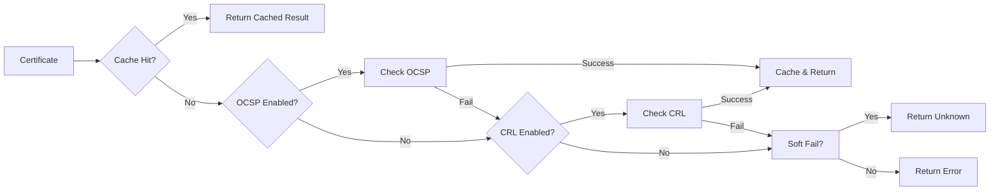

# Certificate Validation and Revocation System Guide

## Overview

The Nephoran Intent Operator's Certificate Validation and Revocation System provides comprehensive, real-time certificate validation with performance optimization, security policy enforcement, and automatic remediation capabilities. This enterprise-grade system ensures the security and compliance of all certificates used in the telecommunications infrastructure.

## Table of Contents

1. [Architecture Overview](#architecture-overview)
2. [Core Components](#core-components)
3. [Configuration](#configuration)
4. [Real-time Validation](#real-time-validation)
5. [Revocation Checking](#revocation-checking)
6. [Security Policies](#security-policies)
7. [Performance Optimization](#performance-optimization)
8. [Emergency Procedures](#emergency-procedures)
9. [Integration](#integration)
10. [Monitoring and Alerts](#monitoring-and-alerts)
11. [Troubleshooting](#troubleshooting)

## Architecture Overview

The certificate validation system consists of five main components:

```
┌─────────────────────────────────────────────────────────────┐
│                   Certificate Validation System              │
├─────────────────────────────────────────────────────────────┤
│                                                               │
│  ┌──────────────────┐  ┌──────────────────┐                │
│  │ Real-time        │  │ Enhanced         │                │
│  │ Validation       │  │ Revocation       │                │
│  │ Engine           │  │ System           │                │
│  └────────┬─────────┘  └────────┬─────────┘                │
│           │                      │                           │
│  ┌────────▼──────────────────────▼─────────┐                │
│  │        Policy Engine                     │                │
│  └────────┬─────────────────────────────────┘                │
│           │                                                   │
│  ┌────────▼─────────────────────────────────┐                │
│  │     Performance Optimization Layer        │                │
│  │  ┌──────────┐ ┌──────────┐ ┌──────────┐ │                │
│  │  │ Caching  │ │ Batching │ │ Circuit  │ │                │
│  │  │          │ │          │ │ Breaker  │ │                │
│  │  └──────────┘ └──────────┘ └──────────┘ │                │
│  └───────────────────────────────────────────┘                │
│                                                               │
│  ┌───────────────────────────────────────────┐                │
│  │     Integration & Monitoring Layer        │                │
│  └───────────────────────────────────────────┘                │
│                                                               │
└─────────────────────────────────────────────────────────────┘
```

## Core Components

### 1. Real-time Validation Engine

The Real-time Validation Engine performs certificate validation during TLS handshakes and connection establishment.

**Key Features:**
- Chain of trust verification with intermediate CA support
- Certificate Transparency (CT) log verification
- Real-time revocation status checking
- Policy enforcement during validation
- Performance optimization with caching

**Usage Example:**

```go
import (
    "github.com/thc1006/nephoran-intent-operator/pkg/security/ca"
)

// Initialize the validation engine
config := &ca.RealtimeValidationConfig{
    Enabled: true,
    ChainValidationEnabled: true,
    CTLogValidationEnabled: true,
    OCSPValidationEnabled: true,
    PolicyValidationEnabled: true,
}

engine, err := ca.NewRealtimeValidationEngine(config, logger, validator, revocationChecker)
if err != nil {
    log.Fatal("Failed to initialize validation engine:", err)
}

// Validate a certificate
result, err := engine.ValidateCertificateRealtime(ctx, cert, connState)
if err != nil {
    log.Error("Validation failed:", err)
}

if !result.Valid {
    log.Error("Certificate is invalid:", result.Errors)
}
```

### 2. Enhanced Revocation System

The Enhanced Revocation System provides comprehensive revocation checking with multiple methods and fallback mechanisms.

**Features:**
- CRL (Certificate Revocation List) checking with delta CRL support
- OCSP (Online Certificate Status Protocol) with stapling
- Automatic certificate replacement for revoked certificates
- Performance optimization with batching and async processing
- Circuit breaker pattern for resilience

**Revocation Check Flow:**



### 3. Policy Engine

The Policy Engine enforces security policies and compliance requirements.

**Policy Types:**
- Algorithm strength validation
- Certificate pinning
- Extended validation requirements
- O-RAN compliance checking
- Service-specific policies
- Custom validation rules

**Policy Configuration Example:**

```yaml
policy_engine:
  enforcement_mode: "strict"
  
  rules:
    - name: "minimum_key_size"
      type: "key_size"
      pattern: "2048"
      required: true
      severity: "error"
    
    - name: "o-ran_component"
      type: "extension"
      pattern: "1.3.6.1.4.1.53148.1.1"
      required: true
      severity: "critical"
  
  service_policies:
    "default/amf-service":
      pinned_certificates:
        - "sha256:abcd1234..."
      required_key_usage:
        - 1  # DigitalSignature
      allowed_dns_names:
        - "*.amf.example.com"
```

## Configuration

### Basic Configuration

Create a `certificate-validation-config.yaml` file:

```yaml
realtime_validation:
  enabled: true
  validation_timeout: 10s
  chain_validation_enabled: true
  ocsp_validation_enabled: true
  
enhanced_revocation:
  crl_enabled: true
  ocsp_enabled: true
  auto_replace_revoked: true
  
policy_engine:
  enabled: true
  enforcement_mode: "strict"
```

### Advanced Configuration

For production environments, use comprehensive configuration:

```yaml
realtime_validation:
  # Performance settings
  async_validation_enabled: true
  batch_validation_enabled: true
  connection_pool_size: 20
  circuit_breaker_enabled: true
  
  # Security settings
  certificate_pinning_enabled: true
  minimum_rsa_key_size: 2048
  oran_compliance_enabled: true
  
  # Monitoring
  metrics_enabled: true
  webhook_notifications: true
```

## Real-time Validation

### TLS Handshake Integration

The system integrates with TLS handshakes to validate certificates in real-time:

```go
// Custom TLS configuration with validation
tlsConfig := &tls.Config{
    VerifyPeerCertificate: func(rawCerts [][]byte, verifiedChains [][]*x509.Certificate) error {
        for _, rawCert := range rawCerts {
            cert, _ := x509.ParseCertificate(rawCert)
            result, err := validationEngine.ValidateCertificateRealtime(ctx, cert, nil)
            if err != nil || !result.Valid {
                return fmt.Errorf("certificate validation failed")
            }
        }
        return nil
    },
}
```

### Validation Process

1. **Chain Validation**: Verifies the complete certificate chain up to a trusted root
2. **Revocation Check**: Checks CRL and OCSP for revocation status
3. **CT Log Verification**: Ensures certificate is logged in Certificate Transparency logs
4. **Policy Validation**: Enforces security policies and compliance requirements
5. **O-RAN Compliance**: Validates O-RAN specific requirements

## Revocation Checking

### CRL Management

The system automatically manages CRL updates:

```yaml
enhanced_revocation:
  crl_update_interval: 4h
  crl_cache_size: 1000
  crl_delta_enabled: true
```

### OCSP Configuration

Configure OCSP with stapling for performance:

```yaml
enhanced_revocation:
  ocsp_stapling_enabled: true
  ocsp_nonce_enabled: true
  ocsp_cache_ttl: 30m
```

### Automatic Certificate Replacement

When a certificate is found to be revoked:

1. System automatically triggers replacement request
2. New certificate is issued through CA Manager
3. Old certificate is replaced in Kubernetes secrets
4. Services are notified of the update

## Security Policies

### Certificate Pinning

Pin certificates for critical services:

```yaml
service_policies:
  "critical/payment-service":
    pinned_certificates:
      - "sha256:1234567890abcdef..."
    include_backup: true
    backup_pin_count: 3
```

### Algorithm Strength

Enforce minimum algorithm strengths:

```yaml
policy_engine:
  minimum_rsa_key_size: 2048
  allowed_ec_curves:
    - "P-256"
    - "P-384"
  forbidden_algorithms:
    - "MD5"
    - "SHA1"
```

### O-RAN Compliance

Validate O-RAN specific requirements:

```yaml
oran_compliance:
  required_extensions:
    - "1.3.6.1.4.1.53148.1.1"
  naming_convention: "oran_standard"
  minimum_security_level: 2
```

## Performance Optimization

### Multi-Level Caching

The system implements three levels of caching:

1. **L1 Cache**: In-memory hot cache (sub-millisecond access)
2. **L2 Cache**: Distributed cache (Redis)
3. **Preload Cache**: Pre-validated certificates

### Batch Processing

Process multiple validations efficiently:

```yaml
batch_processing_enabled: true
batch_size: 100
batch_timeout: 5s
```

### Connection Pooling

Optimize OCSP connections:

```yaml
connection_pool_size: 20
ocsp_timeout: 10s
```

### Circuit Breaker

Prevent cascade failures:

```yaml
circuit_breaker_enabled: true
failure_threshold: 5
recovery_timeout: 30s
```

## Emergency Procedures

### Emergency Bypass

In critical situations, validation can be temporarily bypassed:

```bash
# Enable emergency bypass
curl -X POST https://api/emergency/bypass \
  -H "Authorization: Bearer <emergency-key>" \
  -d '{"duration": "1h", "reason": "Critical incident response"}'
```

### Soft-Fail Mode

Configure soft-fail for non-critical services:

```yaml
soft_fail_enabled: true
soft_fail_services:
  - "monitoring/*"
  - "logging/*"
```

## Integration

### Kubernetes Integration

The system integrates with Kubernetes for automatic secret management:

```yaml
apiVersion: v1
kind: Secret
metadata:
  name: service-tls
  annotations:
    nephoran.io/auto-validate: "true"
    nephoran.io/auto-replace: "true"
    nephoran.io/policy: "strict"
type: kubernetes.io/tls
```

### Monitoring Integration

Export metrics to Prometheus:

```yaml
monitoring:
  metrics_enabled: true
  metrics_endpoint: "/metrics"
  export_interval: 30s
```

### Webhook Notifications

Send validation events to external systems:

```yaml
webhook_notifications: true
webhook_endpoints:
  - url: "https://siem.example.com/api/events"
    events: ["validation_failed", "certificate_revoked"]
```

## Monitoring and Alerts

### Key Metrics

Monitor these critical metrics:

- `cert_validation_total`: Total validations performed
- `cert_validation_duration_seconds`: Validation latency
- `cert_revocation_check_total`: Revocation checks performed
- `cert_policy_violations_total`: Policy violations detected
- `cert_cache_hit_rate`: Cache effectiveness

### Alert Rules

Configure alerts for critical conditions:

```yaml
alerts:
  - name: HighValidationFailureRate
    expr: rate(cert_validation_failed[5m]) > 0.05
    severity: warning
    
  - name: RevocationCheckFailure
    expr: rate(cert_revocation_check_failed[5m]) > 0.1
    severity: critical
    
  - name: PolicyViolationSpike
    expr: rate(cert_policy_violations_total[1m]) > 10
    severity: warning
```

### Grafana Dashboard

Import the provided dashboard for comprehensive monitoring:

```json
{
  "dashboard": {
    "title": "Certificate Validation System",
    "panels": [
      {
        "title": "Validation Success Rate",
        "targets": [
          {
            "expr": "rate(cert_validation_success[5m])"
          }
        ]
      }
    ]
  }
}
```

## Troubleshooting

### Common Issues

#### 1. High Validation Latency

**Symptoms**: Validation takes longer than expected

**Solutions**:
- Enable async validation
- Increase cache size
- Check network connectivity to OCSP/CRL servers
- Enable connection pooling

#### 2. Frequent Cache Misses

**Symptoms**: Low cache hit rate

**Solutions**:
- Increase cache TTL
- Enable preload cache
- Increase cache size
- Review cache eviction policy

#### 3. Circuit Breaker Tripping

**Symptoms**: Validation requests rejected

**Solutions**:
- Check external service availability
- Review failure threshold settings
- Enable soft-fail mode
- Check network policies

### Debug Mode

Enable detailed logging for troubleshooting:

```yaml
logging:
  level: debug
  components:
    - validation_engine
    - revocation_checker
    - policy_engine
```

### Health Checks

Verify system health:

```bash
# Check validation engine health
curl http://localhost:8080/health/validation

# Check revocation system health
curl http://localhost:8080/health/revocation

# Check policy engine health
curl http://localhost:8080/health/policy
```

## Best Practices

1. **Performance**:
   - Enable caching for all production deployments
   - Use async validation for non-critical paths
   - Implement connection pooling for OCSP
   - Monitor cache hit rates

2. **Security**:
   - Always enable chain validation
   - Configure certificate pinning for critical services
   - Enforce minimum key sizes
   - Enable CT log validation

3. **Reliability**:
   - Configure circuit breakers
   - Enable soft-fail for non-critical services
   - Implement emergency bypass procedures
   - Maintain backup OCSP responders

4. **Compliance**:
   - Enable O-RAN compliance checking
   - Configure audit logging
   - Generate compliance reports
   - Maintain validation history

## API Reference

### Validation API

```go
// Validate a certificate
func ValidateCertificateRealtime(ctx context.Context, cert *x509.Certificate, connState *tls.ConnectionState) (*ValidationResult, error)

// Validate with service context
func ValidateServiceCertificate(ctx context.Context, cert *x509.Certificate, serviceName, namespace string) (*PolicyValidationResult, error)
```

### Revocation API

```go
// Check revocation status
func CheckRevocationEnhanced(ctx context.Context, cert *x509.Certificate) (*RevocationCheckResult, error)

// Batch revocation check
func CheckRevocationBatch(ctx context.Context, certs []*x509.Certificate) (map[string]*RevocationCheckResult, error)
```

### Policy API

```go
// Add policy rule
func AddPolicyRule(rule PolicyRule)

// Pin certificate
func PinCertificate(serviceName string, fingerprint string)

// Enable emergency bypass
func EnableEmergencyBypass(authKey string, duration time.Duration, reason string) error
```

## Conclusion

The Certificate Validation and Revocation System provides comprehensive security for the Nephoran Intent Operator's mTLS infrastructure. With real-time validation, advanced revocation checking, and policy enforcement, it ensures the highest levels of security and compliance for telecommunications workloads while maintaining high performance and availability.