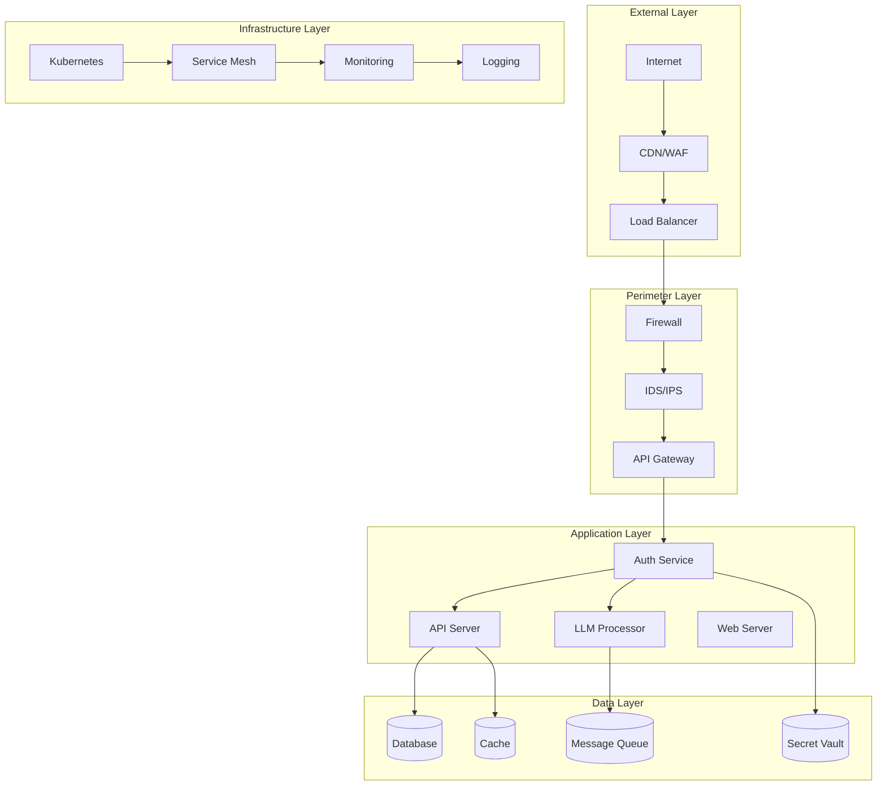
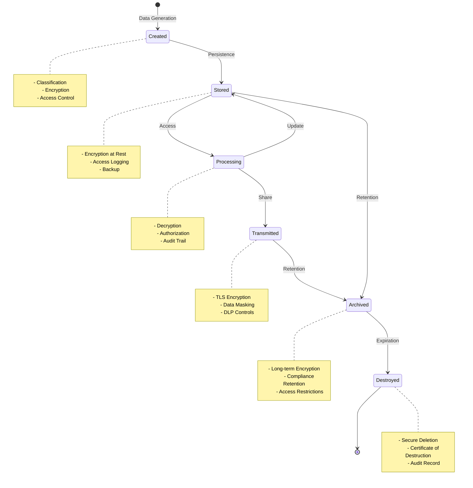
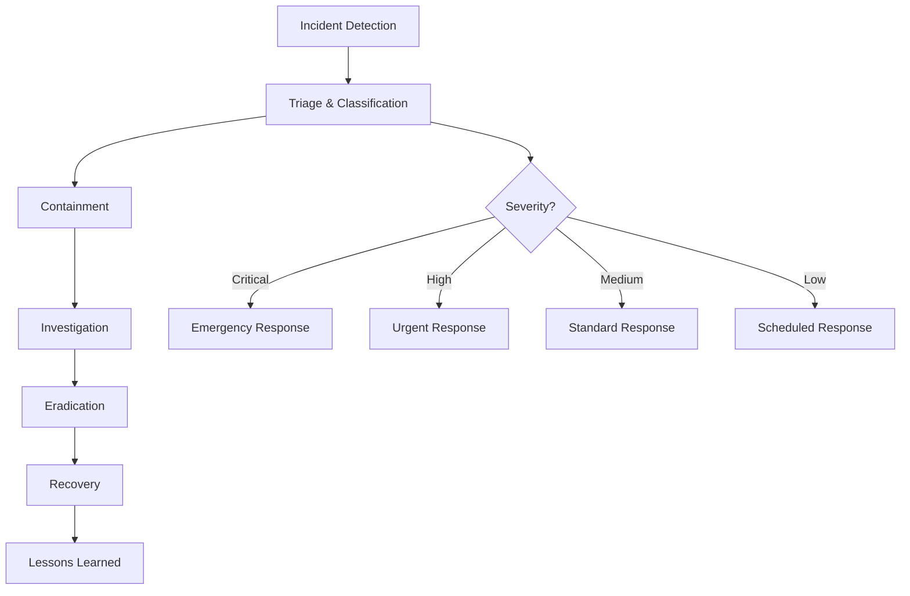

# Nephoran Intent Operator Security Architecture

## Executive Summary

The Nephoran Intent Operator implements a comprehensive, multi-layered security architecture designed to protect against modern threats while maintaining operational efficiency. This document details the security design principles, threat model, and defensive mechanisms employed throughout the system.

The architecture follows a defense-in-depth strategy with security controls at every layer: from network perimeter protection to application-level sanitization, from authentication and authorization to audit logging and compliance monitoring. Each component is designed with security as a first-class concern, implementing industry best practices and exceeding regulatory requirements.

## Table of Contents

1. [Security Design Principles](#security-design-principles)
2. [Threat Model](#threat-model)
3. [Architecture Overview](#architecture-overview)
4. [Security Layers](#security-layers)
5. [Component Security](#component-security)
6. [Data Protection](#data-protection)
7. [Operational Security](#operational-security)
8. [Compliance and Governance](#compliance-and-governance)

## Security Design Principles

### 1. Zero Trust Architecture

The system operates under the assumption that no component, user, or network segment is inherently trustworthy. Every interaction requires:

- **Continuous Verification**: Authentication and authorization checks at every access point
- **Least Privilege Access**: Minimal permissions required for operation
- **Micro-segmentation**: Network isolation between components
- **Encrypted Communications**: All data in transit uses TLS 1.3 or mTLS

### 2. Defense in Depth

Multiple layers of security controls ensure that compromise of a single layer doesn't result in system breach:

```
┌─────────────────────────────────────────────┐
│           Perimeter Security                │
│  ┌───────────────────────────────────────┐  │
│  │       Network Security                │  │
│  │  ┌─────────────────────────────────┐  │  │
│  │  │   Application Security          │  │  │
│  │  │  ┌───────────────────────────┐  │  │  │
│  │  │  │    Data Security          │  │  │  │
│  │  │  │  ┌─────────────────────┐  │  │  │  │
│  │  │  │  │  Identity & Access  │  │  │  │  │
│  │  │  │  │      Management     │  │  │  │  │
│  │  │  │  └─────────────────────┘  │  │  │  │
│  │  │  └───────────────────────────┘  │  │  │
│  │  └─────────────────────────────────┘  │  │
│  └───────────────────────────────────────┘  │
└─────────────────────────────────────────────┘
```

### 3. Secure by Default

All components and configurations default to the most secure settings:

- **Deny by Default**: All access is denied unless explicitly allowed
- **Secure Defaults**: TLS enabled, authentication required, minimal permissions
- **Hardened Configurations**: Security headers, rate limiting, input validation enabled
- **Automated Security**: Security controls are automatically applied, not optional

### 4. Shift-Left Security

Security is integrated throughout the development lifecycle:

- **Security in Design**: Threat modeling during architecture phase
- **Security in Development**: Static analysis, dependency scanning
- **Security in Testing**: Security testing, penetration testing
- **Security in Deployment**: Runtime protection, continuous monitoring

## Threat Model

### Threat Actors

1. **External Attackers**
   - Nation-state actors targeting critical infrastructure
   - Cybercriminals seeking financial gain
   - Hacktivists pursuing ideological goals
   - Script kiddies using automated tools

2. **Insider Threats**
   - Malicious insiders with privileged access
   - Compromised accounts
   - Negligent employees
   - Third-party contractors

3. **Supply Chain Threats**
   - Compromised dependencies
   - Malicious packages
   - Vulnerable libraries
   - Backdoored components

### Attack Vectors

#### 1. Network-Based Attacks
- **DDoS/DoS**: Overwhelming system resources
- **Man-in-the-Middle**: Intercepting communications
- **Port Scanning**: Discovering exposed services
- **Protocol Exploitation**: Exploiting network protocol vulnerabilities

#### 2. Application-Level Attacks
- **Injection Attacks**: SQL, NoSQL, Command, LDAP injection
- **Cross-Site Scripting (XSS)**: Client-side code execution
- **Cross-Site Request Forgery (CSRF)**: Unauthorized actions
- **Server-Side Request Forgery (SSRF)**: Internal network access

#### 3. LLM-Specific Attacks
- **Prompt Injection**: Manipulating LLM behavior
- **Model Extraction**: Stealing model information
- **Data Poisoning**: Corrupting training data
- **Adversarial Inputs**: Crafted inputs causing misclassification

#### 4. Authentication/Authorization Attacks
- **Credential Stuffing**: Using leaked credentials
- **Brute Force**: Password guessing
- **Session Hijacking**: Stealing session tokens
- **Privilege Escalation**: Gaining unauthorized access

#### 5. Data Security Attacks
- **Data Exfiltration**: Stealing sensitive information
- **Data Tampering**: Modifying data integrity
- **Information Disclosure**: Leaking sensitive metadata
- **Privacy Violations**: Unauthorized data access

### Risk Matrix

| Threat Category | Likelihood | Impact | Risk Level | Mitigation Priority |
|----------------|------------|---------|------------|-------------------|
| LLM Prompt Injection | High | Critical | Critical | Immediate |
| Authentication Bypass | Medium | Critical | High | High |
| Data Exfiltration | Medium | High | High | High |
| DDoS Attack | High | Medium | Medium | Medium |
| Supply Chain | Low | Critical | Medium | Medium |
| Insider Threat | Low | High | Medium | Medium |

## Architecture Overview

### High-Level Security Architecture



### Security Zones

1. **DMZ (Demilitarized Zone)**
   - Public-facing services
   - Load balancers and reverse proxies
   - Web Application Firewall (WAF)

2. **Application Zone**
   - Business logic components
   - API servers
   - LLM processing services

3. **Data Zone**
   - Databases and storage
   - Secret management
   - Backup systems

4. **Management Zone**
   - Monitoring and logging
   - Security operations center
   - Administrative access

## Security Layers

### Layer 1: Network Security

#### Firewall Rules
```yaml
ingress:
  - port: 443
    protocol: TCP
    source: 0.0.0.0/0
    description: "HTTPS traffic"
  - port: 8443
    protocol: TCP
    source: 10.0.0.0/8
    description: "Internal API traffic"

egress:
  - port: 443
    protocol: TCP
    destination: 0.0.0.0/0
    description: "Outbound HTTPS"
  - port: 53
    protocol: UDP
    destination: 10.0.0.2
    description: "Internal DNS"
```

#### Network Segmentation
- **VLAN Separation**: Different security zones on separate VLANs
- **Micro-segmentation**: Pod-to-pod communication restrictions
- **Network Policies**: Kubernetes NetworkPolicy enforcement
- **Service Mesh**: Istio for service-to-service security

### Layer 2: Transport Security

#### TLS Configuration
```go
// Minimum TLS 1.2, prefer TLS 1.3
tlsConfig := &tls.Config{
    MinVersion: tls.VersionTLS12,
    PreferServerCipherSuites: true,
    CipherSuites: []uint16{
        tls.TLS_AES_256_GCM_SHA384,
        tls.TLS_AES_128_GCM_SHA256,
        tls.TLS_CHACHA20_POLY1305_SHA256,
    },
    CurvePreferences: []tls.CurveID{
        tls.X25519,
        tls.CurveP256,
    },
}
```

#### Mutual TLS (mTLS)
- Service-to-service authentication
- Certificate-based identity
- Automatic certificate rotation
- Revocation checking

### Layer 3: Application Security

#### Input Validation
```go
// Comprehensive input validation
func ValidateInput(input string) error {
    // Length check
    if len(input) > MaxInputLength {
        return ErrInputTooLong
    }
    
    // Character validation
    if !isValidCharset(input) {
        return ErrInvalidCharacters
    }
    
    // Pattern matching
    if containsMaliciousPattern(input) {
        return ErrMaliciousInput
    }
    
    // Encoding validation
    if hasEncodingIssues(input) {
        return ErrInvalidEncoding
    }
    
    return nil
}
```

#### Security Headers
```go
// Comprehensive security headers
headers := map[string]string{
    "Strict-Transport-Security": "max-age=31536000; includeSubDomains; preload",
    "X-Content-Type-Options": "nosniff",
    "X-Frame-Options": "DENY",
    "X-XSS-Protection": "1; mode=block",
    "Content-Security-Policy": "default-src 'self'; script-src 'self'",
    "Referrer-Policy": "strict-origin-when-cross-origin",
    "Permissions-Policy": "geolocation=(), microphone=(), camera=()",
}
```

### Layer 4: Authentication & Authorization

#### Multi-Factor Authentication
```go
type MFAConfig struct {
    Required bool
    Methods  []MFAMethod
    Timeout  time.Duration
}

type MFAMethod struct {
    Type     string // "totp", "sms", "email", "hardware"
    Priority int
    Enabled  bool
}
```

#### Role-Based Access Control (RBAC)
```yaml
roles:
  - name: admin
    permissions:
      - resource: "*"
        actions: ["*"]
  
  - name: operator
    permissions:
      - resource: "networkintents"
        actions: ["get", "list", "create", "update"]
      - resource: "deployments"
        actions: ["get", "list"]
  
  - name: viewer
    permissions:
      - resource: "*"
        actions: ["get", "list"]
```

### Layer 5: Data Security

#### Encryption at Rest
```go
// AES-256-GCM encryption for data at rest
func EncryptData(plaintext []byte, key []byte) ([]byte, error) {
    block, err := aes.NewCipher(key)
    if err != nil {
        return nil, err
    }
    
    gcm, err := cipher.NewGCM(block)
    if err != nil {
        return nil, err
    }
    
    nonce := make([]byte, gcm.NonceSize())
    if _, err := io.ReadFull(rand.Reader, nonce); err != nil {
        return nil, err
    }
    
    return gcm.Seal(nonce, nonce, plaintext, nil), nil
}
```

#### Key Management
- Hardware Security Module (HSM) integration
- Key rotation policies
- Key escrow and recovery
- Cryptographic agility

## Component Security

### LLM Security

#### Prompt Injection Prevention
```go
// Multi-layer prompt sanitization
func SanitizeLLMInput(input string) string {
    // Remove control characters
    input = removeControlCharacters(input)
    
    // Detect and block injection patterns
    if detectInjectionPattern(input) {
        return ""
    }
    
    // Apply context boundaries
    input = applyContextBoundaries(input)
    
    // Token limit enforcement
    input = enforceTokenLimit(input)
    
    return input
}
```

#### Model Security
- Model encryption at rest
- Secure model serving
- Access control for model endpoints
- Model versioning and rollback

### API Security

#### Rate Limiting
```go
type RateLimitConfig struct {
    Global    RateLimit
    PerIP     RateLimit
    PerUser   RateLimit
    PerAPI    map[string]RateLimit
}

type RateLimit struct {
    Requests int
    Window   time.Duration
    Burst    int
}
```

#### API Gateway Security
- Request validation
- Response filtering
- API key management
- OAuth2/OIDC integration

### Database Security

#### Connection Security
```go
// Secure database connection
dbConfig := &DatabaseConfig{
    Host:            "db.internal",
    Port:            5432,
    SSLMode:         "require",
    SSLCert:         "/certs/client.crt",
    SSLKey:          "/certs/client.key",
    SSLRootCert:     "/certs/ca.crt",
    ConnMaxLifetime: 30 * time.Minute,
    MaxOpenConns:    25,
    MaxIdleConns:    5,
}
```

#### Query Security
- Parameterized queries only
- Query timeout enforcement
- Row-level security
- Audit logging

## Data Protection

### Data Classification

| Classification | Description | Protection Requirements |
|---------------|-------------|------------------------|
| Public | Non-sensitive data | Basic integrity |
| Internal | Internal business data | Encryption in transit |
| Confidential | Sensitive business data | Encryption at rest and in transit |
| Restricted | Highly sensitive data | HSM encryption, audit logging |

### Data Lifecycle Management



### Privacy Protection

#### Personal Data Handling
```go
type PersonalDataHandler struct {
    Anonymization   bool
    Pseudonymization bool
    Encryption      bool
    RetentionDays   int
    ConsentRequired bool
}

// GDPR-compliant data processing
func (h *PersonalDataHandler) ProcessPersonalData(data PersonalData) error {
    // Check consent
    if h.ConsentRequired && !data.HasConsent() {
        return ErrNoConsent
    }
    
    // Apply privacy techniques
    if h.Anonymization {
        data = anonymize(data)
    }
    if h.Pseudonymization {
        data = pseudonymize(data)
    }
    if h.Encryption {
        data = encrypt(data)
    }
    
    // Set retention
    data.SetExpiration(time.Now().AddDate(0, 0, h.RetentionDays))
    
    return nil
}
```

## Operational Security

### Security Monitoring

#### Security Information and Event Management (SIEM)
```yaml
siem_config:
  sources:
    - type: application_logs
      path: /var/log/nephoran/*.log
      format: json
    - type: security_events
      path: /var/log/audit/*.log
      format: syslog
    - type: network_flows
      protocol: netflow
      port: 2055
  
  rules:
    - name: failed_login_attempts
      condition: "event.type == 'authentication' AND event.result == 'failed'"
      threshold: 5
      window: 5m
      action: alert
    
    - name: privilege_escalation
      condition: "event.type == 'authorization' AND event.privilege_change == true"
      action: alert
    
    - name: data_exfiltration
      condition: "event.bytes_sent > 1000000 AND event.destination.external == true"
      action: block
```

#### Intrusion Detection System (IDS)
```yaml
ids_rules:
  - rule_id: 1001
    name: "SQL Injection Attempt"
    pattern: "(\bSELECT\b.*\bFROM\b|\bUNION\b.*\bSELECT\b|\bINSERT\b.*\bINTO\b)"
    action: alert
    severity: high
  
  - rule_id: 1002
    name: "Directory Traversal"
    pattern: "(\.\./|\.\.\\|%2e%2e/|%252e%252e/)"
    action: block
    severity: critical
  
  - rule_id: 1003
    name: "Command Injection"
    pattern: "(\||;|`|\$\(|\${|&&|\|\|)"
    action: alert
    severity: high
```

### Incident Response

#### Incident Response Plan


#### Incident Response Team
```yaml
incident_response_team:
  roles:
    - role: incident_commander
      responsibilities:
        - Overall incident coordination
        - External communication
        - Decision making
      
    - role: security_analyst
      responsibilities:
        - Technical investigation
        - Forensics
        - Root cause analysis
      
    - role: system_administrator
      responsibilities:
        - System isolation
        - Patch deployment
        - System restoration
      
    - role: legal_counsel
      responsibilities:
        - Legal compliance
        - Law enforcement liaison
        - Regulatory reporting
```

### Security Operations

#### Vulnerability Management
```go
type VulnerabilityManagement struct {
    ScanInterval   time.Duration
    PatchWindow    time.Duration
    CriticalSLA    time.Duration
    HighSLA        time.Duration
    MediumSLA      time.Duration
}

// Automated vulnerability scanning
func (vm *VulnerabilityManagement) ScheduledScan() {
    ticker := time.NewTicker(vm.ScanInterval)
    for range ticker.C {
        vulnerabilities := performScan()
        for _, vuln := range vulnerabilities {
            vm.procesVulnerability(vuln)
        }
    }
}
```

#### Security Metrics
```yaml
security_metrics:
  - metric: mean_time_to_detect
    target: < 1 hour
    measurement: time_from_incident_to_detection
  
  - metric: mean_time_to_respond
    target: < 4 hours
    measurement: time_from_detection_to_containment
  
  - metric: patch_compliance
    target: > 95%
    measurement: patched_systems / total_systems
  
  - metric: security_training_completion
    target: 100%
    measurement: trained_users / total_users
```

## Compliance and Governance

### Regulatory Compliance

#### Compliance Framework Mapping
| Requirement | SOC 2 | ISO 27001 | GDPR | HIPAA | PCI DSS |
|------------|-------|-----------|------|-------|---------|
| Access Control | CC6.1 | A.9 | Art. 32 | §164.312(a) | Req. 7 |
| Encryption | CC6.7 | A.10.1 | Art. 32 | §164.312(a)(2) | Req. 3.4 |
| Audit Logging | CC4.1 | A.12.4 | Art. 30 | §164.312(b) | Req. 10 |
| Incident Response | CC7.3 | A.16 | Art. 33 | §164.308(a)(6) | Req. 12.10 |
| Risk Assessment | CC3.1 | A.12.6 | Art. 35 | §164.308(a)(1) | Req. 12.2 |

#### Compliance Automation
```go
type ComplianceChecker struct {
    Standards []ComplianceStandard
    Controls  []SecurityControl
}

func (cc *ComplianceChecker) ValidateCompliance() ComplianceReport {
    report := ComplianceReport{
        Timestamp: time.Now(),
        Standards: make(map[string]StandardCompliance),
    }
    
    for _, standard := range cc.Standards {
        compliance := cc.checkStandard(standard)
        report.Standards[standard.Name] = compliance
    }
    
    return report
}
```

### Security Governance

#### Security Policies
1. **Information Security Policy**: Overall security framework
2. **Access Control Policy**: User access management
3. **Data Protection Policy**: Data handling and privacy
4. **Incident Response Policy**: Security incident procedures
5. **Business Continuity Policy**: Disaster recovery planning

#### Security Training Program
```yaml
training_program:
  onboarding:
    - module: security_awareness
      duration: 2h
      required: true
    - module: data_protection
      duration: 1h
      required: true
    - module: incident_reporting
      duration: 30m
      required: true
  
  annual:
    - module: security_refresher
      duration: 1h
      required: true
    - module: phishing_awareness
      duration: 30m
      required: true
  
  role_specific:
    developers:
      - module: secure_coding
        duration: 4h
      - module: owasp_top_10
        duration: 2h
    
    administrators:
      - module: system_hardening
        duration: 3h
      - module: incident_response
        duration: 2h
```

### Audit and Assurance

#### Internal Audit Program
```go
type AuditProgram struct {
    Schedule     []AuditEvent
    Scope        []AuditScope
    Methodology  AuditMethodology
    Reporting    ReportingStructure
}

type AuditEvent struct {
    Type      string // "technical", "compliance", "process"
    Frequency string // "quarterly", "annual", "continuous"
    Areas     []string
    Auditor   string
}
```

#### Third-Party Assessments
- Annual penetration testing
- Quarterly vulnerability assessments
- SOC 2 Type II certification
- ISO 27001 certification
- Security code reviews

## Security Roadmap

### Current State (Phase 1) ✅
- Basic authentication and authorization
- TLS encryption
- Input validation
- Security headers
- Rate limiting
- Audit logging

### Near-Term Improvements (Phase 2) 🚧
- Advanced threat detection
- Zero-trust network architecture
- Enhanced LLM security
- Automated incident response
- Compliance automation

### Long-Term Vision (Phase 3) 📋
- AI-powered security operations
- Quantum-resistant cryptography
- Advanced behavioral analytics
- Autonomous security response
- Predictive threat intelligence

## Conclusion

The Nephoran Intent Operator's security architecture represents a comprehensive, defense-in-depth approach to protecting critical infrastructure. By implementing multiple layers of security controls, maintaining strict compliance standards, and continuously evolving our security posture, we ensure the system remains resilient against current and emerging threats.

This living document will be updated regularly to reflect changes in the threat landscape, technological advances, and lessons learned from security operations. Regular reviews and updates ensure the security architecture remains effective and aligned with business objectives.

## References

1. NIST Cybersecurity Framework v1.1
2. ISO/IEC 27001:2022 Information Security Management
3. OWASP Top 10 2021
4. MITRE ATT&CK Framework
5. Zero Trust Architecture (NIST SP 800-207)
6. Cloud Security Alliance Security Guidance v4.0
7. CIS Critical Security Controls v8
8. ENISA Threat Landscape 2023

---

**Document Classification**: INTERNAL USE ONLY  
**Last Updated**: 2025-08-19  
**Next Review**: 2025-09-19  
**Owner**: Security Architecture Team  
**Version**: 1.0.0