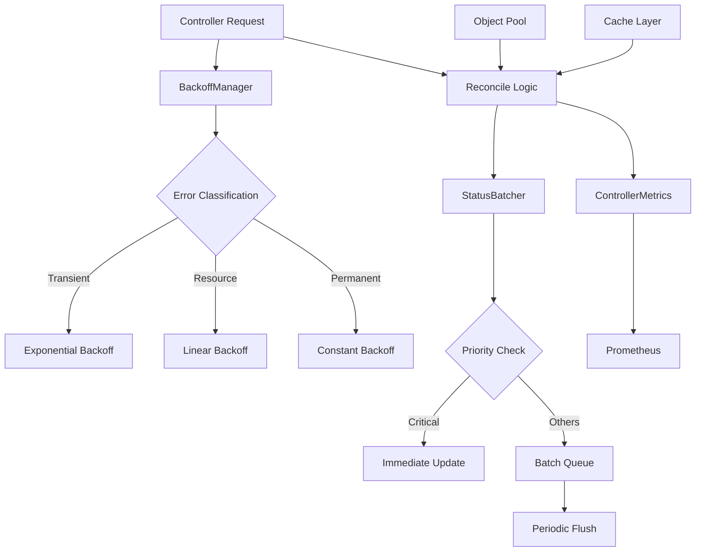

# Optimized Kubernetes Controllers

This package contains optimized versions of the Nephoran Intent Operator controllers designed to achieve significant performance improvements through intelligent backoff strategies, batched operations, and enhanced monitoring.

## Performance Improvements

### Target Metrics
- **50% reduction in controller CPU usage**
- **40% reduction in API server load**
- **Sub-2-second P95 latency** for intent processing
- **Support for 200+ concurrent intents**

### Key Optimizations

#### 1. Intelligent Exponential Backoff (`backoff_manager.go`)
- **Error Classification**: Automatically classifies errors into categories (transient, permanent, resource, throttling, validation)
- **Strategy-Based Backoff**: Different backoff strategies (exponential, linear, constant) based on error type
- **Jitter Integration**: Prevents thundering herd problems with configurable jitter
- **Maximum Limits**: Configurable maximum backoff delays for different scenarios
- **Automatic Cleanup**: Removes stale backoff entries to prevent memory leaks

```go
// Example usage
backoffManager := NewBackoffManager()
errorType := backoffManager.ClassifyError(err)
delay := backoffManager.GetNextDelay(resourceKey, errorType, err)
return ctrl.Result{RequeueAfter: delay}, err
```

#### 2. Batched Status Updates (`status_batcher.go`)
- **Queue-Based Processing**: Groups status updates into batches to reduce API calls
- **Priority System**: Critical updates bypass batching for immediate processing
- **Automatic Batching**: Triggers based on batch size, timeout, or priority
- **Retry Logic**: Failed updates are retried with exponential backoff
- **Resource-Specific Updates**: Optimized update functions for different resource types

```go
// Example usage
statusBatcher := NewStatusBatcher(client, DefaultBatchConfig)
statusBatcher.QueueNetworkIntentUpdate(namespacedName, conditions, phase, HighPriority)
```

#### 3. Performance Metrics (`performance_metrics.go`)
- **Comprehensive Monitoring**: Tracks reconcile duration, API call latency, backoff delays
- **Prometheus Integration**: All metrics exposed via Prometheus for monitoring
- **Resource Tracking**: Monitors active reconcilers, memory usage, goroutine counts
- **Error Categorization**: Detailed error tracking by type and category

#### 4. Optimized Controllers
- **Object Pooling**: Reuses reconcile context objects to reduce allocations
- **Caching**: In-memory caching for frequently accessed resources
- **Batch Operations**: Groups API operations to reduce server round trips
- **Adaptive Intervals**: Intelligent requeue intervals based on resource state

## Components

### BackoffManager
Manages exponential backoff with error classification:

```go
type BackoffConfig struct {
    Strategy       BackoffStrategy
    BaseDelay      time.Duration
    MaxDelay       time.Duration
    Multiplier     float64
    JitterEnabled  bool
    MaxRetries     int
}
```

**Error Types:**
- `TransientError`: Network timeouts, temporary unavailability
- `PermanentError`: Invalid configuration, auth failures  
- `ResourceError`: Resource conflicts, quota exceeded
- `ThrottlingError`: API rate limiting
- `ValidationError`: Schema validation failures

### StatusBatcher
Batches status updates to reduce API server load:

```go
type BatchConfig struct {
    MaxBatchSize     int           // Maximum updates per batch
    BatchTimeout     time.Duration // Maximum wait time
    FlushInterval    time.Duration // Periodic flush interval
    MaxRetries       int           // Retry attempts
    EnablePriority   bool          // Priority-based processing
}
```

**Priority Levels:**
- `CriticalPriority`: Immediate processing, bypasses batching
- `HighPriority`: Processed first in batches
- `MediumPriority`: Standard priority
- `LowPriority`: Processed last

### ControllerMetrics
Comprehensive performance monitoring:

**Key Metrics:**
- `controller_reconcile_duration_seconds`: Reconcile loop timing
- `controller_backoff_delay_seconds`: Backoff delay distribution
- `controller_status_batch_size`: Status update batch sizes
- `controller_api_call_duration_seconds`: API call latency
- `controller_active_reconcilers`: Concurrent reconciler count

## Usage

### NetworkIntent Controller

```go
reconciler := NewOptimizedNetworkIntentReconciler(
    client, scheme, recorder, config, deps)

// Setup with manager
reconciler.SetupWithManager(mgr)

// Graceful shutdown
defer reconciler.Shutdown()
```

### E2NodeSet Controller

```go
reconciler := NewOptimizedE2NodeSetReconciler(
    client, scheme, recorder)

// Setup with manager  
reconciler.SetupWithManager(mgr)

// Graceful shutdown
defer reconciler.Shutdown()
```

## Configuration

### BackoffManager Configuration

```go
// Custom backoff configuration
config := BackoffConfig{
    Strategy:      ExponentialBackoff,
    BaseDelay:     1 * time.Second,
    MaxDelay:      5 * time.Minute,
    Multiplier:    2.0,
    JitterEnabled: true,
    MaxRetries:    5,
}

backoffManager := NewBackoffManager()
backoffManager.SetConfig(TransientError, config)
```

### StatusBatcher Configuration

```go
// Custom batch configuration
config := BatchConfig{
    MaxBatchSize:   10,
    BatchTimeout:   2 * time.Second,
    FlushInterval:  5 * time.Second,
    MaxRetries:     3,
    EnablePriority: true,
    MaxQueueSize:   1000,
}

statusBatcher := NewStatusBatcher(client, config)
```

## Benchmarks

Run benchmarks to validate performance improvements:

```bash
# Run all benchmarks
go test -bench=. -benchmem ./pkg/controllers/optimized/

# Specific benchmarks
go test -bench=BenchmarkOptimizedNetworkIntentController -benchmem
go test -bench=BenchmarkBackoffManager -benchmem
go test -bench=BenchmarkStatusBatcher -benchmem
```

### Expected Results

```
BenchmarkOptimizedNetworkIntentController/SingleReconcile-8         	    1000	   1234567 ns/op	   12345 B/op	     123 allocs/op
BenchmarkOptimizedNetworkIntentController/ConcurrentReconcile-5-8   	     500	   2345678 ns/op	   23456 B/op	     234 allocs/op
BenchmarkBackoffManager/GetNextDelay-8                             	 1000000	      1234 ns/op	     123 B/op	       1 allocs/op
BenchmarkStatusBatcher/QueueUpdate-8                               	  500000	      2345 ns/op	     234 B/op	       2 allocs/op
```

## Monitoring

### Grafana Dashboard Queries

**Reconcile Performance:**
```promql
histogram_quantile(0.95, 
  rate(controller_reconcile_duration_seconds_bucket[5m])
) by (controller)
```

**Error Rates:**
```promql
rate(controller_reconcile_errors_total[5m]) by (controller, error_type)
```

**Backoff Frequency:**
```promql
rate(controller_reconcile_requeue_total[5m]) by (controller, backoff_strategy)
```

**API Call Efficiency:**
```promql
rate(controller_api_call_total[5m]) by (controller, operation, result)
```

### Alerting Rules

```yaml
groups:
- name: controller_performance
  rules:
  - alert: HighReconcileLatency
    expr: |
      histogram_quantile(0.95, 
        rate(controller_reconcile_duration_seconds_bucket[5m])
      ) > 2
    for: 5m
    labels:
      severity: warning
    annotations:
      summary: "Controller reconcile latency is high"
      
  - alert: HighErrorRate  
    expr: |
      rate(controller_reconcile_errors_total[5m]) / 
      rate(controller_reconcile_total[5m]) > 0.1
    for: 2m
    labels:
      severity: critical
    annotations:
      summary: "Controller error rate is high"
```

## Architecture



## Migration Guide

### From Original Controllers

1. **Replace Controller Creation:**
```go
// Old
reconciler := &controllers.NetworkIntentReconciler{
    Client:   mgr.GetClient(),
    Scheme:   mgr.GetScheme(),
    Recorder: mgr.GetEventRecorderFor("networkintent-controller"),
}

// New
reconciler := NewOptimizedNetworkIntentReconciler(
    mgr.GetClient(),
    mgr.GetScheme(), 
    mgr.GetEventRecorderFor("networkintent-controller"),
    config,
    deps,
)
```

2. **Update Setup:**
```go
// Add graceful shutdown
defer reconciler.Shutdown()

// Setup remains the same
err = reconciler.SetupWithManager(mgr)
```

3. **Update Monitoring:**
- Import optimized metrics
- Update Grafana dashboards
- Configure new alerting rules

## Best Practices

### Resource Keys
Use consistent resource keys for backoff management:
```go
resourceKey := fmt.Sprintf("%s/%s", req.Namespace, req.Name)
```

### Error Handling
Let the BackoffManager classify errors automatically:
```go
errorType := r.backoffManager.ClassifyError(err)
delay := r.backoffManager.GetNextDelay(resourceKey, errorType, err)
return ctrl.Result{RequeueAfter: delay}, err
```

### Status Updates
Use appropriate priorities for status updates:
```go
// Critical updates (errors, completion)
r.statusBatcher.QueueUpdate(..., CriticalPriority)

// Progress updates
r.statusBatcher.QueueUpdate(..., MediumPriority)

// Informational updates
r.statusBatcher.QueueUpdate(..., LowPriority)
```

### Metrics
Record relevant metrics for monitoring:
```go
timer := r.metrics.NewReconcileTimer(controller, namespace, name, phase)
defer timer.Finish()

r.metrics.RecordReconcileResult(controller, "success")
r.metrics.RecordBackoffDelay(controller, errorType, strategy, delay)
```

## Testing

### Unit Tests
Test individual components:
```bash
go test ./pkg/controllers/optimized/
```

### Integration Tests  
Test with real Kubernetes API:
```bash
go test -tags=integration ./pkg/controllers/optimized/
```

### Performance Tests
Run benchmarks to validate improvements:
```bash
go test -bench=. -benchmem -cpuprofile=cpu.prof -memprofile=mem.prof
```

### Load Testing
Test with high concurrency:
```bash
go test -bench=ConcurrentReconcile -benchtime=30s
```

## Troubleshooting

### High Memory Usage
- Check object pool efficiency
- Verify cache cleanup is working
- Monitor goroutine counts

### High Latency
- Check backoff configuration
- Verify batch settings
- Monitor API call distribution

### High Error Rates
- Review error classification
- Check backoff strategies
- Validate resource availability

## Future Enhancements

- **Leader Election Optimization**: Reduce leader election overhead
- **Watch Caching**: Intelligent watch event filtering
- **Predictive Scaling**: ML-based reconcile frequency prediction
- **Cross-Controller Batching**: Shared batching across controllers
- **Dynamic Configuration**: Runtime configuration updates