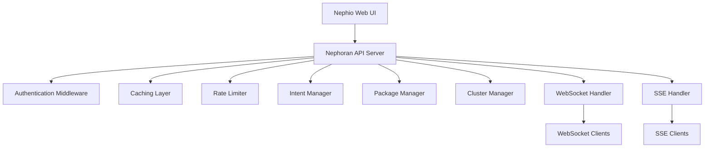

# Nephoran Web UI Integration

This package provides a comprehensive Web UI integration layer for the Nephoran Intent Operator, enabling complete REST API access and real-time streaming capabilities for the Nephio UI.

## Overview

The Web UI integration provides:

- **RESTful APIs**: Complete CRUD operations for intents, packages, and clusters
- **Real-time Streaming**: WebSocket and Server-Sent Events for live updates
- **Authentication**: OAuth2 integration with RBAC authorization
- **Performance Optimization**: Intelligent caching and rate limiting
- **OpenAPI Documentation**: Complete API specification and interactive docs

## Architecture



## Key Components

### 1. API Server (`server.go`)
- HTTP/HTTPS server with configurable TLS
- Middleware pipeline for auth, caching, rate limiting
- Graceful shutdown and connection management
- Prometheus metrics integration
- CORS support for cross-origin requests

### 2. Intent Management APIs (`intent_handlers.go`)
- Full CRUD operations for NetworkIntent resources
- Advanced filtering and pagination
- Status tracking and progress monitoring
- Bulk operations support
- Integration with LLM processor for intent translation

### 3. Package Management APIs (`package_handlers.go`)
- PackageRevision lifecycle management
- Transition operations (Draft → Proposed → Published)
- Validation and approval workflows
- Multi-cluster deployment status
- Template and blueprint management

### 4. Multi-Cluster APIs (`cluster_handlers.go`)
- Cluster registration and management
- Health monitoring and resource utilization
- Deployment orchestration across clusters
- Network topology visualization
- Connectivity testing and latency metrics

### 5. Real-time Streaming (`realtime_handlers.go`)
- WebSocket endpoints for bidirectional communication
- Server-Sent Events for unidirectional streaming
- Subscription filtering and event routing
- Connection lifecycle management
- Automatic reconnection and heartbeat

### 6. Performance Optimization
- **Caching (`cache.go`)**: LRU cache with TTL and intelligent invalidation
- **Rate Limiting (`rate_limiter.go`)**: Token bucket with sliding window
- Connection pooling and resource optimization
- Response compression and efficient serialization

### 7. Dashboard APIs (`dashboard_handlers.go`)
- Comprehensive metrics aggregation
- Real-time system health monitoring
- Alert management and event tracking
- Performance analytics and trend data
- Network topology and dependency visualization

### 8. OpenAPI Documentation (`openapi.go`)
- Complete OpenAPI 3.0 specification
- Interactive Swagger UI documentation
- Schema definitions and examples
- Security scheme documentation
- Automated API validation

## API Endpoints

### Intent Management
```
GET    /api/v1/intents                 - List intents
POST   /api/v1/intents                 - Create intent
GET    /api/v1/intents/{name}          - Get intent details
PUT    /api/v1/intents/{name}          - Update intent
DELETE /api/v1/intents/{name}          - Delete intent
GET    /api/v1/intents/{name}/status   - Get intent status
POST   /api/v1/intents/{name}/validate - Validate intent
```

### Package Management
```
GET    /api/v1/packages                    - List packages
GET    /api/v1/packages/{name}             - Get package details
POST   /api/v1/packages/{name}/propose     - Transition to Proposed
POST   /api/v1/packages/{name}/approve     - Approve and publish
POST   /api/v1/packages/{name}/validate    - Validate package
GET    /api/v1/packages/{name}/deployment-status - Get deployment status
```

### Multi-Cluster Management
```
GET    /api/v1/clusters                - List clusters
POST   /api/v1/clusters                - Register cluster
GET    /api/v1/clusters/{id}           - Get cluster details
GET    /api/v1/clusters/{id}/status    - Get cluster status
POST   /api/v1/clusters/{id}/deploy    - Deploy to cluster
GET    /api/v1/clusters/topology       - Get network topology
```

### Real-time Streaming
```
WebSocket /api/v1/realtime/ws          - All events
WebSocket /api/v1/realtime/ws/intents  - Intent events only
WebSocket /api/v1/realtime/ws/packages - Package events only
WebSocket /api/v1/realtime/ws/clusters - Cluster events only

SSE /api/v1/realtime/events            - All events stream
SSE /api/v1/realtime/events/intents    - Intent events stream
SSE /api/v1/realtime/events/packages   - Package events stream
SSE /api/v1/realtime/events/clusters   - Cluster events stream
```

### Dashboard and Metrics
```
GET /api/v1/dashboard/metrics          - Complete dashboard metrics
GET /api/v1/dashboard/overview         - System overview
GET /api/v1/dashboard/health           - System health status
GET /api/v1/dashboard/alerts           - Active alerts
GET /api/v1/dashboard/trends/intents   - Intent trend data
```

### System Management
```
GET /health                            - Health check
GET /readiness                         - Readiness check  
GET /metrics                           - Prometheus metrics
GET /openapi.json                      - OpenAPI specification
GET /docs                              - Swagger UI documentation
```

## Configuration

The API server is configured through the `ServerConfig` structure:

```go
config := &ServerConfig{
    Address:           "0.0.0.0",
    Port:              8080,
    TLSEnabled:        false,
    TLSCertFile:       "/etc/certs/tls.crt",
    TLSKeyFile:        "/etc/certs/tls.key",
    EnableCORS:        true,
    AllowedOrigins:    []string{"*"},
    EnableRateLimit:   true,
    RequestsPerMin:    1000,
    EnableCaching:     true,
    CacheSize:         1000,
    CacheTTL:          5 * time.Minute,
    MaxWSConnections:  100,
    DefaultPageSize:   20,
    MaxPageSize:       100,
}
```

## Authentication and Authorization

The API integrates with the existing Nephoran authentication system:

- **OAuth2 Providers**: Azure AD, Okta, Keycloak, Google
- **JWT Tokens**: Stateless authentication with refresh tokens  
- **RBAC**: Role-based access control with permissions
- **Session Management**: Server-side session tracking
- **API Keys**: For service-to-service communication

### Permission Requirements

| Endpoint Category | Required Permission |
|-------------------|-------------------|
| Intent Read | `intent:read` |
| Intent Create/Update | `intent:create`, `intent:update` |
| Intent Delete | `intent:delete` |
| Package Operations | `intent:update` (lifecycle operations) |
| Cluster Operations | `system:manage` |
| Dashboard/Metrics | `metrics:view` |
| System Admin | `system:manage` (admin endpoints) |

## Real-time Features

### WebSocket Integration

WebSocket connections support:
- **Subscription Filtering**: Subscribe to specific event types
- **Real-time Updates**: Live intent, package, and cluster status
- **Bidirectional Communication**: Request/response and notifications
- **Connection Management**: Automatic reconnection and heartbeat
- **Scalability**: Support for hundreds of concurrent connections

Example WebSocket subscription:
```javascript
const ws = new WebSocket('ws://localhost:8080/api/v1/realtime/ws/intents');

// Subscribe to high-priority intents only
ws.send(JSON.stringify({
    action: 'subscribe',
    filters: {
        priority: ['high', 'critical'],
        event_types: ['intent_update']
    }
}));

ws.onmessage = (event) => {
    const update = JSON.parse(event.data);
    console.log('Intent update:', update);
};
```

### Server-Sent Events

SSE provides unidirectional streaming:
- **Event Streaming**: Continuous event feed
- **Filtering**: Query parameter based filtering
- **Reconnection**: Automatic client reconnection
- **Keep-alive**: Heartbeat to maintain connections

Example SSE consumption:
```javascript
const eventSource = new EventSource('/api/v1/realtime/events/intents?priority=high');

eventSource.onmessage = (event) => {
    const data = JSON.parse(event.data);
    console.log('Intent event:', data);
};
```

## Performance Optimizations

### Intelligent Caching
- **Multi-level Cache**: In-memory with TTL and LRU eviction
- **Cache Invalidation**: Smart invalidation on resource changes
- **Cache Warming**: Predictive cache population
- **Hit Rate Monitoring**: Performance metrics and optimization

### Rate Limiting
- **Token Bucket**: Burst handling with sustained rate limits
- **Sliding Window**: Accurate rate calculation over time windows
- **Per-User Limits**: Individual rate limits based on authentication
- **Adaptive Limits**: Dynamic rate adjustment based on load

### Connection Management
- **Connection Pooling**: Efficient resource utilization
- **Graceful Degradation**: Fallback strategies during high load
- **Circuit Breakers**: Fault isolation and recovery
- **Resource Monitoring**: Memory and connection usage tracking

## Monitoring and Observability

### Metrics Collection
- **Request Metrics**: Latency, throughput, error rates
- **Connection Metrics**: WebSocket and SSE connection counts
- **Cache Metrics**: Hit rates, eviction counts, memory usage
- **Rate Limit Metrics**: Rejection rates, quota utilization

### Health Monitoring
- **Health Endpoints**: System health and readiness checks
- **Component Health**: Individual service health status
- **Dependency Checks**: External service availability
- **Alert Integration**: Automated alert generation

### Distributed Tracing
- **Request Tracing**: End-to-end request tracking
- **Service Correlation**: Cross-service request correlation
- **Performance Analysis**: Bottleneck identification
- **Error Attribution**: Error source tracking

## Usage Examples

### Creating an Intent
```bash
curl -X POST http://localhost:8080/api/v1/intents \
  -H "Content-Type: application/json" \
  -H "Authorization: Bearer ${JWT_TOKEN}" \
  -d '{
    "name": "deploy-amf-prod",
    "intent": "Deploy a high-availability AMF instance for production with auto-scaling",
    "intent_type": "deployment",
    "priority": "high",
    "target_components": ["AMF"],
    "target_namespace": "telecom-production"
  }'
```

### Subscribing to Real-time Updates
```javascript
// WebSocket for bidirectional communication
const ws = new WebSocket('ws://localhost:8080/api/v1/realtime/ws');

ws.onopen = () => {
    // Subscribe to all high-priority events
    ws.send(JSON.stringify({
        action: 'subscribe',
        filters: { priority: ['high', 'critical'] }
    }));
};

// Server-Sent Events for unidirectional streaming  
const events = new EventSource('/api/v1/realtime/events?priority=high');
events.onmessage = (event) => {
    const data = JSON.parse(event.data);
    updateUI(data);
};
```

### Retrieving Dashboard Metrics
```bash
curl -H "Authorization: Bearer ${JWT_TOKEN}" \
  http://localhost:8080/api/v1/dashboard/metrics
```

## Development and Testing

### Running the Server
```go
import (
    "context"
    "github.com/thc1006/nephoran-intent-operator/pkg/webui"
)

// Create server with dependencies
server, err := webui.NewNephoranAPIServer(
    intentManager,
    packageManager, 
    clusterManager,
    llmProcessor,
    kubeClient,
    config,
)

// Start server
ctx := context.Background()
err = server.Start(ctx)
```

### Testing WebSocket Connections
```bash
# Test WebSocket connection
wscat -c ws://localhost:8080/api/v1/realtime/ws

# Test SSE stream  
curl -N -H "Accept: text/event-stream" \
  http://localhost:8080/api/v1/realtime/events
```

### API Documentation
- **Interactive Docs**: http://localhost:8080/docs
- **OpenAPI Spec**: http://localhost:8080/openapi.json
- **Health Check**: http://localhost:8080/health

## Integration with Nephio UI

The API server is designed specifically for integration with the Nephio Web UI:

### UI Dashboard Integration
- Real-time metrics display
- Interactive intent creation and monitoring
- Package lifecycle visualization
- Multi-cluster deployment management
- Alert and event management

### Streaming Integration
- Live status updates without polling
- Real-time progress indicators
- Immediate error notifications
- Connection status monitoring

### Security Integration
- Single sign-on (SSO) compatibility
- Role-based UI element visibility
- Secure API token management
- Session timeout handling

This comprehensive Web UI integration layer provides the Nephio UI with complete visibility and control over intent-driven network operations while maintaining enterprise-grade security, performance, and reliability standards.