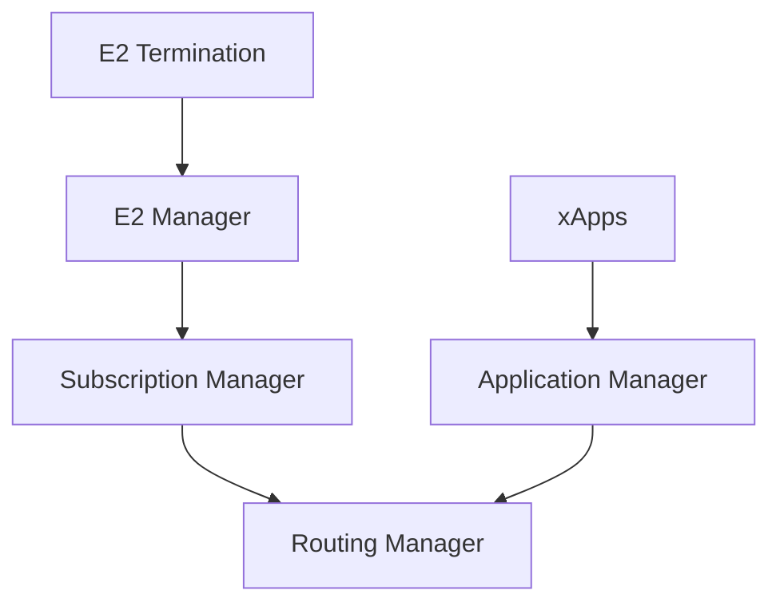

# O-RAN Near-RT RIC Platform

This directory contains the integration of O-RAN Near-Real-Time RIC Platform components as Git submodules, following O-RAN SC best practices.

## Architecture

The Near-RT RIC Platform consists of 5 core components managed as independent submodules:

### Core Components (Submodules)

| Component | Repository | Purpose | Interface |
|-----------|-----------|---------|-----------|
| **submgr** | [ric-plt-submgr](https://github.com/thc1006/ric-plt-submgr) | Subscription Manager | Manages E2 subscriptions |
| **rtmgr** | [ric-plt-rtmgr](https://github.com/thc1006/ric-plt-rtmgr) | Routing Manager | Dynamic routing for RIC platform |
| **e2mgr** | [ric-plt-e2mgr](https://github.com/thc1006/ric-plt-e2mgr) | E2 Manager | E2 interface management |
| **e2** | [ric-plt-e2](https://github.com/thc1006/ric-plt-e2) | E2 Termination | E2AP protocol termination |
| **appmgr** | [ric-plt-appmgr](https://github.com/thc1006/ric-plt-appmgr) | Application Manager | xApp lifecycle management |

## Directory Structure

```
ric-platform/
├── README.md                    # This file
├── INTEGRATION.md               # Integration guide
├── submodules/                  # Git submodules for RIC components
│   ├── submgr/                  # Subscription Manager
│   ├── rtmgr/                   # Routing Manager
│   ├── e2mgr/                   # E2 Manager
│   ├── e2/                      # E2 Termination
│   └── appmgr/                  # Application Manager
├── helm/                        # Helm charts for deployment
│   ├── ric-common/              # Shared templates and helpers
│   ├── ric-infra/               # Infrastructure components
│   └── ric-platform/            # Platform components chart
└── scripts/                     # Deployment and management scripts
    ├── deploy-all.sh            # Deploy entire RIC platform
    ├── deploy-component.sh      # Deploy individual component
    └── health-check.sh          # Health check for all components
```

## Quick Start

### Prerequisites

- Kubernetes 1.29+
- Helm 3.x
- kubectl configured

### Clone with Submodules

```bash
# Initial clone
git clone --recurse-submodules https://github.com/thc1006/nephoran-intent-operator.git

# Or if already cloned
git submodule update --init --recursive
```

### Deploy RIC Platform

```bash
# Deploy all components
cd ric-platform
./scripts/deploy-all.sh

# Or deploy individual component
./scripts/deploy-component.sh submgr
```

### Verify Deployment

```bash
# Check all components
./scripts/health-check.sh

# Check specific namespace
kubectl get all -n ricplt
kubectl get all -n ricinfra
```

## Git Submodules Management

### Update All Submodules

```bash
# Update to latest commits
git submodule update --remote --merge

# Update specific submodule
git submodule update --remote --merge ric-platform/submodules/submgr
```

### Working with Submodules

```bash
# Enter submodule directory
cd ric-platform/submodules/submgr

# Make changes
git checkout -b feature/my-feature
# ... make changes ...
git commit -m "feat: add new feature"

# Push to submodule repo
git push origin feature/my-feature

# Update parent repo
cd ../../..
git add ric-platform/submodules/submgr
git commit -m "chore: update submgr to latest"
```

### Clone Specific Submodule

```bash
# Clone only one submodule
git submodule update --init ric-platform/submodules/submgr
```

## Deployment Architecture

The RIC Platform follows a layered deployment approach (O-RAN SC compatible):

1. **ricinfra** (Infrastructure Layer)
   - Database (PostgreSQL/Redis)
   - Message Bus (RMR)
   - Service Registry

2. **ricplt** (Platform Layer)
   - Subscription Manager (submgr)
   - Routing Manager (rtmgr)
   - E2 Manager (e2mgr)
   - E2 Termination (e2)
   - Application Manager (appmgr)

3. **ricxapp** (Application Layer)
   - xApps deployed by appmgr

## Component Dependencies



## O-RAN Interfaces

- **E2**: E2 interface between Near-RT RIC and RAN (gNB/eNB)
- **A1**: A1 interface between Non-RT RIC and Near-RT RIC
- **O1**: O1 interface for management and orchestration

## References

- [O-RAN SC Documentation](https://docs.o-ran-sc.org/)
- [O-RAN SC RIC Deployment](https://docs.o-ran-sc.org/projects/o-ran-sc-ric-plt-ric-dep/en/latest/)
- [Near-RT RIC Architecture](https://docs.o-ran-sc.org/en/latest/architecture/architecture.html)

## License

Each submodule has its own license. Please refer to individual component repositories.

## Support

For issues related to specific components, please file issues in the respective component repositories.

For integration issues, file an issue in the main Nephoran Intent Operator repository.
